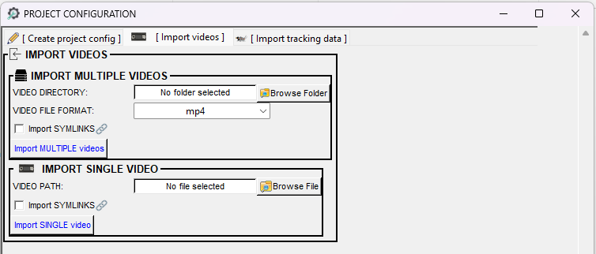
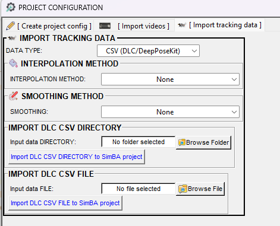
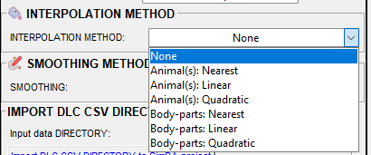
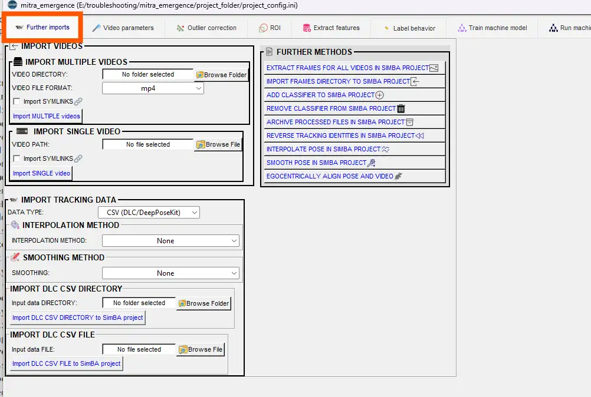
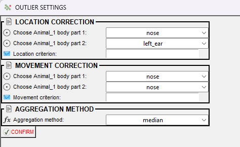
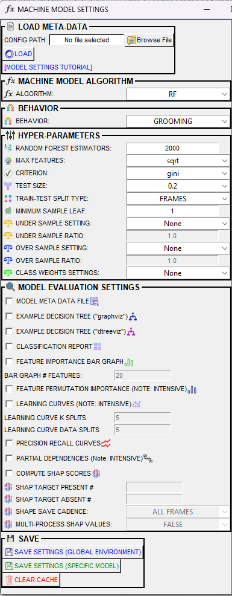
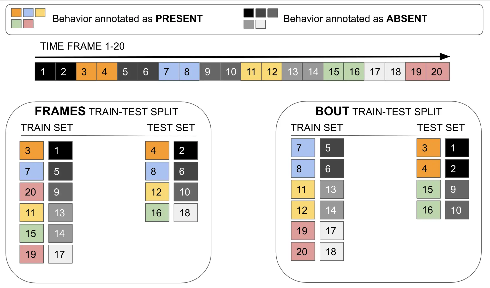

# 🎯 Scenario 1: From Scratch — Train a Behavioral Classifier

---

> **Tooltips:** Many menu items and dialog options in SimBA have **tooltips**. Hover over a label or control to see a short description.

---

## 📖 Overview

SimBA provides several scenario-based tutorials that walk you through building and running behavioral classifiers. This tutorial is written for a hypothetical resident–intruder experiment but will work in many other situations (e.g. social, locomotor, or species-specific behaviors). The Scenario 1 tutorial takes you from a **completely new start** through building a behavioral classifier that you will use in later scenarios.

**Prerequisites:**
- Pose-estimation tracking files exist (DeepLabCut, SLEAP, DANNCE, BENTO, YOLO, or other [supported formats](https://github.com/sgoldenlab/simba/blob/master/docs/Multi_animal_pose.md)) for the same videos you want to analyze.

---

## 📊 Hypothetical Dataset

Three days of resident–intruder testing between aggressive CD-1 mice and subordinate C57 intruders. Each day has 10 pairs of mice, for a total of 30 videos recorded across 3 days. Recordings are 3 minutes long, in color, at 30 fps. To avoid overfitting the classifier to the experimental data, a separate set of 20 pilot videos was recorded using the same video acquisition parameters. You will use the pilot videos to train the classifier; the experimental videos are for later scenarios.

| Property | Value |
|----------|-------|
| **Experiment** | Resident–intruder testing: aggressive CD-1 mice vs. subordinate C57 intruders |
| **Days** | 3 days of testing |
| **Pairs per day** | 10 pairs per day, 30 videos total |
| **Video specs** | 3 min, color, 30 fps |
| **Pilot videos** | 20 videos (for training; separate from experimental data to avoid overfitting) |

---

## 🗺️ Workflow at a Glance

The pipeline is split into two parts:

**Part 1 — Create project**
- [Generate SimBA project](#step-1--generate-simba-project)
- [Import videos to SimBA project](#step-2--import-videos-to-simba-project)
- [Import DLC tracking data to SimBA project](#step-3--import-dlc-tracking-data-to-simba-project)

**Part 2 — Build classifier**
- [Load project](#step-1--load-project-config)
- [Further imports](#step-2-optional--further-imports) (optional)
- [Set video parameters](#step-3--set-video-parameters)
- [Outlier correction](#step-4--outlier-correction)
- [Extract features](#step-5--extract-features)
- [Label behavior](#step-6--label-behavior)
- [Train model](#step-7--train-machine-model)
- [Run/validate model](#step-8--validate-model-on-new-data)
- [Visualizations](https://github.com/sgoldenlab/simba/blob/master/docs/tutorial.md#step-11-visualizations), [merge frames](https://github.com/sgoldenlab/simba/blob/master/docs/tutorial.md#step-12-merge-frames), [create videos](https://github.com/sgoldenlab/simba/blob/master/docs/tutorial.md#step-13-create-videos) (post-validation output)

  

---

## 🚀 Part 1: Create a New Project

In Part 1 you create a new SimBA project, add your videos, and import your pose-estimation tracking data. Complete the Part 1 steps (create project, add videos, import tracking data) once when you start a new experiment.

### ⚙️ Step 1 — Generate SimBA project

You create a SimBA project to organize your videos, tracking data, and analysis outputs in one place. This step creates the main project folder and all the subdirectories SimBA needs.

1. Open SimBA, go to `File`, and select `Create a new project`

  

2. **General project settings**
   - **Project directory** — The parent folder on your computer where SimBA will create the project. Click **Browse** to choose a location (e.g. a drive or lab folder). SimBA creates a new subfolder here with the name you give below; all project files (videos, CSVs, config, logs) will live inside the new project subfolder.
   - **Project name** — The name of the project folder and how SimBA identifies this project. Use **underscores** instead of spaces (e.g. `BtWGaNP_pilot`). In this example, `BtWGaNP` is the behavior you will train (a short label for your behavior of interest), and `_pilot` indicates the project holds the pilot dataset used for training. The name appears in paths and config files, so keep it concise and consistent if you create multiple projects (e.g. same behavior name with different suffixes for pilot vs. experimental data).
   - **Workflow file type** — The format SimBA uses for pose data, extracted features, and results inside the project. **CSV is strongly recommended:** human-readable, works in Excel and other tools, and is the default in most tutorials. **Parquet** is more compact and can be faster for very large datasets (many videos or long recordings). You can convert between them later (Tools → Convert working file type) if needed.

3. **Machine learning settings**
   - **Behavior names** are the labels for the behaviors you will train (and later run) classifiers on. Each name becomes one classifier: SimBA will create a model that predicts “when is this behavior happening?” in new videos. Use short, clear names without spaces (e.g. `Attack`, `Grooming`, `BtWGaNP`). These names appear as columns in your annotated data and in the **Run machine model** and **Visualizations** tabs, so choose names you can recognize later.
   - **Add or remove classifiers:** Click the **+** button to add a new behavior name to the list (a new row appears); click the **−** button to remove the currently selected behavior from the list. Add one entry per behavior you plan to label and train. You can have multiple behaviors in one project (e.g. `Attack`, `Investigation`, `Rest`).
   - **If you are using SimBA only for ROI analysis or movement statistics** (e.g. time in zone, entries per ROI, total distance, velocity) and do **not** plan to create or run behavior classifiers, you can leave the behavior names list **blank**. SimBA will still create the project and you can run ROI and movement analyses; the classifier-related tabs will simply not apply.

4. **Animal settings**
   - **Type of tracking** — This must match how your pose-estimation software identified animals and wrote the tracking data. SimBA uses the chosen tracking type to interpret columns (e.g. which x,y belong to which animal) and to compute features correctly.
     - **Classical tracking** — Choose this when you have **one animal**, or **two or more animals that are visually distinct** (e.g. different coat colors, marked vs. unmarked). Your pose-estimation tool (e.g. standard DeepLabCut, SLEAP with one animal) outputs one set of body-part coordinates per frame without track IDs; SimBA assumes each body-part column corresponds to a single individual. If you have two animals, they are usually distinguished by naming (e.g. Animal_1_nose, Animal_2_nose) or by separate CSV columns. Do **not** use Classical if your DLC/SLEAP output includes track IDs for identical-looking animals—use Multi tracking instead.
     - **Multi tracking** — Choose this when **two or more animals look alike** (e.g. same strain, no visual tags) and your pose-estimation pipeline assigns **track IDs** to keep identity across frames. Multi-animal DeepLabCut (version 2.2b5 or newer) and SLEAP can output per-frame track IDs so that “Animal A” in frame 1 is still “Animal A” in frame 100. SimBA reads these IDs and computes features per individual (e.g. distance between Animal 1 and Animal 2). If you use Classical by mistake with multi-animal track data, identities can be mixed and features will be wrong.
     - **3D tracking** — Choose this when your pose data is **three-dimensional** (x, y, z or similar), for example from **DANNCE** or other 3D reconstruction pipelines. SimBA expects 3D coordinates and computes 3D-based features (distances, angles in 3D). Do not use 3D for standard 2D top-down or side-view pose data.
   - **Body-part configuration** — This must match your pose-estimation annotation scheme (e.g. `2 animals; 16 body-parts`). See [Pose estimation body-part labelling](https://github.com/sgoldenlab/simba/blob/master/docs/Tutorial_DLC.md#pose-estimation-body-part-labelling) for how this relates to your DLC/pose-estimation setup.

> [!IMPORTANT]
> If your pose-estimation scheme (number of animals, body-part count, body-part names) does not appear in the **Body-part configuration** dropdown, you must create a **user-defined body-part configuration**. Click the button next to `# config` in Animal settings and define your animals, body parts, and names. See [user-defined pose configurations](https://github.com/sgoldenlab/simba/blob/master/docs/Pose_config.md) for details. SimBA computes fewer and less precise features for user-defined configs than for built-in configs, which can reduce classifier performance.

> [!NOTE]
> With **Multi tracking**, the Body-part configuration dropdown shows additional options: **Multi-animals** (4, 7, or 8 body parts) for multi-animal DLC/SLEAP, **AMBER** (maternal/pup interaction analysis), and **SuperAnimal-TopView** (zero-shot top-view mouse pose). SimBA also supports **FaceMap**, **YOLO** pose estimation, and **blob tracking** as alternative tracking/pose schemes. For more information, see [AMBER](https://github.com/lapphe/AMBER-pipeline), [SuperAnimal-TopView](https://github.com/sgoldenlab/simba/blob/master/docs/superanimal_topview_project.md), [FaceMap](https://github.com/sgoldenlab/simba/blob/master/docs/facemap_project.md), [YOLO](https://github.com/sgoldenlab/simba/blob/master/docs/yolo_train.md), and [blob tracking](https://github.com/sgoldenlab/simba/blob/master/docs/blob_track.md).

5. Click <kbd>CREATE PROJECT CONFIG</kbd>

---

### 📹 Step 2 — Import videos to SimBA project

Importing videos into the SimBA project is **not strictly required** for every workflow (you can run some analyses with pose and results data alone), but video import is **strongly encouraged**. Video import is also **required when annotating data**, as we are doing in Scenario 1: you need the video in the project to label behaviors frame-by-frame or by bout. Having the videos in the project also lets you visually confirm each step—e.g. that tracking looks correct, that labels match the behavior on screen, and that predictions and visualizations look right. Imported videos are copied into the SimBA project and used for visualizing predictions, calibrating distances across videos, and labeling behaviors for training. In Scenario 1, import the 20 pilot videos used to train the classifier for Behavior BtWGaNP.

> [!NOTE]
> **Video selection considerations:** The number of videos matters less than the total number of behavioral events. Frequent behaviors (e.g. attacks) may need only a handful of videos; rare behaviors (e.g. lateral threat displays) need more for the same event count. Behaviors should be representative of experimental data, with sufficient variability in how they are performed (e.g. different animals, contexts, or angles). You also need videos left over for validation — never test classifiers on the same videos you used to train them. **In this scenario, use 19 videos for training and 1 for validation.** You can also create rendered visualizations in Scenarios 2–4 and use SimBA’s [evaluation tools](#step-7--train-machine-model).

  

1. Go to the **Import videos** tab
2. Under **Import multiple videos**, click <kbd>Browse Folder</kbd> and select the folder with all pilot videos
3. Set **Video file format** (e.g. `mp4` or `avi`). We recommend **mp4** for best compatibility. If your videos are in a different format, use SimBA's [video tools](Tools.md#convert-file-formats-tools-menu) to convert them (e.g. Tools → Change formats → Change video format) before importing.
4. Click <kbd>Import MULTIPLE videos</kbd>

   Videos are copied to the `project_folder/videos/` directory.

> [!TIP]
> For many or high-resolution videos, import can take a few minutes; the terminal reports progress. You can enable **Import SYMLINKS** to use soft links instead of copying (saves disk space by not duplicating video files).

---

### 📥 Step 3 — Import DLC tracking data to SimBA project

SimBA needs the pose-estimation data (x,y coordinates of body parts) produced by DeepLabCut or similar tools. In this step you import the pose-estimation CSV files into the SimBA project so SimBA can compute movement, distances, and other features. For 20 pilot videos, you need 20 CSV files.

> [!NOTE]
> DLC outputs CSVs with long filenames. SimBA copies the CSV files, strips DLC notation, renames them to match video names, and saves the copies in the project folder. The original files stay untouched. **Important:** Videos and tracking CSVs must have matching filenames (before the extension) so SimBA can pair them. For example, `Mouse1_Day1.mp4` and `Mouse1_Day1.csv` will be paired; `Mouse1_Day1.mp4` and `DLC_resnet50_Mouse1Day1Jan1.csv` will not pair until SimBA renames the CSV to match the video.

  

1. Go to the **Import tracking data** tab. Leave **file type** as **CSV (DLC/DeepPoseKit)** (see [multi-animal tutorial](https://github.com/sgoldenlab/simba/blob/master/docs/Multi_animal_pose.md) for other formats).

2. **Interpolate missing pose-estimation data:** Pose-estimation tools sometimes fail to detect an animal or a body part in a frame, leaving gaps (NaN or missing coordinates) in the tracking CSV. SimBA can fill the tracking gaps by interpolating between nearby frames that have valid coordinates. For best classifier performance, animals should be visible in every frame. Prefer [SimBA video clipping tools](Tools.md#clip-videos-tools-menu) to remove segments where animals leave the frame entirely. If clipping is not possible, use interpolation:
   - **Animal(s):** Choose Nearest, Linear, or Quadratic to fill gaps where a whole animal was not detected in a frame. Nearest uses the last known position; Linear and Quadratic estimate positions between the previous and next valid detections.
   - **Body-parts:** Choose Nearest, Linear, or Quadratic to fill gaps where individual body parts (e.g. nose, tail) were not detected in specific frames. If unsure, use Nearest.
   - See the [interpolation comparison image](https://github.com/sgoldenlab/simba/blob/master/images/Interpolation_comparison.png) for a visual, or the [linked code example](https://gist.github.com/gyassine/b47b90e8de935cc06ef856401f7582b0) for implementation details.

  

> [!NOTE]
> Interpolation fills gaps with estimated coordinates, not actual detections. Those estimates can be wrong (e.g. if the animal moved in an unexpected way while occluded), which can distort features and hurt classifier performance. Avoid interpolation where possible; use video clipping to remove problematic segments instead.

3. **Smoothing (optional):** Pose data can be “jittery” with unrealistic jumps between frames. Smoothing averages predictions with neighbouring frames. The options are **Gaussian** or **Savitzky Golay**. When you select **Gaussian** or **Savitzky Golay**, set **Smoothing period (ms)** (e.g. 100–300). See the [before/after smoothing video](https://youtu.be/d9-Bi4_HyfQ), [smoothing example (webm)](../_static/img/smoothing_example_2.webm), or [smoothing example (gif)](../_static/img/smoothing.gif) to compare results. For this tutorial, select **None**.

  

[smoothing.webm](https://github.com/user-attachments/assets/17afddde-2869-4dbe-99b5-dd3880d8387b)

[wmoothing_2.webm](https://github.com/user-attachments/assets/3f54ddc8-cf3f-4b44-82b6-0b20c178ae55)

> [!TIP]
> After interpolation or smoothing, use [Visualize pose estimation in folder](Tools.md#visualize-pose-estimation-in-folder) (Tools menu) to overlay the pose keypoints on your videos. The visualization tool lets you verify that the tracking looks correct (e.g. keypoints follow the animal, interpolation did not introduce obvious errors) before you proceed to feature extraction and labeling. Select the folder containing your tracking CSVs (e.g. the `project_folder/csv/input/` directory) and choose a directory to save the output; SimBA renders annotated videos for review.

4. Click <kbd>Browse Folder</kbd>, select the folder with CSV files, and then click <kbd>Import DLC CSV DIRECTORY to SimBA project</kbd> (or **Import DLC CSV FILE to SimBA project** for a single file).

> [!NOTE]
> You can import a single video and its corresponding CSV instead of a folder; see the [tutorial](https://github.com/sgoldenlab/simba/blob/master/docs/tutorial.md#part-1-create-a-new-project-1). This scenario uses the directory import.

You can close the SimBA window after completing Part 1. In Part 2 you will reload the project and continue with the analysis pipeline.

---

## 🔧 Part 2: Load Project & Build Classifier

In Part 2 you load your project and work through the analysis pipeline: calibrate video parameters, correct outliers, extract features, label behaviors, train the classifier, and validate the classifier on a held-out video. Each step builds on the previous one. The original pose-tracking CSVs move through different subdirectories in the `project_folder/csv/` directory: from the `csv/input_csv/` directory (after import) to the `csv/outlier_corrected_movement_location/` directory (after outlier correction), then to the `csv/features_extracted/` directory (pose plus computed features), and finally to the `csv/targets_inserted/` directory (features plus behavior labels for training).

### 📂 Step 1 — Load Project Config

Before running any analysis, you must load your project so SimBA knows which folder and settings to use. Always load the project before any other process.

1. Go to `File` and select `Load project`
2. Click <kbd>Browse File</kbd>, navigate to your project folder, and select `project_config.ini`
3. The `File Selected` box should show the location of the config file (e.g. `.../project_folder/project_config.ini`); "No file selected" should disappear

  

> [!NOTE]
> SimBA keeps a list of recently opened projects. You can reopen a project without browsing in two places: (i) Go to `File` and select `Open recent project...`, then choose a project from the submenu; (ii) Use the **LOAD RECENT PROJECT</kbd> section on the main window — select a project from the dropdown and click <kbd>LOAD RECENT PROJECT</kbd>.

---

### ➕ Step 2 (Optional) — Further Imports

If you need to add more videos or tracking data later (for example, when you get new experimental videos), use the **Further imports** tab. The Further imports tab lets you add data to an existing project without recreating the project. Use the Further imports tab when you need to bring in new videos or pose files (e.g. for [Scenario 4](Scenario4.md#part-2-load-the-project-and-import-your-new-data)).

  

**Import more data**
- **Import videos** — Add single or multiple videos to the `project_folder/videos/` directory. Use when you have new experimental videos to analyze or more pilot videos for training. Same workflow as project creation.
- **Import tracking data** — Add pose files (DLC, SLEAP, etc.) to the `project_folder/csv/input/` directory. Use when you run pose estimation on new videos or receive tracking data from collaborators. Same workflow as project creation.

**Other options**

You will not use the options below (Extract frames, Import frame folders, Interpolate pose, Smooth pose, Reverse tracking identities, Egocentrically align) for Scenario 1. They are listed here for reference.

- **Extract frames** — Write all video frames to disk. Use if you need frames for visualization workflows, batch image analysis, or tools that expect image sequences. Not required for SimBA's labeling interface, which works directly from video.
- **Import frame folders** — Bring in frames that were extracted outside SimBA (e.g. by another script or software). SimBA registers the imported frames for use in labeling or analysis.
- **Add new classifier(s)** — Add new behavior names to the project. Use when you want to train or run additional classifiers without recreating the project.
- **Remove classifiers** — Remove classifier names from the project. Use when you no longer need a behavior or have renamed the behavior elsewhere.
- **Archive processed files** — Move analyzed files (e.g. from `csv/machine_results`) into an archive folder so SimBA does not re-analyze the archived files. Use when you have finalized results and want to run a fresh analysis on new data without mixing old and new analysis outputs.
- **Interpolate pose** — Fill missing body-part coordinates (gaps where tracking failed). Use when you imported without interpolation and later notice holes in the pose data. Use the Interpolate pose option instead of re-importing when you want to apply interpolation after visualizing the pose data, or when you want to try a different interpolation method (e.g. Nearest vs Linear) without re-importing the tracking CSVs.
- **Smooth pose** — Apply temporal smoothing (Gaussian or Savitzky–Golay) to reduce jitter. Use when pose data is noisy and you did not smooth at import. Use the Smooth pose option instead of re-importing when you discover jitter only after visualizing or running outlier correction, or when you want to try different smoothing settings without starting over.
- **Reverse tracking identities** — Swap which animal is labeled as Animal 1 vs Animal 2. Use when track IDs were assigned incorrectly (e.g. after identity swaps).
- **Egocentrically align pose and video** — Rotate and translate poses (and optionally video) so one animal is centered and facing a fixed direction. Use for egocentric analysis or visualization.

You can skip the Further imports step for Scenario 1, since you will not add new data during this tutorial.

---

### 📐 Step 3 — Set Video Parameters

**This step is important:** Videos can differ in frame rate, resolution, and camera distance. Without calibration, SimBA works in pixels, which are not comparable across videos or sessions (e.g. a 100-pixel movement means different real distances in two videos shot from different heights). In this step you calibrate **pixels per millimeter** and frame rate so SimBA can work in metric units (millimeters, millimeters per second). Calibration allows you to compare behaviors across videos and compute real-world distances—for example, how far an animal moved in millimeters. You calibrate by clicking two points in each video that correspond to a known distance (such as the width of the cage). SimBA then converts pixel measurements into millimeters so results are comparable across sessions.

**Batch quick settings:** If the same known distance (e.g. cage width) applies to all videos, use **AUTO-POPULATE** (step 1) to fill the distance for every video at once. If the camera position and distance were identical across recordings, you can use **DUPLICATE INDEX 1** (in the table) to copy the first video's pixels/mm or known distance to all others—see the Important note below. These batch options save time when calibrating many videos.

1. Under **Video parameters (fps, resolution, ppx/mm ....)**, enter **KNOWN DISTANCE (MILLIMETERS)** (e.g. 245) if the same for all videos, then click **AUTO-POPULATE**. Leave empty to fill per video.

2. Click **CONFIGURE VIDEO PARAMETERS** to open the table.

  

3. Video names appear in the left column. Enter known distance in the **DISTANCE IN MM** column. For each video, click **CALCULATE DISTANCE** to open the pixel picker; place two points that define the known distance (e.g. two markers 245 mm apart). The **PIXELS PER MM** column populates after you place the two points. Repeat for every video.

4. For each video, click **CALCULATE DISTANCE**; a window shows the first frame. Double-**left**-click two points that define the known distance. If a point is misplaced, double-click the dot to replace the misplaced point. Press **Esc** when done.

[getcoord.webm](https://github.com/user-attachments/assets/4da58c75-f9b9-4d26-bafe-a65fc1ce5d17)

5. When finished, click **SAVE PIXEL PER MILLIMETER DATA** (or <kbd>SAVE</kbd> in the table) to write the values to `video_info.csv` in `project_folder/logs`. You must save before closing the window or the calibration will not be applied to later steps.

> [!IMPORTANT]
> If the same known distance (e.g. cage width) and camera setup apply to all videos, use **DUPLICATE INDEX 1** to copy the first video's calibration to all others—using DUPLICATE INDEX 1 avoids re-measuring each video.

---

### 🔍 Step 4 — Outlier Correction

Pose-estimation tools sometimes make mistakes—a body part might suddenly jump to an impossible position. In this step you configure SimBA to detect and correct those pose-estimation outliers so they do not distort your feature calculations or classifier. SimBA flags implausible movements and locations based on the animal’s body length. See [Outlier_settings.pdf](https://github.com/sgoldenlab/simba/blob/master/misc/Outlier_settings.pdf) for details. Keep the default annotation options and set **Movement Criterion** and **Location Criterion** manually.

> [!NOTE]
> Outlier correction works best when there are few outliers. If you have many outliers and frequent jumps, the pose-estimation tracking itself needs to be improved (e.g. retrain the model, adjust video quality, or use a different pose-estimation tool) before SimBA's correction will be effective.

1. Open **Outlier Correction** and click **Settings**

  

2. Select body parts for Animal 1 and Animal 2 to calculate a reference value (mean or median Euclidean distance in mm between the two body parts across all frames). Keep the default body-part selections.

3. **Movement criterion:** A body part is flagged if it moves *reference value times criterion* across two sequential frames. For example, if Nose_1–Tail_base_1 equals 100 mm and the criterion is 0.5, any body part moving 50 mm between frames is corrected. A suggested range for the movement criterion is 0.7 to 1.5.

4. **Location criterion:** A body part is flagged if its distance to at least two other body parts of the same animal exceeds *reference value times criterion* within one frame. For example, with a 100 mm reference and criterion 1.5, body parts more than 150 mm from two others are corrected. A suggested value for the location criterion is 1.5 or greater.

   Body parts flagged as outliers are re-placed at each body part's last reliable coordinate. Movement outliers are corrected first, then location outliers, which typically results in fewer location outliers being flagged.

5. Choose **Median** or **Mean** at the bottom, click **CONFIRM**, and then run outlier correction from the Outlier Correction tab.

6. Two CSV log files appear in `project_folder/logs` with correction counts per video (see [Outlier_corrections.xlsx](https://github.com/sgoldenlab/simba/blob/master/misc/Outlier_corrections.xlsx)).

> [!NOTE]
> Use **Skip outlier correction (CAUTION)** only if pose-estimation is already excellent; the Skip option formats CSVs for later steps (feature extraction, labeling, training) without removing outliers.

> [!NOTE]
> To visualize the pose after outlier correction, go to the **Tools** menu and open [Visualize pose estimation in folder](https://github.com/sgoldenlab/simba/blob/master/docs/Tutorial_tools.md#visualize-pose-estimation-in-folder). In the pop-up, select the folder containing your outlier-corrected CSVs (`project_folder/csv/outlier_corrected_movement_location/`) and choose a save directory; SimBA renders annotated videos so you can verify the corrections look correct before extracting features.

> [!NOTE]
> If you only need movement, directionality, velocities, or ROI analysis, you can stop here and go to the [ROI tutorial](https://github.com/sgoldenlab/simba/blob/master/docs/ROI_tutorial.md).

---

### 📊 Step 5 — Extract Features

Raw x,y coordinates from pose estimation are not directly useful for behavior classification—the individual pixel positions matter less than the relationships and changes between them. Similarly, when a human observer scores behavior manually, they do not mentally track pixel coordinates; they notice how close animals are, how fast they move, angles of approach, and so on. SimBA converts the raw coordinates into meaningful measurements—distances between body parts, movement speed, angles, and so on—that the classifier can learn from. In this step you run feature extraction so SimBA computes these measurements for each frame.

If you want to see which features SimBA computes for your setup, you can browse the example lists: [2 mice, 16 body parts](https://github.com/sgoldenlab/simba/blob/master/misc/Feature_description.csv), [user-defined pose](https://github.com/sgoldenlab/simba/blob/master/misc/features_user_defined_pose_config.csv), or [AMBER (maternal/pup)](https://github.com/sgoldenlab/simba/blob/master/misc/amber_feature_description.csv). For writing your own Python script to compute custom features (e.g. for non-social behavior or user-defined pose configs), see [user-defined feature extraction](https://github.com/sgoldenlab/simba/blob/master/docs/extractFeatures.md). SimBA includes example scripts for [fish](https://github.com/sgoldenlab/simba/blob/master/simba/feature_extractors/misc/fish_feature_extractor_2023_version_5.py), [geometric features and bounding boxes](https://github.com/sgoldenlab/simba/blob/master/misc/geometry_feature_extraction.py), and [AMBER maternal/pup behavior](https://github.com/lapphe/AMBER-pipeline/blob/main/SimBA_AMBER_project/AMBER_2_0__feature_extraction/amber_feature_extraction_20230815.py). To compute selected feature families (distances, angles, convex hull, etc.) and save or append them—for use in SimBA or in other software—see [feature subsets](https://github.com/sgoldenlab/simba/blob/master/docs/feature_subsets.md).

1. Go to the **Extract features** tab and click **EXTRACT FEATURES**. Do **not** enable **APPLY USER DEFINED FEATURE EXTRACTION SCRIPT** for this tutorial; SimBA’s built-in features are appropriate for this scenario. The user-defined script option is for advanced users who need custom features. See [user-defined feature extraction](https://github.com/sgoldenlab/simba/blob/master/docs/extractFeatures.md) for when and how to use the user-defined script option.

  

2. CSV files with features and pose data are saved in `project_folder/csv/features_extracted/` (one per DLC file).

> [!NOTE]
> You do not need **APPEND ROI DATA TO FEATURES**, **CALCULATE FEATURE SUBSETS**, or **REMOVE ROI FEATURES FROM FEATURE SET** for this tutorial. **APPEND ROI DATA TO FEATURES: BY ANIMAL** or **BY BODY-PARTS** adds spatial features (for example, time spent in each zone) when you have defined regions of interest; see the [ROI tutorial](https://github.com/sgoldenlab/simba/blob/master/docs/ROI_tutorial.md). **CALCULATE FEATURE SUBSETS** extracts a subset of features for external use or to append to your data; see [feature subsets](https://github.com/sgoldenlab/simba/blob/master/docs/feature_subsets.md). **REMOVE ROI FEATURES FROM FEATURE SET** removes ROI columns from the dataset if you added ROI features but no longer need the ROI columns.

3. **Validation holdout:** Before training, set aside one video’s feature file so you can test the classifier on data the classifier has never seen. Cut one file from `project_folder/csv/features_extracted/` and paste the file somewhere else (for example, a folder called `validation_holdout`). SimBA will train on the remaining 19 files. In Step 8 you will run the trained model on the held-out file and compare the model's predictions to your labels to see how well the model generalizes.

---

### 🏷️ Step 6 — Label Behavior

The classifier needs **training labels**: for each frame (or bout), you tell SimBA whether the behavior of interest is **present** or **absent**. You provide the training labels in the **SimBA behavioral annotation GUI**, which opens from the **Label behavior** tab. The GUI shows a **video player** and a **frame viewer** that stay in sync: you move through the video, and for each frame you mark which behavior(s) are occurring. Your annotations are written into the feature-extracted CSVs and saved in **`project_folder/csv/targets_inserted/`** (one CSV per video). SimBA uses the annotated CSVs from `project_folder/csv/targets_inserted/` in Step 7 to train the classifier.

**Where to find the Label behavior interface:** In the main SimBA window, click the **Label behavior** tab (alongside **Outlier correction**, **Extract features**, **Train machine model**, etc.). You will see sub-menus for different annotation modes. For this scenario use **LABEL BEHAVIOR** → **Select video (create new video annotation)**. In that mode, SimBA assumes the behavior is **absent** in every frame unless you mark it **present**; you step through the video and check the box for your behavior (e.g. BtWGaNP) when it occurs. You can label **frame by frame** or use **Frame range** to mark a start and end frame and save a bout in one go. When you leave a frame or save a range, your choices are stored; when you close the annotation window, SimBA writes the labels to the project.

**What you do:** For each video you want to use for training, open the video from the **Label behavior** interface, watch or step through the video, and for each frame (or range of frames) where the behavior occurs, check the corresponding behavior box. Use the same **operational definition** for the behavior across all videos so the classifier learns a consistent pattern. When you are done with a video, close the annotation window; SimBA saves the annotated CSV to **`project_folder/csv/targets_inserted/`**. Repeat for all training videos (e.g. 19 of the 20 pilot videos if you set one aside for validation in Step 5).

**Validation holdout reminder:** If you set aside one video’s feature file in Step 5 (e.g. in a `validation_holdout` folder), do **not** label that video here—SimBA will train on the remaining labeled files only. In Step 8 you will run the trained model on the held-out video and compare predictions to your labels.

For a full walkthrough of the annotation interface (frame navigation, video playback, frame range, saving), see the [SimBA behavioral annotator / labelling tutorial](https://github.com/sgoldenlab/simba/blob/master/docs/label_behavior.md). For importing annotations from other tools (e.g. BORIS, Observer), see [third-party annotations](https://github.com/sgoldenlab/simba/blob/master/docs/third_party_annot.md).

---

### 🤖 Step 7 — Train Machine Model

Once you have labeled data and extracted features, you train a classifier that learns to recognize the behavior in new, unlabeled videos. In this step you configure the training settings (such as which algorithm to use and how to handle imbalanced data) and run the training. The result is a model file (`.sav`) that you can run on experimental data.

  

**Where to find the Train machine model settings:** In the main SimBA window, click the **Train machine model** tab (alongside **Outlier correction**, **Extract features**, **Label behavior**, etc.). Within that tab, click <kbd>SETTINGS</kbd> to open the settings window.

**Two modes:** **(i)** Train one model with your chosen settings. **(ii)** Save several different configurations and train multiple models in one go (e.g. five classifiers, then pick the best). **This tutorial uses Mode 1.**

> [!NOTE]
> A **meta file** is a CSV that stores all your training settings in one place. Use **LOAD META DATA** to load a meta file and fill in the settings window automatically, or **CREATE MODEL META DATA FILE** to save your current settings for later.

#### Train settings

Click <kbd>SETTINGS</kbd> in the **Train machine model** tab to open the settings window. All options are described below. Defaults work for most users; adjust them when your behavior is rare or your classifier underperforms.

**LOAD META-DATA**

| Option | Description |
|--------|-------------|
| **CONFIG PATH** / **LOAD** | Browse to a pre-made CSV and click **LOAD** to fill every setting at once. Useful to reproduce a previous run or try someone else’s config. Example files: [BtWGaNP_meta.csv](https://github.com/sgoldenlab/simba/blob/master/misc/BtWGaNP_meta.csv), [meta_data_2023.csv](https://github.com/sgoldenlab/simba/blob/master/misc/meta_data_2023.csv). |

**MACHINE MODEL ALGORITHM**

| Option | Description |
|--------|-------------|
| **ALGORITHM** | The learning algorithm: **RF** (Random Forest), **GBC** (Gradient Boosting), or **XGBoost**. **RF** is the best starting point—RF trains quickly and rarely needs tuning. Try GBC or XGBoost only if RF performs poorly and you’re comfortable tuning. See [scikit-learn ensemble methods](https://scikit-learn.org/stable/modules/ensemble.html). |

**BEHAVIOR**

| Option | Description |
|--------|-------------|
| **BEHAVIOR** | The behavior (classifier) you are training. Must exactly match one of the label columns in your extracted feature files (e.g. the column you annotated in Step 6). |

**HYPER-PARAMETERS**

| Option | Description |
|--------|-------------|
| **RANDOM FOREST ESTIMATORS** | How many trees make up the forest (default 2000). More trees usually improve accuracy slightly but slow down training. Start with 2000; increase only if you need a small boost. |
| **MAX FEATURES** | How many features the model considers when splitting a node: `sqrt` (square root of total features), `log2`, or `None` (all). `sqrt` is recommended; the sqrt option keeps trees diverse and reduces overfitting. |
| **CRITERION** | The rule used to decide how to split data at each node: `gini` or `entropy`. Both are fine; `gini` is a bit faster. |
| **TEST SIZE** | Fraction of your labeled data reserved for testing (e.g. 0.2 means 20% is held out). The model never sees the test set during training—the test set is used to estimate real-world performance. 0.2 is a common choice. |
| **TRAIN-TEST SPLIT TYPE** | **FRAMES** — Split frames randomly into train and test. A single bout of behavior may be cut across both sets. **BOUTS** — Split by whole bouts, so each bout stays entirely in train or test. Use **BOUTS** if your bouts are short and you want cleaner evaluation. See illustration below. |
| **MINIMUM SAMPLE LEAF** | Minimum number of samples allowed in a leaf (end node) of a tree. Higher values (e.g. 5 or 10) produce simpler trees and can reduce overfitting; lower values (e.g. 1) allow finer-grained decisions. Default 1 is fine for most cases. |
| **UNDER SAMPLE SETTING** | **Often the most important setting for animal behavior classification.** When your behavior occurs in only a small fraction of frames (e.g. &lt;10%), the model sees mostly “absent” and may ignore “present.” **Random undersample** removes some absent frames so both classes are better balanced. Use `random undersample` and explore the ratio below—trying several undersample ratios is recommended. See [RandomUnderSampler](https://imbalanced-learn.org/stable/references/generated/imblearn.under_sampling.RandomUnderSampler.html). |
| **UNDER SAMPLE RATIO** | **Often the most impactful setting to tune.** After undersampling, how many absent frames per present frame? **1** = equal numbers; **0.5** = half as many absent; **0.25** = fewer absent. Different ratios often give very different results—explore several values (e.g. 1, 0.5, 0.25, 0.1) to find what works best for your behavior. Only used when undersampling is enabled. |
| **OVER SAMPLE SETTING** | Alternative to undersampling: add synthetic or duplicated “present” frames so the model sees more behavior examples. **SMOTE** creates synthetic samples; **SMOTEENN** combines SMOTE with cleanup. Use if undersampling removes too much useful data. See [imbalanced-learn](https://imbalanced-learn.org/stable/). |
| **OVER SAMPLE RATIO** | Target ratio of present to absent frames after oversampling. Active when oversampling is enabled. |
| **CLASS WEIGHTS SETTINGS** | Another way to handle imbalance: tell the model to penalize errors on “present” frames more heavily. **balanced** and **balanced_subsample** set weights automatically from your data. **custom** lets you set weights manually. Use when undersampling/oversampling don’t help enough. See [class_weight](https://scikit-learn.org/stable/modules/generated/sklearn.ensemble.RandomForestClassifier.html#sklearn.ensemble.RandomForestClassifier). |

*Train-test split: FRAMES vs BOUTS —*

  

**MODEL EVALUATION SETTINGS**

| Option | Description |
|--------|-------------|
| **MODEL META DATA FILE** | Save a CSV with every setting used for this run. Useful for sharing configs and reproducing experiments. |
| **EXAMPLE DECISION TREE ("graphviz")** | Export one tree as an image showing how the tree makes decisions. Helps you understand the model but is optional. Requires graphviz installed. |
| **EXAMPLE DECISION TREE ("dtreeviz")** | Same idea as the graphviz option but with a richer visualization library (dtreeviz). Optional. |
| **CLASSIFICATION REPORT** | Standard summary: precision, recall, F1-score for “present” and “absent.” Always worth enabling—the classification report tells you how well the model does on each class. |
| **FEATURE IMPORTANCE BAR GRAPH** | A bar chart and CSV listing which features (e.g. distances, velocities) the model relied on most. Good first step to interpret your classifier. [Example CSV](https://github.com/sgoldenlab/simba/blob/master/images/BtWGaNP_feature_importance_log.csv), [bar chart](https://github.com/sgoldenlab/simba/blob/master/images/BtWGaNP_feature_bars.png). |
| **BAR GRAPH # FEATURES** | How many of the top features to include in the bar graph (e.g. 20). Active when the feature importance bar graph is enabled. |
| **FEATURE PERMUTATION IMPORTANCE** | Like feature importance but often more reliable: each feature is shuffled and you see how much performance drops. Slower to compute. Use when features are correlated or you want a more robust importance estimate. See [permutation importance](https://scikit-learn.org/stable/modules/permutation_importance.html). |
| **LEARNING CURVES** | A plot of model performance versus amount of training data. If the learning curve keeps rising, more labeled videos will likely help; if the learning curve flattens, you have enough. Helps you decide whether to annotate more. [Example](https://github.com/sgoldenlab/simba/blob/master/images/BtWGaNP_prediction_learning_curve.csv). |
| **LEARNING CURVE K SPLITS** | How many times to split and retrain when building the learning curve (e.g. 5). Higher K gives smoother curves but takes longer. Active when learning curves are enabled. |
| **LEARNING CURVE DATA SPLITS** | Number of different training-set sizes to evaluate (e.g. 5 means 5 points on the curve). Active when learning curves are enabled. |
| **PRECISION RECALL CURVES** | Plots precision vs. recall at many probability thresholds. Helps you choose a good discrimination threshold—the cutoff above which the model says “behavior present.” Especially useful for rare behaviors. [Example](https://github.com/sgoldenlab/simba/blob/master/misc/BtWGaNP_prediction_precision_recall.csv). |
| **PARTIAL DEPENDENCIES** | Plots how changing each feature (e.g. distance to another animal) affects the model’s predictions. Computationally heavy; use when you want a deeper understanding of feature effects. See [partial dependence](https://scikit-learn.org/stable/modules/partial_dependence.html). |
| **COMPUTE SHAP SCORES** | SHAP values show *why* the model predicted each frame—which features pushed it toward “present” or “absent.” Powerful for interpreting and debugging classifiers. Slow; use a subset of frames (set the target present/absent counts below). [SHAP tutorial](https://github.com/sgoldenlab/simba/blob/master/docs/SHAP.md). |
| **SHAP TARGET PRESENT #** / **SHAP TARGET ABSENT #** | How many “present” and “absent” frames to include in SHAP analysis. Start small (e.g. 50 each) to keep runtimes manageable. Active when SHAP is enabled. |
| **SHAPE SAVE CADENCE** | How often to save SHAP results (e.g. every 100 frames). Protects against losing work if the run crashes. |
| **MULTI-PROCESS SHAP VALUES** | Use multiple CPU cores to speed up SHAP. Enable if you have a multi-core machine and SHAP is too slow. |

**SAVE**

| Option | Description |
|--------|-------------|
| **SAVE SETTINGS (GLOBAL ENVIRONMENT)** | Writes your settings into the project config. Use SAVE SETTINGS (GLOBAL ENVIRONMENT) before training a single model (Mode 1). |
| **SAVE SETTINGS (SPECIFIC MODEL)** | Saves settings as a separate CSV in `configs/` for batch training (Mode 2). Create one file per configuration you want to try. |
| **CLEAR CACHE** | Deletes cached training data. Use if you get odd errors or changed your data and want to force a clean rerun. |

#### ▶️ Start training

Close the settings window and click <kbd>TRAIN SINGLE MODEL (GLOBAL ENVIRONMENT)</kbd>.

  

- **Mode 1 (used in this tutorial):** Save settings with **SAVE SETTINGS (GLOBAL ENVIRONMENT)**, close the settings window, and click <kbd>TRAIN SINGLE MODEL (GLOBAL ENVIRONMENT)</kbd>. SimBA saves the model as `{behavior}.sav` (e.g. `BtWGaNP.sav`) in `project_folder/models/generated_models/`. Evaluation outputs (classification report, feature importance, learning curves, etc.) go to `model_evaluations/` in `project_folder/models/generated_models/`.

- **Mode 2:** Save each configuration with **SAVE SETTINGS (SPECIFIC MODEL)** (once per config), then click <kbd>TRAIN MULTIPLE MODELS</kbd>. SimBA reads the saved config CSVs from `project_folder/configs/` and trains one model per config. Outputs go to `project_folder/models/validations/`.

**Further reading:**
- [SimBA SHAP tutorial](https://github.com/sgoldenlab/simba/blob/master/docs/SHAP.md) — Model explainability and calculating feature SHAP values
- [scikit-learn ensemble methods](https://scikit-learn.org/stable/modules/ensemble.html) — Random Forest, Gradient Boosting, and related algorithms
- [imbalanced-learn](https://imbalanced-learn.org/stable/) — Oversampling and undersampling for imbalanced classification

---

### ✅ Step 8 — Validate Model on New Data

Before running your classifier on real experimental data, you should check how well the classifier works. The interactive probability plot and validation video are documented in [Visualizations](Visualizations.md#validate-model-interactive-probability-plot-scenario-1). In this step you run the model on a held-out video (one you labeled but did not use for training) and visually compare the model's predictions to your labels. Comparing predictions to labels helps you choose a good probability threshold and catch any problems before analyzing your full dataset. Use the held-out file from Step 5. See the [example validation video](https://youtu.be/UOLSj7DGKRo) for a walkthrough.

1. Go to the **Run machine model** tab and open the **VALIDATE MODEL ON SINGLE VIDEO** section.

  

2. **SELECT DATA FEATURE FILE PATH** — Browse to select the held-out features file. The held-out file lives in `project_folder/csv/features_extracted/` (or wherever you moved it in Step 5) and was not used for training.

3. **SELECT MODEL FILE PATH** — Browse to select the `.sav` classifier file in the `project_folder/models/generated_models/` directory (e.g. `BtWGaNP.sav`).

4. **RUN MODEL** — SimBA runs the classifier on the feature file and writes the result to the `project_folder/csv/validation/` directory. The output file has the same filename as the input feature file and contains all original columns (features, pose coordinates, etc.) plus one new column: `Probability_{classifier_name}` — the model's predicted probability (0–1) that the behavior is present in each frame. The validation output file feeds the interactive probability plot and the validation video.

5. **INTERACTIVE PROBABILITY PLOT** — Inspect frame-by-frame probabilities alongside the video. Use the interactive plot to pick a threshold that separates behavior from non-behavior.

   **Interface layout:** The window shows two panels. On the **left** is the video with the current frame. On the **right** is the probability plot. The plot **x-axis** is frame number (0 to end of video). The **y-axis** is classifier probability (0–1). The **main line** (blue) traces the model’s predicted probability for each frame. Optional **threshold lines** (75%, 50%, 25%) appear as dashed horizontal lines to help pick a cutoff. A **red vertical line** marks the current frame in the plot, and a **red circle** marks the probability value for that frame. The **legend** (top right) lists the probability trace and the threshold lines. A **statistics box** (bottom right) shows max probability, mean probability, and total frame count. The **title** shows the selected frame number and its probability. **Double-click** a point on the plot to jump the video to that frame. **SHOW HIGHEST PROBABILITY FRAME** (in the validation tab) jumps to the frame with the peak probability.

   **Keyboard shortcuts (select the line plot window first):** Press the right arrow key to move forward one frame, the left arrow key to move backward, and the Space bar to play or pause.

  

6. **DISCRIMINATION THRESHOLD (0.00–1.0)** — Frames with probability greater than or equal to the discrimination threshold are classified as behavior (e.g. 0.50). See [threshold tuning guidance](https://www.scikit-yb.org/en/latest/api/classifier/threshold.html) for more on choosing a threshold.

7. **MINIMUM BOUT LENGTH (MS)** — The shortest bout that will be classified as behavior. After applying the discrimination threshold, each frame is labeled 1 (behavior present) or 0 (absent). For example, frame-by-frame labels 1,1,1,1,0,1,1,1,1 at 50 fps yield two 80 ms bouts with a 20 ms gap; with a minimum bout length of 20 ms, the gap is removed and the result is one 180 ms bout.

8. **CREATE VALIDATION VIDEO** — Opens a pop-up to customize the validation video. Options:

| Option | Description |
|--------|-------------|
| **FONT SIZE** | Size of behavior labels and other text overlays. **AUTO** scales from video resolution; or pick 1–100 for fixed size. Use larger values for high-res or distant viewing. |
| **TEXT SPACING** | Space between stacked text lines (e.g. behavior name and probability). **AUTO** adjusts to video; or 1–100. Reduces overlap when multiple labels appear. |
| **CIRCLE SIZE** | Size of dots at each pose keypoint (nose, tail, etc.). **AUTO** scales with video; or 1–100. Larger circles make keypoints easier to see on small previews. |
| **TEXT OPACITY** | Transparency of text overlays (0.1–1.0). Lower values let more video show through; 1.0 is fully opaque. Useful when overlays obscure behavior. |
| **TEXT THICKNESS** | Boldness of text strokes. Thicker text (higher values) stays readable on busy or low-contrast frames. |
| **BODY-PART PALETTE** | Color scheme for pose dots—one color per animal. Examples: Pastel1, spring, Set1. Pick a palette that contrasts with your arena and animals. |
| **SHOW POSE** | **TRUE** = draw keypoints and skeleton on the video; **FALSE** = video only. Turn off for cleaner output if pose is not needed for validation. |
| **SHOW ANIMAL NAMES** | **TRUE** = labels like "Animal_1" near each animal; **FALSE** = no names. Helps when tracking identity or explaining videos to others. |
| **SHOW BOUNDING BOX** | **TRUE** = draw a box around each animal; **FALSE** = no boxes. Boxes clarify location and overlap; turn off for minimal overlay. |
| **SHOW CONFIDENCE** | **TRUE** = display the classifier probability (e.g. 0–100%) for each frame; **FALSE** = hide it. Essential for threshold tuning; optional for presentation. |
| **CPU COUNT** | Number of CPU cores for encoding. More cores speed up video creation when processing many or long videos. Use 2–4+ if available. |
| **GANTT TYPE** | **None** = no Gantt bar chart. **Final frame only** = one static Gantt at the end (faster). **Video** = Gantt updates per frame (shows timing over video). Use CPU count > 1 for Gantt videos. |

  

9. **RUN** — SimBA creates a video with the classifier's predictions overlaid on each frame (e.g. behavior-present frames highlighted, probability text, Gantt chart if selected). The output video is saved to the `project_folder/frames/output/validation/` directory.

[validation_example.webm](https://github.com/user-attachments/assets/7d8cc685-1e84-4ae1-9634-71f9fecbcefe)

> [!NOTE]
> See the [Classifier Validation](https://github.com/sgoldenlab/simba/blob/master/docs/classifier_validation.md) tool for detecting false positives (the tool creates bout-level overlays with frame counts and probabilities).

**🎉 Congratulations!** You have RF models ready for experimental data. Proceed to [Scenario 2](Scenario2.md) to run the BtWGaNP classifier on Day 1. If you already have processed data (outliers corrected and features extracted), go to [Scenario 2 — Part 3: Run the classifier on new data](Scenario2.md#part-3--run-the-classifier-on-new-data).

---

## ➡️ Next Steps

- **[Scenario 2](Scenario2.md)** — Run the classifier on Day 1 experimental data.
- **[Scenario 3](Scenario3.md)** — Improve the classifier with additional data.
- **[Scenario 4](Scenario4.md)** — Add new data and run the classifier on Day 2.

---

## 📚 API Reference

Classes, methods, and modules used in this workflow and their Read the Docs links. (Frame extraction from videos is not part of this scenario; frame extraction is documented under [Tools](Tools.md).)

| Workflow step | Class or module | Read the Docs link |
|---------------|-----------------|--------------------|
| Generate SimBA project (create config) | `CreateProjectPopUp`, project init | [simba.ui](https://simba-uw-tf-dev.readthedocs.io/en/latest/simba.ui.html), [simba.config_reader](https://simba-uw-tf-dev.readthedocs.io/en/latest/simba.config_reader.html) |
| Import videos to SimBA project | Project video import / copy | [simba.ui](https://simba-uw-tf-dev.readthedocs.io/en/latest/simba.ui.html) |
| Import DLC tracking data to SimBA project | DLC/pose importers | [simba.pose_importers](https://simba-uw-tf-dev.readthedocs.io/en/latest/simba.pose_importers.html) |
| Load project | `ConfigReader` | [simba.config_reader](https://simba-uw-tf-dev.readthedocs.io/en/latest/simba.config_reader.html) |
| Further imports (videos, tracking) | Pose importers, project UI | [simba.pose_importers](https://simba-uw-tf-dev.readthedocs.io/en/latest/simba.pose_importers.html), [simba.ui](https://simba-uw-tf-dev.readthedocs.io/en/latest/simba.ui.html) |
| Set video parameters (pixels/mm, fps) | `GetPixelsPerMillimeterInterface`, video info | [simba.ui](https://simba-uw-tf-dev.readthedocs.io/en/latest/simba.ui.html) |
| Outlier correction | `OutlierCorrecterMovement`, `OutlierCorrecterLocation` | [simba.outlier_tools](https://simba-uw-tf-dev.readthedocs.io/en/latest/simba.outlier_tools.html) |
| Extract features | Feature extraction mixins and wrappers | [simba.feature_extraction_mixins](https://simba-uw-tf-dev.readthedocs.io/en/latest/simba.feature_extraction_mixins.html), [simba.feature_extractors](https://simba-uw-tf-dev.readthedocs.io/en/latest/simba.feature_extractors.html) |
| Label behavior | Labelling tools | [simba.labelling](https://simba-uw-tf-dev.readthedocs.io/en/latest/simba.labelling.html) |
| Train single model | `TrainRandomForestClassifier` | [simba.model_mixin](https://simba-uw-tf-dev.readthedocs.io/en/latest/simba.model_mixin.html) |
| Train multiple models (Mode 2) | `GridSearchRandomForestClassifier` | [simba.model_mixin](https://simba-uw-tf-dev.readthedocs.io/en/latest/simba.model_mixin.html) |
| Train model (shared methods) | `TrainModelMixin` | [simba.model_mixin](https://simba-uw-tf-dev.readthedocs.io/en/latest/simba.model_mixin.html) |
| Run model on validation file | `InferenceValidation` | [simba.model_mixin](https://simba-uw-tf-dev.readthedocs.io/en/latest/simba.model_mixin.html) |
| Create validation video | `ValidateModelOneVideo`, `ValidateModelOneVideoMultiprocess` | [simba.plotting](https://simba-uw-tf-dev.readthedocs.io/en/latest/simba.plotting.html) |
| Validation video pop-up | `ValidationVideoPopUp` | [simba.ui](https://simba-uw-tf-dev.readthedocs.io/en/latest/simba.ui.html) |

Full API index: [SimBA API Reference](https://simba-uw-tf-dev.readthedocs.io/en/latest/api.html)

---

> **Bugs and feature requests:** Please help improve SimBA by reporting bugs or suggesting features—either [open an issue on GitHub](https://github.com/sgoldenlab/simba/issues) or reach out on [Gitter](https://gitter.im/SimBA-Resource/community).

*Author: [Simon N](https://github.com/sronilsson)*
