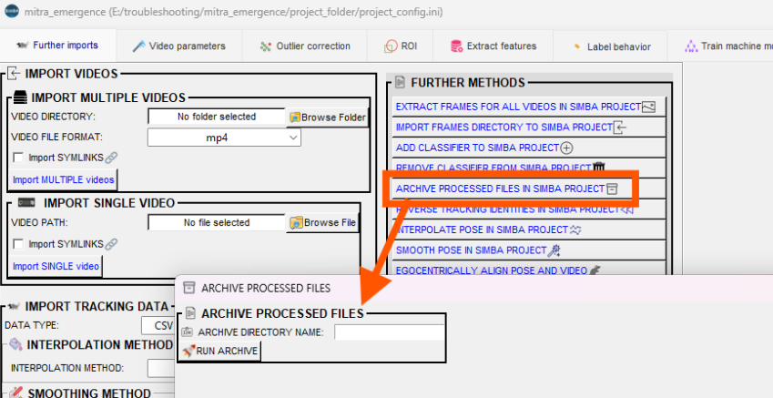
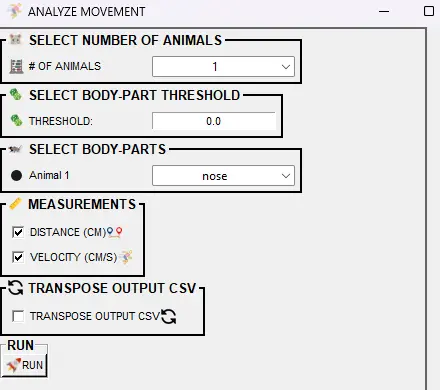
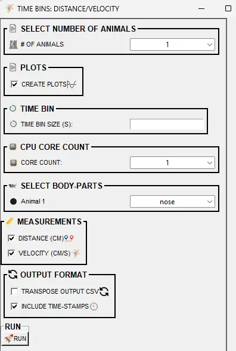
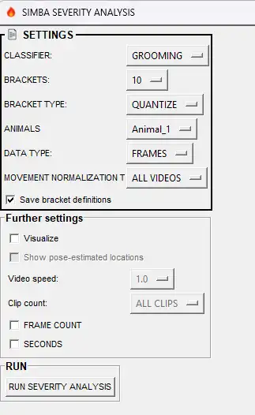
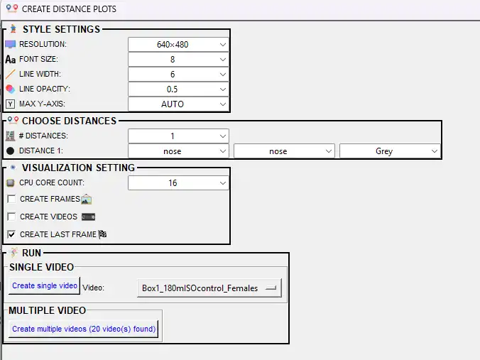
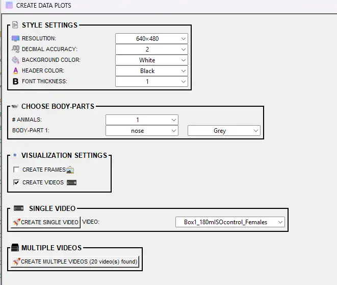

# 🎯 Scenario 2: Run a Classifier on New Experimental Data

---

> **Tooltips:** Many menu items and dialog options in SimBA have **tooltips**. Hover over a label or control to see a short description.

---

## 📖 Overview

SimBA provides several scenario-based tutorials. This tutorial covers **Scenario 2**: running a trained behavioral classifier on new experimental data. You already have a classifier—either one you trained in [Scenario 1](Scenario1.md), one you **downloaded** (e.g. from the [SimBA OSF repository](https://osf.io/d69jt/)), or one you **received** (e.g. from a collaborator or another lab as a `.sav` file plus any required project settings)—and you have pose-estimation tracking data for your **experimental** videos (the new videos you want to score, not the pilot set used for training). In this scenario you will: **(1)** set up a project that contains **only** your experimental videos and their pose data (so SimBA does not re-analyze or mix in the old pilot/training data); **(2)** run the same preprocessing pipeline (calibration, outlier correction, feature extraction) as for training; **(3)** run the classifier to get predictions; **(4)** compute descriptive statistics; and **(5)** create visualizations: classification videos, Gantt charts, probability plots, path plots, distance plots, classification heatmaps, data tables, and merge (concatenate) videos.

**You are ready for Scenario 2 if:**
- **(i)** You trained a classifier in [Scenario 1](Scenario1.md) (e.g. BtWGaNP) and are satisfied with its validation performance, or  
- **(ii)** You have a classifier from elsewhere: for example you **downloaded** it (e.g. from the [SimBA OSF repository](https://osf.io/d69jt/)) or **received** it from a collaborator or another lab (e.g. they shared the `.sav` model file and any project/settings info). You want to score behavior on your experimental videos with the downloaded or received classifier.

**Prerequisites:**
- Pose-estimation tracking files exist (DeepLabCut CSV/H5, SLEAP SLP/CSV/H5, APT TRK, DANNCE MAT, BENTO JSON, FaceMap H5, SuperAnimal-TopView H5, SimBA BLOB/YOLO CSV — see [supported formats](https://github.com/sgoldenlab/simba/blob/master/docs/Multi_animal_pose.md)) for the same videos you want to analyze in SimBA in this tutorial.

---

## 📊 Hypothetical Dataset

Three days of resident–intruder testing between aggressive CD-1 mice and subordinate C57 intruders. Each day has 10 pairs of mice, for a total of 30 videos across 3 days. Recordings are 3 minutes long, in color, at 30 fps.

| Property | Value |
|----------|-------|
| **Experiment** | Resident–intruder: aggressive CD-1 vs. subordinate C57 intruders |
| **Days** | 3 days of testing |
| **Pairs per day** | 10 pairs per day, 30 videos total |
| **Video specs** | 3 min, color, 30 fps |

---

## 🗺️ Workflow at a Glance

- [Part 1: Clean up or create SimBA project](#part-1-clean-up-or-create-simba-project)
- [Part 2: Load SimBA project and process tracking data](#part-2-load-simba-project-and-process-tracking-data)
- [Part 3: Run the classifier on new data](#part-3-run-the-classifier-on-new-data)
- [Part 4: Analyze machine learning results](#part-4-analyze-machine-learning-results)
- [Part 5: Visualize results](#part-5-visualize-results)

---

## 📁 Part 1 — Clean up or create SimBA project

You need a **SimBA project** that contains **only** the experimental data you want to analyze—either clean up your existing project (e.g. archive pilot data) or create a new SimBA project with only experimental videos and the pose-tracking files that go with those videos. If you continue from [Scenario 1](Scenario1.md), your project folder still contains **pilot** CSV files—the pose and feature files you used for **training** the classifier—in subdirectories such as `project_folder/csv/input_csv/` (e.g. 19 files). You do not want to run the classifier on the pilot files again; the pilot files were for training only. Many SimBA tools look inside the project’s `csv/` folders and process **every** CSV file they find there. So if the pilot CSVs stay in place, SimBA will treat the pilot files as if they were experimental data and will run the classifier on the pilot files too. To avoid running the classifier on pilot data, either archive the pilot files (move the pilot CSVs into an archive subfolder) or create a new project that holds only your experimental videos and pose data.

**Options:**

1. **Archive processed files** — If you want to keep using the same project folder from Scenario 1, you can move the pilot data out of the active analysis path. After loading your project, go to the **Further imports** tab. In the **FURTHER METHODS** section, click <kbd>ARCHIVE PROCESSED FILES IN SIMBA PROJECT</kbd>. Enter a name for the archive (e.g. `pilot_training_data`) and click <kbd>RUN ARCHIVE</kbd>. SimBA moves the processed CSV files (from the `csv/input_csv/`, `csv/outlier_corrected_movement_location/`, `csv/features_extracted/` directories, and related folders) into an archive subfolder so they are no longer analyzed. Your project folder stays in place; only the pilot data is relocated. After archiving, **import your experimental videos and pose-tracking data** into the project if they are not already there: use **Import videos** and **Import tracking data** (or the equivalent options in the Further imports tab) to add the experimental videos and their pose CSVs. See the [Scenario 4 — Part 1](Scenario4.md#part-1-clean-up-your-previous-project-or-create-a-new-one) for more detail.

  

2. **Create a new project** — Start fresh with a project that contains only your experimental data. Go to `File` → `Create a new project` and follow [Scenario 1 — Part 1: Create a new project](Scenario1.md#part-1-create-a-new-project). Use the same project name format, body-part configuration, and workflow type as your pilot project so the classifier will work. When the project is created, **import your experimental videos and pose-tracking data** into the new SimBA project: use the **Import videos** tab to add the experimental videos, then the **Import tracking data** tab (or equivalent) to add the pose-estimation CSVs for those videos (Day 1, Day 2, etc.). Do not import the pilot set.

**By the end of Part 1**, your SimBA project must contain **only** your experimental videos and the pose-tracking files for those videos. You must **import** this experimental data into the project.

- **If you chose Archive:** Import your experimental videos and pose CSVs via the **Further imports** tab (**Import videos**, **Import tracking data**). The import steps work the same as in [Scenario 1](Scenario1.md)—see [Step 2 — Import videos](Scenario1.md#step-2--import-videos-to-simba-project) and [Step 3 — Import tracking data](Scenario1.md#step-3--import-dlc-tracking-data-to-simba-project) for how to add videos and pose files.
- **If you chose Create a new project:** You import the experimental videos and tracking data when you set up the project. The workflow is the same as in Scenario 1: use the **Import videos** tab, then the **Import tracking data** tab. See [Scenario 1 — Part 1: Create a new project](Scenario1.md#part-1-create-a-new-project) (Steps 2 and 3) for step-by-step instructions.

Once the experimental data is in the project, you are ready for **Part 2**: load the project and run the preprocessing pipeline on that data.

---

## ⚙️ Part 2 — Load SimBA project and process tracking data

After [Part 1](#part-1-clean-up-or-create-simba-project), you have a SimBA project that contains only your experimental videos and tracking data (the pose CSVs for those videos). Before running the classifier, you must load the project and run the same preprocessing pipeline you used for training: calibration, outlier correction, and feature extraction. This ensures the experimental data has the same structure (body parts, metrics, units) as the data the classifier was trained on.

Complete the following steps from [Scenario 1](Scenario1.md); Scenario 1 has more detailed instructions for each step. You will **skip** Steps 6–7 (label behavior, train model), because you already have a trained classifier.

**Step 1 — Load project config:** Go to `File` → `Load project`, click <kbd>Browse File</kbd>, and select `project_config.ini` in your project folder. SimBA must load the project before any analysis.

**Step 2 — Further imports (optional):** Use the **Further imports** tab only if you need to add more videos or tracking files to the project after creation. If your project already has all experimental data, skip this step.

**Step 3 — Set video parameters:** Calibrate pixels per millimeter and frame rate for each video so SimBA works in metric units. This step is required—without video parameter calibration, features and distances are not comparable across videos. Use the **Video parameters** tab; see [Scenario 1 — Step 3](Scenario1.md#step-3--set-video-parameters) for the full workflow (KNOWN DISTANCE, CONFIGURE VIDEO PARAMETERS, CALCULATE DISTANCE, SAVE).

**Step 4 — Outlier correction:** Detect and correct implausible pose jumps (e.g. body parts teleporting) so outliers do not distort features. Use the **Outlier correction** tab. If your pose-estimation quality is already excellent, you can use **SKIP OUTLIER CORRECTION (CAUTION)** instead—this formats the CSVs for later steps without correcting outliers, but use the Skip outlier correction option only when you are confident the tracking has few or no implausible jumps. See [Scenario 1 — Step 4](Scenario1.md#step-4--outlier-correction) and [Outlier_settings.pdf](https://github.com/sgoldenlab/simba/blob/master/misc/Outlier_settings.pdf).

**Step 5 — Extract features:** Compute behavioral features (distances, angles, velocities, etc.) from the pose data. The classifier expects a fixed set of features; this step produces that feature set. Use the **Extract features** tab. See [Scenario 1 — Step 5](Scenario1.md#step-5--extract-features) and [Feature_description.csv](https://github.com/sgoldenlab/simba/blob/master/misc/Feature_description.csv).

After Step 5, your experimental data resides in the `project_folder/csv/features_extracted/` directory. Each CSV has the same columns (pose coordinates plus computed features) as the training data, so the classifier can read each feature-extracted CSV.

---

## 🤖 Part 3 — Run the classifier on new data

At this point your experimental data is in the `project_folder/csv/features_extracted/` directory and has the same structure as the training data: pose coordinates plus computed features. The classifier will read each CSV, output a probability per frame for each behavior, apply your discrimination threshold and minimum bout length, and write new CSVs with predictions to the `project_folder/csv/machine_results/` directory for use in Part 4 and Part 5.

> [!NOTE]
> If you downloaded a classifier (e.g. from the [OSF repository](https://osf.io/d69jt/)) or received one from a collaborator, you can use the downloaded or received classifier here — just point to the `.sav` file when selecting the model.

### Step 1: Open RUN MODELS

1. After loading your project, go to the **[Run machine model]** tab in the main workflow tabs (alongside Further imports, Video parameters, Outlier correction, etc.).
2. Click <kbd>RUN MODELS</kbd>. The RUN MODELS pop-up appears with one row per classifier defined in your project (e.g. BtWGaNP). Each row has fields for the model path, discrimination threshold, and minimum bout length.

  

### Step 2: Select model file for each classifier

For each classifier row, click <kbd>BROWSE FILE</kbd> next to the model path and select the corresponding `.sav` file.

> [!IMPORTANT]
> **The classifier name in the row must match the model** (e.g. BtWGaNP classifier → `BtWGaNP.sav`). Your SimBA project has one or more classifier names defined in its config (e.g. the behavior you trained in Scenario 1). Each row in the RUN MODELS pop-up shows that project classifier name. You must assign the correct `.sav` file to that row so SimBA applies the right model to the right behavior when writing predictions and statistics.

- **If you followed Scenario 1:** The model is in your pilot project: in the `project_folder/models/generated_models/` directory (e.g. `BtWGaNP.sav` for single-model training) or the `project_folder/models/validations/model_files/` directory (batch training).
- **If you downloaded or received a model:** Browse to wherever the `.sav` file is stored (the model file can be outside the project folder).

The RUN MODELS pop-up remembers your last-used model paths the next time you open it.

### Step 3: Set discrimination threshold and minimum bout length

The classifier outputs a **continuous probability** per frame—a value between 0 and 1 (e.g. 0.23, 0.87), not just 0 or 1. You then convert those probabilities into binary predictions (behavior present vs absent) using two settings:

- **DISCRIMINATION THRESHOLD** — Frames with probability at or above this value are classified as behavior present. Enter a value between 0.0 and 1.0 (e.g. 0.50). At 0.50, every frame with probability ≥ 0.5 is labeled as containing the behavior. Lowering the threshold (e.g. to 0.30) predicts *more* behavior (more frames classified as present); raising it (e.g. to 0.70) predicts *less* behavior. Choose a threshold that balances false positives and false negatives for your use case. If you are familiar with pose-estimation tools (e.g. DeepLabCut, SLEAP), the discrimination threshold is analogous to body-part confidence or likelihood scores: you set a cutoff above which you treat the detection as reliable. See [threshold tuning guidance](https://www.scikit-yb.org/en/latest/api/classifier/threshold.html).
- **MINIMUM BOUT LENGTH (MS)** — The shortest bout (in milliseconds) that counts as a real behavior. Very short gaps within a bout are merged. Example: at 50 fps, predictions 1,1,1,1,0,1,1,1,1 over 9 frames give two 80 ms bouts with a 20 ms gap. If you set minimum bout length to 20 ms, that gap is removed and you get one 180 ms bout instead. Use this to filter out single-frame noise or very brief artifacts. SimBA uses each video's frame rate, so the same setting works across videos with different fps.

> [!TIP]
> If you like, you can try [Scenario 1 — Validate model on single video](Scenario1.md#step-8--validate-model-on-new-data) on one or a few videos before running on all experimental videos. The interactive probability plot and validation video can help you choose a good discrimination threshold and minimum bout length.

> [!IMPORTANT]
> **The model expects the same number of features as it was trained on.** When you trained the classifier (in Scenario 1 or elsewhere), you extracted features from pose data with a specific body-part configuration (e.g. 8 body parts per animal). The features (distances, angles, movements, etc.) are derived from the body-part coordinates. A model trained on 8 body parts expects exactly the feature set that 8 body parts produce. If you run that model on experimental data with a different number of body parts (e.g. 3 or 16), the feature set will have a different number of columns, and SimBA will raise an error. **Use the same pose configuration for inference as you used for training** — same body parts, same animal count, same ROI setup (if ROIs were used). When creating a new project for Scenario 2, select the same body-part config and workflow type as the project where the model was trained.

### Step 4: Run

Click the <kbd>RUN</kbd> button in the RUN MODELS pop-up. Before processing starts, look at the top of the same pop-up: the pop-up shows how many CSV files will be analyzed. The files shown are the feature-extracted CSVs in your project (in the `project_folder/csv/features_extracted/` folder)—one file per video.

SimBA then works through each file in turn. For every file SimBA: reads the features, runs the classifier to get a probability per frame, applies your discrimination threshold and minimum bout length to turn probabilities into behavior present/absent, and adds new columns (probabilities and predictions) to the data. You can watch progress in the **SimBA terminal** (the text window that opened when you started SimBA): the SimBA terminal will list each file as the file is processed.

When processing is finished, SimBA saves new CSV files to the `project_folder/csv/machine_results/` directory. Each saved file has the same base name as the corresponding input file (e.g. `Mouse1_Day1`), and contains the original pose and feature data plus the new probability and prediction columns for each classified behavior (e.g. BtWGaNP). Use the machine-results CSVs from `project_folder/csv/machine_results/` for Part 4 (analysis) and Part 5 (visualization).

---

## 📈 Part 4 — Analyze machine learning results

The files in the `project_folder/csv/machine_results/` directory contain frame-by-frame predictions and probabilities **for each classified behavior** (e.g. BtWGaNP): for every frame, the probability that the behavior occurred (0–1) and the binary prediction (present or absent) based on your threshold and minimum bout length. To summarize the predictions for analysis (e.g. for statistics, figures, or group comparisons), use the analysis tools in the **Run machine model** tab. The **Analyze machine results** sub-menu offers six options, each covered in the sections below: **(1)** ANALYZE MACHINE PREDICTIONS: AGGREGATES, **(2)** ANALYZE DISTANCES / VELOCITY: AGGREGATES, **(3)** ANALYZE MACHINE PREDICTIONS: TIME BINS, **(4)** ANALYZE DISTANCES / VELOCITY: TIME-BINS, **(5)** ANALYZE MACHINE PREDICTIONS: BY ROI, **(6)** ANALYZE MACHINE PREDICTIONS: BY SEVERITY. Each tool reads from the `project_folder/csv/machine_results/` directory, computes the requested metrics, and writes a date-time stamped CSV to the `project_folder/logs/` directory (plots in subfolders when applicable). The terminal prints the exact filename(s) after each run.

To access the analysis tools: go to the **Run machine model** tab and find the **Analyze machine results** section. Click the button for the analysis you want (e.g. **ANALYZE MACHINE PREDICTIONS: AGGREGATES**).

> [!NOTE]
> Analyses that do not require machine learning results (e.g. distance and velocity aggregates or time bins) can also be run from the **ROI** tab, which has equivalent tools for movement and distance metrics. Use whichever tab fits your workflow.

  

### 1. ANALYZE MACHINE PREDICTIONS: AGGREGATES

Use **ANALYZE MACHINE PREDICTIONS: AGGREGATES** when you need **one summary number per video per classifier** for each behavioral measurement you choose (e.g. total event duration in seconds, event count, first occurrence in seconds). That gives you a single table of values—one row per video (or per video–classifier–measurement, depending on output format)—suitable for comparing experimental groups (e.g. treatment vs control) or for importing into statistics or plotting software. You select at least one **measurement** (from the list below), at least one **classifier**, then click <kbd>RUN</kbd>. The output is a date-time stamped CSV saved to the `project_folder/logs/` directory; the terminal prints the exact filename. All options in the dialog are described below.

  

**MEASUREMENTS** — Choose which statistics to compute. A *bout* (or *event*) is a continuous run of frames where the classifier predicts the behavior; bouts are separated by frames where the behavior is not predicted (subject to the minimum bout length setting from the Run model step).

| Statistic | Description | Notes |
|-----------|-------------|-------|
| **First occurrence (s)** | Time (in seconds) from video start until the behavior first occurs. | Useful for latency measures. If the behavior never occurs, the field is empty. |
| **Event (bout) count** | Total number of behavior bouts in each video. | Counts each bout as one event, regardless of duration. |
| **Total event duration (s)** | Sum of all bout durations. Total time (in seconds) the behavior occurs across the whole video. | Use with video length to compute proportion of time in behavior. |
| **Mean event duration (s)** | Average duration (in seconds) of each bout. | Sum of bout durations ÷ number of bouts. One long bout yields a high mean. |
| **Median event duration (s)** | Median duration (in seconds) of each bout. | Less sensitive than mean to a few very long or short bouts. |
| **Mean event interval (s)** | Average time (in seconds) between the *end* of one bout and the *start* of the next. | If only one bout, interval is undefined (field empty). |
| **Median event interval (s)** | Median time (in seconds) between bouts. | Less sensitive than mean to outliers in inter-bout intervals. |

**CLASSIFIERS** — Check one or more classifiers to analyze. Each selected classifier gets its own set of statistics per video.

**DETAILED BOUT DATA** — If checked, SimBA writes a second CSV with one row per bout: video name, classifier, bout number, start time, end time, and duration. Useful for event-level analysis or when you need the raw bout list. [Example output](https://github.com/sgoldenlab/simba/blob/master/misc/detailed_bout_data_summary_20231011091832.csv).

**METADATA** — Optional columns added to the summary:

| Option | Description |
|--------|-------------|
| **Frame count** | Total number of frames in each video. Use with total event duration (converted to frames) to compute proportion of frames with behavior. |
| **Video length (s)** | Video length in seconds. Use with total event duration (s) to compute proportion of time in behavior. |

**OUTPUT OPTIONS:**

| Option | Description |
|--------|-------------|
| **Transpose output** | If checked, each video is one row and classifier–measurement combinations are columns. If unchecked (default), each row is a video–classifier–measurement combination. Transpose is often easier for plotting or importing into stats software. |

**CPU CORE COUNT** — Number of CPU cores to use. More cores speed up analysis when you have many videos.

Click <kbd>RUN</kbd>. A date-time stamped CSV is saved to the `project_folder/logs/` directory. The terminal prints the exact filename.

### 2. ANALYZE DISTANCES / VELOCITY: AGGREGATES

Use **ANALYZE DISTANCES / VELOCITY: AGGREGATES** when you need **one movement value per video per animal** for the whole video: either total distance traveled (in cm) and/or average velocity (cm/s), depending on which measurements you check. SimBA computes these from the pose data in the `project_folder/csv/outlier_corrected_movement_location/` directory; you do not need to run the classifier or extract features for this analysis—distance and velocity come directly from the calibrated pose coordinates. You choose the number of animals, which body part(s) to track for each animal (e.g. Nose, Center of gravity), a pose confidence threshold, and at least one of **DISTANCE (CM)** or **VELOCITY (CM/S)**, then click <kbd>RUN</kbd>. Output is saved to the `project_folder/logs/` directory as `Movement_log_{datetime}.csv`. 

  

All options in the dialog are listed below.

| Option | Description |
|--------|-------------|
| **# OF ANIMALS** (SELECT NUMBER OF ANIMALS) | Number of animals to analyze (1 to project max). Determines how many body-part dropdowns appear below. |
| **THRESHOLD** (SELECT BODY-PART THRESHOLD) | Minimum pose-estimation confidence (0.0–1.0). Only frames where body-part detection exceeds this value are used. Lower values include more frames but may add noise; higher values are stricter. Default: 0.0. |
| **SELECT BODY-PARTS** | For each animal (Animal 1, Animal 2, …), choose which body part to track for movement. Options include named body parts (e.g. Nose, Center, Tail_base) and **Animal N CENTER OF GRAVITY**. The center of gravity is the centroid of the animal’s body parts (estimated from the convex hull); use it for whole-body movement. |
| **DISTANCE (CM)** (MEASUREMENTS) | If checked, calculates the total distance traveled (in centimeters) for each animal throughout the entire video. Distance is the cumulative path length of the selected body part. |
| **VELOCITY (CM/S)** (MEASUREMENTS) | If checked, calculates the average velocity (in cm/s) for each animal throughout the entire video. Velocity = distance ÷ time. At least one of DISTANCE or VELOCITY must be checked. |
| **TRANSPOSE OUTPUT CSV** | If checked, transposes the output so each video is one row and animal–body-part–measurement combinations are columns. Default: each row is a video–animal–body-part–measurement combination. |

> [!TIP]
> To see where the center of gravity is placed for each animal, use **Tools** → **Visualize pose-estimation in folder...** In the Visualize pose-estimation dialog, select the folder containing your outlier-corrected CSVs (the `project_folder/csv/outlier_corrected_movement_location/` directory), set **SHOW CENTER OF MASS** to a color (e.g. red), and run. SimBA renders annotated videos with a dot at each animal’s center of mass so you can verify the location before using it in movement analysis. For full options and details, see [Tools — Visualize pose-estimation in folder](Tools.md#visualize-pose-estimation-in-folder) and [Visualizations — Visualize pose-estimation in folder](Visualizations.md#visualize-pose-estimation-in-folder-tools-menu).

### 3. ANALYZE MACHINE PREDICTIONS: TIME BINS

Use **ANALYZE MACHINE PREDICTIONS: TIME BINS** when you want **one value of each selected measurement per time bin per video per classifier**, instead of one value for the whole video. For example, for a 3-minute video with 60 s bins you get three values of “total event duration (s)” (one for 0–60 s, one for 60–120 s, one for 120–180 s), three values of “event count,” and so on—so you can see how the behavior changes over the course of the video. You choose the **time bin size** (e.g. 30 or 60 seconds), at least one **measurement** (first occurrence, event count, total event duration, mean/median duration, mean/median interval), and at least one **classifier**, then click <kbd>RUN</kbd>. Output is saved to the `project_folder/logs/` directory as `Time_bins_ML_results_{datetime}.csv`. 

  

All options in the dialog are listed below.

| Option | Description |
|--------|-------------|
| **MEASUREMENTS** — A bout is a continuous run of frames where the classifier predicts the behavior. Select at least one. | |
| **First occurrence (s)** | Time (in seconds) from bin start until behavior first occurs. Empty if behavior never occurs in that bin. |
| **Event count** | Number of behavior bouts within each time bin. |
| **Total event duration (s)** | Sum of bout durations (s) in the bin. Use with bin size for proportion of time in behavior. |
| **Mean event duration (s)** | Average bout duration (s) within the bin. Sum of bout durations ÷ number of bouts. |
| **Median event duration (s)** | Median bout duration (s) within the bin. Less sensitive than mean to outliers. |
| **Mean event interval (s)** | Average time (s) between end of one bout and start of next. Empty if fewer than two bouts in bin. |
| **Median event interval (s)** | Median time (s) between bouts. Empty if fewer than two bouts in bin. |
| **CLASSIFIERS** | Select one or more classifiers to analyze (e.g. BtWGaNP). Each gets statistics per bin per video. |
| **SET TIME** | |
| **TIME BIN SIZE (S)** | Duration of each bin in seconds (e.g. 30 for 30 s, 60 for 1 min). Video divided into equal segments. Default: 30. |
| **OUTPUT FORMAT OPTIONS** | |
| **TRANSPOSE OUTPUT (ONE ROW PER VIDEO)** | If checked, each video is one row; classifier–timebin–measurement combinations are columns. Default: one row per video–timebin–classifier–measurement. |
| **INCLUDE TIME (HH:MM:SS)** | If checked, adds `START TIME` and `END TIME` columns (HH:MM:SS) for each bin. Useful for aligning with video playback. |

> [!NOTE]
> (i) If no behavior occurred in a time bin, that bin’s fields are missing. (ii) If exactly one behavior event occurred in a bin, `Mean event interval (s)` and `Median event interval (s)` are missing.

### 4. ANALYZE DISTANCES / VELOCITY: TIME-BINS

Use **ANALYZE DISTANCES / VELOCITY: TIME-BINS** when you need **one distance or velocity value per time bin per video per animal** (e.g. total distance traveled in bin 1, in bin 2, …), so you can see how movement or velocity changes over the course of each video. SimBA reads pose data from the `project_folder/csv/outlier_corrected_movement_location/` directory; no feature extraction or classifier is required. You set the **time bin size** (e.g. 60 s), choose which body part(s) to track for each animal, and select at least one of **DISTANCE (CM)** or **VELOCITY (CM/S)**, then click <kbd>RUN</kbd>. Optionally you can generate line plots of distance (or velocity) vs time bin. 

  

All options in the dialog are listed below.

**Where data is saved:**
- **CSV:** `project_folder/logs/` — e.g. `Time_bins_60s_movement_results_YYYYMMDD_HHMMSS.csv`. The terminal prints the exact filename.
- **Plots (if CREATE PLOTS is checked):** `project_folder/logs/` — subfolder e.g. `time_bin_movement_plots_YYYYMMDD_HHMMSS/` with one line plot per video per body part (distance vs time bin).

| Option | Description |
|--------|-------------|
| **# OF ANIMALS** (SELECT NUMBER OF ANIMALS) | Number of animals to analyze (1 to project max). Determines how many body-part dropdowns appear below. |
| **PLOTS** — **CREATE PLOTS** | If checked, generates line plots (one per video per body part) showing distance across time bins. Saved to `project_folder/logs/time_bin_movement_plots_{datetime}/`. |
| **TIME BIN** — **TIME BIN SIZE (S)** | Duration of each time bin in seconds (e.g. 60 for 1-minute bins). The video is divided into equal segments of this length. |
| **CPU CORE COUNT** | Number of CPU cores to use for processing. Use more cores (e.g. 4–8) if you have many videos. |
| **SELECT BODY-PARTS** | For each animal (Animal 1, Animal 2, …), choose which body part to track for movement. Options include named body parts (e.g. Nose, Center, Tail_base). |
| **MEASUREMENTS** — Select at least one. | |
| ↳ **DISTANCE (CM)** | If checked, calculates the total distance traveled (in centimeters) for each animal within each time bin. Cumulative path length of the selected body part within that bin. |
| ↳ **VELOCITY (CM/S)** | If checked, calculates the average velocity (in cm/s) for each animal within each time bin. Velocity = distance in bin ÷ time bin duration. |
| **OUTPUT FORMAT** | |
| ↳ **TRANSPOSE OUTPUT CSV** | If checked, each video–animal–body-part–measurement combination is one row and time bins are columns. Default: each row is a video–time-bin–animal–body-part–measurement combination. |
| ↳ **INCLUDE TIME-STAMPS** | If checked, adds `START TIME` and `END TIME` columns (HH:MM:SS) for each time bin. |

### 5. ANALYZE MACHINE PREDICTIONS: BY ROI

Use **ANALYZE MACHINE PREDICTIONS: BY ROI** when you have drawn [user-defined ROIs](https://github.com/sgoldenlab/simba/blob/master/docs/ROI_tutorial_new.md) (e.g. zones or polygons on the video) and want **per-ROI metrics**: total time (seconds) each classified behavior occurred inside each ROI, how many behavior bouts *started* inside each ROI, and how many *ended* inside each ROI. SimBA uses the classifier predictions from the `project_folder/csv/machine_results/` directory and your ROI definitions to determine when the animal (via the body part you choose) is inside or outside each zone. You select which ROIs, which classifiers, which body part(s) to use for location, and which measurements to compute, then click <kbd>RUN</kbd>. 

  

All options in the **Analyze machine predictions: by ROI** dialog are listed below:

| Option | Description |
|--------|-------------|
| **SELECT ROIs** | Check which ROI(s) to analyze. At least one must be selected. Metrics are computed for each selected ROI. |
| **SELECT CLASSIFIERS** | Check which classifier(s) to analyze. At least one must be selected. Behavior metrics are calculated for each classifier within each ROI. |
| **SELECT BODY-PARTS** | Check which body part(s) to use for determining animal location within ROIs. At least one must be selected. Typically use center of mass or a prominent body part (e.g. Nose). The chosen body part determines whether the animal is "inside" or "outside" each ROI. |
| **TOTAL BEHAVIOR TIME IN ROI (S)** | If checked, calculates the total duration (in seconds) that the behavior occurs within each ROI. Sums all time the animal spends performing the behavior while inside the ROI. |
| **STARTED BEHAVIOR BOUTS IN ROI (COUNT)** | If checked, counts how many behavior bouts *started* within each ROI. A bout starts when the behavior begins while the animal is inside the ROI. |
| **ENDED BEHAVIOR BOUTS IN ROI (COUNT)** | If checked, counts how many behavior bouts *ended* within each ROI. A bout ends when the behavior stops while the animal is inside the ROI. |
| **DETAILED BOUTS TABLE - EACH BEHAVIOR EVENT BY ROI (START/END TIME)** | If checked, creates a second CSV listing each individual behavior bout within ROIs, including start time, end time, duration, ROI name, and classifier. |
| **TRANSPOSE OUTPUT (ONE ROW PER VIDEO)** | If checked, transposes the main output so each video is one row and classifier–ROI–body-part–measurement combinations are columns. Default: each row is a video–classifier–ROI–body-part–measurement combination. |
| **CPU CORE COUNT** | Number of CPU cores to use for processing. Use more cores for faster analysis of many videos. |

**Where data is saved:**
- **Main CSV:** A date-time stamped file is saved to the `project_folder/logs/` directory, e.g. `Classification_time_by_ROI_YYYYMMDD_HHMMSS.csv`. The terminal prints the exact filename.
- **Detailed bouts CSV:** If **DETAILED BOUTS TABLE** is checked, a second file is saved, e.g. `Classification_time_by_ROI_detailed_bouts_YYYYMMDD_HHMMSS.csv`, with one row per bout (start time, end time, duration, ROI, body part, classifier).

### 6. ANALYZE MACHINE PREDICTIONS: BY SEVERITY

Use **ANALYZE MACHINE PREDICTIONS: BY SEVERITY** when your behavior can be graded from **mild to severe** based on movement intensity (e.g. mild vs severe attacks). SimBA computes movement (e.g. summed velocity of selected body parts) during each classified frame or each bout, then assigns a **severity score** (e.g. 1–10) to each frame or bout using a user-defined scale. The output gives you not only how often the behavior occurred but **how intense** the behavior was—e.g. how many events fell into each severity bracket. You choose the classifier, the number of brackets (scale size), whether to score per bout or per frame, how to normalize movement across videos, and optionally whether to save bracket definitions or generate example clips.

  

All options in the severity analysis dialog are listed below.

**Where data is saved:** `project_folder/logs/` — severity results and (if SAVE BRACKET DEFINITIONS is checked) bracket definitions. Example clips (if VISUALIZE is checked) go to `project_folder/frames/output/` subfolders. The terminal prints exact paths.

| Setting | Description |
|---------|-------------|
| **CLASSIFIER** | Which classifier to score for severity. |
| **BRACKETS** | Severity scale size (e.g. 10 for a 10-point scale). |
| **ANIMALS** | Which animals (or **ALL ANIMALS**) to use for movement when computing severity. |
| **BRACKET TYPE** | **QUANTIZE** = equal-width bins; **QUANTILE** = equal-count bins. See [pandas.cut](https://pandas.pydata.org/docs/reference/api/pandas.cut.html) vs [pandas.qcut](https://pandas.pydata.org/docs/reference/api/pandas.qcut.html). |
| **DATA TYPE** | **BOUTS** = per-bout score; **FRAMES** = per-frame score. |
| **MOVEMENT NORMALIZATION TYPE** | **ALL VIDEOS** = single scale across all videos; **SINGLE VIDEOS** = per-video scale. |
| **SAVE BRACKET DEFINITIONS** (Save bracket definitions) | If checked, saves a CSV of bin definitions to the `project_folder/logs/` directory. |
| **Further settings** (when VISUALIZE is checked) | |
| **VISUALIZE** | If checked, generates example clips. Enables the options below. |
| **SHOW POSE-ESTIMATED LOCATIONS** | If checked, includes pose circles in the clips. |
| **VIDEO SPEED** | Clip playback speed relative to original (e.g. 1.0 = real time, 0.5 = half speed). |
| **CLIP COUNT** | Number of example clips to create (or **ALL CLIPS**). |
| **FRAME COUNT** (DATA TYPE = FRAMES only) | If checked, includes frame-count output in the results. At least one of FRAME COUNT or SECONDS must be checked when using FRAMES. |
| **SECONDS** (DATA TYPE = FRAMES only) | If checked, includes time-in-seconds output in the results. At least one of FRAME COUNT or SECONDS must be checked when using FRAMES. |

---

## 🎬 Part 5 — Visualize results

Visualizations help you inspect classifier performance, share results, and create figures. This section walks through the main options in the **[Visualizations]** tab for Scenario 2: overlay predictions on video (e.g. highlighting behavior-present frames), Gantt charts (when behaviors occur), probability line plots, path plots (animal movement + behavior locations), distance plots, classification heatmaps, data tables, and merge (concatenate) videos. All of the visualization tools in this section read from the `project_folder/csv/machine_results/` directory (or `project_folder/csv/outlier_corrected_movement_location/` for path/distance/data-table plots) and from videos in `project_folder/videos/`.

> **Note — Many other ways to visualize:** SimBA offers additional visualization methods (e.g. ROI-based tracking and heatmaps, directionality, blob and YOLO overlays, egocentric alignment, annotate frames). For a full list and step-by-step guidance, see the [Visualizations tutorial](Visualizations.md).

**Where visualization outputs are saved** — All go under `project_folder/frames/output/` in type-specific subfolders:

| Visualization | Output directory |
|---------------|------------------|
| Classification videos | `sklearn_results/` |
| Gantt charts | `gantt_plots/` |
| Probability plots | `probability_plots/` |
| Path plots | `path_plots/` |
| Distance plots | `line_plot/` |
| Classification heatmaps | `heatmaps_classifier_locations/` |
| Data tables | `live_data_table/` |
| Merged videos | `merged/` |

Go to the **[Visualizations]** tab to access the visualization tools.

### VISUALIZE CLASSIFICATIONS

Creates videos (or frame sequences) with classification overlays: the video plays while the current behavior predictions and probabilities are shown (e.g. text overlay, highlighted pose). Use the classification overlay to quickly review predictions or to create presentation videos. See the [example video](https://youtu.be/lGzbS7OaVEg). SimBA reads classifier data from `project_folder/csv/machine_results/` and videos from `project_folder/videos/`. 

  

The **Visualize classifications** dialog offers the following options:

| Option | Description |
|--------|-------------|
| **BODY-PART PROBABILITY THRESHOLD** | Minimum pose-estimation confidence (0.0–1.0) for body parts to be drawn. Use 0.0 to show all; use 1.0 to show only 100% certain detections. Body parts below this threshold are hidden. |
| **TEXT SIZE** | Size of behavior labels on the video. AUTO = SimBA picks based on video resolution; or choose 1–100. |
| **TEXT SPACING** | Space between label text and other drawn elements. AUTO = SimBA picks; or 1–100. |
| **TEXT THICKNESS** | How bold the behavior labels are. AUTO or 1–100; higher = thicker text. |
| **CIRCLE SIZE** | Size of dots drawn at each body part (pose visualization). AUTO = SimBA picks; or 1–100. |
| **TEXT OPACITY** | Transparency of labels (0.1–1.0). Lower = more transparent. |
| **TEXT COLOR** | Color of the behavior name text (e.g. White, Red). |
| **TEXT BACKGROUND COLOR** | Color of the box behind the text. Helps labels stand out on busy frames. |
| **TRACKING COLOR PALETTE** | Color scheme for pose dots (one color per animal). Options include Set1, Set2, etc. |
| **CPU CORES** | Number of CPU cores for parallel processing when creating multiple videos. |
| **USE GPU** | If TRUE and a compatible GPU is available, use it to speed up video creation. |
| **SHOW GANTT PLOT** | **NO GANTT** = no bar chart. **Static Gantt (final frame, faster)** = one bar chart at the end. **Dynamic Gantt (updated per frame)** = bar chart updates as the video plays. |
| **CREATE VIDEO** | If checked, generates an .mp4 with behavior labels and optional overlays. |
| **CREATE FRAMES** | If checked, saves one .png image per frame. At least one of CREATE VIDEO or CREATE FRAMES must be checked. |
| **INCLUDE TIMERS OVERLAY** | If checked, shows a timer (time or frame number) on each frame. Handy for presentations or matching other data. |
| **ROTATE VIDEO 90°** | If checked, rotates the output 90°. Use for portrait (vertical) recordings. |
| **SHOW TRACKING (POSE)** | If checked, draws tracked body parts (dots and skeleton) on the video. |
| **SHOW ANIMAL NAME(S)** | If checked, displays labels like "Animal_1" so you can tell animals apart. |
| **SHOW ANIMAL BOUNDING BOXES** | If checked, draws a box around each animal. Helps see location and overlap. |
| **SHOW CLASSIFICATION PROBABILITY** | If checked, displays the model's confidence (0–100%) for the predicted behavior on each frame. |

**SINGLE VIDEO** — Select one video from the dropdown (or use the file browser) and click <kbd>Create single video</kbd>. **MULTIPLE VIDEOS** — Click <kbd>Create multiple videos</kbd> to process all videos that have classification results.

**Where output is saved:** Videos and frames are saved to the `project_folder/frames/output/sklearn_results/` directory.
[sklearn_visualization.webm](https://github.com/user-attachments/assets/50094bd3-051a-432c-8f97-06aad53d18f0)

[sklearn_visualization_2.webm](https://github.com/user-attachments/assets/63acd686-7c56-4552-8850-3051f10d530b)

### VISUALIZE GANTT CHARTS

Gantt charts are horizontal bar charts: one row per classifier, with bars indicating when each behavior occurred and for how long. Use Gantt charts to compare timing and duration across behaviors or videos. They can be static (one image for the whole video) or dynamic (a video where the chart updates over time). SimBA reads classifier data from the `project_folder/csv/machine_results/` directory. 

  

Select at least one behavior and at least one output type (frames, videos, or last frame), then run.

**STYLE SETTINGS:**

| Option | Description |
|--------|-------------|
| **GANTT PLOT RESOLUTION** | Size of the output image or video (width×height in pixels). Options include 640×480, 1280×720, etc. Bigger = sharper but slower and larger files. |
| **TEXT SIZE** | Font size for behavior names on the y-axis (1–25). Bigger = easier to read; too big can overlap if you have many behaviors. |
| **TEXT ROTATION (°)** | Rotation of the behavior labels on the y-axis (0–180°, step 2). Use 45° or 90° when you have many behaviors to reduce overlap. |
| **COLOR PALETTE** | Color scheme for the behavior bars (e.g. Set1, Set2, viridis). Each behavior gets its own color. |
| **BAR OPACITY (%)** | Transparency of the bars (5%–100% in 5% steps). Lower = more transparent; useful when bars overlap. Default: 85%. |
| **X-AXIS TIME FORMAT** | **SECONDS** = numeric (e.g. 120). **HH:MM:SS** = clock style (e.g. 00:02:00). Use HH:MM:SS for long videos or presentations. |
| **FONT** | Font for behavior names. **AUTO** = SimBA picks; or choose a font (e.g. Arial). |
| **CPU CORES** | Number of CPU cores for parallel processing when creating multiple Gantt videos (2 to max). Only used for MULTIPLE VIDEO(S). |

**BEHAVIORS** — Check which classifier(s) to show on the chart. At least one must be selected. Each behavior gets its own row of colored bars.

**VISUALIZATION SETTINGS** — Choose at least one output type:

| Option | Description |
|--------|-------------|
| **CREATE FRAMES** | If checked, saves one .png image per frame. Use if you need to step through frame by frame or create a GIF. |
| **CREATE VIDEOS** | If checked, creates a .mp4 where the Gantt chart builds over time, frame by frame. |
| **CREATE LAST FRAME** | If checked, saves one .png with the full Gantt chart for the entire video. Good for a quick summary. Default: on. |

**SINGLE VIDEO** — Select one video from the **VIDEO** dropdown and click <kbd>VIDEO</kbd>. **MULTIPLE VIDEO(S)** — Click <kbd>Create multiple videos</kbd> to process all videos that have classification results.

**Where output is saved:** Videos, frames, and final images are saved to the `project_folder/frames/output/gantt_plots/` directory. Per-video outputs: `{video_name}.mp4`, `{video_name}_final_image.png`, and (if CREATE FRAMES) a subfolder `{video_name}/` with frame images.

> [!TIP]
> **GIFs:** Create GIFs from Gantt frames using **Tools** → **Generate gifs** (see [Tools: Create GIFs](Tools.md#create-gifs)). **WebM (preferred):** WebM is more modern than GIF: smaller file sizes (often 5–10× smaller for the same content), better quality (millions of colors vs GIF’s 256), and modern codecs (VP9, AV1). To convert Gantt videos (or any .mp4) to WebM, use **Tools** → **Convert file formats...** → **Change video file formats...** → **Convert videos to WEBM**.

  

  

### VISUALIZE PROBABILITY PLOTS

Line plots showing the classifier’s predicted probability (0–1) for one behavior across the video timeline. The x-axis is time (or frame), the y-axis is probability. Use probability plots to see when the model was confident vs uncertain and to tune the discrimination threshold. SimBA reads classifier data from the `project_folder/csv/machine_results/` directory. 

  

Select at least one output type (frames, videos, or final frame), then run.

**STYLE SETTINGS:**

| Option | Description |
|--------|-------------|
| **RESOLUTION** | Size of the output image or video (width×height in pixels). Options include 640×480, 1280×720, etc. |
| **LINE COLOR** | Color of the probability line (e.g. Red, Blue, Green). Default: Red. |
| **TEXT SIZE** | Font size for axis labels (1–25). Bigger = easier to read. Default: 10. |
| **LINE WIDTH** | Thickness of the probability line (1–25). Thicker = more visible. Default: 2. |
| **MAX Y-AXIS** | Maximum value on the y-axis. **AUTO** = SimBA sets to 1.0 (100%). Or choose 10–100 (representing 0.1–1.0) to zoom in on lower probabilities. |
| **LINE OPACITY** | Transparency of the line (0.1–1.0 in 0.1 steps). Lower = more transparent. Default: 1.0. |
| **SHOW THRESHOLD LINES** | **TRUE** = draws horizontal lines at the discrimination threshold(s) so you can see when the model crosses above/below. **FALSE** = no threshold lines. Default: TRUE. Useful for tuning thresholds. |

**VISUALIZATION SETTINGS** — Choose at least one output type:

| Option | Description |
|--------|-------------|
| **CLASSIFIER** | Select which classifier to plot (e.g. BtWGaNP). One classifier per plot. |
| **CPU CORE COUNT** | Number of CPU cores for parallel processing (1 to max). Used for multiple videos. |
| **CREATE FRAMES** | If checked, saves one .png per frame. Use for animation or to create a GIF. |
| **CREATE VIDEOS** | If checked, creates an .mp4 where the probability line builds over time. |
| **CREATE FINAL FRAME** | If checked, saves one .png with the full probability plot for the entire video. Default: on. |

**SINGLE VIDEO** — Select one video from the **VIDEO** dropdown and click <kbd>CREATE SINGLE VIDEO</kbd>. **MULTIPLE VIDEO** — Click <kbd>Create multiple videos</kbd> to process all videos that have classification results.

**Where output is saved:** Videos, frames, and final images are saved to the `project_folder/frames/output/probability_plots/` directory. Per-video outputs: `{video_name}_{classifier_name}.mp4`, `{video_name}_{classifier_name}_final_frm_{datetime}.png`, and (if CREATE FRAMES) a subfolder `{video_name}_{classifier_name}/` with frame images.

  

### VISUALIZE PATH PLOTS

Path plots show where each animal moved over time (trajectory lines) and, optionally, where classified behaviors occurred (colored markers). Use path plots to see spatial patterns (e.g. where in the arena behaviors tended to occur) and to combine movement with classification in one visualization.

  

**Data sources:** Pose data from `project_folder/csv/outlier_corrected_movement_location/`. When classification markers are included, SimBA also reads `project_folder/csv/machine_results/`.

**STYLE SETTINGS**

| Option | Description |
|--------|-------------|
| **MAX PRIOR LINES (S)** | How much of the path to show. **ENTIRE VIDEO** = full trajectory. Or choose **1–60** seconds so only the last N seconds of movement are drawn (shorter = “trailing” path, longer = more history). |
| **RESOLUTION** | Output image/video size. **AUTO** = use video resolution. Or pick a preset (e.g. 640×480, 1280×720) in **WIDTH×HEIGHT** format. |
| **BACKGROUND** | **Solid color** (e.g. White, Black). **Video - static frame** = use one video frame as background (then set **SELECT FRAME INDEX**). **Video - moving frames** = paths overlaid on the video as it plays. |
| **SELECT FRAME INDEX** | Shown only when BACKGROUND = **Video - static frame**. Frame number (1 = first frame) to use as the static background. |
| **BACKGROUND OPACITY (%)** | Only when BACKGROUND is a video option. 10–100% in steps of 10. 100% = fully opaque; lower = more transparent so paths stand out. |
| **LINE WIDTH** | Thickness of the path lines in pixels. **AUTO** = SimBA chooses; or **1–25**. |
| **CIRCLE SIZE** | Size of the circle drawn at the current (end) position of each path. **AUTO** or **1–25** pixels. |
| **FONT SIZE** | Size of text (e.g. animal names). **AUTO** or **1–25**. |
| **FONT THICKNESS** | Boldness of text. **AUTO** or **1–25**. |
| **SHOW ANIMAL NAMES** | **TRUE** = label the end of each path with the animal name. **FALSE** = no labels. |

**CHOOSE BODY-PARTS**

| Option | Description |
|--------|-------------|
| **# ANIMALS** | Number of animals (paths) to plot (1 up to your project’s animal count). Sets how many body-part/color rows appear. |
| **BODY-PART 1, 2, …** | For each animal, choose which body part to track (e.g. Nose, Center, Tail_base). Typically use Center or Nose. |
| **COLOR/PALETTE** | For each animal: a **named color** (e.g. Red, Blue), a **palette** (e.g. viridis, plasma) for a time-based color gradient along the path, or **CUSTOM** to enter **RGB** (e.g. 255,0,0). |

**SEGMENTS (time window)**

| Option | Description |
|--------|-------------|
| **Plot ONLY defined time-segment** | If checked, the path is drawn only for the selected time range. Uncheck to use the full video. |
| **START TIME** | Start of the segment. Format **HH:MM:SS** (e.g. 00:00:10). Enabled when the time-segment checkbox is checked. |
| **END TIME** | End of the segment. Format **HH:MM:SS** (e.g. 00:01:30). Must be after START TIME. |

**CLASSIFICATION VISUALIZATION**

| Option | Description |
|--------|-------------|
| **INCLUDE CLASSIFICATION LOCATIONS** | If checked, dots/markers are drawn on the path where the selected behaviors were detected. Requires machine_results data. |
| **Classifier 1, 2, …** | Which classifier to show (e.g. Attack, Sniffing). One row per classifier when classification is included. |
| **Color** (per classifier) | Color of the markers for that behavior. |
| **Size** (per classifier) | Marker size in pixels (**1–50**). Larger = more visible but can obscure the path. |

**ROI VISUALIZATION**

| Option | Description |
|--------|-------------|
| **INCLUDE ROIs** | If checked, ROI shapes are drawn on the plot. Requires ROI definitions in the project. If the option is disabled, no ROI data was found. |

**VISUALIZATION SETTINGS (output type)**

| Option | Description |
|--------|-------------|
| **CPU CORE COUNT** | Number of CPU cores for parallel processing when creating multiple videos (2 up to your system max). Not used for single video. |
| **CREATE FRAMES** | If checked, saves one .png per frame. Use for stepping through frame-by-frame or to build a GIF. |
| **CREATE VIDEOS** | If checked, creates an .mp4 where the path grows frame by frame over time. |
| **CREATE LAST FRAME** | If checked, saves one .png with the full path up to the last frame. Default: on. |

**RUN**

- **SINGLE VIDEO** — Choose a video from the **Video** dropdown, then click <kbd>CREATE SINGLE VIDEO</kbd>.
- **MULTIPLE VIDEO** — Click <kbd>Create multiple videos</kbd> to process all videos that have data in the outlier-corrected (and, if used, machine_results) folder.

**Where output is saved:** `project_folder/frames/output/path_plots/`. For each video: `{video_name}.mp4` (if CREATE VIDEOS), `{video_name}_final_frame.png` (if CREATE LAST FRAME), and if CREATE FRAMES is checked, a subfolder `{video_name}/` containing one .png per frame.

**Example path plot outputs**

  
  
  <video src="images/scenario2/path_plot_2.mp4" width="600" controls>Path plot animation</video>

  
  
  

### VISUALIZE DISTANCE PLOTS

Line plots of the distance between pairs of body parts (or animals) over time. Use distance plots to visualize approach/retreat, proximity, or other distance-based measures (e.g. nose-to-nose distance between two animals). Data is read from the `project_folder/csv/outlier_corrected_movement_location/` directory.

  

The **Visualize distance plots** dialog offers the following options:

| Option | Description |
|--------|-------------|
| **RESOLUTION** | Output image/video size (width×height in pixels). Options include 640×480, 1280×720, etc. |
| **FONT SIZE** | Font size for axis labels (1–32). |
| **LINE WIDTH** | Thickness of the distance line (1–32). |
| **LINE OPACITY** | Transparency of the line (0.0–1.0). Lower = more transparent. |
| **MAX Y-AXIS** | Maximum value on the y-axis (cm). AUTO = SimBA sets from data; or 10–1000 in steps of 10 to fix the scale. |
| **# DISTANCES** | Number of distance curves to plot (1 to a maximum based on body parts). Each curve shows distance between one pair of body parts. |
| **DISTANCE 1, 2, …** | For each distance: select **body part 1** and **body part 2** (the two must differ; e.g. Nose_1 and Nose_2 for inter-animal distance) and a **line color**. |
| **CREATE FRAMES** | If checked, saves one .png per frame. |
| **CREATE VIDEOS** | If checked, creates .mp4 with the distance line building over time. |
| **CREATE LAST FRAME** | If checked, saves one .png with the full distance plot for the entire video. At least one of CREATE FRAMES, CREATE VIDEOS, or CREATE LAST FRAME must be checked. |
| **CPU CORE COUNT** | Number of CPU cores for parallel processing when creating multiple videos. |

**SINGLE VIDEO** — Select one video and click <kbd>Create single video</kbd>. **MULTIPLE VIDEO** — Click <kbd>Create multiple videos</kbd> to process all videos in the outlier-corrected folder.

**Where output is saved:** `project_folder/frames/output/line_plot/`. Per-video: `{video_name}.mp4` (or .avi for single-core), `{video_name}_final_distances.png`, and (if CREATE FRAMES) subfolder `{video_name}/` with frame images.

  
  

### VISUALIZE CLASSIFICATION HEATMAPS

Heatmaps show where in the arena (or frame) classified behaviors tended to occur. Warmer colors indicate more time or more events at that location. Use classification heatmaps to identify spatial hotspots (e.g. corners where attacks occurred). Data is read from the `project_folder/csv/machine_results/` directory. See the [classification heatmap example video](https://youtu.be/O41x96kXUHE). The **Visualize classification heatmaps** dialog offers the following options:

  

| Option | Description |
|--------|-------------|
| **PALETTE** | Colormap for the heatmap (e.g. jet, viridis, magma, plasma). See [Matplotlib colormaps](https://matplotlib.org/stable/gallery/color/colormap_reference.html). |
| **SHADING** | **Gouraud** = smooth gradients between bins. **Flat** = solid colors per bin. |
| **CLASSIFIER** | Which behavior to plot. The heatmap shows where this behavior occurs in the arena over time. |
| **BODY-PART** | Body part used to pinpoint location. When the classifier detects the behavior, SimBA records where this body part is. |
| **MAX TIME SCALE (S)** | Maximum value for the color scale (seconds of behavior per bin). AUTO = SimBA uses max from data; or 5–100 in steps of 5. |
| **BIN SIZE (MM)** | Size of each spatial bin in mm (e.g. 20×20). Smaller = finer detail but noisier; larger = smoother heatmap. |
| **MINIMUM SECONDS** | Hide bins with very low behavior duration. Bins below this (seconds) appear empty. NONE = show all bins. |
| **SHOW TIME COLOR LEGEND** | If TRUE, displays the color bar explaining the heatmap scale. |
| **LINE COLOR** | Color for contour/boundary lines. NONE = no lines. |
| **HEATMAP BACKGROUND** | **NONE** = plain. **VIDEO** = overlay on full video. **VIDEO FRAME** = overlay on one frame. When VIDEO/VIDEO FRAME: **HEATMAP OPACITY (%)** (5–100). When VIDEO: **SHOW KEYPOINT** (draw body-part position). When VIDEO FRAME: **FRAME NUMBER** (0 = first). |
| **PLOT SELECT TIME-PERIOD** | If checked, only plots between **START TIME** and **END TIME** (HH:MM:SS). |
| **CPU CORE COUNT** | CPU cores for parallel processing. |
| **CREATE FRAMES** | If checked, saves one .png per frame. |
| **CREATE VIDEOS** | If checked, creates .mp4 with heatmap building over time. |
| **CREATE LAST FRAME** | If checked, saves one .png with the final cumulative heatmap. At least one output type must be checked. |

**SINGLE VIDEO** — Select one video and click <kbd>Create single heatmap</kbd>. **MULTIPLE VIDEO** — Click <kbd>Create multiple heatmaps</kbd> to process all videos in machine_results.

**Where output is saved:** `project_folder/frames/output/heatmaps_classifier_locations/`. Per-video: `{video_name}.mp4`, `{video_name}_final_frm.png`, and (if CREATE FRAMES) subfolder `{video_name}/` with frame images.

  
  

### VISUALIZE DATA TABLES

Creates videos or frames where a table overlays the video, showing movement metrics (total distance traveled, current velocity) for selected body parts, updating in real time as the video plays. Useful for presentations or for checking that movement calculations look correct. Data is read from the `project_folder/csv/outlier_corrected_movement_location/` directory. 

  

The **Visualize data tables** dialog offers the following options:

| Option | Description |
|--------|-------------|
| **RESOLUTION** | Output image/video size (width×height in pixels). Options include 640×480, 1280×720, etc. |
| **DECIMAL ACCURACY** | Number of decimal places for movement and velocity values (0–10). |
| **BACKGROUND COLOR** | Background color of the table (e.g. White, Black). Must differ from header and text colors. |
| **HEADER COLOR** | Color of the header labels (e.g. ANIMAL, TOTAL MOVEMENT, CURRENT VELOCITY). Must differ from background. |
| **FONT THICKNESS** | Thickness of the table text (0–10). Higher = bolder. |
| **# ANIMALS** | Number of body parts (rows) to show in the table. Each row displays one body part. |
| **BODY-PART (per row)** | Which body part to track (e.g. Nose, Center, Tail_base). Must be unique per row. **COLOR** — Text color for that row. Must differ from background. |
| **CREATE FRAMES** | If checked, saves one .png per frame of the table overlay. |
| **CREATE VIDEOS** | If checked, creates .mp4 with the table updating as the video plays. At least one of CREATE FRAMES or CREATE VIDEOS must be checked. |

**Metrics displayed:** For each body part, the table shows **Total movement (cm)** (cumulative distance up to the current frame) and **Velocity (cm/s)** (current frame).

**SINGLE VIDEO** — Select one video and click <kbd>Create single video</kbd>. **MULTIPLE VIDEOS** — Click <kbd>Create multiple videos</kbd> to process all videos in the outlier-corrected folder.

**Where output is saved:** `project_folder/frames/output/live_data_table/`. Per-video: `{video_name}.mp4`, and (if CREATE FRAMES) subfolder `{video_name}/` with frame images.

  

### MERGE (CONCATENATE) MULTIPLE VIDEOS

The **merge (concatenate) multiple videos** tool combines several videos into one output video by arranging the selected videos in a single multi-panel layout. Each input video becomes one panel; the videos are not played one after another in time, but shown side by side (or in a grid) in every frame. Typical uses include putting the original video, a classification-overlay video, a Gantt chart, and a probability or path plot into one view for figures, slides, or quick visual comparison.

  

To concatenate or merge multiple videos, use the **Tools** menu → **Concatenate (stack) videos...** → **Concatenate multiple videos** (or **MERGE FRAMES** in the **[Visualizations]** tab). For options, layout types, and where output is saved, see [Tools — Concatenate (stack) videos](Tools.md#concatenate-stack-videos) and [Tools — Concatenate multiple videos](Tools.md#concatenate-multiple-videos).

  <video src="images/scenario2/concat_videos.mp4" width="600" controls>Your browser does not support the video tag.</video>

---

## ➡️ Next Steps

- **[Scenario 3](Scenario3.md)** — Update a classifier with additional annotated data.
- **[Scenario 4](Scenario4.md)** — Analyze new experimental data with a previously started project.

---

## 📚 API Reference

Classes, methods, and modules used in this workflow and their Read the Docs links:

| Workflow step | Class or module | Read the Docs link |
|---------------|-----------------|--------------------|
| Load project, config | `ConfigReader` | [simba.config_reader](https://simba-uw-tf-dev.readthedocs.io/en/latest/simba.config_reader.html) |
| Import tracking data | DLC/pose importers | [simba.pose_importers](https://simba-uw-tf-dev.readthedocs.io/en/latest/simba.pose_importers.html) |
| Outlier correction | `OutlierCorrecterMovement`, `OutlierCorrecterLocation` | [simba.outlier_tools](https://simba-uw-tf-dev.readthedocs.io/en/latest/simba.outlier_tools.html) |
| Extract features | Feature extraction mixins | [simba.feature_extraction_mixins](https://simba-uw-tf-dev.readthedocs.io/en/latest/simba.feature_extraction_mixins.html) |
| Run classifier | `InferenceBatch` | [simba.model](https://simba-uw-tf-dev.readthedocs.io/en/latest/simba.model.html) |
| Analyze aggregates (clf) | `AggregateClfCalculator` | [simba.data_processors](https://simba-uw-tf-dev.readthedocs.io/en/latest/simba.data_processors.html) |
| Analyze distances/velocity | `MovementCalculator`, `TimeBinsMovementCalculator` | [simba.data_processors](https://simba-uw-tf-dev.readthedocs.io/en/latest/simba.data_processors.html) |
| Analyze time bins (clf) | `TimeBinsClfCalculator` | [simba.data_processors](https://simba-uw-tf-dev.readthedocs.io/en/latest/simba.data_processors.html) |
| Analyze by ROI | `ROIClfCalculator` | [simba.roi_tools](https://simba-uw-tf-dev.readthedocs.io/en/latest/simba.roi_tools.html) |
| Analyze severity | `SeverityCalculator` | [simba.data_processors](https://simba-uw-tf-dev.readthedocs.io/en/latest/simba.data_processors.html) |
| Visualize classifications | `PlotSklearnResultsSingleCore`, `PlotSklearnResultsMultiProcess` | [simba.plotting](https://simba-uw-tf-dev.readthedocs.io/en/latest/simba.plotting.html) |
| Gantt charts | `GanttCreatorSingleProcess`, `GanttCreatorMultiprocess` | [simba.plotting](https://simba-uw-tf-dev.readthedocs.io/en/latest/simba.plotting.html) |
| Probability plots | `TresholdPlotCreatorSingleProcess`, `TresholdPlotCreatorMultiprocess` | [simba.plotting](https://simba-uw-tf-dev.readthedocs.io/en/latest/simba.plotting.html) |
| Path plots | `PathPlotterSingleCore`, `PathPlotterMulticore` | [simba.plotting](https://simba-uw-tf-dev.readthedocs.io/en/latest/simba.plotting.html) |
| Distance plots | `DistancePlotterSingleCore`, `DistancePlotterMultiCore` | [simba.plotting](https://simba-uw-tf-dev.readthedocs.io/en/latest/simba.plotting.html) |
| Classification heatmaps | `HeatMapperClfSingleCore`, `HeatMapperClfMultiprocess` | [simba.plotting](https://simba-uw-tf-dev.readthedocs.io/en/latest/simba.plotting.html) |
| Data tables | `DataPlotter` | [simba.plotting](https://simba-uw-tf-dev.readthedocs.io/en/latest/simba.plotting.html) |
| Merge videos | `FrameMergererFFmpeg`, `ConcatenatorPopUp` | [simba.plotting](https://simba-uw-tf-dev.readthedocs.io/en/latest/simba.plotting.html), [simba.ui](https://simba-uw-tf-dev.readthedocs.io/en/latest/simba.ui.html) |

Full API index: [SimBA API Reference](https://simba-uw-tf-dev.readthedocs.io/en/latest/api.html)

---

> **Bugs and feature requests:** Please help improve SimBA by reporting bugs or suggesting features—either [open an issue on GitHub](https://github.com/sgoldenlab/simba/issues) or reach out on [Gitter](https://gitter.im/SimBA-Resource/community).

*Author: [Simon N](https://github.com/sronilsson)*
