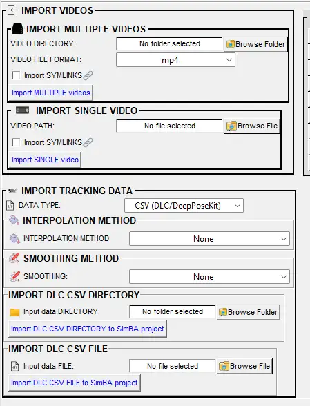

# 🎯 Scenario 4: Adding New Experimental Data to a Previously Started Project

---

> **Tooltips:** Many menu items and dialog options in SimBA have **tooltips**. Hover over a label or control to see a short description.

---

## 📖 Overview

SimBA provides several scenario-based tutorials. This tutorial covers **Scenario 4**: using an existing project and classifier to analyze a **new batch** of experimental data (e.g. Day 2 and Day 3) after you have already analyzed an earlier batch (e.g. Day 1) in [Scenario 2](Scenario2.md). You have already generated a classifier ([Scenario 1](Scenario1.md)), run the classifier on Day 1 ([Scenario 2](Scenario2.md)), and optionally improved the classifier with more training data ([Scenario 3](Scenario3.md)). You now want to run the same classifier on Days 2 and 3 without re-analyzing the Day 1 files.

This scenario is very similar to [Scenario 2](Scenario2.md); the main difference is how you prepare the project so that SimBA only processes the **new** data (Part 1 below).

**What this scenario is about:** You analyze **new** videos with a classifier that has **already been created and validated**. Once the model is trained (Scenario 1, and optionally refined in Scenario 3), the goal of using machines is to score behavior quickly on new experimental data without re-annotating or re-training. Scenario 4 is that workflow—adding a new batch of videos to an existing project and running the same classifier to get predictions and analyses with minimal extra work.

**You are ready for Scenario 4 if:**
- You have a SimBA project that already contains analyzed data from an earlier batch (e.g. Day 1).
- You have new experimental videos and pose-estimation files (e.g. Day 2 and Day 3) to add and analyze with the same classifier.

---

## 📊 Hypothetical Experiment

Three days of resident–intruder testing between aggressive CD-1 mice and subordinate C57 intruders. Each day has 10 pairs of mice, for a total of 30 videos across 3 days. Recordings are 3 minutes, in color, at 30 fps. Day 1 was analyzed in [Scenario 2](Scenario2.md); here you add and analyze Day 2 and Day 3.

| Property | Value |
|----------|-------|
| **Experiment** | Resident–intruder: aggressive CD-1 vs. subordinate C57 intruders |
| **Days** | 3 days of testing |
| **Pairs per day** | 10 pairs per day, 30 videos total |
| **Video specs** | 3 min, color, 30 fps |
| **Already analyzed** | Day 1 (Scenario 2) |
| **To analyze here** | Day 2 and Day 3 |

---

## 🗺️ Workflow at a Glance

- [Part 1: Clean up your previous project (or create a new one)](#part-1-clean-up-your-previous-project-or-create-a-new-one)
- [Part 2: Load the project and import your new data](#part-2-load-the-project-and-import-your-new-data)
- [Part 3: Process the data for Day 2–3](#part-3-process-the-data-for-day-23)
- [Part 4: Run the classifier on Day 2–3](#part-4-run-the-classifier-on-day-23)
- [Part 5: Analyze machine results](#part-5-analyze-machine-results)
- [Part 6: Visualize machine predictions](#part-6-visualize-machine-predictions)
- [Part 7: Post-classification validation](#part-7-post-classification-validation-detecting-false-positives)

---

## 📁 Part 1: Clean up your previous project (or create a new one)

You need a project that contains **only** the data you want to analyze in this run. If you continue from [Scenario 2](Scenario2.md), your project has Day 1 CSV files in `project_folder/csv/input/`, `project_folder/csv/features_extracted/`, `project_folder/csv/machine_results/`, and related folders. SimBA will process every CSV SimBA finds in those directories, so if you leave Day 1 files in place, they will be analyzed again together with Day 2–3. To avoid re-analyzing Day 1, either archive the old files or use a new project.

**Options:**

1. **Archive processed files** — Keep using the same project folder. After loading your project, go to the **Further imports** tab. In the **FURTHER METHODS** section, click <kbd>ARCHIVE PROCESSED FILES IN SIMBA PROJECT</kbd>. Enter a name for the archive (e.g. `Day1`) and click <kbd>RUN ARCHIVE</kbd>. SimBA moves the processed CSV files from the active `project_folder/csv/` subdirectories into an archive subfolder so they are no longer analyzed. Day 1 data stays in the project but is hidden from the next run. This is the same workflow described in [Scenario 2 — Part 1: Clean up or create project](Scenario2.md#part-1--clean-up-or-create-simba-project).

   

     
   

2. **Manually move files** — Alternatively, move the already-analyzed CSV files out of the immediate `project_folder/csv/` subdirectories into a subfolder (e.g. `Day1`) or another location. You must move files for **(i)** `project_folder/csv/input/`, **(ii)** `project_folder/csv/outlier_corrected_movement/`, **(iii)** `project_folder/csv/outlier_corrected_movement_location/`, **(iv)** `project_folder/csv/features_extracted/`, and **(v)** `project_folder/csv/machine_results/`. SimBA only reads CSVs that sit directly in these folders (or their configured equivalents), so moving them into a subfolder hides them. Log files (e.g. outlier correction counts, descriptive statistics) live in `project_folder/logs/`; you can move those into a Day1 subfolder too if you want to keep outputs organized.

3. **Create a new project** — Start a new project that contains only the new experimental data (Day 2 and Day 3). Follow [Scenario 1 — Part 1: Create a new project](Scenario1.md#part-1-create-a-new-project) and import only the new videos and tracking data. Use the same body-part configuration and classifier names as your existing project so the classifier runs correctly.

---

## ⚙️ Part 2: Load the project and import your new data

1. **Load the project.** If you archived or moved files in Part 1, load the same project. If you created a new project, load that one. Follow [Scenario 1 — Step 1: Load project config](Scenario1.md#step-1--load-project-config).

2. **Import the new tracking data and videos.** Use the **Further imports** tab to add the Day 2 and Day 3 pose-estimation CSVs and videos. Follow [Scenario 1 — Step 2 (optional): Further imports](Scenario1.md#step-2-optional--further-imports). After importing, the new files appear in `project_folder/csv/input/` (and videos in `project_folder/videos/`).

   

     
   

---

## 🔧 Part 3: Process the data for Day 2–3

Process the newly imported data so it has the same structure as the data the classifier was trained on: set video parameters, correct outliers, and extract features. Follow **Steps 3–5** in [Scenario 1](Scenario1.md):

- [Step 3: Set video parameters](Scenario1.md#step-3--set-video-parameters)
- [Step 4: Outlier correction](Scenario1.md#step-4--outlier-correction)
- [Step 5: Extract features](Scenario1.md#step-5--extract-features)

**Calibration:** Calibrate each new video with its **own** pixels per mm and fps (e.g. using the known-distance picker). The numeric value of pixels per mm will often differ between videos if the camera distance or resolution changed—that is expected. What matters is that you calibrate so that features are in the same **real-world units** (e.g. mm, mm/s) as the training data, so the classifier receives inputs on the same scale. Use the same **body-part configuration** and **outlier criteria** as in your original project so the feature set (which body parts, which metrics) matches what the classifier was trained on.

---

## 🤖 Part 4: Run the classifier on Day 2–3

The Day 2–3 data is now in the project with corrected pose and extracted features. Run the BtWGaNP classifier (or whichever classifier you use) on the Day 2–3 videos. For full step-by-step instructions and all options, see [Scenario 2 — Part 3: Run the classifier on new data](Scenario2.md#part-3--run-the-classifier-on-new-data). For where the model file comes from (training) and how to validate the model on a single video, see [Scenario 1 — Step 7: Train machine model](Scenario1.md#step-7--train-machine-model) and [Scenario 1 — Step 8: Validate model on new data](Scenario1.md#step-8--validate-model-on-new-data).

1. Go to the **Run machine model** tab and click <kbd>RUN MODELS</kbd>.

  

2. In the pop-up, ensure the model path points to your `.sav` file (e.g. from `project_folder/models/generated_models/` or from when you ran Day 1 in Scenario 2). Paths are stored in `project_config.ini` and usually do not need to be re-entered.
3. Set **Discrimination threshold** and **Minimum bout length (ms)** as in Scenario 2 (see [Scenario 2 — Part 3: Set discrimination threshold and minimum bout length](Scenario2.md#step-3-set-discrimination-threshold-and-minimum-bout-length)).
4. Click <kbd>RUN</kbd>. SimBA writes predictions to `project_folder/csv/machine_results/` for each new CSV in `project_folder/csv/features_extracted/`.

To validate the classifier on a single video (e.g. to tune threshold and bout length before running on all of Day 2–3), use the **VALIDATE MODEL ON SINGLE VIDEO** section in the same tab — see [Scenario 1 — Step 8](Scenario1.md#step-8--validate-model-on-new-data).

  

---

## 📈 Part 5: Analyze machine results

Generate descriptive statistics and analysis for the Day 2–3 classifications. Go to the **Run machine model** tab → **Analyze machine results** section. All tools read from `project_folder/csv/machine_results/` (or, for distance/velocity, from `project_folder/csv/outlier_corrected_movement_location/`) and write date-time stamped CSVs to `project_folder/logs/` (and plot subfolders when applicable). For detailed options and screenshots, see [Scenario 2 — Part 4: Analyze machine learning results](Scenario2.md#part-4--analyze-machine-learning-results).

| Analysis | Description |
|----------|-------------|
| **[1. Aggregates](Scenario2.md#1-analyze-machine-predictions-aggregates)** | Summary statistics per video and per classifier: first occurrence, bout count, total/mean/median duration, mean/median interval. Optional detailed bout table. |
| **[2. Distance / velocity (aggregates)](Scenario2.md#2-analyze-distances--velocity-aggregates)** | Total distance (cm) and average velocity (cm/s) per video per animal from pose data. No classifier required. |
| **[3. Machine predictions: time bins](Scenario2.md#3-analyze-machine-predictions-time-bins)** | Same metrics as aggregates but per time bin (e.g. 30 s or 60 s) within each video. |
| **[4. Distance / velocity: time bins](Scenario2.md#4-analyze-distances--velocity-time-bins)** | Distance and velocity per time bin per video. Optional line plots. |
| **[5. Machine predictions: by ROI](Scenario2.md#5-analyze-machine-predictions-by-roi)** | Behavior time and bout counts inside user-defined ROIs (zones). Requires ROIs to be defined. |
| **[6. Machine predictions: by severity](Scenario2.md#6-analyze-machine-predictions-by-severity)** | Grade behavior intensity (e.g. mild vs severe) using movement during bouts; output severity brackets and optional example clips. |

---

## 📊 Part 6: Visualize machine predictions

Create visualizations for the Day 2–3 results. Go to the **[Visualizations]** tab. For a consolidated reference of all visualization methods, see [Visualizations](Visualizations.md). All tools read from `project_folder/csv/machine_results/` (or `project_folder/csv/outlier_corrected_movement_location/` for path/distance/data tables) and from videos in `project_folder/videos/`; outputs go under `project_folder/frames/output/` in type-specific subfolders. You can only visualize on videos for which you have feature data. For detailed options and screenshots, see [Scenario 2 — Part 5: Visualizing results](Scenario2.md#part-5--visualize-results).

| Visualization | Description |
|---------------|-------------|
| **[Classification videos](Scenario2.md#visualize-classifications)** | Overlay predictions and probabilities on video (or save per-frame images). Optional pose, Gantt, timers. Output: `sklearn_results/`. |
| **[Gantt charts](Scenario2.md#visualize-gantt-charts)** | Horizontal bar charts: when each behavior occurred and for how long. Static image, video, or per-frame. Output: `gantt_plots/`. |
| **[Probability plots](Scenario2.md#visualize-probability-plots)** | Line plots of classifier probability over time. Output: `probability_plots/`. |
| **[Path plots](Scenario2.md#visualize-path-plots)** | Animal movement paths with behavior locations overlaid. Output: `path_plots/`. |
| **[Distance plots](Scenario2.md#visualize-distance-plots)** | Distance or velocity over time (from pose). Output: `line_plot/`. |
| **[Classification heatmaps](Scenario2.md#visualize-classification-heatmaps)** | Heatmaps of where behavior occurred in the arena. Output: `heatmaps_classifier_locations/`. |
| **[Data tables](Scenario2.md#visualize-data-tables)** | Live data table (or video) of metrics per frame. Output: `live_data_table/`. |
| **[Merge (concatenate) videos](Scenario2.md#merge-concatenate-multiple-videos)** | Concatenate multiple videos (e.g. clips or visualization outputs) into one file. Output: `merged/`. |

---

## ✅ Part 7: Post-classification validation (detecting false-positives)

When you have many predictions, you may want to review them in short clips that show only the classified events. The **post-classification validation** tool generates a video for each CSV that contains concatenated clips of all bouts of the target behavior identified by the classifier. The post-classification validation tool helps you spot false positives and tune the discrimination threshold or minimum bout length.

  

- **Seconds** — Duration (in seconds) to add **before** the start and **after** the end of each event. For example, for a 2-second attack, entering **1** adds 1 second before and 1 second after, so the clip is 4 seconds long. Larger values produce longer clips.
- **Target** — The target behavior (e.g. BtWGaNP) to include in the validation video.

**Steps:**

1. In the **Run machine model** tab, open the **Validate** / post-classification validation section.
2. Enter a value in the **Seconds** entry box (e.g. 1 or 2).
3. Select the target behavior from the **Target** dropdown.
4. Click <kbd>Validate</kbd>. Videos are generated in `project_folder/frames/output/classifier_validation/`. Each file is named: **videoname** + **target behavior** + **number of bouts** + `.mp4`.

  <video src="images/scenario4/classifiervalidation.webm" width="600" controls style="border: 1px solid #999; border-radius: 4px; box-shadow: 0 10px 40px rgba(0,0,0,0.35); max-width: 100%;">Your browser does not support the video tag.</video>

  <video src="images/scenario4/ClassifierValidationClips_1.webm" width="600" controls style="border: 1px solid #999; border-radius: 4px; box-shadow: 0 10px 40px rgba(0,0,0,0.35); max-width: 100%;">Your browser does not support the video tag.</video>

---

## ➡️ Next Steps

- **[Scenario 1](Scenario1.md)** — Train or validate a classifier.
- **[Scenario 2](Scenario2.md)** — Run the classifier on experimental data and create visualizations.
- **[Scenario 3](Scenario3.md)** — Update the classifier with more annotated data.

---

**🎉 Congratulations!** You have added and analyzed a new batch of experimental data in the same project. You can repeat this workflow (Parts 1–6) for further batches (e.g. Day 4, Day 5) or refine your classifier with [Scenario 3](Scenario3.md).

---

> **Bugs and feature requests:** Please help improve SimBA by reporting bugs or suggesting features—either [open an issue on GitHub](https://github.com/sgoldenlab/simba/issues) or reach out on [Gitter](https://gitter.im/SimBA-Resource/community).

*Author: [Simon N](https://github.com/sronilsson)*
