# 🔧 SimBA Tools Reference

> This is a consolidated reference for the **Tools** menu in SimBA. It is based on [Tutorial_tools.md](https://github.com/sgoldenlab/simba/blob/master/docs/Tutorial_tools.md) and the current SimBA GUI. For visualization-specific tools (e.g. create path plot, visualize pose in folder, concatenate two videos), see [Visualizations.md](Visualizations.md).

SimBA provides video and image processing tools that work **with or without** a SimBA project. Many are useful for one-off tasks (trim a video, change FPS, crop, convert format). They are available from the **Tools** menu:

- **Tools** — Change FPS, clip, crop, convert formats, remove color, concatenate videos, convert ROI definitions, convert tracking data formats, create path plot, drop body-parts, down-sample video, extract frames, create GIFs, get metric conversion factor, brightness/contrast, merge frames to video, change playback speed, print classifier info, video meta data, reorganize tracking data, rotate/flip/reverse, superimpose on videos, remove backgrounds, temporal join, box blur, cross-fade, average frames, validate video seekability, **visualize pose-estimation in folder**, and **egocentrically align pose and video** (the last two are also described in [Visualizations.md](Visualizations.md)).

> **Batch preprocessing** is **not** part of the Tools menu. It lives under **Process Videos** → **Batch pre-process videos**. Use batch preprocessing when you want to apply the same operations (e.g. clip, crop, downsample, change format) to **many videos in one go**, often before creating a project or importing. For full instructions, see [Tutorial: Process videos](https://github.com/sgoldenlab/simba/blob/master/docs/tutorial_process_videos.md) (batch pre-processing).

The **Process Videos** menu (separate from **Tools**) includes **Blob tracking** and **YOLO tracking**; those are summarized in [Visualizations.md](Visualizations.md).

> **GPU:** Many video processing dialogs include a **USE GPU** (or similar) option. If you have an NVIDIA GPU, enabling it can speed up processing. See [GPU vs CPU video processing runtimes](https://github.com/sgoldenlab/simba/blob/master/docs/gpu_vs_cpu_video_processing_runtimes.md) for typical time savings.

> **FFmpeg:** Most video and image processing operations in the Tools menu (change FPS, clip, crop, convert format, remove color, concatenate, down-sample, merge frames, playback speed, rotate/flip/reverse, superimpose, and others) rely on **FFmpeg** for encoding and decoding. Ensure [FFmpeg is installed and on your system PATH](https://github.com/sgoldenlab/simba/blob/master/docs/installation.md) so these tools run correctly.

> **Tooltips:** Many menu items and dialog options in SimBA have **tooltips**. Hover over a label or control to see a short description.

---

## 📑 Contents

Jump to any section:

- [📋 Quick reference (Tools menu)](#-quick-reference-tools-menu)
- [📖 Detailed sections (Tools menu)](#-detailed-sections-tools-menu)
- [⏱️ Change FPS (Tools menu)](#change-fps-tools-menu)
  - [Change FPS for single video](#-change-fps-for-single-video)
  - [Change FPS for multiple videos](#-change-fps-for-multiple-videos)
  - [Up-sample FPS with interpolation](#-up-sample-fps-with-interpolation)
- [✂️ Clip videos (Tools menu)](#clip-videos-tools-menu)
  - [Clip single video (by time)](#-clip-single-video-by-time)
  - [Clip multiple videos (by time)](#-clip-multiple-videos-by-time)
  - [Clip video into multiple videos](#-clip-video-into-multiple-videos)
  - [Clip single video by frame numbers](#-clip-single-video-by-frame-numbers)
  - [Clip multiple videos by frame numbers](#-clip-multiple-videos-by-frame-numbers)
- [🔲 Crop videos (Tools menu)](#crop-videos-tools-menu)
  - [Crop videos (rectangle)](#-crop-videos-rectangle)
  - [Crop videos (circles)](#-crop-videos-circles)
  - [Crop videos (polygons)](#-crop-videos-polygons)
  - [Multi-crop videos](#multi-crop-videos)
- [🔄 Convert file formats (Tools menu)](#convert-file-formats-tools-menu)
  - [Convert image file formats](#-convert-image-file-formats)
  - [Convert video file formats (single or multiple)](#-convert-video-file-formats-single-or-multiple)
- [🎨 Remove color from videos (Tools menu)](#remove-color-from-videos-tools-menu)
  - [Convert to grayscale](#-convert-to-grayscale)
  - [Convert to black and white](#-convert-to-black-and-white)
  - [CLAHE enhance videos](#-clahe-enhance-videos)
  - [Interactively CLAHE enhance videos](#-interactively-clahe-enhance-videos)
- [🎞️ Concatenate (stack) videos](#concatenate-stack-videos)
  - [Concatenate two videos](#concatenate-two-videos)
  - [Concatenate multiple videos](#concatenate-multiple-videos)
- [📐 Convert ROI definitions](#convert-roi-definitions)
- [🔀 Convert tracking data formats](#convert-tracking-data-formats)
- [📄 Convert working file type](#convert-working-file-type)
- [📈 Create path plot](#create-path-plot)
- [✂️ Drop body-parts from tracking data](#drop-body-parts-from-tracking-data)
- [📉 Down-sample video](#down-sample-video)
  - [Down-sample single video](#-down-sample-single-video)
  - [Down-sample multiple videos](#-down-sample-multiple-videos)
- [🖼️ Extract frames](#extract-frames)
  - [Extract defined frames (single video)](#-extract-defined-frames-single-video)
  - [Extract frames from single video (all frames)](#-extract-frames-from-single-video-all-frames)
  - [Extract frames from multiple videos (all frames)](#-extract-frames-from-multiple-videos-all-frames)
  - [Extract frames from seq files](#-extract-frames-from-seq-files)
- [🎞️ Create GIFs](#create-gifs)
- [📏 Get metric conversion factor (pixels/millimeter)](#get-metric-conversion-factor-pixelsmillimeter)
- [☀️ Change video brightness / contrast](#change-video-brightness--contrast)
- [🎬 Merge frames to video](#merge-frames-to-video)
- [⏩ Change video playback speed](#change-video-playback-speed)
- [🖨️ Print classifier info](#print-classifier-info)
- [ℹ️ Show video file(s) meta data](#show-video-files-meta-data)
- [🔀 Reorganize Tracking Data](#reorganize-tracking-data)
- [🔄 Rotate / flip / reverse videos](#rotate--flip--reverse-videos)
  - [Rotate videos](#-rotate-videos)
  - [Interactively rotate videos](#-interactively-rotate-videos)
  - [Flip videos](#-flip-videos)
  - [Reverse videos](#-reverse-videos)
- [🏷️ Superimpose on videos](#superimpose-on-videos)
  - [Superimpose frame numbers](#-superimpose-frame-numbers)
  - [Superimpose watermark](#-superimpose-watermark)
  - [Superimpose timer](#-superimpose-timer)
  - [Superimpose progress-bar](#-superimpose-progress-bar)
  - [Superimpose video on video](#-superimpose-video-on-video)
  - [Superimpose video names](#-superimpose-video-names)
  - [Superimpose free-text](#-superimpose-free-text)
- [🎭 Remove video backgrounds](#remove-video-backgrounds)
  - [Remove background from single video (mean subtraction)](#-remove-background-from-single-video-mean-subtraction)
  - [Remove background from multiple videos (mean subtraction)](#-remove-background-from-multiple-videos-mean-subtraction)
- [⏱️ Temporal join videos](#temporal-join-videos)
  - [Temporal join all videos in directory](#-temporal-join-all-videos-in-directory)
  - [Temporal join selected videos](#-temporal-join-selected-videos)
- [🌫️ Box blur videos](#box-blur-videos)
- [🌅 Cross-fade videos](#cross-fade-videos)
- [📊 Create average frames from videos](#create-average-frames-from-videos)
- [✅ Validate video seekability](#validate-video-seekability)
- [👁️ Visualize pose-estimation in folder](#visualize-pose-estimation-in-folder)
- [🧭 Egocentrically align pose and video](#egocentrically-align-pose-and-video)
- [📊 Extract project annotation counts](#extract-project-annotation-counts)
- [📚 Related documentation](#related-documentation)
- [🔗 API reference (Read the Docs)](#api-reference-read-the-docs)

---

## 📋 Quick reference (Tools menu)

| Menu path | Description |
|-----------|-------------|
| [**Tools** → **Change FPS...**](#change-fps-tools-menu) | Single/multiple video FPS; up-sample with interpolation |
| [**Tools** → **Clip videos...**](#clip-videos-tools-menu) | Clip single/multiple by time or frame numbers; clip into multiple videos |
| [**Tools** → **Crop videos...**](#crop-videos-tools-menu) | Rectangle crop; circle crop; polygon crop; multi-crop |
| [**Tools** → **Convert file formats...**](#convert-file-formats-tools-menu) | Images (PNG, JPEG, BMP, TIFF, WEBP); videos (MP4, AVI, WEBM, MOV) |
| [**Tools** → **Remove color from videos...**](#remove-color-from-videos-tools-menu) | Grayscale; black and white; CLAHE; interactive CLAHE |
| [**Tools** → **Concatenate (stack) videos...**](#concatenate-stack-videos) | Two videos (horizontal/vertical); multiple videos (mosaic) |
| [**Tools** → **Convert ROI definitions**](#convert-roi-definitions) | Export ROI definitions (H5) to CSV (polygons, rectangles, circles) |
| [**Tools** → **Convert tracking data formats...**](#convert-tracking-data-formats) | DLC/SLEAP/COCO/Labelme ↔ YOLO and other pose formats |
| [**Tools** → **Convert working file type...**](#convert-working-file-type) | CSV ↔ parquet |
| [**Tools** → **Create path plot**](#create-path-plot) | Simple path plot from pose CSV (no project). See [Visualizations](Visualizations.md#create-path-plots-roi-tab). |
| [**Tools** → **Drop body-parts from tracking data**](#drop-body-parts-from-tracking-data) | Remove selected body-parts from pose CSVs in a folder |
| [**Tools** → **Down-sample video...**](#down-sample-video) | Single or multiple videos to lower resolution |
| [**Tools** → **Extract frames...**](#extract-frames) | Defined frame range; single/multiple video; from .seq files |
| [**Tools** → **Create GIFs**](#create-gifs) | Generate GIF from video (start time, duration, size) |
| [**Tools** → **Get metric conversion factor (pixels/millimeter)**](#get-metric-conversion-factor-pixelsmillimeter) | Calibrate known length in mm on one frame |
| [**Tools** → **Change video brightness / contrast**](#change-video-brightness--contrast) | Adjust brightness and contrast |
| [**Tools** → **Merge frames to video**](#merge-frames-to-video) | Folder of images → video (format, fps, bitrate) |
| [**Tools** → **Change video playback speed**](#change-video-playback-speed) | Speed up or slow down video |
| [**Tools** → **Print classifier info**](#print-classifier-info) | Print model details from a `.sav` file |
| [**Tools** → **Show video file(s) meta data**](#show-video-files-meta-data) | Print video metadata (resolution, fps, etc.) |
| [**Tools** → **Reorganize Tracking Data**](#reorganize-tracking-data) | Reorder body-parts across pose files in a folder |
| [**Tools** → **Rotate / flip / reverse videos...**](#rotate--flip--reverse-videos) | Rotate (fixed or interactive); flip; reverse |
| [**Tools** → **Superimpose on videos...**](#superimpose-on-videos) | Frame numbers; watermark; timer; progress bar; video on video; video names; free text |
| [**Tools** → **Remove video backgrounds...**](#remove-video-backgrounds) | Mean-subtraction background removal (single or directory) |
| [**Tools** → **Temporal join videos...**](#temporal-join-videos) | Join videos in directory or selected list into one (by order) |
| [**Tools** → **Box blur videos**](#box-blur-videos) | Apply box blur |
| [**Tools** → **Cross-fade videos**](#cross-fade-videos) | Cross-fade between two videos |
| [**Tools** → **Create average frames from videos**](#create-average-frames-from-videos) | Average frame(s) across videos |
| [**Tools** → **Validate video seekability**](#validate-video-seekability) | Check if videos are seekable (e.g. for analysis) |
| [**Tools** → **Visualize pose-estimation in folder...**](#visualize-pose-estimation-in-folder) | Overlay pose on videos from any folder. See [Visualizations](Visualizations.md#visualize-pose-estimation-in-folder-tools-menu). |
| [**Tools** → **Egocentrically align pose and video**](#egocentrically-align-pose-and-video) | Center and align orientation. See [Visualizations](Visualizations.md#egocentrically-align-pose-and-video-tools-menu). |

---

## 📖 Detailed sections (Tools menu)

The sections below follow the **Tools** menu order and give short "what it does," where to find it, main options, and where output is saved. For tools covered in more detail in [Visualizations.md](Visualizations.md), the section points to that doc.

---

## ⏱️ Change FPS (Tools menu)

*Available under **Tools** → **Change FPS...**. Three sub-options: single video, multiple videos, or up-sample with interpolation.*

**What it is:** The frame rate (FPS) is how many frames the video shows per second. Changing FPS means re-encoding the video so it plays at a different rate: either fewer frames (e.g. 30 → 15 fps) or more frames (up-sampling adds interpolated frames between existing ones).

**Why use it:** Lower FPS reduces file size and speeds up downstream processing (e.g. before importing into SimBA or for quick previews). Matching FPS across all videos ensures consistent analysis. Up-sampling is useful when you need smoother playback or a specific frame rate for another tool, without re-recording. No SimBA project required.

**Related:** [Clip videos](#clip-videos-tools-menu) (trim before/after), [Down-sample video](#down-sample-video) (reduce resolution), [Batch pre-process videos](https://github.com/sgoldenlab/simba/blob/master/docs/tutorial_process_videos.md) (batch FPS + clip + crop).

---

### ⏱️ Change FPS for single video

* **Tools** → **Change FPS...** → **Change FPS for single video**

Re-encodes **one video** to a new frame rate. You choose the input file and the output FPS (e.g. 15). SimBA creates a new file in the same directory as the input; the frame count may change depending on the ratio (e.g. 30 fps → 15 fps halves the number of frames).

  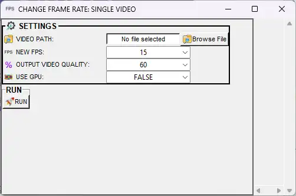

| Option | Description |
|--------|-------------|
| **VIDEO PATH** | Path to the video file. Click **Browse** or type the path. |
| **NEW FPS** | Target frame rate (1–100). Default: 15. The new video will have this many frames per second. Lower FPS = smaller file and fewer frames; higher = smoother but larger. |
| **OUTPUT VIDEO QUALITY** | Percentage (1–100, default 60). Higher = better quality and larger file; lower = smaller file and lower quality. Scale is not linear; 60 usually works well; avoid values above 80. |
| **USE GPU** | **TRUE** = use NVIDIA GPU for faster encoding (if available). **FALSE** = CPU only. |
| **Convert** | Click to run. Progress appears in the SimBA terminal. |

**Where output is saved:** Same directory as the input video. Filename suffix: `fps_{value}` (e.g. `MyVideo_fps_15.mp4`).

[change_single_video_fps.webm](https://github.com/user-attachments/assets/a1b067ce-1bac-46b5-b810-f70d5701774f)

---

### ⏱️ Change FPS for multiple videos

* **Tools** → **Change FPS...** → **Change FPS for multiple videos**

Re-encodes **all videos in a folder** to the same target FPS. Useful for batch standardizing frame rate before import or analysis.

  

| Option | Description |
|--------|-------------|
| **VIDEO DIRECTORY PATH** | Folder containing the videos. All videos in this folder will be converted to the same FPS. |
| **NEW FPS** | Target frame rate (1–100). Default: 15. Every video will be re-encoded to this FPS. |
| **OUTPUT VIDEO QUALITY** | Percentage (1–100, default 60). Higher = better quality and larger file; lower = smaller file and lower quality. Scale is not linear; 60 usually works well; avoid values above 80. |
| **USE GPU** | **TRUE** = use NVIDIA GPU for faster encoding (if available). **FALSE** = CPU only. |
| **Convert** | Click to run. Each file is processed in turn; progress appears in the terminal. |

**Where output is saved:** Same directory as the input videos. Each output file has the same base name as the input with the `fps_{value}` suffix (e.g. `Video1_fps_15.mp4`).

---

### ⏱️ Up-sample FPS with interpolation

* **Tools** → **Change FPS...** → **Up-sample fps with interpolation**

**Increases** the frame rate of a video by generating intermediate frames (interpolation). Use when you need a higher FPS for playback or downstream tools without re-recording. For example, 15 fps → 30 fps adds interpolated frames between existing ones.

  

| Option | Description |
|--------|-------------|
| **Input** / **VIDEO PATH** (single) / **VIDEO DIRECTORY** (multiple) | The video file or folder of videos to up-sample. |
| **Output FPS** / **Target FPS** | The desired higher frame rate (e.g. 30). Must be greater than the source video's FPS. SimBA creates new frames by interpolating between existing ones. |
| **OUTPUT VIDEO QUALITY** | Percentage (1–100, default 60). Higher = better quality and larger file; lower = smaller file and lower quality. Scale is not linear; 60 usually works well; avoid values above 80. |
| **Run** / **Convert** | Start processing. |

**Where output is saved:** Same directory as the input (or as set in the dialog). Filename usually includes a suffix indicating the new FPS.

---

## ✂️ Clip videos (Tools menu)

*Available under **Tools** → **Clip videos...**. Five sub-options: clip single/multiple by time, clip into multiple videos, clip single/multiple by frame numbers.*

**What it is:** Clipping (trimming) means cutting a video to keep only a segment: you specify a start and end (by time, e.g. 00:01:00–00:02:30, or by frame index). SimBA re-encodes only that segment into a new file. You can also split one long video into several shorter clips.

> **TIMELAPSE VIEWER** — Several clip dialogs include a <kbd>TIMELAPSE VIEWER</kbd> button. It opens an interactive window that shows a composite image of evenly-spaced frames from the video, with a time ruler and sliders. Drag the sliders to select the start and end of the segment visually; the window highlights the selected range and shows frame previews. When you close the window (click X or press **Esc**), the chosen start/end times or frame numbers are filled into the dialog. Use it when you prefer visual selection instead of typing timestamps or frame indices manually.

  

**Why use it:** Remove unwanted parts (e.g. setup time at the start, or extra seconds at the end), extract a specific trial or epoch for analysis, or split a long recording into manageable files (e.g. one file per hour). Useful before creating a project or when preparing videos for other tools. No SimBA project required.

**Related:** [Change FPS](#change-fps-tools-menu), [Crop videos](#crop-videos-tools-menu), [Temporal join videos](#temporal-join-videos) (join clips back into one), [Batch pre-process videos](https://github.com/sgoldenlab/simba/blob/master/docs/tutorial_process_videos.md).

---

### ✂️ Clip single video (by time)

* **Tools** → **Clip videos...** → **Clip single video**

Trims **one video** by specifying start and end time. For example, from a 2-minute video you can keep only 00:00:10 to 00:01:55.

  

| Option | Description |
|--------|-------------|
| **FILE PATH** / **VIDEO PATH** | Path to the video to trim. |
| **USE GPU** | **TRUE** = use NVIDIA GPU for faster encoding (if available). **FALSE** = CPU only. |
| **OUTPUT VIDEO QUALITY** | Percentage (1–100, default 60). Higher = better quality and larger file; lower = smaller file and lower quality. Scale is not linear; 60 usually works well; avoid values above 80. |
| **METHOD 1 — Start/End time** | **START AT (HH:MM:SS)** and **END AT (HH:MM:SS)** — Keep only the segment between these times (e.g. 00:00:10 to 00:01:30). **CUT VIDEO** runs the trim. **TIMELAPSE VIEWER** opens an interactive window to scrub the video and set start/end visually. |
| **METHOD 2 — Trim from start** | **SECONDS** — Remove this many seconds from the **beginning** (e.g. 20 = drop the first 20 s). **CUT VIDEO** runs the trim. |
| **METHOD 3 — Trim from end** | **SECONDS** — Remove this many seconds from the **end** (e.g. 5 = drop the last 5 s). **CUT VIDEO** runs the trim. |

**Where output is saved:** Same folder as the input video. Filename: original name + `_shorten` (e.g. `MyVideo_shorten.mp4`).

---

### ✂️ Clip multiple videos (by time)

* **Tools** → **Clip videos...** → **Clip multiple videos**

Trims **all videos in a folder** by time. You select an input directory and an output directory; a table opens with one row per video showing **VIDEO LENGTH**. You set **START TIME** and **END TIME** for each row, then run.

  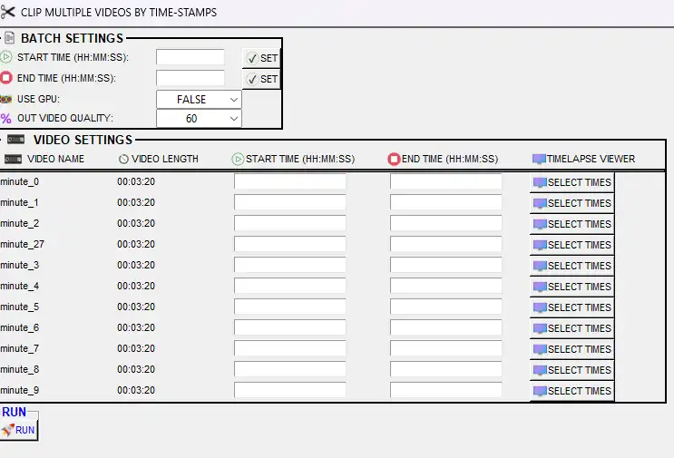

| Option | Description |
|--------|-------------|
| **Input directory** | Folder containing the videos to clip. |
| **Output directory** | Where the shortened videos will be saved. |
| **START TIME** (per video) | Start time in HH:MM:SS. |
| **END TIME** (per video) | End time in HH:MM:SS. Must be after START TIME. |
| **TIMELAPSE VIEWER** (per video) | Each row has a <kbd>TIMELAPSE VIEWER</kbd> button. Click it to open the interactive timelapse window for that video; use sliders to select start and end visually. When you close the window, the chosen times fill into the START TIME and END TIME fields for that row. |
| **USE GPU** | **TRUE** = use GPU for encoding (if available). **FALSE** = CPU only. |
| **OUTPUT VIDEO QUALITY** | Percentage (1–100, default 60). Higher = better quality and larger file; lower = smaller file and lower quality. Scale is not linear; 60 usually works well; avoid values above 80. |
| **RUN** | Process all videos. |

**Where output is saved:** The **output directory** you chose. Filenames typically keep the original base name with a suffix (e.g. `_shorten`).

**Alternative:** For batch clipping by time you can also use **Process Videos** → **Batch pre-process videos** or the [batch pre-processing tutorial](https://github.com/sgoldenlab/simba/blob/master/docs/tutorial_process_videos.md).

---

### ✂️ Clip video into multiple videos

* **Tools** → **Clip videos...** → **Clip video into multiple videos**

Splits **one video** into **several separate clips**. You define how many clips and the start/stop time for each (e.g. clip 1: 00:00:00–00:01:00, clip 2: 00:01:00–00:02:00).

  

| Option | Description |
|--------|-------------|
| **Browse File** / **VIDEO PATH** | Path to the video to split. |
| **# of clips** | Number of output clips (e.g. 3). After entering, click <kbd>Confirm</kbd> to fill the table with one row per clip. |
| **Start Time** / **Stop Time** (per clip) | For each clip, enter start and end in **HH:MM:SS** (e.g. 00:01:00 to 00:02:00). End time must be after start time. |
| **TIMELAPSE VIEWER** (per clip) | Each row has a <kbd>TIMELAPSE VIEWER</kbd> button. Click it to open the interactive window; drag sliders to choose start and end visually. When you close the window, the chosen times fill into that row. |
| **OUTPUT VIDEO QUALITY** | Percentage (1–100, default 60). Higher = better quality and larger file; lower = smaller file and lower quality. Scale is not linear; 60 usually works well; avoid values above 80. |
| **USE GPU** | **TRUE** = use NVIDIA GPU for encoding (if available). **FALSE** = CPU only. |
| **Clip video** | Run. One output file per clip. |

**Where output is saved:** Same folder as the input video. Output files are named by clip (e.g. index or time range).

---

### ✂️ Clip single video by frame numbers

* **Tools** → **Clip videos...** → **Clip single video by frame numbers**

Trims **one video** by **start frame** and **end frame** index instead of time. Useful when you know exact frame numbers from another tool or script.

  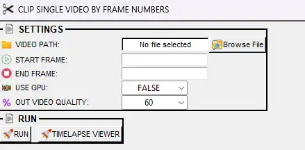

| Option | Description |
|--------|-------------|
| **Video path** / **VIDEO PATH** | Path to the video to clip. |
| **START FRAME** | First frame to keep. Frames are usually 1-based (first frame = 1); check the dialog if unsure. |
| **END FRAME** | Last frame to keep. Must be greater than or equal to START FRAME. |
| **TIMELAPSE VIEWER** | Click to open the interactive window with frame sliders. Drag to select start and end frames visually; on close, the values fill into START FRAME and END FRAME. |
| **OUTPUT VIDEO QUALITY** / **OUT VIDEO QUALITY** | Percentage (1–100, default 60). Higher = better quality and larger file; lower = smaller file and lower quality. Scale is not linear; 60 usually works well; avoid values above 80. |
| **USE GPU** | **TRUE** = use NVIDIA GPU for encoding (if available). **FALSE** = CPU only. |
| **RUN** | Create the clipped video. |

**Where output is saved:** Same directory as the input video. Filename includes a suffix with the frame range (e.g. `MyVideo_100_500.mp4`).

---

### ✂️ Clip multiple videos by frame numbers

* **Tools** → **Clip videos...** → **Clip multiple videos by frame numbers**

Same as clip single by frame numbers, but for **all videos in a folder**. You select input and output directories; a table lists each video with **TOTAL FRAMES**; you set **START FRAME** and **END FRAME** per video, then run.

  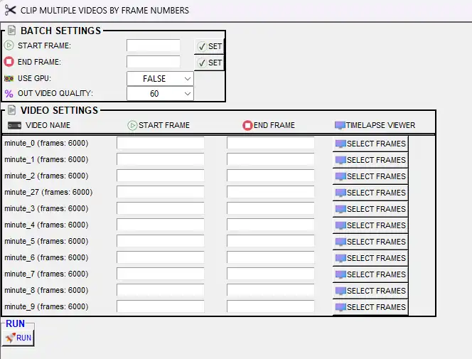

| Option | Description |
|--------|-------------|
| **Input directory** | Folder containing the videos to clip. |
| **Output directory** | Folder where the clipped videos will be saved. |
| **START FRAME** / **END FRAME** (per video) | For each video, the first and last frame to keep. You can type values or use **SET** to apply one value to all rows. |
| **TIMELAPSE VIEWER** (per video) | Each row has a <kbd>SELECT FRAMES</kbd> (timelapse) button. Click it to open the interactive window for that video; use sliders to pick start and end frames visually. On close, the values fill into that row. |
| **OUTPUT VIDEO QUALITY** / **OUT VIDEO QUALITY** | Percentage (1–100, default 60). Higher = better quality and larger file; lower = smaller file and lower quality. Scale is not linear; 60 usually works well; avoid values above 80. |
| **USE GPU** | **TRUE** = use NVIDIA GPU for encoding (if available). **FALSE** = CPU only. |
| **RUN** | Process all videos. |

**Where output is saved:** The **output directory** you chose.

---

## 🔲 Crop videos (Tools menu)

*Available under **Tools** → **Crop videos...**. Four sub-options: rectangle crop, circle crop, polygon crop, multi-crop.*

**What it is:** Cropping keeps only a **region of interest** in each frame and discards the rest. You define the region by drawing it on the first frame (rectangle, circle, or polygon); SimBA applies that same region to every frame and writes a new, smaller video.

**Why use it:** Focus on the arena or animal and remove irrelevant areas (e.g. walls, extra cage space), reduce file size and speed up analysis, or split one wide-angle recording into several videos (e.g. one camera covering four cages → four cropped videos). No SimBA project required.

**Related:** [Clip videos](#clip-videos-tools-menu), [Multi-crop videos](#multi-crop-videos) (multiple regions per video), [Down-sample video](#down-sample-video), [Batch pre-process videos](https://github.com/sgoldenlab/simba/blob/master/docs/tutorial_process_videos.md).

---

### 🔲 Crop videos (rectangle)

* **Tools** → **Crop videos...** → **Crop videos**

Crops **one video** to a **rectangular** region. The first frame opens; you click and drag to draw the rectangle, then press **Enter** twice to apply.

  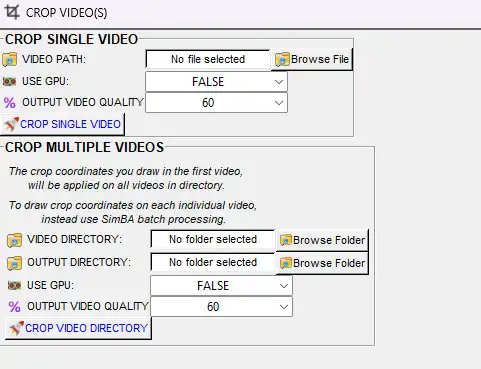

| Option | Description |
|--------|-------------|
| **Browse File** / **VIDEO PATH** | Path to the video to crop. |
| **USE GPU** | **TRUE** = use NVIDIA GPU for encoding (if available). **FALSE** = CPU only. |
| **OUTPUT VIDEO QUALITY** | Percentage (1–100, default 60). Higher = better quality and larger file; lower = smaller file and lower quality. Scale is not linear; 60 usually works well; avoid values above 80. |
| **CROP SINGLE VIDEO** / **Crop Video** | Opens the first frame; draw the rectangle (left-click and drag). You can redraw by clicking and dragging again. **Enter** (twice) confirms and starts cropping. |

**Where output is saved:** Same folder as the input video. Filename: original name + `_cropped` (e.g. `MyVideo_cropped.mp4`).

[crop_rectangle.webm](https://github.com/user-attachments/assets/33d9b792-6aa1-4436-8302-1fcf69d875aa)

---

### 🔲 Crop videos (circles)

* **Tools** → **Crop videos...** → **Crop videos (circles)**

Crops to a **circular** region. Single-video mode: draw one circle per video. **Fixed circle coordinates crop for multiple videos**: draw the circle once on the first video, then apply the same circle to all videos in a folder (useful when the camera and arena are static).

| Option | Description |
|--------|-------------|
| **Video path** (single) | Path to the video. Click **Crop**; the first frame opens for drawing. |
| **Video directory** / **Output directory** (batch) | For fixed circle crop: folder of input videos and folder where cropped videos will be saved. |
| **OUTPUT VIDEO QUALITY** | Percentage (1–100, default 60). Higher = better quality and larger file; lower = smaller file and lower quality. Scale is not linear; 60 usually works well; avoid values above 80. |
| **USE GPU** | **TRUE** = use NVIDIA GPU for encoding (if available). **FALSE** = CPU only. |
| **Draw circle** | On the first frame: **left-click** at the center of the region, **drag** to the edge to set the radius. **Without releasing the mouse**, press **ESC**, **Space**, or **Q** to confirm the circle. |
| **Crop** (single) / **Crop Videos** (batch) | Single: runs after you confirm the circle. Batch: applies the same circle to all videos in the directory. |

**Where output is saved:** Same folder as input (single), or the **output directory** you chose (batch). Filenames typically add `_cropped` or similar.

[crop_circle_0.webm](https://github.com/user-attachments/assets/51b85a98-8ba8-45da-8d0a-8f8030878341)

[crop_circle_1.webm](https://github.com/user-attachments/assets/5a48355e-34a3-4836-8e03-52b369cbe6d4)

[circle_crop_2.webm](https://github.com/user-attachments/assets/247b684e-33ab-4dfb-a8fb-2c6f36f4f2cb)

[circle_crop_3.webm](https://github.com/user-attachments/assets/66a5bf36-ea93-4023-9609-3c07fdf26e28)

---

### 🔲 Crop videos (polygons)

* **Tools** → **Crop videos...** → **Crop videos (polygons)**

Crops to a **user-defined polygon** (shape with multiple corners). You click points on the first frame to define the shape; SimBA crops every frame to that polygon.

| Option | Description |
|--------|-------------|
| **Input** / **VIDEO PATH** (single) / **Video directory** (batch) | The video file or folder of videos to crop. |
| **Output directory** (batch) | Where to save the cropped videos (batch mode). |
| **Polygon** | On the first frame, **click** to place each vertex of the polygon in order. Complete the shape (e.g. close the loop or press a key to finish). Exact method (clicks vs drag) depends on the dialog. |
| **OUTPUT VIDEO QUALITY** (if available) | Percentage (1–100, default 60). Higher = better quality and larger file; lower = smaller file and lower quality. Scale is not linear; 60 usually works well; avoid values above 80. |
| **USE GPU** (if available) | **TRUE** = use NVIDIA GPU for encoding. **FALSE** = CPU only. |
| **Run** / **Crop** | Apply the crop and save the new video(s). |

**Where output is saved:** As specified in the dialog (often same directory as input with `_cropped` or similar).

[roi_selector_polygon.webm](https://github.com/user-attachments/assets/79a5e725-b4da-40fa-bfa4-9efea37b0712)

---

### 🔲 Multi-crop videos

* **Tools** → **Crop videos...** → **Multi-crop**

Splits **each video** into **several cropped videos** by drawing multiple rectangles (e.g. one camera recording four arenas yields four output videos per file). You set **CROPS PER VIDEO**; for each video in the folder, the first frame opens and you draw that many rectangles in order (one per output clip). Press **Enter** after each rectangle; then move to the next video.

  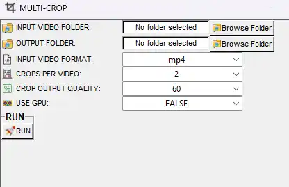

| Option | Description |
|--------|-------------|
| **INPUT VIDEO FOLDER** | Directory containing the videos to multi-crop. |
| **OUTPUT FOLDER** | Where the cropped videos will be saved. |
| **INPUT VIDEO FORMAT** | File extension of input videos (e.g. mp4, avi, mov). |
| **CROPS PER VIDEO** | Number of rectangles (output clips) per input video (2–30). Default: 2. |
| **CROP OUTPUT QUALITY** | Percentage (1–100, default 60). Higher = better quality and larger file; lower = smaller file and lower quality. Scale is not linear; 60 usually works well; avoid values above 80. |
| **USE GPU** | **TRUE** = use NVIDIA GPU for encoding (if available). **FALSE** = CPU only. |
| **Run** | Start; for each video the first frame opens. **Draw rectangles** (top-left to bottom-right), press **Enter** after each; repeat for all crops, then for all videos. |

**Where output is saved:** The **OUTPUT FOLDER** you chose. Each input video produces multiple files (e.g. `Video1_1.mp4`, `Video1_2.mp4`).

**Fixed rectangle for many videos:** To apply the same rectangle to all videos in a folder, use a Fixed Crop Videos option if present in your build, or **Multi-crop** with **# of crop** = 1 and draw the same rectangle for each file.

[multicrop.webm](https://github.com/user-attachments/assets/f548d9d7-eee0-4c38-8a46-414e48dc3805)

---

## 🔄 Convert file formats (Tools menu)

*Available under **Tools** → **Convert file formats...**. Two sub-menus: image formats and video formats.*

**What it is:** Converting changes the **file format** (container/codec for video, or image type for images) without changing the content. For example, PNG → JPEG for images, or MP4 → AVI for video. SimBA re-encodes the data into the new format.

**Why use it:** Match the format required by another program (e.g. PowerPoint, a labelling tool, or SimBA's import), reduce file size (e.g. JPEG instead of PNG, or a more efficient video codec), or standardize all project assets to one format. No SimBA project required.

**Related:** [Merge frames to video](#merge-frames-to-video) (images → video); [Extract frames](#extract-frames) (video → images). Some builds offer **Convert mp4 into Powerpoint supported format** under this menu.

---

### 🔄 Convert image file formats

* **Tools** → **Convert file formats...** → **Convert image file formats...**

Converts **all images in a folder** from one format to another. You choose the folder, the source format (e.g. PNG), and the target format (e.g. JPEG, BMP, TIFF, WEBP). SimBA overwrites or saves alongside the originals depending on the dialog.

| Option | Description |
|--------|-------------|
| **Browse Folder** | Directory containing the images to convert. |
| **Input format** | Current format of the images (e.g. PNG, JPEG). |
| **Output format** | Desired format. Options typically include PNG, JPEG, BMP, TIFF, WEBP. |
| **Convert image file format** | Run. All matching files in the folder are converted. |

**Where output is saved:** As specified in the dialog (often the same folder with new extension, or a chosen output folder).

---

### 🔄 Convert video file formats (single or multiple)

* **Tools** → **Convert file formats...** → **Change video file formats...** → **Convert videos to MP4** / **AVI** / **WEBM** / **MOV**

Converts one or more videos to a target **container format** (e.g. MP4, AVI, WEBM, MOV). The video is re-encoded; you can choose compression codec and quality. Use **Browse File** for one video or **Browse Folder** for a directory.

| Option | Description |
|--------|-------------|
| **Browse File** (single) / **VIDEO PATH** | Path to the video to convert. |
| **Browse Folder** (multiple) / **VIDEO DIRECTORY** | Folder containing the videos to convert. |
| **Input format** | Current file extension (e.g. `mp4`, `avi`). Enter **without** a dot. |
| **Output format** | Target format (e.g. `mp4`, `webm`, `mov`). Output files will have this extension. |
| **COMPRESSION CODEC** (if shown) | Encoder used for the output (e.g. H.264, HEVC, VP9). Affects file size and compatibility. |
| **OUTPUT VIDEO QUALITY** | Percentage (1–100, default 60). Higher = better quality and larger file; lower = smaller file and lower quality. Scale is not linear; 60 usually works well; avoid values above 80. |
| **USE GPU** (if shown) | **TRUE** = use NVIDIA GPU for encoding when available. **FALSE** = CPU only. |
| **KEEP AUDIO** (if shown) | **TRUE** = keep the original audio track. **FALSE** = output video only. |
| **Convert** / **Convert multiple videos** | Run. |

**Where output is saved:** Same directory as the input (or as set in the dialog). Output files use the new extension.

**Note:** Some builds also offer **Convert .avi to .mp4**, **Convert mp4 into Powerpoint supported format**, or **Change .seq to .mp4** under this menu.

---
## 🎨 Remove color from videos (Tools menu)

*Available under **Tools** → **Remove color from videos...**. Four sub-options: grayscale, black and white, CLAHE, interactive CLAHE.*

**What it is:** These tools change how color is represented in the video: **grayscale** (one channel, no color), **black and white** (binary or high-contrast), or **CLAHE** (contrast-limited adaptive histogram equalization), which boosts local contrast so dim or flat footage is easier to see.

**Why use it:** Grayscale or black-and-white can reduce file size and sometimes improve tracking or analysis when color is irrelevant. CLAHE is useful when footage is too dark or low-contrast (e.g. infrared or poor lighting) so that animals or features become clearer. No SimBA project required.

**Related:** [Extract frames](#extract-frames) (grayscale/CLAHE option when extracting), [Change video brightness / contrast](#change-video-brightness--contrast).

---

### 🎨 Convert to grayscale

* **Tools** → **Remove color from videos...** → **Convert to grayscale**

Converts video(s) to grayscale. Single-file or batch depending on the sub-option.

  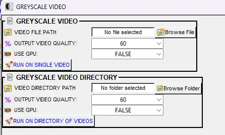

| Option | Description |
|--------|-------------|
| **VIDEO PATH** (single) | Path to the video to convert. |
| **VIDEO DIRECTORY PATH** (multiple) | Folder containing the videos to convert. |
| **OUTPUT VIDEO QUALITY** | Percentage (1–100, default 60). Higher = better quality and larger file; lower = smaller file and lower quality. Scale is not linear; 60 usually works well; avoid values above 80. |
| **USE GPU** | **TRUE** = use NVIDIA GPU for encoding (if available). **FALSE** = CPU only. |
| **Open** / **Convert** / **Run** | Start conversion. |

**Where output is saved:** Same folder as the input video(s). Filename: original name + `_grayscale` (e.g. `MyVideo_grayscale.mp4`).

[geyscale_0.webm](https://github.com/user-attachments/assets/998d5470-882f-4361-83d1-d1f1cb60469a)

---

### 🎨 Convert to black and white

* **Tools** → **Remove color from videos...** → **Convert to black and white**

Converts video(s) to **black and white** (binary): each pixel becomes either black or white, with no gray. Useful for high-contrast views or when you need a strict foreground/background. Single file or batch depending on the dialog.

  <video src="images/tools/bw_gui.webp" width="600" controls>Convert to grayscale</video>

| Option | Description |
|--------|-------------|
| **VIDEO PATH** (single) / **VIDEO DIRECTORY** (multiple) | The video file or folder of videos to convert. |
| **BLACK THRESHOLD** / **Threshold** | Value from 0.01 to 1.01 (often default 0.5). Pixels **below** this become black; pixels **above** become white. Lower = more pixels become white (brighter); higher = more black. Adjust to separate the animal from the background. |
| **USE GPU** | **TRUE** = use NVIDIA GPU for encoding when available. **FALSE** = CPU only. |
| **Run** / **RUN - SINGLE VIDEO** / **RUN - MULTIPLE VIDEOS** | Start conversion. |

**Where output is saved:** Same directory as input (often with a suffix such as `_bw` or `_black_white`).

[black_and_white_0.webm](https://github.com/user-attachments/assets/921cbdc9-b672-44ec-bc05-17194678b59f)

---

### 🎨 CLAHE enhance videos

* **Tools** → **Remove color from videos...** → **CLAHE enhance videos**

Applies **CLAHE** (contrast-limited adaptive histogram equalization) to improve **local contrast**—making dim or flat footage easier to see without over-brightening the whole frame. Useful for infrared, low light, or when the animal is hard to see against the background.

  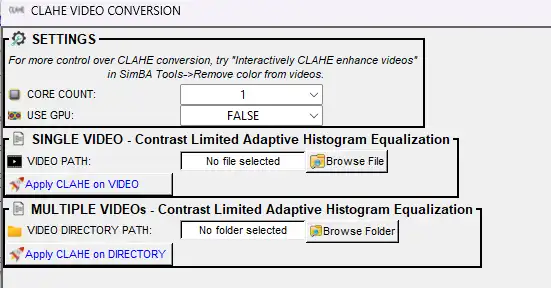

| Option | Description |
|--------|-------------|
| **VIDEO PATH** / **Browse File** | Path to the video to enhance. |
| **Clip limit** (if in dialog) | Limits how much contrast is boosted in each small region (e.g. 2.0). Higher = stronger local contrast; too high can increase noise. Defaults are usually fine. |
| **Tile size** (if in dialog) | Size of the local regions used for contrast (e.g. 8×8 pixels). Smaller = more local detail; larger = smoother. Defaults are usually fine. |
| **OUTPUT VIDEO QUALITY** (if in dialog) | Percentage (1–100, default 60). Higher = better quality and larger file; lower = smaller file and lower quality. |
| **USE GPU** (if in dialog) | **TRUE** = use NVIDIA GPU for encoding. **FALSE** = CPU only. |
| **Apply CLAHE** / **Run** | Start processing. |

**Where output is saved:** Same folder as the input video. Filename: `CLAHE_` + original name. Output is often **.avi** format.

[clahe.webm](https://github.com/user-attachments/assets/df2b9f30-29bc-4e60-9359-14c745d48a33)

---

### 🎨 Interactively CLAHE enhance videos

* **Tools** → **Remove color from videos...** → **Interactively CLAHE enhance videos**

Same as CLAHE enhance, but opens an **interactive window** where you can adjust **Clip limit** and **Tile size** with sliders and see a live preview before saving. Use this when you want to tune the look (e.g. how strong the contrast boost is) by eye.

  <video src="images/tools/interactive_clahe_ui.mp4" width="600" controls>Interactively CLAHE enhance videos</video>

| Option | Description |
|--------|-------------|
| **VIDEO PATH** / **Input** | Path to the video. |
| **Interactive window** | **Clip limit** — Slider to control how much contrast is boosted (higher = stronger). **Tile size** — Slider for the size of local regions. The preview updates as you change them. |
| **Apply** / **Save** | When the preview looks good, click to save the enhanced video. |
| **Output path** (if shown) | Folder or full path where the output video will be saved. |

**Where output is saved:** As set in the dialog (often same folder with a suffix).

---

### 🎞️ Concatenate (stack) videos

**Where:** **Tools** → **Concatenate (stack) videos...**

**What it is:** Concatenating (stacking) means **combining two or more videos into one output file**. SimBA can place them **side by side or stacked** in the same frame (so you see all streams at once), or—for "temporal join" elsewhere—play them one after another in time.

  

**Why use it:** Compare two views of the same moment (e.g. raw video next to a classification overlay, or two cages), build figures for papers or talks (e.g. original + Gantt + path plot in one view), or create a single file that shows multiple panels in sync. No SimBA project required.

**For more info:** [Visualizations.md — Concatenate two videos](Visualizations.md#concatenate-two-videos-tools-menu). **Related:** [Concatenate multiple videos](#concatenate-multiple-videos) (mosaic), [Temporal join videos](#temporal-join-videos) (one-after-another in time), [Scenario 2 — Part 5: Merge videos](Scenario2.md#merge-concatenate-multiple-videos).

https://github.com/user-attachments/assets/d7842665-0c8d-4aa7-bc64-e0be2170e8d3

---

#### 🎞️ Concatenate two videos

Place **two videos** in one output: either **horizontally** (side by side) or **vertically** (one above the other). Same duration; you see both streams at once.

  

| Option | Description |
|--------|-------------|
| **VIDEO 1 PATH** | Path to the first video. |
| **VIDEO 2 PATH** | Path to the second video. |
| **RESOLUTION (ASPECT RATIO RETAINED)** | **VIDEO 1** = use first video's resolution; **VIDEO 2** = use second video's; or a fixed value (240, 320, 480, 640, 720, 800, 960, 1120, 1080, 1980). For horizontal concat this sets height; for vertical, width. Aspect ratio is preserved. |
| **OUTPUT VIDEO QUALITY** | Percentage (1–100, default 60). Higher = better quality and larger file; lower = smaller file and lower quality. Scale is not linear; 60 usually works well; avoid values above 80. |
| **USE GPU** | **TRUE** = use NVIDIA GPU for encoding when available. **FALSE** = CPU only. |
| **HORIZONTAL concatenation** | Place the two videos side by side in one row. |
| **VERTICAL concatenation** | Stack the two videos in one column. |
| **RUN** | Create the concatenated video. |

**Where output is saved:** Same directory as the first video. Filename: `{video1}_{video2}_concat.mp4`.  
→ Full description: [Visualizations.md — Concatenate two videos](Visualizations.md#concatenate-two-videos-tools-menu).

---

#### 🎞️ Concatenate multiple videos

**What "merge" means here:** SimBA **merges** 2–20 videos into **one output video** where each input becomes a **panel** in a **mosaic** (a grid layout). All panels play in sync; you do not get one long video in time, but one frame showing 2–20 videos at the same time.

  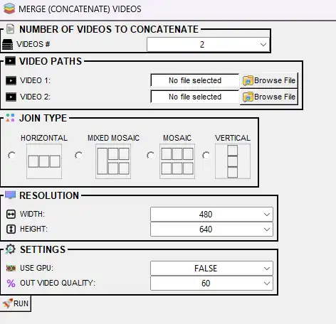

**Why merge multiple videos:** Create a single view that combines, for example, the original video, the classification-overlay video, a Gantt chart, and a path or probability plot—ideal for presentations, papers, or quick visual comparison. Or show several animals or cages side by side in one file. Output is one video file (e.g. `merged_video_20250212143055.mp4`) with all panels in the layout you chose.

**For more info:** [Visualizations.md — Merge (concatenate) multiple videos](Visualizations.md#merge-concatenate-multiple-videos), [Scenario 2 — Part 5: MERGE (CONCATENATE) MULTIPLE VIDEOS](Scenario2.md#merge-concatenate-multiple-videos). **Related:** [Concatenate two videos](#concatenate-two-videos), [Temporal join videos](#temporal-join-videos), [Merge frames to video](#merge-frames-to-video).

| Option | Description |
|--------|-------------|
| **VIDEOS #** | Number of videos (2–20). Then **SELECT** and browse each **VIDEO PATH**. |
| **JOIN TYPE** | **MOSAIC** (two rows), **VERTICAL**, **HORIZONTAL**, or **MIXED MOSAIC** (one large + rest in mosaic). |
| **Resolution width** / **height** | Per-panel size in pixels. |
| **RUN** | Create the merged video. |

**Where output is saved:** Same directory as Video 1, date-time stamped (e.g. `merged_video_20250212143055.mp4`).  
→ Also under **[Visualizations]** tab as **MERGE FRAMES**; see [Visualizations.md](Visualizations.md#merge-concatenate-multiple-videos).

  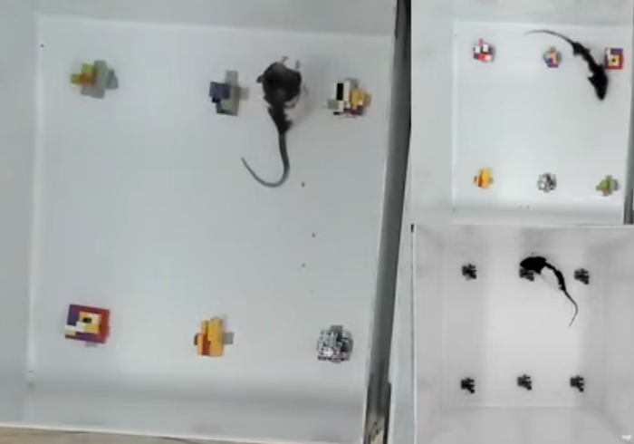

---

### 📐 Convert ROI definitions

**Where:** **Tools** → **Convert ROI definitions**

**What it is:** SimBA stores ROI (region of interest) shapes—polygons, rectangles, circles—in a single binary file (`ROI_definitions.h5`). This tool **exports** those definitions into **human-readable CSV files** (one per shape type), so you can inspect, edit in a spreadsheet, or use them in other software.

**Why use it:** Back up or version ROI definitions, share them with collaborators, edit coordinates in Excel or Python, or import the geometry into another tool. The CSVs list vertex coordinates or center/radius in a consistent format.

**Related:** ROI definitions are created and used in the [ROI tab](Scenario2.md#part-5--visualize-results) (e.g. draw ROIs, analyze by ROI). See [Visualizations.md — ROI tracking and features](Visualizations.md#visualize-roi-tracking-roi-tab) for ROI-based visualizations.

| Option | Description |
|--------|-------------|
| **ROI DEFINITIONS PATH (H5)** | Browse to `ROI_definitions.h5` (typically in `project_folder/logs/measures/`). |
| **SAVE DIRECTORY** | Where to save the CSV files. |
| **RUN** | Start conversion. |

**Where output is saved:** **SAVE DIRECTORY**. Files: `polygons_datetimestamp.csv`, `rectangles_datetimestamp.csv`, `circles_datetimestamp.csv` (only those that exist in the H5). See [misc examples](https://github.com/sgoldenlab/simba/tree/master/misc) for format.

---

### 🔀 Convert tracking data formats

**Where:** **Tools** → **Convert tracking data formats...**

**What it is:** Different tools use different **file formats** for pose keypoints or bounding boxes (e.g. DLC CSV, SLEAP H5, COCO JSON, YOLO text). This menu **converts** between those formats: you choose a source format and a target format; SimBA reads the source and writes the same data in the target layout.

**Why use it:** Use pose or annotation data from one pipeline in another (e.g. export SimBA or DLC data for YOLO training, or import Labelme keypoints into SimBA). Essential when moving between DeepLabCut, SLEAP, YOLO, SimBA, or other tools that expect a specific format.

**For more info:** [Scenario 1 — Step 3: Import DLC tracking data to SimBA project](Scenario1.md#step-3--import-dlc-tracking-data-to-simba-project) (import into SimBA). **Related:** [Drop body-parts from tracking data](#drop-body-parts-from-tracking-data), [Reorganize Tracking Data](#reorganize-tracking-data), [Convert working file type](#convert-working-file-type).

| Option (typical across submenus) | Description |
|----------------------------------|-------------|
| **Input file(s) / Input folder** | Source: single file or directory of pose/annotation files. |
| **Output folder / Save directory** | Where to write converted files. |
| **Format-specific options** | e.g. **Tracking tool** (DLC, SLEAP, COCO, Labelme), **YOLO type** (key-points vs bounding boxes), **SimBA ROI** for bbox export. |
| **Run** | Start conversion. |

**Submenus (examples):** **DLC** / **SLEAP** / **COCO** / **Labelme** ↔ **YOLO** (key-points or bbox); **SimBA** → YOLO pose or ROI → YOLO bbox; **Labelme** key-points → Images or CSV. Each opens a pop-up with the options above; output location is set in the dialog.

---

### 📄 Convert working file type

**Where:** **Tools** → **Convert working file type...**

**What it is:** SimBA can work with pose, feature, and results data as either **CSV** or **parquet**. This tool **batch-converts** all files in a folder from one type to the other without changing the data—only the on-disk format.

**Why use it:** Parquet loads faster and uses less disk space for large projects; convert CSVs to parquet to speed up I/O. If another tool or script expects CSV, convert parquet back to CSV. Use it to standardize a whole project to one file type.

**Related:** [Convert tracking data formats](#convert-tracking-data-formats), [Reorganize Tracking Data](#reorganize-tracking-data) (same pose files, different format).

| Option | Description |
|--------|-------------|
| **Convert CSV to parquet** | **INPUT FOLDER** — Folder containing CSV files. **OUTPUT FOLDER** (optional) — Where to write parquet files. Run converts all matching CSVs to parquet for faster I/O. |
| **Convert parquet to CSV** | **INPUT FOLDER** — Folder containing parquet files. **OUTPUT FOLDER** (optional) — Where to write CSV files. Run converts all parquet to CSV. |

**Where output is saved:** **OUTPUT FOLDER** if set; otherwise same folder as input (or as specified in the dialog).

---

### 📈 Create path plot

**Where:** **Tools** → **Create path plot**

**What it is:** A **path plot** is a video (or image) that shows the **trajectory** of a chosen body-part over time—e.g. the path the nose or center of mass took through the arena. SimBA draws this from a pose CSV/parquet file and optionally overlays it on the source video.

  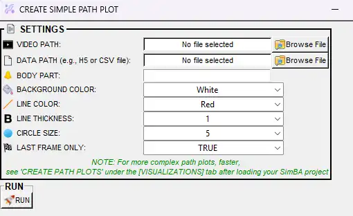

**More advanced path plots:** For multiple animals, classification markers on the path, ROI overlays, time-segment selection, or batch processing, use **[Visualizations]** tab → **Path plots**; see [Visualizations.md — Visualize path plots](Visualizations.md#visualize-path-plots) and [Scenario 2 — Part 5: Path plots](Scenario2.md#visualize-path-plots).

**Why use it:** Quickly visualize movement patterns without running a full SimBA project (no project required). Useful for checking tracking quality, comparing conditions, or building simple trajectory figures before or outside classifier-based analysis.

**For more info:** [Visualizations.md — Create path plots (ROI tab)](Visualizations.md#create-path-plots-roi-tab). **Related:** [Visualize pose-estimation in folder](#visualize-pose-estimation-in-folder), [Scenario 2 — Part 5: Path plots](Scenario2.md#visualize-path-plots).

| Option | Description |
|--------|-------------|
| **Video path** | Source video (for dimensions and optional overlay). |
| **Data path** | CSV or parquet pose file. |
| **Body-part** | Which body-part to plot. |
| **Background color** | Frame background (e.g. white, black). |
| **Line color** / **Circle color** | Path and/or point color. |
| **Line thickness** / **Circle size** | Appearance of the path and markers. |
| **Output path** (if available) | Where to save the path plot video. |

**Where output is saved:** Next to input or in chosen folder. Full description: [Visualizations.md — Create path plots](Visualizations.md#create-path-plots-roi-tab) (same tool under **ROI** tab).

[EzPathPlot_2.webm](https://github.com/user-attachments/assets/dd9e4b22-278a-41c7-b05a-315c6dda25b0)

---

### ✂️ Drop body-parts from tracking data

**Where:** **Tools** → **Drop body-parts from tracking data**

**What it is:** Pose files contain columns for every body-part (e.g. Nose_x, Nose_y, Tail_base_x, …). This tool **removes** the columns for body-parts you select and writes new files (or overwrites) so the remaining parts are unchanged.

**Why use it:** Simplify datasets by dropping parts you do not need (e.g. ears if only body and tail matter), fix projects where extra keypoints were imported by mistake, or reduce file size and feature count before training or analysis.

**For more info:** [Scenario 1 — Further imports](Scenario1.md#step-2-optional--further-imports) (other pose modifications). **Related:** [Reorganize Tracking Data](#reorganize-tracking-data), [Convert tracking data formats](#convert-tracking-data-formats).

| Option | Description |
|--------|-------------|
| **Data Folder** | Folder containing pose CSVs (or parquet). |
| **Tracking Tool** | Source format (e.g. DLC, SLEAP). |
| **File Type** | **CSV** or **parquet**. |
| **# body-parts to remove** | Number of body-parts to drop. |
| **Confirm** | Loads file structure; then select which body-parts to remove from the list. |
| **Run Removal** | Removes selected body-parts from all files in the folder. |

**Where output is saved:** New folder inside **Data Folder** with a name like `Reorganized_bp_20210726111127` (reused naming from reorganize).

---

### 📉 Down-sample video

**Where:** **Tools** → **Down-sample video...**

**What it is:** **Down-sampling** reduces the **resolution** (width × height in pixels) of the video. Each frame is resized to smaller dimensions; the result is a smaller file and faster decoding.

**Why use it:** Shrink file size for storage or sharing, speed up SimBA (and other tools) by processing fewer pixels, or match a target resolution (e.g. 640×480) for consistency across recordings. Single-video or batch.

**Related:** [Change FPS](#change-fps-tools-menu), [Crop videos](#crop-videos-tools-menu), [Batch pre-process videos](https://github.com/sgoldenlab/simba/blob/master/docs/tutorial_process_videos.md).

---

#### 📉 Down-sample single video

* **Tools** → **Down-sample video...** → **Down-sample single video**

  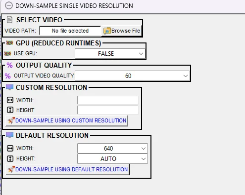

| Option | Description |
|--------|-------------|
| **VIDEO PATH** | Path to the video to down-sample. |
| **USE GPU** | **TRUE** = use NVIDIA GPU for encoding (if available). **FALSE** = CPU only. |
| **OUTPUT VIDEO QUALITY** | Percentage (1–100, default 60). Higher = better quality and larger file; lower = smaller file and lower quality. Scale is not linear; 60 usually works well; avoid values above 80. |
| **CUSTOM RESOLUTION** | **WIDTH** and **HEIGHT** — Enter exact pixel values (e.g. 640 and 480). Use **DOWN-SAMPLE USING CUSTOM RESOLUTION** to run. Use when you need a specific size. |
| **DEFAULT RESOLUTION** | **WIDTH** and **HEIGHT** — Dropdowns with common values (e.g. 640, 1280) or **AUTO**. If one dimension is AUTO, the other is fixed and aspect ratio is kept. Use **DOWN-SAMPLE USING DEFAULT RESOLUTION** to run. |

**Where output is saved:** Same folder as the input video. Filename: original name + `_downsampled` (e.g. `MyVideo_downsampled.mp4`).

---

#### 📉 Down-sample multiple videos

* **Tools** → **Down-sample video...** → **Down-sample multiple videos**

  

| Option | Description |
|--------|-------------|
| **VIDEO DIRECTORY** | Folder containing the videos. Every video in the folder will be down-sampled to the same resolution. |
| **USE GPU** | **TRUE** = use GPU for encoding (if available). **FALSE** = CPU only. |
| **OUTPUT VIDEO QUALITY** | Percentage (1–100, default 60). Higher = better quality and larger file; lower = smaller file and lower quality. Scale is not linear; 60 usually works well; avoid values above 80. |
| **CUSTOM RESOLUTION** | **WIDTH** and **HEIGHT** — Exact pixel values. **DOWN-SAMPLE USING CUSTOM RESOLUTION** processes all videos at this size. |
| **DEFAULT RESOLUTION** | **WIDTH** and **HEIGHT** — Dropdowns (AUTO allowed for one dimension to keep aspect ratio). **DOWN-SAMPLE USING DEFAULT RESOLUTION** processes all videos. |

**Where output is saved:** Same directory as each input video. Each file gets the `_downsampled` suffix.

---

### 🖼️ Extract frames

**Where:** **Tools** → **Extract frames...**

**What it is:** **Extracting frames** means **saving individual video frames as image files** (e.g. PNG, JPEG). You can pull a specific range of frames (e.g. 100–500), every frame of one video, or every frame of every video in a folder. SimBA writes the images in a folder you choose.

**Why use it:** Get still images for labelling, manual inspection, or figures; feed frames into other software (e.g. image classifiers); or archive key moments as images. Optional grayscale or CLAHE per frame. Also supports `.seq` files.

**For more info:** [Scenario 1 — Further imports: Extract frames](Scenario1.md#step-2-optional--further-imports). **Related:** [Merge frames to video](#merge-frames-to-video) (inverse: images → video), [Create GIFs](#create-gifs), [Remove color from videos](#remove-color-from-videos-tools-menu) (grayscale/CLAHE).

---

#### 🖼️ Extract defined frames (single video)

* **Tools** → **Extract frames...** → **Extract defined frames**

| Option | Description |
|--------|-------------|
| **VIDEO PATH** | Path to the video. |
| **SAVE DIRECTORY** | Optional. Folder where extracted images will be saved. If empty, a folder with suffix `_frames` is created in the same directory as the video. |
| **SAVE FORMAT** | **png**, **jpeg**, or **webp**. PNG = lossless, larger files; JPEG = smaller, good for photos; WEBP = modern compressed format. |
| **GREYSCALE** | **TRUE** = save frames as grayscale (no color). **FALSE** = keep color. |
| **CLAHE** | **TRUE** = apply CLAHE contrast enhancement to each frame (helps dim footage). **FALSE** = no enhancement. |
| **INCLUDE VIDEO NAME IN IMAGE NAME** | **TRUE** = image filenames include the video name (e.g. `MyVideo_001.png`). **FALSE** = frame numbers only (e.g. `001.png`). Useful when extracting from multiple videos into one folder. |
| **START FRAME NUMBER** | First frame to extract. Frames are usually 1-based (first frame = 1); check the dialog. |
| **END FRAME NUMBER** | Last frame to extract. Must be greater than or equal to START FRAME. |
| **RUN** | Start extraction. One image file is created per frame in the range. |

**Where output is saved:** **SAVE DIRECTORY** if set; otherwise a folder named `{video_name}_frames` in the same directory as the video.

---

#### 🖼️ Extract frames from single video (all frames)

* **Tools** → **Extract frames...** → **Extract Frames (Single video)**

| Option | Description |
|--------|-------------|
| **VIDEO PATH** | Path to the video. |
| **Extract Frames (Single video)** | Click to extract every frame. No format/grayscale options in this dialog; uses defaults. |

**Where output is saved:** Folder named after the video in the same directory (or as per implementation).

---

#### 🖼️ Extract frames from multiple videos (all frames)

* **Tools** → **Extract frames...** → **Extract Frames (Multiple videos)**

| Option | Description |
|--------|-------------|
| **DIRECTORY PATH** | Folder containing the videos. |
| **Extract Frames (Multiple videos)** | Click to extract every frame of every video. One folder per video. |

**Where output is saved:** One folder per video inside the chosen directory (or alongside each video).

---

#### 🖼️ Extract frames from seq files

* **Tools** → **Extract frames...** → (option for `.seq` if present in menu)

Extract all frames from a `.seq` file. Output: folder of images (e.g. PNGs).

---

### 🎞️ Create GIFs

**Where:** **Tools** → **Create GIFs**

**What it is:** An **animated GIF** is a short, looping clip saved as a `.gif` file that plays in browsers and many apps without a video player. This tool takes a **segment** of a video (start time and duration) and encodes it as a **GIF** at the size and quality you choose.

  

**Why use it:** Share short clips in emails, slides, or web pages; create quick previews or highlights that loop; avoid sending full video files when a few seconds suffice.

> **Tip — WebM for web:** This tool outputs **GIF** only. For smaller file size and better quality on the web, you can create a short clip with [Clip videos](#clip-videos-tools-menu) and convert it to WebM with an external tool (or use SimBA's batch convert for full videos). Reserve GIF when you need maximum compatibility (e.g. email clients or tools that only accept GIF).

**Related:** [Clip videos](#clip-videos-tools-menu) (trim segment), [Extract frames](#extract-frames) (video → images).

| Option | Description |
|--------|-------------|
| **VIDEO PATH** | Path to the source video. |
| **START TIME (s)** | Time in seconds where the GIF should start (e.g. 10.0 = 10 seconds in). |
| **DURATION (s)** | Length of the GIF in seconds (e.g. 5.0 = 5-second clip). |
| **GIF WIDTH** | Output width in pixels; height is set to keep aspect ratio. **AUTO** = use the source video width. Smaller width = smaller file (e.g. 480 for web). |
| **GIF QUALITY (%)** | Quality of the GIF (1–100). Higher = better quality, larger file. Default: 100. |
| **GIF FPS** | Frame rate of the GIF. **AUTO** = match source video FPS. Lower FPS = smaller file, less smooth. |
| **USE GPU** | **TRUE** = use GPU for decoding (if available). **FALSE** = CPU only. |
| **Generate gif** | Click to create the GIF. Output is always `.gif`. |

**Where output is saved:** Same folder as the video (or as specified). Filename typically includes the video name and segment info; extension is `.gif`.

---

### 📏 Get metric conversion factor (pixels/millimeter)

**Where:** **Tools** → **Get metric conversion factor (pixels/millimeter)**

**What it is:** To turn **pixel distances** in the video into **real-world distances** (e.g. mm or cm), you need a **conversion factor**: how many pixels correspond to one millimeter. This tool lets you **calibrate** that factor by measuring a known length on one frame (e.g. cage width 130 mm): you click the two endpoints; SimBA reports pixels per mm.

**Why use it:** Get real distances (e.g. distance moved in mm) when you are not using a SimBA project's Video parameters, or when you need a one-off calibration for scripts or other tools. The value is printed in the terminal for you to copy.

**For more info:** [Scenario 1 — Step 3: Set video parameters](Scenario1.md#step-3--set-video-parameters) (same calibration workflow inside a project). **Related:** [Show video file(s) meta data](#show-video-files-meta-data).

| Option | Description |
|--------|-------------|
| **SELECT VIDEO FILE** | Path to the video. A frame will be shown for measuring. |
| **KNOWN REAL LIFE METRIC DISTANCE (mm)** | The real-world length in millimeters (e.g. 130 for a 130 mm cage width). |
| **GET PIXELS PER MILLIMETER** | Click to open the frame. **Double-click** at one end of the known distance, then **double-click** at the other end. Press **Esc** when done. |
| **Output** | The conversion factor is printed in the main SimBA terminal. Use this value for calibration when not using the project's **Video parameters** tab. |

[pixel_per_mm.webm](https://github.com/user-attachments/assets/85ce851d-bf88-4443-bead-f83b7cd08845)

---

### ☀️ Change video brightness / contrast

**Where:** **Tools** → **Change video brightness / contrast**

**What it is:** **Brightness** shifts all pixels brighter or darker; **contrast** stretches or compresses the difference between dark and light areas. SimBA applies these adjustments to every frame and saves a new video.

**Why use it:** Compensate for under- or overexposed recordings, make animals or features easier to see (or easier for tracking), or normalize lighting across videos before analysis. Single video or batch.

**Related:** [Remove color from videos](#remove-color-from-videos-tools-menu) (grayscale, CLAHE), [Box blur videos](#box-blur-videos).

| Option | Description |
|--------|-------------|
| **Input** / **VIDEO PATH** (single) / **VIDEO DIRECTORY** (multiple) | The video file or folder of videos to adjust. |
| **Brightness** | How much to brighten or darken (e.g. -50 to +50, or 0–100). Positive = brighter; negative = darker. |
| **Contrast** | How much to increase or decrease the difference between light and dark. Higher = more contrast (darks darker, lights lighter). |
| **OUTPUT VIDEO QUALITY** (if shown) | Percentage (1–100, default 60). Higher = better quality and larger file; lower = smaller file and lower quality. Scale is not linear; 60 usually works well; avoid values above 80. |
| **Save directory** / **Output** | Folder where the adjusted video(s) will be saved. |
| **Run** | Apply and save. |

**Where output is saved:** The save directory you chose (or as set in the dialog).

[brightness_contrast_ui.webm](https://github.com/user-attachments/assets/0c02a1d2-5739-4b97-811c-0fdeacf0fab0)

---

### 🎬 Merge frames to video

**Where:** **Tools** → **Merge frames to video**

**What it is:** **Merge** here means **turn a folder of images into one video**: each image becomes one frame, in **alphabetical/filename order**. You set the output frame rate (FPS), format (e.g. mp4), and quality; SimBA encodes the image sequence as a video.

**Why use it:** Rebuild a video from extracted frames (e.g. after editing frames in another program), create a video from a timelapse of still images, or assemble an animation from rendered images (e.g. path plots or heatmaps exported as PNGs).

**Related:** [Extract frames](#extract-frames) (inverse: video → images), [Concatenate multiple videos](#concatenate-multiple-videos) (merge visualization videos). [Scenario 2 — Part 5](Scenario2.md#part-5--visualize-results) creates frames then merges them into videos.

| Option | Description |
|--------|-------------|
| **IMAGE DIRECTORY** | Folder containing the frame images (e.g. PNG, JPEG). **Order matters:** frames are taken in **alphabetical order by filename**, so name files so they sort correctly (e.g. `frame_001.png`, `frame_002.png`). |
| **VIDEO FPS** | Output video frame rate (1–100). Default: 30. How many of your images are shown per second in the final video. |
| **VIDEO QUALITY** | Percentage (1–100, default 60). Higher = better quality and larger file; lower = smaller file and lower quality. Scale is not linear; 60 usually works well; avoid values above 80. |
| **VIDEO FORMAT** | Output container: **mp4**, **avi**, or **webm**. MP4 is widely compatible. |
| **Use GPU (reduced runtime)** | **TRUE** = use NVIDIA GPU for encoding when available. **FALSE** = CPU only. |
| **Run** | Start merging. One video file is created from all images in the folder. |

**Where output is saved:** Same directory as the image folder (or as specified in the dialog). Output filename is typically derived from the folder or a default name.

---

### ⏩ Change video playback speed

**Where:** **Tools** → **Change video playback speed**

**What it is:** **Playback speed** controls how fast the video plays (e.g. 2× = twice as fast, 0.5× = half speed). SimBA re-encodes the video so that when played at normal speed, the motion appears faster or slower (by dropping or duplicating frames, or changing FPS metadata).

  

**Why use it:** Create quick previews (speed up long recordings), slow down fast motion for inspection or presentation, or match the duration of another video. Single or batch.

**Related:** [Change FPS](#change-fps-tools-menu) (frame rate vs playback speed).

| Option | Description |
|--------|-------------|
| **Input** / **VIDEO PATH** (single) / **VIDEO DIRECTORY** (multiple) | The video file or folder of videos to change. |
| **Speed** / **Playback speed** | Multiplier: e.g. **2** = twice as fast (half the duration), **0.5** = half speed (double the duration). Values &gt; 1 speed up; &lt; 1 slow down. |
| **OUTPUT VIDEO QUALITY** (if shown) | Percentage (1–100, default 60). Higher = better quality and larger file; lower = smaller file and lower quality. Scale is not linear; 60 usually works well; avoid values above 80. |
| **Save directory** / **Output** | Folder where the new video(s) will be saved. |
| **Run** | Apply and save. |

**Where output is saved:** The save directory you chose (or same folder as input if not specified).

[playback_speed.webm](https://github.com/user-attachments/assets/e99a9cee-03de-4414-9628-ed694913dfc0)

---

### 🖨️ Print classifier info

**Where:** **Tools** → **Print classifier info**

**What it is:** A SimBA classifier is saved as a `.sav` file (e.g. a random forest). This tool **reads** that file and **prints** its main parameters to the terminal: number of trees, number of features, hyperparameters, creation time, etc.—no file is written.

**Why use it:** Check which model or settings were used, document methods for a paper, debug mismatches between training and inference, or compare two `.sav` files by eye.

**For more info:** [Scenario 1 — Step 7: Train machine model](Scenario1.md#step-7--train-machine-model), [Scenario 2 — Part 3: Run the classifier](Scenario2.md#part-3--run-the-classifier-on-new-data).

| Option | Description |
|--------|-------------|
| **Model path** | Browse to the classifier `.sav` file. |
| **PRINT MODEL INFO** | Click to print details to the main SimBA terminal. |

**Where output is saved:** No file; text appears in the SimBA terminal.

---

### ℹ️ Show video file(s) meta data

**Where:** **Tools** → **Show video file(s) meta data**

**What it is:** **Metadata** is technical information about the video file: resolution (width × height), frame rate (FPS), codec, duration, file size, etc. This tool **reads** one or more video files and **prints** that information to the SimBA terminal—no output file.

**Why use it:** Verify video properties before import, check that FPS or resolution match expectations, troubleshoot playback or analysis issues, or document video specs for methods sections.

**Related:** [Validate video seekability](#validate-video-seekability), [Scenario 1 — Step 3: Video parameters](Scenario1.md#step-3--set-video-parameters) (uses video info).

| Option | Description |
|--------|-------------|
| **Select video file(s)** | Browse to one video or select a folder of videos. |
| **Run / Show** | Prints metadata to the main SimBA terminal. |

**Where output is saved:** No file; info appears in the terminal.

---

### 🔀 Reorganize Tracking Data

**Where:** **Tools** → **Reorganize Tracking Data**

**What it is:** Pose CSVs/parquet files have **columns** for each body-part (often in x, y, likelihood order). Different recordings or tools may use **different column orders**. This tool **reorders** the columns so that every file in a folder has the **same** order (e.g. Nose, Ears, Tail_base, …).

**Why use it:** SimBA (and many scripts) assume a consistent column order. If you merged data from different projects or tools, or if body-parts are in a different order than your project expects, reorganizing avoids wrong assignments and failed runs.

**Related:** [Drop body-parts from tracking data](#drop-body-parts-from-tracking-data), [Convert tracking data formats](#convert-tracking-data-formats).

| Option | Description |
|--------|-------------|
| **Data Folder** | Folder containing pose files (CSV or parquet). |
| **Tracking Tool** | Source format (e.g. DLC, SLEAP). |
| **File Type** | **CSV** or **parquet**. |
| **Confirm** | Loads current column order from the files. |
| **Current Order** vs **New Order** | Dropdowns or list to set the desired body-part order. |
| **Run re-organization** | Writes reordered data to a new folder. |

**Where output is saved:** Date-time stamped folder inside **Data Folder** (e.g. `Reorganized_bp_20210726111127`).

---

### 🔄 Rotate / flip / reverse videos

**Where:** **Tools** → **Rotate / flip / reverse videos...**

**What it is:** **Rotate** turns every frame by a fixed angle (e.g. 90°, 180°); **flip** mirrors frames horizontally or vertically; **reverse** plays the video backwards (last frame first). SimBA re-encodes and saves a new file.

**Why use it:** Correct camera orientation (e.g. camera mounted sideways), mirror a view for consistency across setups, or create a backwards-playback clip for presentation or validation. Single video or batch.

**Related:** [Egocentrically align pose and video](#egocentrically-align-pose-and-video) (rotate to animal-centric view), [Crop videos](#crop-videos-tools-menu).

---

#### 🔄 Rotate videos

* **Tools** → **Rotate / flip / reverse videos...** → **Rotate videos**

Rotates **every frame** by a **fixed angle** (e.g. 90° or 180°). Use when the camera was mounted sideways or upside down and you want the whole video reoriented. You choose one video or a folder; set the rotation angle; SimBA re-encodes and saves the new file(s).

  

| Option | Description |
|--------|-------------|
| **Input** | Single video file or directory of videos. |
| **Save directory** | Where to save the rotated video(s). |
| **Rotation angle** | Fixed angle (e.g. 90°, 180°). Applied to every frame. |
| **OUTPUT VIDEO QUALITY** (if shown) | Percentage (1–100, default 60). Higher = better quality and larger file; lower = smaller file and lower quality. Scale is not linear; 60 usually works well; avoid values above 80. |
| **USE GPU** (if shown) | **TRUE** = use NVIDIA GPU for encoding. **FALSE** = CPU only. |
| **Run** | Start processing. |

---

#### 🖱️ Interactively rotate videos

* **Tools** → **Rotate / flip / reverse videos...** → **Interactively rotate videos**

[rotate_demo.webm](https://github.com/user-attachments/assets/a464705c-65e8-4d90-842e-10bf799f51ac)

Lets you **rotate by keypress** while viewing the video: use **left/right arrow keys** to rotate stepwise until the orientation looks correct, then press **Esc** to save and close. Useful when you don't know the exact angle and want to tune by eye.

| Option | Description |
|--------|-------------|
| **Input** | Path to the video. |
| **Save directory** | Where to save the rotated video. |
| **Left/right arrow keys** | Rotate the frame stepwise. |
| **Esc** | Save the current orientation and close the window. |
| **Run** (if in dialog) | Start the interactive window. |

[rotate_video.webm](https://github.com/user-attachments/assets/32c77c76-3b0a-4df8-931a-991834c21213)

---

#### ↩️ Flip videos

* **Tools** → **Rotate / flip / reverse videos...** → **Flip videos**

**Mirrors** each frame **horizontally** (left–right) or **vertically** (top–bottom). No rotation—only a mirror flip. Use to correct a reversed view or to match orientation across setups. Single video or batch.

  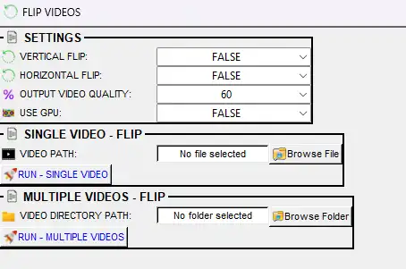

| Option | Description |
|--------|-------------|
| **Input** | Single video file or directory of videos. |
| **Save directory** | Where to save the flipped video(s). |
| **Direction** | **Horizontal** — mirror left–right. **Vertical** — mirror top–bottom. |
| **Run** | Apply flip and save. |

[flip_videos.webm](https://github.com/user-attachments/assets/3cb887af-ea94-4a72-95e5-a20534070753)

---

#### ⏪ Reverse videos

* **Tools** → **Rotate / flip / reverse videos...** → **Reverse videos**

**Reverses the frame order** so the video plays **backwards** (last frame first). Use for presentation, validation, or when you need a reversed clip. Single video or batch. SimBA re-encodes the video with frames in reverse order.

  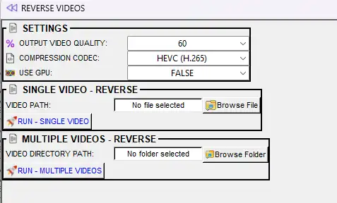

| Option | Description |
|--------|-------------|
| **Input** | Single video file or directory of videos. |
| **Save directory** | Where to save the reversed video(s). |
| **COMPRESSION CODEC** (if shown) | Encoder for output (e.g. H.264, HEVC). Affects file size and compatibility. |
| **OUTPUT VIDEO QUALITY** | Percentage (1–100, default 60). Higher = better quality and larger file; lower = smaller file and lower quality. Scale is not linear; 60 usually works well; avoid values above 80. |
| **USE GPU** | **TRUE** = use NVIDIA GPU for encoding. **FALSE** = CPU only. |
| **Run** | Start processing. |

[reverse_videos.webm](https://github.com/user-attachments/assets/55ddde05-c880-4850-b5cd-afabaef8bbf4)

---

### 🏷️ Superimpose on videos

**Where:** **Tools** → **Superimpose on videos...**

**What it is:** **Superimposing** means **drawing something on top of every frame**: frame index, a running timer, a watermark image, a progress bar, the video filename, or custom text. Each overlay is burned into the video; the result is a new file with the overlay visible.

**Why use it:** Add frame numbers or timestamps for reference when annotating or debugging; add a logo or watermark for sharing; add a progress bar or label for presentations; or overlay a second video (e.g. picture-in-picture). Each sub-option opens a pop-up with input, output, and format options.

**Related:** [Concatenate (stack) videos](#concatenate-stack-videos), [Remove video backgrounds](#remove-video-backgrounds) (overlay/mask).

---

#### 🔢 Superimpose frame numbers

* **Tools** → **Superimpose on videos...** → **Superimpose frame numbers**

Draws the **frame index** (frame number) on each frame. Useful for annotation, debugging, or when you need to reference exact frame numbers. Single video or folder. Output is saved in the same directory as the input with the suffix `_frame_no` (e.g. `MyVideo_frame_no.mp4`).

  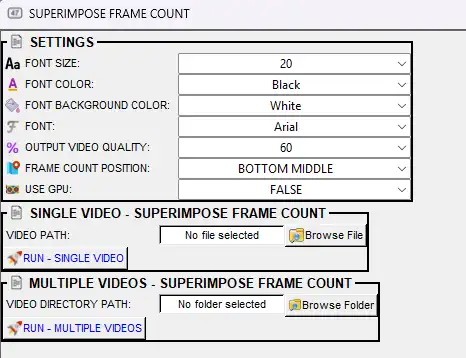

| Option | Description |
|--------|-------------|
| **Video path** (single) | Path to one video file. |
| **Video directory path** (batch) | Folder of videos to process. |
| **Font size** | Size of the frame number text (1–99, default 20). |
| **Font color** | Text color (e.g. Black, White, Red). |
| **Font background color** | Color of the box behind the number (e.g. White, Black). |
| **Font** | Font family (e.g. Arial). |
| **Output video quality** | 10–100% (default 60). Higher = better quality, larger file. |
| **Frame count position** | **Top left**, **Top middle**, **Top right**, **Bottom left**, **Bottom middle**, **Bottom right** (default). |
| **Use GPU** | **TRUE** = use NVIDIA GPU for encoding. **FALSE** = CPU only. |
| **Run** | Process. Single: use **Run – single video**. Batch: use **Run – multiple videos**. |

[superimpose_frame_count.webm](https://github.com/user-attachments/assets/a497b075-a5f7-429c-835e-ad84829a0de0)

---

#### 💧 Superimpose watermark

* **Tools** → **Superimpose on videos...** → **Superimpose watermark**

Overlays a **watermark image** (e.g. logo) on every frame. You choose the image, position, opacity, and scale. Use for branding or attribution when sharing videos. Output is saved in the same directory as the input with a suffix (e.g. `_watermark`).

  

| Option | Description |
|--------|-------------|
| **Watermark image path** | Path to the image (e.g. PNG with transparency). |
| **Watermark location** | **Top left**, **Top right**, **Bottom left**, **Bottom right**, or **Center**. |
| **Watermark opacity** | 0.1–1.0 (0.5 = 50% transparent). |
| **Watermark scale %** | 5–95%. How large the watermark is relative to the frame. |
| **Use GPU** | **TRUE** = use NVIDIA GPU for encoding. **FALSE** = CPU only. |
| **Video path** (single) / **Video directory path** (batch) | The video(s) to watermark. |
| **Run** | **Run – single video** or **Run – multiple videos**. |

[watermark_video.webm](https://github.com/user-attachments/assets/c3cbca9e-8667-43dc-ba10-f14fcc0247ac)

---

#### ⏱️ Superimpose timer

* **Tools** → **Superimpose on videos...** → **Superimpose timer**

Draws a **running timer** (elapsed time from the start of the video) on each frame. You set position, font, and time format. Use for time reference in presentations or when annotating. Output is saved in the same directory as the input.

  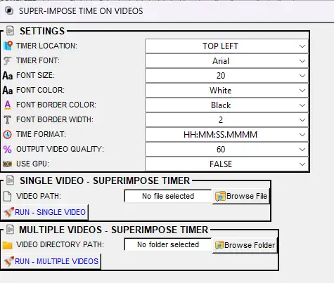

| Option | Description |
|--------|-------------|
| **Timer location** | **Top left**, **Top middle**, **Top right**, **Bottom left**, **Bottom right**, **Bottom middle**. |
| **Timer font** | Font family (e.g. Arial). |
| **Font size** | 20–95 (step 5). Default: 20. |
| **Font color** | Text color (e.g. White, Black). |
| **Font border color** | Outline color around the text. |
| **Font border width** | 2–50 (step 2). Default: 2. |
| **Time format** | **MM:SS**, **HH:MM:SS**, **SS.MMMMMM**, or **HH:MM:SS.MMMM** (with milliseconds). |
| **Output video quality** | 10–100% (default 60). |
| **Use GPU** | **TRUE** = use NVIDIA GPU for encoding. **FALSE** = CPU only. |
| **Video path** (single) / **Video directory path** (batch) | The video(s) to process. |
| **Run** | **Run – single video** or **Run – multiple videos**. |

[superimpose_elapsed_time.webm](https://github.com/user-attachments/assets/bc055f3a-dc13-4c1b-8aac-61c0013b5b70)

---

#### 📊 Superimpose progress-bar

* **Tools** → **Superimpose on videos...** → **Superimpose progress-bar**

Draws a **progress bar** on each frame that advances with playback (by frame index). Use to show how far through the video the current frame is—handy for presentations or previews. Output is saved in the same directory as the input.

  

| Option | Description |
|--------|-------------|
| **Progress bar location** | **Top** or **Bottom** of the frame. |
| **Progress bar color** | Bar color (e.g. Red, White, Black). |
| **Progress bar height %** | 1–105% (step 5). Default: 10. Bar thickness as % of frame height. |
| **Use GPU** | **TRUE** = use NVIDIA GPU for encoding. **FALSE** = CPU only. |
| **Video path** (single) / **Video directory path** (batch) | The video(s) to process. |
| **Run** | **Run – single video** or **Run – multiple videos**. |

---

#### 📺 Superimpose video on video

* **Tools** → **Superimpose on videos...** → **Superimpose video on video**

Overlays **one video on top of another** (e.g. picture-in-picture). You choose a main video and an overlay video; set position, opacity, and scale of the overlay. Use for comparisons or inset views. Output is saved in the same directory as the main video.

  

| Option | Description |
|--------|-------------|
| **Main video path** | The background video. |
| **Overlay video path** | The video to place on top (e.g. smaller clip in a corner). |
| **Overlay video location** | **Top left**, **Top right**, **Bottom left**, **Bottom right**, or **Center**. |
| **Overlay video opacity** | 0.1–1.0 (0.5 = 50% transparent). |
| **Overlay video scale %** | 0.05–0.95 (5–95%). Size of the overlay relative to the frame. |
| **Use GPU** | **TRUE** = use NVIDIA GPU for encoding. **FALSE** = CPU only. |
| **Run** | Apply and save. |

[superimpose_video.webm](https://github.com/user-attachments/assets/6543306d-1b4b-4ab7-a567-c5b3a4c69f60)

---

#### 🏷️ Superimpose video names

* **Tools** → **Superimpose on videos...** → **Superimpose video names**

Writes the **video filename** as text on each frame. Use when you need to identify the source file in the video itself (e.g. when sharing multiple clips). Output is saved in the same directory as the input.

  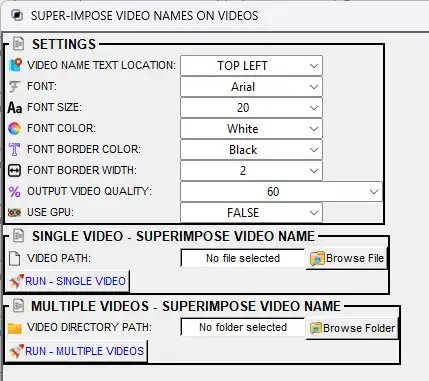

| Option | Description |
|--------|-------------|
| **Video name text location** | **Top left**, **Top middle**, **Top right**, **Bottom left**, **Bottom right**, **Bottom middle**. |
| **Font** | Font family (e.g. Arial). |
| **Font size** | 5–100 (step 5). Default: 20. |
| **Font color** | Text color (e.g. White, Black). |
| **Font border color** | Outline color around the text. |
| **Font border width** | 2–50 (step 2). Default: 2. |
| **Output video quality** | 10–100% (default 60). |
| **Use GPU** | **TRUE** = use NVIDIA GPU for encoding. **FALSE** = CPU only. |
| **Video path** (single) / **Video directory path** (batch) | The video(s) to process. |
| **Run** | **Run – single video** or **Run – multiple videos**. |

[superimpose_video_names.webm](https://github.com/user-attachments/assets/f76350db-764e-4539-91bf-2ebc4d34e6d9)

---

#### 📝 Superimpose free-text

* **Tools** → **Superimpose on videos...** → **Superimpose free-text**

Draws **custom text** you type on every frame. You set position, font, size, color, and border. Use for labels, titles, or any fixed caption (e.g. condition name, date). Output is saved in the same directory as the input.

  

| Option | Description |
|--------|-------------|
| **Text location** | **Top left**, **Top middle**, **Top right**, **Bottom left**, **Bottom right**, **Bottom middle**. |
| **Text** | The text to display (e.g. "Condition A", "Trial 1"). |
| **Font** | Font family (e.g. Arial). |
| **Font size** | 5–100 (step 5). Default: 20. |
| **Font color** | Text color (e.g. White, Black). |
| **Font border color** | Outline color around the text. |
| **Font border width** | 2–50 (step 2). Default: 2. |
| **Output video quality** | 10–100% (default 60). |
| **Use GPU** | **TRUE** = use NVIDIA GPU for encoding. **FALSE** = CPU only. |
| **Video path** (single) / **Video directory path** (batch) | The video(s) to process. |
| **Run** | **Run – single video** or **Run – multiple videos**. |

**Where output is saved:** As set in each pop-up (often same folder with a suffix such as `_frame_no`, `_watermark`, or similar).

[superimpose_freetext.webm](https://github.com/user-attachments/assets/c555a600-1b17-4e62-8885-3ee94cde7ef7)

---

### 🎭 Remove video backgrounds

**Where:** **Tools** → **Remove video backgrounds...**

**What it is:** **Background removal** (mean subtraction) estimates the **static background** of the scene (either from the same video or from a reference video) and then **replaces** pixels that match that background with a solid color (e.g. white or black). Moving objects (e.g. the animal) stay; the rest becomes a flat background.

**Why use it:** Isolate the animal for clearer visualization or downstream tracking, reduce visual clutter in figures or presentations, or prepare footage for tools that expect a clean background. Single video or batch.

**Related:** [Create average frames from videos](#create-average-frames-from-videos) (estimate background), [Box blur videos](#box-blur-videos) (blur region). [Visualizations.md — Blob tracking](Visualizations.md#visualize-blob-tracking-process-videos-menu) uses background subtraction for detection.

---

#### 🎬 Remove background from single video (mean subtraction)

* **Tools** → **Remove video backgrounds...** → **Remove background from single video (mean subtraction)**

Process **one video**: compute or supply a background, then replace matching pixels with the chosen background color.

  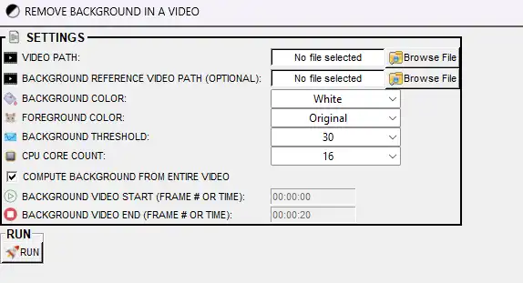

| Option | Description |
|--------|-------------|
| **VIDEO PATH** | Path to the video to process. |
| **BACKGROUND REFERENCE VIDEO PATH** (optional) | Use this video's frames as the background. Leave empty to compute from the target video. |
| **BACKGROUND COLOR** | Color for background pixels (e.g. White, Black). |
| **FOREGROUND COLOR** | Color for non-background (moving) pixels. **Original** = keep original colors; otherwise a solid color (e.g. Black). |
| **BACKGROUND THRESHOLD** | 1–99. Sensitivity for "matching" background (higher = stricter). Default: 30. |
| **CPU CORE COUNT** | Number of cores for multiprocessing (1 to max). More cores = faster. |
| **COMPUTE BACKGROUND FROM ENTIRE VIDEO** | **Checked** = use all frames. **Unchecked** = use only the segment below. |
| **BACKGROUND VIDEO START** / **BACKGROUND VIDEO END** | When not entire video: frame # or time (HH:MM:SS) defining the segment to compute the background from. |
| **Run** | Start background subtraction. |

**Where output is saved:** Same directory as input. Filename: original name + `_bg_subtracted`.

[bg_remover_example_4.webm](https://github.com/user-attachments/assets/80abb7bb-bb19-4e34-8d98-b20dc27d263f)

[bg_remover_example_3.webm](https://github.com/user-attachments/assets/439b0eac-e6f3-479e-be4f-7ddcb106d14b)

---

#### 📁 Remove background from multiple videos (mean subtraction)

* **Tools** → **Remove video backgrounds...** → **Remove background from multiple videos (mean subtraction)**

Process **all videos in a folder**. Optionally supply a folder of reference videos (matched by filename) for background.

  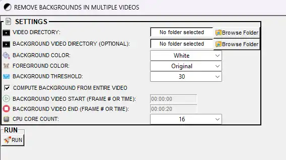

| Option | Description |
|--------|-------------|
| **VIDEO DIRECTORY** | Folder containing the videos to process. |
| **BACKGROUND VIDEO DIRECTORY** (optional) | Folder of reference videos whose frames are used as background. Filenames should match the target videos. Leave empty to compute background from each target video. |
| **BACKGROUND COLOR** | Color for background pixels (e.g. White, Black). |
| **FOREGROUND COLOR** | Color for non-background (moving) pixels. **Original** = keep original colors; otherwise a solid color. |
| **BACKGROUND THRESHOLD** | 1–99. Sensitivity for "matching" background (higher = stricter). Default: 30. |
| **CPU CORE COUNT** | Number of cores for multiprocessing. More cores = faster batch processing. |
| **COMPUTE BACKGROUND FROM ENTIRE VIDEO** | **Checked** = use all frames. **Unchecked** = use only the segment below. |
| **BACKGROUND VIDEO START** / **BACKGROUND VIDEO END** | When not entire video: frame # or time (HH:MM:SS) for the segment to compute the background from. |
| **Run** | Start background subtraction. |

**Where output is saved:** Same directory as each input video. Filename: original name + `_bg_subtracted`.

[bg_removed_ex_2_clipped.webm](https://github.com/user-attachments/assets/cfb8d6e4-8739-441b-b5fe-02cfe3126b34)

[bg_removed_ex_4_clipped.webm](https://github.com/user-attachments/assets/c88889e8-75ce-4bbe-b1bf-0ad58c0279ff)

[bg_removed_ex_6_clipped.webm](https://github.com/user-attachments/assets/fef45850-6bb7-415f-ac5b-1c13ce42f3df)

---

### ⏱️ Temporal join videos

**Where:** **Tools** → **Temporal join videos...**

**What it is:** **Temporal join** means **concatenating videos in time order**: the first video plays, then the second, then the third, and so on, in a **single output file**. This is different from "Concatenate (stack) videos," which places multiple videos **side by side** in the same frame. Here you get one long timeline.

**Why use it:** Combine segments that were recorded or exported separately (e.g. trial 1, trial 2, trial 3 → one file), reassemble a long recording that was split into chunks, or build a single video from a list of clips in a chosen order.

**Related:** [Clip videos](#clip-videos-tools-menu) (split vs join), [Concatenate (stack) videos](#concatenate-stack-videos) (side-by-side panels, not time order), [Merge frames to video](#merge-frames-to-video).

---

#### 📁 Temporal join all videos in directory

* **Tools** → **Temporal join videos...** → **Temporal join all videos in directory**

Joins **all videos in a folder** in **alphabetical filename order** into one file. Name files so they sort correctly (e.g. `01_trial.mp4`, `02_trial.mp4`).

| Option | Description |
|--------|-------------|
| **INPUT DIRECTORY** | Folder containing the videos to join. |
| **INPUT VIDEO FORMAT** | File extension of the videos (e.g. mp4, avi). Only files with this extension in the folder are included. |
| **OUTPUT FPS** | **KEEP INPUT VIDEO FPS** — use original FPS. **SAME AS THE FIRST INPUT VIDEO IN INPUT DIRECTORY** — use first video's FPS. Or choose a fixed FPS (2–100, even numbers). |
| **USE GPU (REDUCED RUN-TIME)** | **TRUE** = use NVIDIA GPU for encoding. **FALSE** = CPU only. |
| **Run** | Start concatenation. |

**Where output is saved:** Same directory as the input folder. Filename: `concatenated.mp4`.

---

#### 🎬 Temporal join selected videos

* **Tools** → **Temporal join videos...** → **Temporal join selected videos**

Joins **only the videos you choose**, in the **order you set** (VIDEO PATH 1, then VIDEO PATH 2, …). Use when you need a specific order or subset, not alphabetical.

| Option | Description |
|--------|-------------|
| **NUMBER OF VIDEOS** | How many videos to join (2–100). After setting, **VIDEO PATH 1**, **VIDEO PATH 2**, … appear. |
| **VIDEO PATH 1**, **VIDEO PATH 2**, … | Path to each video. **Order = play order**: first path plays first, then second, and so on. |
| **OUTPUT VIDEO QUALITY %** | 10–100% (default 60). Higher = better quality, larger file. |
| **OUTPUT VIDEO FORMAT** | Container format (e.g. .mp4, .avi, .webm). |
| **USE GPU** | **TRUE** = use NVIDIA GPU for encoding. **FALSE** = CPU only. |
| **Run** | Start concatenation. |

**Where output is saved:** Same directory as the first video in your list. Filename: `temporal_concat_video.{format}` (e.g. `temporal_concat_video.mp4`). All selected videos must have the **same FPS** and **same resolution**.

---
### 🌫️ Box blur videos

**Where:** **Tools** → **Box blur videos**

**What it is:** A **box blur** replaces each pixel with the average of its neighbors in a region, so the image looks smoothed or blurred. You set **blur level** (strength) and **invert blur region** (whether the center or the rest of the frame is blurred). Single video only in the current dialog.

**Why use it:** Anonymize parts of the video (e.g. blur background to highlight the subject, or the opposite), soften noise or compression artifacts, or create a privacy-safe version of a recording.

**Related:** [Remove video backgrounds](#remove-video-backgrounds), [Change video brightness / contrast](#change-video-brightness--contrast).

| Option | Description |
|--------|-------------|
| **Video path** | Path to the video to blur. |
| **Blur level** | 0.05–0.95 (step 0.05). Strength of the blur; higher = stronger blur. Default: 0.05. |
| **Invert blur region** | **TRUE** = blur the outer region (keep center sharp). **FALSE** = blur the center (keep edges sharp). Use to choose which part of the frame is blurred. |
| **Run** | Apply blur and save. Output is saved in the same directory as the input. |

**Where output is saved:** Same directory as the input video.

[roi_blurbox.webm](https://github.com/user-attachments/assets/60f07106-2335-440b-9e9c-557b9bb76263)

---

### 🌅 Cross-fade videos

**Where:** **Tools** → **Cross-fade videos**

**What it is:** A **cross-fade** is a **transition** between two videos: over a short period (e.g. 2–20 seconds), the first video **fades out** while the second **fades in**, so the change from one clip to the next is smooth rather than an abrupt cut. The output is one video containing both clips with the fade in between.

  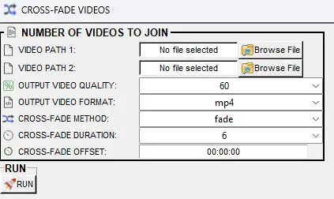

**Why use it:** Create smooth transitions for presentations or compilations, blend between two conditions or time points, or produce a single, polished clip from two segments without a hard cut.

**Related:** [Temporal join videos](#temporal-join-videos), [Concatenate two videos](#concatenate-two-videos).

| Option | Description |
|--------|-------------|
| **Video path 1** | Path to the first video (plays first, then fades out). |
| **Video path 2** | Path to the second video (fades in during the transition). |
| **Output video quality** | 10–100% (default 60). Higher = better quality and larger file. |
| **Output video format** | **mp4**, **avi**, or **webm**. |
| **Cross-fade method** | FFmpeg cross-fade method (e.g. **fade**). Affects how the blend is computed. |
| **Cross-fade duration** | 2–20 seconds (step 2). Length of the overlap where both videos blend. Default: 6. |
| **Cross-fade offset** | Time in the **first video** (HH:MM:SS, e.g. 00:00:00) at which the fade starts. Use to skip the beginning of video 1 before the transition. |
| **Run** | Create the cross-fade video. Output is saved in the same directory (or as set by the dialog). |

**Where output is saved:** Same directory as the input (or as specified in the dialog).

[crossfade_two_videos.webm](https://github.com/user-attachments/assets/7fcd7e40-97eb-4794-abe2-06298d0cc1d5)

---

### 📊 Create average frames from videos

**Where:** **Tools** → **Create average frames from videos**

  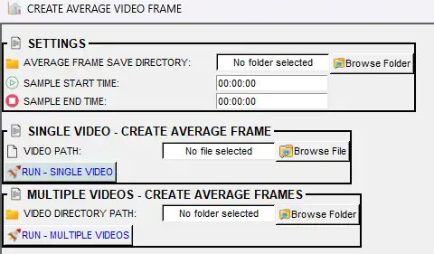

**What it is:** **Averaging frames** means taking frames from one or more videos, **averaging** the pixel values at each position, and saving the result as **one image per video**. Static elements (e.g. background) stay clear; moving elements (e.g. the animal) blur or disappear. You can average the **entire video** or only a **time range** (sample start/end time).

**Why use it:** Estimate a **background image** for the arena, create a representative "typical" frame for a condition, or generate a summary image from many short clips. The output is one PNG per input video (e.g. `{video_name}_avg_frm.png`).

**Related:** [Remove video backgrounds](#remove-video-backgrounds) (use background for subtraction), [Extract frames](#extract-frames).

| Option | Description |
|--------|-------------|
| **Average frame save directory** | Folder where the average image(s) will be saved. |
| **Sample start time** (optional) | Start of the segment to average, HH:MM:SS (e.g. 00:00:00). Leave **both** start and end blank to use the entire video. |
| **Sample end time** (optional) | End of the segment to average, HH:MM:SS (e.g. 00:00:20). Leave both blank to use the entire video. |
| **Video path** (single) / **Video directory path** (multiple) | The video file or folder of videos. One average image is created per video. |
| **Run** | **Run – single video** or **Run – multiple videos**. Compute the average and save the image(s). |

**Where output is saved:** In the **Average frame save directory** you chose. Filename: `{video_name}_avg_frm.png` per video.

[create_average_frm_1.webm](https://github.com/user-attachments/assets/d493f30e-1c5d-4583-ab59-61a03cd4d227)

[create_average_frm_2.webm](https://github.com/user-attachments/assets/c498340e-09da-445f-b0cf-67e6102c0242)

[create_average_frm_3.webm](https://github.com/user-attachments/assets/d0f11225-dd09-4fad-9117-35f7910bd7fa)

[create_average_frm_4.webm](https://github.com/user-attachments/assets/6f805a43-b59d-4e55-8390-a8177d7ce471)

### ✅ Validate video seekability

**Where:** **Tools** → **Validate video seekability**

**What it is:** A video is **seekable** if you can jump to **any frame** by index (random access) rather than having to decode from the start. Some codecs or recording setups produce videos that are not fully seekable; SimBA (and other tools) may then fail or behave oddly when extracting a frame range or running frame-based analysis.

**Why use it:** Before running frame-accurate analysis (e.g. extracting a frame range or running a classifier), check that all videos in a folder are seekable. If a video fails, re-encode it (e.g. with [Convert file formats](#convert-file-formats-tools-menu) or [Change FPS](#change-fps-tools-menu)) so that analysis does not fail partway through.

**Related:** [Show video file(s) meta data](#show-video-files-meta-data). Re-encoding can fix many seekability issues.

| Option | Description |
|--------|-------------|
| **Input** / **VIDEO PATH** (single) / **VIDEO DIRECTORY** (multiple) | The video file or folder of videos to test. |
| **Run** | Test each video: SimBA tries to seek to one or more frames. Pass = seekable; fail = not seekable or problematic. |
| **Output** | Results are printed in the SimBA terminal. Each file is listed as seekable or not. Some builds may write a log file to a chosen path. |

**Where output is saved:** No file by default; info appears in the terminal. Some builds may write a log file to a path you choose.

---

### 👁️ Visualize pose-estimation in folder

**Where:** **Tools** → **Visualize pose-estimation in folder...**

**What it is:** This tool **overlays pose keypoints** (and optional skeleton or bounding boxes) from pose CSV/parquet files onto the corresponding videos and saves new videos. It does **not** require a SimBA project: you point to a folder of pose files and a folder of videos (matched by filename) and a save directory.

**Why use it:** Check tracking quality before building a project, create pose-overlay videos for presentations or papers, or visualize DLC/SLEAP/other pose output without importing into a full SimBA workflow. Single file or batch.

**For more info:** [Visualizations.md — Visualize pose-estimation in folder](Visualizations.md#visualize-pose-estimation-in-folder-tools-menu). [Scenario 1 — Outlier correction](Scenario1.md#step-4--outlier-correction) suggests using this tool to verify corrections. **Related:** [Create path plot](#create-path-plot), [Egocentrically align pose and video](#egocentrically-align-pose-and-video).

| Option | Description |
|--------|-------------|
| **Pose folder** / **Data directory** | Folder of pose CSV or parquet files. |
| **Video folder** (if separate) | Folder of videos (matched by filename to pose files). |
| **Save directory** | Where to save the output videos. |
| **Key-point sizes** | Circle/point size for keypoints. |
| **Video section** (seconds) | Optional start/end time to process only part of each video. |
| **CPU count** / **Cores** | Number of cores for multiprocessing. |
| **USE GPU** | **TRUE** / **FALSE** — Use GPU for video I/O when available. |
| **Bounding box** | Draw bounding box around animal(s). |
| **Number of animals** | For multi-animal data. |
| **Color palettes** | Colors per animal or body-part. |
| **Run** | Start rendering. |

→ Full description: [Visualizations.md — Visualize pose-estimation in folder](Visualizations.md#visualize-pose-estimation-in-folder-tools-menu).

---

### 🧭 Egocentrically align pose and video

**Where:** **Tools** → **Egocentrically align pose and video**

**What it is:** **Egocentric alignment** **rotates and translates** both the video and the pose data so that **one animal** is always **centered** in the frame and **facing a fixed direction** (e.g. right). The arena and the animal's trajectory are transformed so that "forward" for the animal is consistent across time and across videos.

**Why use it:** Analyze behavior relative to the animal's own heading (e.g. "approach from the left"), compare trajectories in a common reference frame, or produce videos/figures where the animal is always oriented the same way for easier visual comparison.

**For more info:** [Visualizations.md — Egocentrically align pose and video](Visualizations.md#egocentrically-align-pose-and-video-tools-menu). [Scenario 1 — Further imports](Scenario1.md#step-2-optional--further-imports) lists this tool for egocentric analysis. **Related:** [Rotate / flip / reverse videos](#rotate--flip--reverse-videos), [Visualize pose-estimation in folder](#visualize-pose-estimation-in-folder).

| Option | Description |
|--------|-------------|
| **Data directory** | Folder of pose CSV/parquet files. |
| **Video directory** | Folder of videos (matched to pose files). |
| **Save directory** | Where to save aligned videos and/or pose files. |
| **Center anchor body-part** | Body-part used as the center (e.g. nose, center of body). |
| **Direction anchor** | Body-part or vector that defines "forward" (e.g. nose to tail). |
| **Target angle** (0–360°) | Desired heading in the output (e.g. 0 = right). |
| **Run** | Start alignment. |

→ Full description: [Visualizations.md — Egocentrically align pose and video](Visualizations.md#egocentrically-align-pose-and-video-tools-menu).

[egocentric_1.webm](https://github.com/user-attachments/assets/ad42c335-4147-4e54-b2cc-2ec6439f194f)

[egocentric_2.webm](https://github.com/user-attachments/assets/39aa532b-c812-4e04-aa4c-d15fdc66ae42)

---

---

## 📊 Extract project annotation counts

**Where:** **Label behavior** tab → **LABELLING TOOLS** (or similar) → **COUNT ANNOTATIONS IN PROJECT**

**What it is:** In a SimBA project, behavior labels (annotations) are stored per video. This tool **counts**, for each video and each behavior, **how many frames** (and, using the video FPS, **how many seconds**) the behavior is marked as present (or absent). It writes one **Excel** file (`.xlsx`) with totals and, optionally, counts per video and annotated bout data.

**Why use it:** Get a quick summary of how much you have labelled (e.g. for reporting inter-rater reliability or training set size), check that every video has sufficient annotations, or export counts for use in spreadsheets or reports. Requires a project with `project_config.ini` and videos listed in the project's video info.

**For more info:** [Scenario 1 — Step 6: Label behavior](Scenario1.md#step-6--label-behavior), [Visualizations.md — Visualize annotations (Label behavior tab)](Visualizations.md#visualize-annotations-label-behavior-tab).

| Option | Description |
|--------|-------------|
| **INCLUDE ANNOTATION COUNTS SPLIT BY VIDEO** | If checked, adds a worksheet with counts per video (in addition to total counts). |
| **INCLUDE ANNOTATED BOUTS INFORMATION** | If checked, adds a worksheet with bout start/end times and bout length for each annotated behavior. |
| **RUN** | Count annotations and write Excel file. |

**Where output is saved:** Excel file in `project_folder/logs/` with a name like `ANNOTATION_STATISTICS_20240110185525.xlsx`. Sheets: **TOTAL ANNOTATION COUNTS**; optionally **VIDEO ANNOTATION COUNTS** (if split by video); optionally **VIDEO ANNOTATION BOUT DATA** (if annotated bouts included). Each video in `project_folder/csv/targets_inserted/` must also appear in `project_folder/logs/video_info.csv` so FPS is known for second counts.

---

## 📚 Related documentation

- [Visualizations.md](Visualizations.md) — Create path plot, concatenate two videos, visualize pose in folder, egocentric align, blob and YOLO visualization
- [Scenario 1](Scenario1.md) — Project setup, video parameters, outlier correction, feature extraction
- [Scenario 2](Scenario2.md) — Running classifier, visualizations in Part 5
- [Tutorial_tools.md](https://github.com/sgoldenlab/simba/blob/master/docs/Tutorial_tools.md) — Original tools tutorial (detailed steps and screenshots)
- [tutorial_process_videos.md](https://github.com/sgoldenlab/simba/blob/master/docs/tutorial_process_videos.md) — Batch pre-processing
- [blob_track.md](https://github.com/sgoldenlab/simba/blob/master/docs/blob_track.md) — Blob tracking pipeline

---

## 🔗 API reference (Read the Docs)

Links below point to the SimBA API on Read the Docs. Each tool maps to one or more modules or functions.

| Tool / operation | API / module | Read the Docs |
|------------------|--------------|---------------|
| Change FPS (single / multiple / up-sample) | `change_single_video_fps`, `change_fps_of_multiple_videos`, `upsample_fps` | [simba.video_processors](https://simba-uw-tf-dev.readthedocs.io/en/latest/simba.video_processors.html) |
| Clip videos (by time or frame numbers) | `clip_video_in_range`, `multi_split_video`, `remove_beginning_of_video`, `remove_end_of_video`, `clip_videos_by_frame_ids` | [simba.video_processors](https://simba-uw-tf-dev.readthedocs.io/en/latest/simba.video_processors.html) |
| Crop videos (rectangle / circle / polygon) | `crop_single_video`, `crop_single_video_circle`, `crop_single_video_polygon`, `crop_multiple_videos`, `crop_multiple_videos_polygons` | [simba.video_processors](https://simba-uw-tf-dev.readthedocs.io/en/latest/simba.video_processors.html) |
| Multi-crop videos | `MultiCropper` | [simba.video_processors](https://simba-uw-tf-dev.readthedocs.io/en/latest/simba.video_processors.html) |
| Convert image / video file formats | `change_img_format`, `convert_to_mp4`, `convert_to_avi`, `convert_to_webm`, `convert_to_mov`, etc. | [simba.video_processors](https://simba-uw-tf-dev.readthedocs.io/en/latest/simba.video_processors.html) |
| Remove color (grayscale / black and white / CLAHE) | `video_to_greyscale`, `batch_video_to_greyscale`, `video_to_bw`, `clahe_enhance_video`, `interactive_clahe_ui` | [simba.video_processors](https://simba-uw-tf-dev.readthedocs.io/en/latest/simba.video_processors.html) |
| Concatenate two videos | `video_concatenator` | [simba.video_processors](https://simba-uw-tf-dev.readthedocs.io/en/latest/simba.video_processors.html) |
| Concatenate multiple videos (mosaic) | `FrameMergererFFmpeg`, concatenator pop-ups | [simba.plotting](https://simba-uw-tf-dev.readthedocs.io/en/latest/simba.plotting.html), [simba.ui](https://simba-uw-tf-dev.readthedocs.io/en/latest/simba.ui.html) |
| Convert ROI definitions (H5 → CSV) | `convert_roi_definitions` | [simba.utils](https://simba-uw-tf-dev.readthedocs.io/en/latest/simba.utils.html) |
| Convert tracking data formats | Pose importers / export utilities | [simba.pose_importers](https://simba-uw-tf-dev.readthedocs.io/en/latest/simba.pose_importers.html) |
| Convert working file type (CSV ↔ parquet) | Read/write utilities | [simba.utils](https://simba-uw-tf-dev.readthedocs.io/en/latest/simba.utils.html) |
| Create path plot | `PathPlotterSingleCore`, `PathPlotterMulticore`, `EzPathPlot` | [simba.plotting](https://simba-uw-tf-dev.readthedocs.io/en/latest/simba.plotting.html) |
| Drop body-parts from tracking data | Pose processors | [simba.pose_processors](https://simba-uw-tf-dev.readthedocs.io/en/latest/simba.pose_processors.html) |
| Down-sample video | `downsample_video`, `resize_videos_by_height`, `resize_videos_by_width` | [simba.video_processors](https://simba-uw-tf-dev.readthedocs.io/en/latest/simba.video_processors.html) |
| Extract frames | `extract_frame_range`, `extract_frames_single_video`, `batch_create_frames`, `extract_seq_frames` | [simba.video_processors](https://simba-uw-tf-dev.readthedocs.io/en/latest/simba.video_processors.html) |
| Create GIFs | `gif_creator` | [simba.video_processors](https://simba-uw-tf-dev.readthedocs.io/en/latest/simba.video_processors.html) |
| Get metric conversion factor (px/mm) | `GetPixelsPerMillimeterInterface` | [simba.ui](https://simba-uw-tf-dev.readthedocs.io/en/latest/simba.ui.html) |
| Merge frames to video | `frames_to_movie` | [simba.video_processors](https://simba-uw-tf-dev.readthedocs.io/en/latest/simba.video_processors.html) |
| Change video brightness / contrast | `BrightnessContrastUI` | [simba.video_processors](https://simba-uw-tf-dev.readthedocs.io/en/latest/simba.video_processors.html) |
| Change video playback speed | Video processing utilities | [simba.video_processors](https://simba-uw-tf-dev.readthedocs.io/en/latest/simba.video_processors.html) |
| Print classifier info | Model mixins / inference | [simba.model_mixin](https://simba-uw-tf-dev.readthedocs.io/en/latest/simba.model_mixin.html) |
| Show video meta data | `get_video_meta_data` | [simba.utils](https://simba-uw-tf-dev.readthedocs.io/en/latest/simba.utils.html) |
| Reorganize Tracking Data | `reorganize_keypoint` and related | [simba.pose_processors](https://simba-uw-tf-dev.readthedocs.io/en/latest/simba.pose_processors.html) |
| Rotate / flip / reverse videos | `VideoRotator`, `rotate_video`, `flip_videos`, `reverse_videos` | [simba.video_processors](https://simba-uw-tf-dev.readthedocs.io/en/latest/simba.video_processors.html) |
| Superimpose on videos | `superimpose_frame_count`, `watermark_video`, `superimpose_elapsed_time`, `superimpose_video_progressbar`, `superimpose_overlay_video`, `superimpose_video_names`, `superimpose_freetext` | [simba.video_processors](https://simba-uw-tf-dev.readthedocs.io/en/latest/simba.video_processors.html) |
| Remove video backgrounds | `video_bg_subtraction`, `video_bg_subtraction_mp` | [simba.video_processors](https://simba-uw-tf-dev.readthedocs.io/en/latest/simba.video_processors.html) |
| Temporal join videos | `temporal_concatenation`, `concatenate_videos_in_folder` | [simba.video_processors](https://simba-uw-tf-dev.readthedocs.io/en/latest/simba.video_processors.html), [simba.utils](https://simba-uw-tf-dev.readthedocs.io/en/latest/simba.utils.html) |
| Box blur videos | `roi_blurbox` | [simba.video_processors](https://simba-uw-tf-dev.readthedocs.io/en/latest/simba.video_processors.html) |
| Cross-fade videos | `crossfade_two_videos` | [simba.video_processors](https://simba-uw-tf-dev.readthedocs.io/en/latest/simba.video_processors.html) |
| Create average frames from videos | `create_average_frm` | [simba.video_processors](https://simba-uw-tf-dev.readthedocs.io/en/latest/simba.video_processors.html) |
| Validate video seekability | Check-video pop-up, video I/O | [simba.ui](https://simba-uw-tf-dev.readthedocs.io/en/latest/simba.ui.html), [simba.utils](https://simba-uw-tf-dev.readthedocs.io/en/latest/simba.utils.html) |
| Visualize pose-estimation in folder | `PosePlotter`, `PosePlotterMultiProcess` | [simba.plotting](https://simba-uw-tf-dev.readthedocs.io/en/latest/simba.plotting.html) |
| Egocentrically align pose and video | `EgocentricalAligner`, egocentric video rotator | [simba.data_processors](https://simba-uw-tf-dev.readthedocs.io/en/latest/simba.data_processors.html), [simba.video_processors](https://simba-uw-tf-dev.readthedocs.io/en/latest/simba.video_processors.html) |
| Extract project annotation counts | Labelling / config readers | [simba.labelling](https://simba-uw-tf-dev.readthedocs.io/en/latest/simba.labelling.html), [simba.config_reader](https://simba-uw-tf-dev.readthedocs.io/en/latest/simba.config_reader.html) |

**Full API index:** [SimBA API Reference](https://simba-uw-tf-dev.readthedocs.io/en/latest/api.html)

---

> **Bugs and feature requests:** Please help improve SimBA by reporting bugs or suggesting features—either [open an issue on GitHub](https://github.com/sgoldenlab/simba/issues) or reach out on [Gitter](https://gitter.im/SimBA-Resource/community).

*Author: [Simon N](https://github.com/sronilsson). Based on Tutorial_tools.md and SimBA GUI.*
