# 🎬 SimBA Visualization Methods

> This document consolidates all SimBA visualization methods from the scenario-based tutorials. Use it as a single reference for creating videos, plots, heatmaps, and other outputs.

> **Tooltips:** Many menu items and dialog options in SimBA have **tooltips**. Hover over a label or control to see a short description.

---

## 📖 Overview

This document serves as a central location documenting many pose-dependent visualization methods in SimBA. SimBA provides tools to visualize pose-estimation data, classifier predictions, movement metrics, blob tracking, YOLO model results, and egocentric alignment—available in the **[Visualizations]** tab, **[ROI]** tab, **[Label behavior]** tab, and **Tools** menu.

| Tab | Visualization context |
|-----|------------------------|
| **[Visualizations]** | Most tools: classifications, Gantt, probability, path, distance, classification heatmaps, data tables, merge |
| **[ROI]** | **ROI tracking** — Time in/entries per ROI; **ROI features** — Distances, inside/outside, directionality towards ROIs; **Heatmap locations** — Time per arena region; **Directionality** — Animals directing towards each other; **Create path plots** — Simple single-body-part path plots (quick, minimal options) |
| **[Label behavior]** | **Visualize annotations** — Extract frames where behavior was annotated as present |
| **Process Videos** | **Blob tracking...** → **Visualize blob tracking** — Overlay blob shapes on videos; **YOLO tracking...** → **Visualize YOLO model results** — Overlay YOLO pose keypoints on videos |
| **Tools menu** | **Visualize pose-estimation in folder** — Overlay pose keypoints on videos; **Create path plot** — Simple single-body-part path plots (no project required); **Egocentrically align pose and video** — Rotate poses and videos to a fixed egocentric view; **Concatenate (stack) videos** → **Concatenate two videos** — Join two videos horizontally or vertically |

> **Note — Data sources and output locations:**  
> SimBA uses a **project folder** (the main folder you created when setting up your SimBA project; it contains subfolders such as `csv`, `videos`, `logs`).
>
> **Where SimBA reads input data from:**
> - **Classifier predictions** (behavior labels from your trained model) are read from the directory `project_folder/csv/machine_results/`.
> - **Videos** are read from the directory `project_folder/videos/`.
> - **Pose data** (tracked body-part x,y coordinates after outlier correction) are read from the directory `project_folder/csv/outlier_corrected_movement_location/`. Path plots, distance plots, data tables, and location heatmaps use this data.
>
> **Where SimBA saves output to:** Visualization outputs from the [Visualizations] and [ROI] tabs are saved under `project_folder/frames/output/` in type-specific subfolders. See [Where visualization outputs are saved](#where-visualization-outputs-are-saved) at the end of this document for the full list.
>
> **No project required:** The following do **not** require a SimBA project—you choose the input and output folders yourself: **Visualize blob tracking** and **Visualize YOLO model results** (under **Process Videos** → Blob tracking... / YOLO tracking...); **Visualize pose-estimation in folder** and **Egocentrically align pose and video** (under **Tools**).

> **Note:** SimBA also provides menu video editing tools (e.g. rotate, crop, change resolution, merge image directories) that operate on videos *independent of tracking*. Those tools are documented elsewhere (see [Tools](Tools.md) and [Video processing](https://github.com/sgoldenlab/simba/blob/master/docs/tutorial_process_videos.md)).

---

## 🗺️ Quick reference (all visualization methods)

- [Validate model: Interactive probability plot (Scenario 1)](#validate-model-interactive-probability-plot-scenario-1)
- [Validate model: Validation video (Scenario 1)](#validate-model-validation-video-scenario-1)
- [Visualize classifications](#visualize-classifications)
- [Visualize Gantt charts](#visualize-gantt-charts)
- [Visualize probability plots](#visualize-probability-plots)
- [Visualize path plots](#visualize-path-plots)
- [Visualize distance plots](#visualize-distance-plots)
- [Visualize classification heatmaps](#visualize-classification-heatmaps)
- [Visualize ROI tracking (ROI tab)](#visualize-roi-tracking-roi-tab)
- [Visualize ROI features (ROI tab)](#visualize-roi-features-roi-tab)
- [Visualize heatmap locations (ROI tab)](#visualize-heatmap-locations-roi-tab)
- [Visualize directionality (ROI tab)](#visualize-directionality-roi-tab)
- [Visualize data tables](#visualize-data-tables)
- [Merge (concatenate) multiple videos](#merge-concatenate-multiple-videos)
- [Post-classification validation (Scenario 4)](#post-classification-validation-scenario-4)
- [Visualize annotations (Label behavior tab)](#visualize-annotations-label-behavior-tab)
- [Visualize pose-estimation in folder (Tools menu)](#visualize-pose-estimation-in-folder-tools-menu)
- [Visualize blob tracking (Process Videos menu)](#visualize-blob-tracking-process-videos-menu)
- [Visualize YOLO model results (Process Videos menu)](#visualize-yolo-model-results-process-videos-menu)
- [Egocentrically align pose and video (Tools menu)](#egocentrically-align-pose-and-video-tools-menu)
- [Create path plots (ROI tab)](#create-path-plots-roi-tab)
- [Concatenate two videos (Tools menu)](#concatenate-two-videos-tools-menu)

---

## Validate model: Interactive probability plot (Scenario 1)

*Used when validating a classifier on a single held-out video before running on experimental data. See [Scenario 1 — Step 8](Scenario1.md#step-8--validate-model-on-new-data).*

Inspect frame-by-frame probabilities alongside the video. The window shows two panels: on the **left** is the video; on the **right** is the probability plot.

**Prerequisites:** A trained classifier (`.sav` file, e.g. in `project_folder/models/generated_models/`); one **feature file** from `project_folder/csv/features_extracted/` that was **not** used for training (held-out validation file); and the **matching video** in `project_folder/videos/`. You select the feature file and model in the validation pop-up; SimBA runs the classifier on that file and displays probabilities alongside the video.

The **x-axis** is frame number, the **y-axis** is classifier probability (0–1). The main line (blue) traces predicted probability. Threshold lines (75%, 50%, 25%) appear as dashed horizontals. A red vertical line and circle mark the current frame. **Double-click** a point on the plot to jump the video to that frame. **Keyboard shortcuts** (focus the plot): ← → navigate frames, Space play/pause.

  

---

## Validate model: Validation video (Scenario 1)

*Creates a video with classifier predictions overlaid on each frame. See [Scenario 1 — Step 8](Scenario1.md#step-8--validate-model-on-new-data).*

**Prerequisites:** A trained classifier (`.sav` file); one **feature file** from `project_folder/csv/features_extracted/` (typically a held-out file not used in training); and the **matching video** in `project_folder/videos/`. You select the feature file and model in the validation pop-up; SimBA runs the classifier and generates a video with predictions overlaid on each frame.

**Pop-up options:**

| Option | Description |
|--------|-------------|
| **FONT SIZE** | Size of behavior labels and other text overlays. **AUTO** scales from video resolution; or pick 1–100 for fixed size. Use larger values for high-res or distant viewing. |
| **TEXT SPACING** | Space between stacked text lines (e.g. behavior name and probability). **AUTO** adjusts to video; or 1–100. Reduces overlap when multiple labels appear. |
| **CIRCLE SIZE** | Size of dots at each pose keypoint (nose, tail, etc.). **AUTO** scales with video; or 1–100. Larger circles make keypoints easier to see on small previews. |
| **TEXT OPACITY** | Transparency of text overlays (0.1–1.0). Lower values let more video show through; 1.0 is fully opaque. Useful when overlays obscure behavior. |
| **TEXT THICKNESS** | Boldness of text strokes. Thicker text (higher values) stays readable on busy or low-contrast frames. |
| **BODY-PART PALETTE** | Color scheme for pose dots—one color per animal. Examples: Pastel1, spring, Set1. Pick a palette that contrasts with your arena and animals. |
| **SHOW POSE** | **TRUE** = draw keypoints and skeleton on the video; **FALSE** = video only. Turn off for cleaner output if pose is not needed for validation. |
| **SHOW ANIMAL NAMES** | **TRUE** = labels like "Animal_1" near each animal; **FALSE** = no names. Helps when tracking identity or explaining videos to others. |
| **SHOW BOUNDING BOX** | **TRUE** = draw a box around each animal; **FALSE** = no boxes. Boxes clarify location and overlap; turn off for minimal overlay. |
| **SHOW CONFIDENCE** | **TRUE** = display the classifier probability (e.g. 0–100%) for each frame; **FALSE** = hide it. Essential for threshold tuning; optional for presentation. |
| **CPU COUNT** | Number of CPU cores for encoding. More cores speed up video creation when processing many or long videos. Use 2–4+ if available. |
| **GANTT TYPE** | **None** = no Gantt bar chart. **Final frame only** = one static Gantt at the end (faster). **Video** = Gantt updates per frame (shows timing over video). Use CPU count > 1 for Gantt videos. |

**Where output is saved:** `project_folder/frames/output/validation/`

  <video src="images/scenario2/sklearn_visualization_2.mp4" width="600" controls>Validation video with classification overlays</video>

---

## VISUALIZE CLASSIFICATIONS

Creates videos (or frame sequences) with classification overlays: the video plays while the current behavior predictions and probabilities are shown (e.g. text overlay, highlighted pose). Use this to quickly review predictions or to create presentation videos. See [this example](https://youtu.be/lGzbS7OaVEg). 

  

The pop-up offers the following options:

**Prerequisites:**
- **Classifier predictions** — You must have already run the classifier (e.g. from the **Run machine model** tab) so that CSVs with predictions and probabilities exist in `project_folder/csv/machine_results/`. Each file should match a video (same base name).
- **Videos** — Source videos must be in `project_folder/videos/` with filenames matching the machine_results CSVs (excluding extension). SimBA overlays the classification labels on these videos.

**BODY-PART VISUALIZATION THRESHOLD**

| Option | Description |
|--------|-------------|
| **BODY-PART PROBABILITY THRESHOLD** | Minimum pose-estimation confidence (0.0–1.0) for body parts to be drawn. Use 0.0 to show all; use 1.0 to show only 100% certain detections. Body parts below this threshold are hidden. |

**TEXT SETTINGS**

| Option | Description |
|--------|-------------|
| **TEXT SIZE** | Size of behavior labels on the video. AUTO = SimBA picks based on video resolution; or choose 1–100. |
| **TEXT SPACING** | Space between label text and other drawn elements. AUTO = SimBA picks; or 1–100. |
| **TEXT THICKNESS** | How bold the behavior labels are. AUTO or 1–100; higher = thicker text. |
| **CIRCLE SIZE** | Size of dots drawn at each body part (pose visualization). AUTO = SimBA picks; or 1–100. |
| **TEXT OPACITY** | Transparency of labels (0.1–1.0). Lower = more transparent. |
| **TEXT COLOR** | Color of the behavior name text (e.g. White, Red). |
| **TEXT BACKGROUND COLOR** | Color of the box behind the text. Helps labels stand out on busy frames. |
| **TRACKING COLOR PALETTE** | Color scheme for pose dots (one color per animal). Options include Set1, Set2, etc. |

**TIME SEGMENT**

| Option | Description |
|--------|-------------|
| **PLOT SPECIFIC TIME SEGMENT** | If checked, **START TIME (HH:MM:SS)** and **END TIME (HH:MM:SS)** become active. Only the selected time window of the video is used for the output (e.g. 00:01:30 to 00:05:00). Use for long videos when you only need a clip. |

**VISUALIZATION SETTINGS**

| Option | Description |
|--------|-------------|
| **CPU CORES** | Number of CPU cores for parallel processing when creating multiple videos (2 to max). |
| **USE GPU** | If TRUE and a compatible NVIDIA GPU is available, use it to speed up video creation. Disabled if no compatible GPU is detected. |
| **SHOW GANTT PLOT** | **NO GANTT** = no bar chart. **Static Gantt (final frame, faster)** = one bar chart at the end. **Dynamic Gantt (updated per frame)** = bar chart updates as the video plays. |
| **SHOW TRACKING (POSE)** | If checked, draws tracked body parts (dots and skeleton) on the video. |
| **SHOW ANIMAL BOUNDING BOXES** | If checked, draws a box around each animal. Helps see location and overlap. |
| **SHOW CLASSIFICATION PROBABILITY** | If checked, displays the model's confidence (0–100%) for the predicted behavior on each frame. |
| **SHOW ANIMAL NAME(S)** | If checked, displays labels like "Animal_1" so you can tell animals apart. |
| **CREATE VIDEO** | If checked, generates an .mp4 with behavior labels and optional overlays. |
| **CREATE FRAMES** | If checked, saves one .png image per frame. At least one of CREATE VIDEO or CREATE FRAMES must be checked. |
| **INCLUDE TIMERS OVERLAY** | If checked, shows a timer (time or frame number) on each frame. Handy for presentations or matching other data. |
| **ROTATE VIDEO 90°** | If checked, rotates the output 90°. Use for portrait (vertical) recordings. |

**SINGLE VIDEO** — Select one video from the **VIDEO** dropdown (or use the file browser) and click <kbd>Create single video</kbd>. **MULTIPLE VIDEOS** — Click <kbd>Create multiple videos (N found)</kbd> to process all videos that have classification results.

**Where output is saved:** Videos and frames are saved to the `project_folder/frames/output/sklearn_results/` directory.

[sklearn_visualization.webm](https://github.com/user-attachments/assets/8a040763-267a-464b-9a33-fe139fc644bb)

[sklearn_visualization_2.webm](https://github.com/user-attachments/assets/a65c89ed-37ae-423d-a0b2-e470b55c7f15)

---

## VISUALIZE GANTT CHARTS

Gantt charts are horizontal bar charts: one row per classifier, with bars indicating when each behavior occurred and for how long. Use them to compare timing and duration across behaviors or videos. They can be static (one image for the whole video) or dynamic (a video where the chart updates over time). Select at least one behavior and at least one output type (frames, videos, or last frame), then run.

  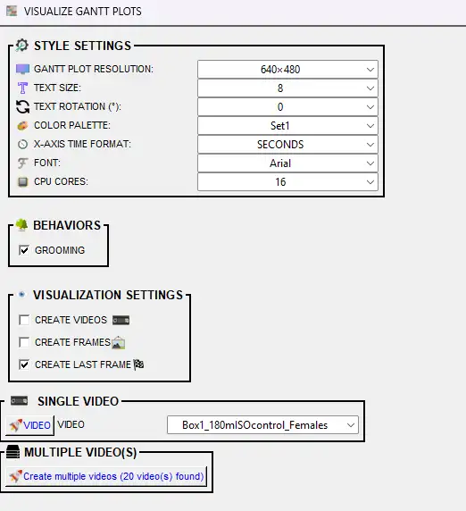

**Prerequisites:**
- **Classifier predictions** — Machine results must exist in `project_folder/csv/machine_results/` (one CSV per video, with prediction and probability columns for each classifier). Run the classifier first if this folder is empty.
- **Videos** — Optional for static/last-frame output; required if you create Gantt **videos**. Videos in `project_folder/videos/` must match machine_results filenames so the dynamic chart can be synced to video length.

**STYLE SETTINGS:**

| Option | Description |
|--------|-------------|
| **GANTT PLOT RESOLUTION** | Size of the output image or video (width×height in pixels). Options include 640×480, 1280×720, etc. Bigger = sharper but slower and larger files. |
| **TEXT SIZE** | Font size for behavior names on the y-axis (1–25). Bigger = easier to read; too big can overlap if you have many behaviors. |
| **TEXT ROTATION (°)** | Rotation of the behavior labels on the y-axis (0–180°, step 2). Use 45° or 90° when you have many behaviors to reduce overlap. |
| **COLOR PALETTE** | Color scheme for the behavior bars (e.g. Set1, Set2, viridis). Each behavior gets its own color. |
| **BAR OPACITY (%)** | Transparency of the bars (5%–100% in 5% steps). Lower = more transparent; useful when bars overlap. Default: 85%. |
| **X-AXIS TIME FORMAT** | **SECONDS** = numeric (e.g. 120). **HH:MM:SS** = clock style (e.g. 00:02:00). Use HH:MM:SS for long videos or presentations. |
| **FONT** | Font for behavior names. **AUTO** = SimBA picks; or choose a font (e.g. Arial). |
| **CPU CORES** | Number of CPU cores for parallel processing of dynamic Gantt outputs (**CREATE FRAMES** and/or **CREATE VIDEOS**). Applies to both **SINGLE VIDEO** and **MULTIPLE VIDEO(S)** runs; not used when creating only the static last frame. |

**BEHAVIORS** — Check which classifier(s) to show on the chart. At least one must be selected. Each behavior gets its own row of colored bars.

**VISUALIZATION SETTINGS** — Choose at least one output type:

| Option | Description                                                                                                                        |
|--------|------------------------------------------------------------------------------------------------------------------------------------|
| **CREATE FRAMES** | If checked, saves one .png image per frame. Use if you need to step through frame by frame as individual files.                    |
| **CREATE VIDEOS** | If checked, creates a .mp4 where the Gantt chart builds over time, frame by frame.                                                 |
| **CREATE LAST FRAME** | If checked, saves one .png with the full Gantt chart for the entire video. Good for a quick summary. Default: on.                  |
| **LAST FRAME AS SVG** | If checked, saves the final static Gantt as `.svg` (vector format) instead of `.png`. Useful for manuscripts and scalable figures. |
| **VIDEO** (Single Video panel) | Choose which single video to process when clicking the **VIDEO** button under **SINGLE VIDEO**.                                    |

**SINGLE VIDEO** — Select one video from the **VIDEO** dropdown and click <kbd>Create single video</kbd>. **MULTIPLE VIDEO(S)** — Click <kbd>Create multiple videos</kbd> to process all videos that have classification results.

**Where output is saved:** Videos, frames, and final images are saved to the `project_folder/frames/output/gantt_plots/` directory. Per-video outputs: `{video_name}.mp4`, `{video_name}_final_image.png` (or `{video_name}_final_image.svg` if **LAST FRAME AS SVG** is checked), and (if CREATE FRAMES) a subfolder `{video_name}/` with frame images.

> **TIP:** Create GIFs from frames via **Tools** → **Generate gifs**. Prefer WebM over GIF: **Tools** → **Convert file formats** → **Convert videos to WEBM**.

  

  

---

## VISUALIZE PROBABILITY PLOTS

Line plots showing the classifier's predicted probability (0–1) for one behavior across the video timeline. The x-axis is time (or frame), the y-axis is probability. Use these to see when the model was confident vs uncertain and to tune the discrimination threshold. Select at least one output type (frames, videos, or final frame), then run.

**Prerequisites:**
- **Classifier predictions** — CSVs in `project_folder/csv/machine_results/` must contain probability columns (e.g. `Probability_BtWGaNP`) for the selected classifier(s). Run the classifier first if needed.
- **Videos** — Required only if you create probability **videos** (chart animates over time). Videos in `project_folder/videos/` must match machine_results filenames. Not required for static or last-frame image output.

**STYLE SETTINGS:**

| Option | Description |
|--------|-------------|
| **RESOLUTION** | Size of the output image or video (width×height in pixels). Options include 640×480, 1280×720, etc. |
| **LINE COLOR** | Color of the probability line (e.g. Red, Blue, Green). Default: Red. |
| **TEXT SIZE** | Font size for axis labels (1–25). Bigger = easier to read. Default: 10. |
| **LINE WIDTH** | Thickness of the probability line (1–25). Thicker = more visible. Default: 2. |
| **MAX Y-AXIS** | Maximum value on the y-axis. **AUTO** = SimBA sets to 1.0 (100%). Or choose 10–100 (representing 0.1–1.0) to zoom in on lower probabilities. |
| **LINE OPACITY** | Transparency of the line (0.1–1.0 in 0.1 steps). Lower = more transparent. Default: 1.0. |
| **SHOW THRESHOLD LINES** | **TRUE** = draws horizontal lines at the discrimination threshold(s) so you can see when the model crosses above/below. **FALSE** = no threshold lines. Default: TRUE. Useful for tuning thresholds. |

**VISUALIZATION SETTINGS** — Choose at least one output type:

| Option | Description |
|--------|-------------|
| **CLASSIFIER** | Select which classifier to plot (e.g. BtWGaNP). One classifier per plot. |
| **CPU CORE COUNT** | Number of CPU cores for parallel processing (1 to max). Used for multiple videos. |
| **CREATE FRAMES** | If checked, saves one .png per frame. Use for animation or to create a GIF. |
| **CREATE VIDEOS** | If checked, creates an .mp4 where the probability line builds over time. |
| **CREATE FINAL FRAME** | If checked, saves one .png with the full probability plot for the entire video. Default: on. |

**SINGLE VIDEO** — Select one video from the **VIDEO** dropdown and click <kbd>CREATE SINGLE VIDEO</kbd>. **MULTIPLE VIDEO** — Click <kbd>Create multiple videos</kbd> to process all videos that have classification results.

**Where output is saved:** Videos, frames, and final images are saved to the `project_folder/frames/output/probability_plots/` directory. Per-video outputs: `{video_name}_{classifier_name}.mp4`, `{video_name}_{classifier_name}_final_frm_{datetime}.png`, and (if CREATE FRAMES) a subfolder `{video_name}_{classifier_name}/` with frame images.

  

  

---

## VISUALIZE PATH PLOTS

Path plots show where each animal moved over time (trajectory lines) and, optionally, where classified behaviors occurred (colored markers). Use them to see spatial patterns (e.g. where in the arena behaviors tended to occur) and to combine movement with classification in one visualization. See [Scenario 2 — Part 5](Scenario2.md#part-5--visualize-results).

  

**Prerequisites:**
- **Pose data** — Tracking data must be in `project_folder/csv/outlier_corrected_movement_location/` (one CSV per video). SimBA uses this to draw the path of the selected body part(s). If you overlay classification, it also reads from `project_folder/csv/machine_results/` (same base filenames).
- **Videos** — Source videos in `project_folder/videos/` with filenames matching the pose (and, if used, machine_results) CSVs. Required for video output or when drawing the path on video frames.

> **Note — Simpler path plots:** For quick, single-body-part trajectory plots with minimal options, see [Create path plots (ROI tab)](#create-path-plots-roi-tab) (under the **[ROI]** tab or **Tools** → **Create path plot**; the Tools version requires no project). Those tools produce simpler path plots without classification markers, multiple animals, ROI overlays, or time-segment controls.

**STYLE SETTINGS**

| Option | Description |
|--------|-------------|
| **MAX PRIOR LINES (S)** | How much of the path to show. **ENTIRE VIDEO** = full trajectory. Or choose **1–60** seconds so only the last N seconds of movement are drawn (shorter = "trailing" path, longer = more history). |
| **RESOLUTION** | Output image/video size. **AUTO** = use video resolution. Or pick a preset (e.g. 640×480, 1280×720) in **WIDTH×HEIGHT** format. |
| **BACKGROUND** | **Solid color** (e.g. White, Black). **Video - static frame** = use one video frame as background (then set **SELECT FRAME INDEX**). **Video - moving frames** = paths overlaid on the video as it plays. |
| **SELECT FRAME INDEX** | Shown only when BACKGROUND = **Video - static frame**. Frame number (1 = first frame) to use as the static background. |
| **BACKGROUND OPACITY (%)** | Only when BACKGROUND is a video option. 10–100% in steps of 10. 100% = fully opaque; lower = more transparent so paths stand out. |
| **LINE WIDTH** | Thickness of the path lines in pixels. **AUTO** = SimBA chooses; or **1–25**. |
| **CIRCLE SIZE** | Size of the circle drawn at the current (end) position of each path. **AUTO** or **1–25** pixels. |
| **FONT SIZE** | Size of text (e.g. animal names). **AUTO** or **1–25**. |
| **FONT THICKNESS** | Boldness of text. **AUTO** or **1–25**. |
| **SHOW ANIMAL NAMES** | **TRUE** = label the end of each path with the animal name. **FALSE** = no labels. |

**CHOOSE BODY-PARTS**

| Option | Description |
|--------|-------------|
| **# ANIMALS** | Number of animals (paths) to plot (1 up to your project's animal count). Sets how many body-part/color rows appear. |
| **BODY-PART 1, 2, …** | For each animal, choose which body part to track (e.g. Nose, Center, Tail_base). Typically use Center or Nose. |
| **COLOR/PALETTE** | For each animal: a **named color** (e.g. Red, Blue), a **palette** (e.g. viridis, plasma) for a time-based color gradient along the path, or **CUSTOM** to enter **RGB** (e.g. 255,0,0). |

**SEGMENTS (time window)**

| Option | Description |
|--------|-------------|
| **Plot ONLY defined time-segment** | If checked, the path is drawn only for the selected time range. Uncheck to use the full video. |
| **START TIME** | Start of the segment. Format **HH:MM:SS** (e.g. 00:00:10). Enabled when the time-segment checkbox is checked. |
| **END TIME** | End of the segment. Format **HH:MM:SS** (e.g. 00:01:30). Must be after START TIME. |

**CLASSIFICATION VISUALIZATION**

| Option | Description |
|--------|-------------|
| **INCLUDE CLASSIFICATION LOCATIONS** | If checked, dots/markers are drawn on the path where the selected behaviors were detected. Requires classifier prediction data in `project_folder/csv/machine_results/`. |
| **Classifier 1, 2, …** | Which classifier to show (e.g. Attack, Sniffing). One row per classifier when classification is included. |
| **Color** (per classifier) | Color of the markers for that behavior. |
| **Size** (per classifier) | Marker size in pixels (**1–50**). Larger = more visible but can obscure the path. |

**ROI VISUALIZATION**

| Option | Description |
|--------|-------------|
| **INCLUDE ROIs** | If checked, ROI shapes are drawn on the plot. Requires ROI definitions in the project. If the option is disabled, no ROI data was found. |

**VISUALIZATION SETTINGS (output type)**

| Option | Description |
|--------|-------------|
| **CPU CORE COUNT** | Number of CPU cores for parallel processing when creating multiple videos (2 up to your system max). Not used for single video. |
| **CREATE FRAMES** | If checked, saves one .png per frame. Use for stepping through frame-by-frame or to build a GIF. |
| **CREATE VIDEOS** | If checked, creates an .mp4 where the path grows frame by frame over time. |
| **CREATE LAST FRAME** | If checked, saves one .png with the full path up to the last frame. Default: on. |

**SINGLE VIDEO** — Choose a video from the **Video** dropdown, then click <kbd>CREATE SINGLE VIDEO</kbd>. **MULTIPLE VIDEO** — Click <kbd>Create multiple videos</kbd> to process all videos that have data in `project_folder/csv/outlier_corrected_movement_location/` (and, if classification markers are used, also in `project_folder/csv/machine_results/`).

**Where output is saved:** `project_folder/frames/output/path_plots/`. For each video: `{video_name}.mp4` (if CREATE VIDEOS), `{video_name}_final_frame.png` (if CREATE LAST FRAME), and if CREATE FRAMES is checked, a subfolder `{video_name}/` containing one .png per frame.

  
  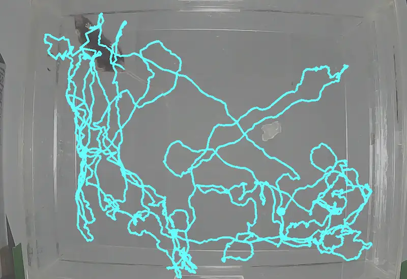

  
  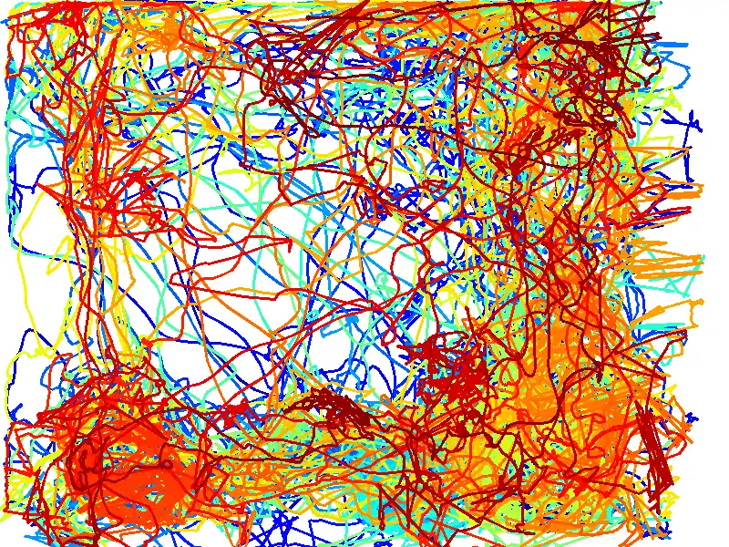
  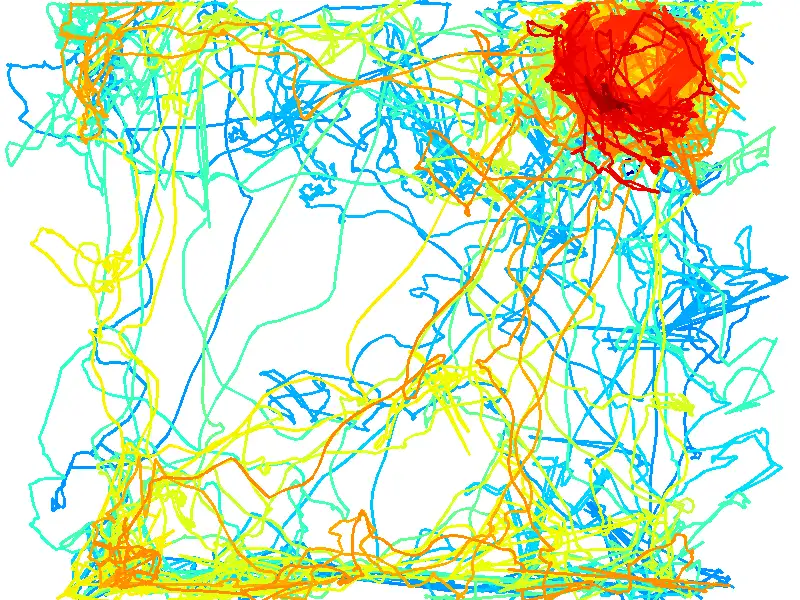

[path_plot_2.webm](https://github.com/user-attachments/assets/4e0e249c-0571-4f8c-b705-7ff341f429fd)

---

## VISUALIZE DISTANCE PLOTS

  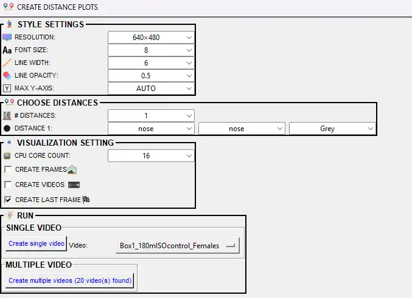

Line plots of the distance between pairs of body parts (or animals) over time. Use these to visualize approach/retreat, proximity, or other distance-based measures (e.g. nose-to-nose distance between two animals). See [Scenario 2 — Part 5](Scenario2.md#part-5--visualize-results). The pop-up offers the following options:

**Prerequisites:**
- **Pose data** — Tracking data must be in `project_folder/csv/outlier_corrected_movement_location/` (one CSV per video). SimBA computes distances between the body-part pairs you select from this data. Calibration (pixels per mm) must be set so distances are in cm. Run outlier correction (and video parameters) first if this folder is empty.
- **Videos** — Source videos in `project_folder/videos/` with filenames matching the pose CSVs. Required for video or frame output so the plot can be synced to video length.

| Option | Description |
|--------|-------------|
| **RESOLUTION** | Output image/video size (width×height in pixels). Options include 640×480, 1280×720, etc. |
| **FONT SIZE** | Font size for axis labels (1–32). |
| **LINE WIDTH** | Thickness of the distance line (1–32). |
| **LINE OPACITY** | Transparency of the line (0.0–1.0). Lower = more transparent. |
| **MAX Y-AXIS** | Maximum value on the y-axis (cm). AUTO = SimBA sets from data; or 10–1000 in steps of 10 to fix the scale. |
| **# DISTANCES** | Number of distance curves to plot (1 to a maximum based on body parts). Each curve shows distance between one pair of body parts. |
| **DISTANCE 1, 2, …** | For each distance: select **body part 1** and **body part 2** (the two must differ; e.g. Nose_1 and Nose_2 for inter-animal distance) and a **line color**. |
| **CREATE FRAMES** | If checked, saves one .png per frame. |
| **CREATE VIDEOS** | If checked, creates .mp4 with the distance line building over time. |
| **CREATE LAST FRAME** | If checked, saves one .png with the full distance plot for the entire video. At least one of CREATE FRAMES, CREATE VIDEOS, or CREATE LAST FRAME must be checked. |
| **CPU CORE COUNT** | Number of CPU cores for parallel processing when creating multiple videos. |

**SINGLE VIDEO** — Select one video and click <kbd>Create single video</kbd>. **MULTIPLE VIDEO** — Click <kbd>Create multiple videos</kbd> to process all videos that have data in `project_folder/csv/outlier_corrected_movement_location/`.

**Where output is saved:** `project_folder/frames/output/line_plot/`. Per-video: `{video_name}.mp4` (or .avi for single-core), `{video_name}_final_distances.png`, and (if CREATE FRAMES) subfolder `{video_name}/` with frame images.

  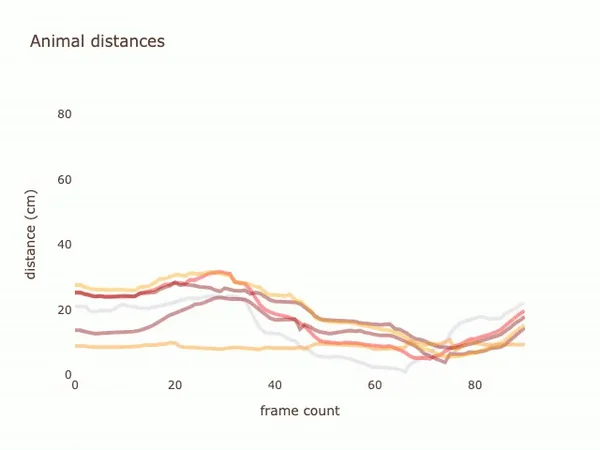
  

---

## VISUALIZE CLASSIFICATION HEATMAPS

Heatmaps show where in the arena (or frame) classified behaviors tended to occur. Warmer colors indicate more time or more events at that location. Use them to identify spatial hotspots (e.g. corners where attacks occurred). See [this video](https://youtu.be/O41x96kXUHE) and [Scenario 2 — Part 5](Scenario2.md#part-5--visualize-results). 

  

The pop-up offers the following options:

**Prerequisites:**
- **Classifier predictions** — Machine results must exist in `project_folder/csv/machine_results/` (one CSV per video) with prediction and probability columns for the chosen classifier. SimBA uses the selected body part’s location when the behavior is predicted to build the spatial heatmap. Run the classifier first if needed.
- **Videos** — Required if **HEATMAP BACKGROUND** is VIDEO or VIDEO FRAME (to overlay the heatmap on video). Videos in `project_folder/videos/` must match machine_results filenames. Not required for heatmap-only (NONE) output.
- **Calibration** — Video parameters (pixels per mm) must be set so that bin size in mm and arena coordinates are meaningful; see `project_folder/logs/video_info.csv`.

| Option | Description |
|--------|-------------|
| **PALETTE** | Colormap for the heatmap (e.g. jet, viridis, magma, plasma). See [Matplotlib colormaps](https://matplotlib.org/stable/gallery/color/colormap_reference.html). |
| **SHADING** | **Gouraud** = smooth gradients between bins. **Flat** = solid colors per bin. |
| **CLASSIFIER** | Which behavior to plot. The heatmap shows where this behavior occurs in the arena over time. |
| **BODY-PART** | Body part used to pinpoint location. When the classifier detects the behavior, SimBA records where this body part is. |
| **MAX TIME SCALE (S)** | Maximum value for the color scale (seconds of behavior per bin). AUTO = SimBA uses max from data; or 5–100 in steps of 5. |
| **BIN SIZE (MM)** | Size of each spatial bin in mm (e.g. 20×20). Smaller = finer detail but noisier; larger = smoother heatmap. |
| **MINIMUM SECONDS** | Hide bins with very low behavior duration. Bins below this (seconds) appear empty. NONE = show all bins. |
| **SHOW TIME COLOR LEGEND** | If TRUE, displays the color bar explaining the heatmap scale. |
| **LINE COLOR** | Color for contour/boundary lines. NONE = no lines. |
| **HEATMAP BACKGROUND** | **NONE** = plain. **VIDEO** = overlay on full video. **VIDEO FRAME** = overlay on one frame. When VIDEO/VIDEO FRAME: **HEATMAP OPACITY (%)** (5–100). When VIDEO: **SHOW KEYPOINT** (draw body-part position). When VIDEO FRAME: **FRAME NUMBER** (0 = first). |
| **PLOT SELECT TIME-PERIOD** | If checked, only plots between **START TIME** and **END TIME** (HH:MM:SS). |
| **CPU CORE COUNT** | CPU cores for parallel processing. |
| **CREATE FRAMES** | If checked, saves one .png per frame. |
| **CREATE VIDEOS** | If checked, creates .mp4 with heatmap building over time. |
| **CREATE LAST FRAME** | If checked, saves one .png with the final cumulative heatmap. At least one output type must be checked. |

**SINGLE VIDEO** — Select one video and click <kbd>Create single heatmap</kbd>. **MULTIPLE VIDEO** — Click <kbd>Create multiple heatmaps</kbd> to process all videos that have data in `project_folder/csv/machine_results/`.

**Where output is saved:** `project_folder/frames/output/heatmaps_classifier_locations/`. Per-video: `{video_name}.mp4`, `{video_name}_final_frm.png`, and (if CREATE FRAMES) subfolder `{video_name}/` with frame images.

  
  

---

## VISUALIZE ROI TRACKING (ROI tab)

*Available under the **[ROI]** tab → **VISUALIZE ROI DATA** → **VISUALIZE ROI TRACKING**. See [ROI Tutorial — Part 4](https://github.com/sgoldenlab/simba/blob/master/docs/ROI_tutorial.md#part-4-visualizing-roi-data).*

  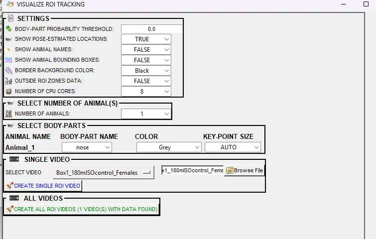

Creates videos with ROI shapes overlaid on each frame, plus **counters** showing how much time animals have spent in each ROI and how many times they have entered each ROI. Use this to visualize traditional ROI metrics (time in, entries) alongside the video. Data is read from `project_folder/csv/outlier_corrected_movement_location/` and ROI definitions in the project.

**Prerequisites:**
- **ROI definitions** — You must have drawn and saved at least one ROI (e.g. zones, shapes) on the videos in this project. ROI definitions are stored in the project; SimBA uses them to compute time-in and entry counts and to draw the shapes on the output video.
- **Pose data** — Tracking data (body-part x,y coordinates) must exist in `project_folder/csv/outlier_corrected_movement_location/`. Each CSV should correspond to a video in `project_folder/videos/` (same base filename). If you have not yet run outlier correction and feature extraction, do that first so this folder is populated.
- **Videos** — Source videos must be in `project_folder/videos/` with filenames matching the pose CSVs (excluding extension).

| Option | Description |
|--------|-------------|
| **BODY-PART PROBABILITY THRESHOLD** | Minimum pose-estimation confidence (0.0–1.0) for body parts. Frames below this are filtered. Use 0.0 to use all frames. |
| **SHOW POSE-ESTIMATED LOCATIONS** | If TRUE, draws circles at the selected body-part locations. Disables KEY-POINT SIZE and COLOR when FALSE. |
| **SHOW ANIMAL NAMES** | Display animal labels on the video. |
| **SHOW ANIMAL BOUNDING BOXES** | Draw boxes around each animal. |
| **BORDER BACKGROUND COLOR** | Color of the side panel where ROI counters are shown. |
| **OUTSIDE ROI ZONES DATA** | If TRUE, treats all areas NOT covered by an ROI as one additional ROI and shows its metrics. |
| **NUMBER OF CPU CORES** | Cores for parallel processing (1 to max). |
| **USE GPU** | Use GPU for faster processing when available. |
| **NUMBER OF ANIMALS** | How many animals to visualize (1 to project max). |
| **BODY-PART** (per animal) | Body part used as proxy for animal location (e.g. Nose, Center). |
| **COLOR** (per animal) | Color of pose circles. Shown only when SHOW POSE-ESTIMATED LOCATIONS is TRUE. |
| **KEY-POINT SIZE** (per animal) | Size of pose circles. AUTO = SimBA picks from video resolution. Shown only when pose is enabled. |

**SINGLE VIDEO** — Select a video and click <kbd>Create single ROI video</kbd>. **ALL VIDEOS** — Click <kbd>Create all ROI videos</kbd> to process all videos that have ROI and pose data.

**Where output is saved:** `project_folder/frames/output/ROI_analysis/`. Per-video: `{video_name}.mp4`.

**Examples:**

[roi_plot_2.webm](https://github.com/user-attachments/assets/7eb65e5d-8d1f-451a-b6fd-2558ba4afc5e)

[outside_roi_example.webm](https://github.com/user-attachments/assets/6174e057-2476-498e-8e5b-2de1390acd8f)

*Outside ROI zones data (treats areas not covered by an ROI as one additional zone).*

---

## VISUALIZE ROI FEATURES (ROI tab)

*Available under the **[ROI]** tab → **VISUALIZE ROI DATA** → **VISUALIZE ROI FEATURES**. See [ROI Tutorial — Part 5](https://github.com/sgoldenlab/simba/blob/master/docs/ROI_tutorial.md#part-5-visualizing-roi-features).*

  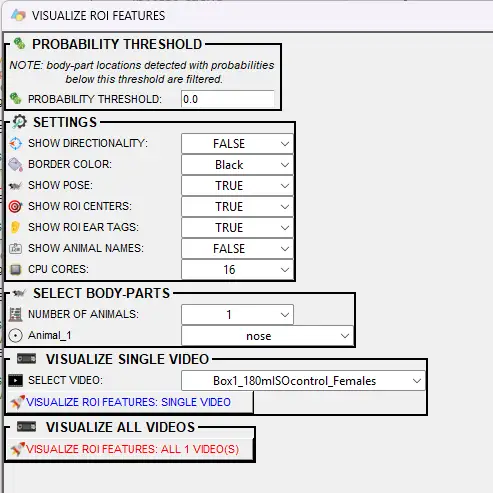

Creates videos showing **continuous and boolean ROI features** (rather than just time-in and entries): distances to ROIs, whether animals are inside ROIs, and optionally **directionality towards ROIs** (when the animal’s head points at an ROI). Use this to inspect ROI feature data used for machine learning or descriptive statistics.

**Prerequisites:**
- **ROI definitions** — At least one ROI must be drawn and saved in the project so SimBA can compute distances, inside/outside status, and (optionally) directionality towards ROIs.
- **Pose data** — Tracking data must be in `project_folder/csv/outlier_corrected_movement_location/` (or equivalent), with one CSV per video. Video filenames must match.
- **For directionality towards ROIs** — If you want to use **SHOW DIRECTIONALITY** (lines or funnel), your pose configuration must include **nose** and **left/right ear** (or equivalent) body parts so SimBA can estimate head direction. If those body parts are not available, the directionality option is disabled.

| Option | Description |
|--------|-------------|
| **SHOW DIRECTIONALITY** | **FALSE** = no direction overlay. **LINES** = lines from head to ROI when directing. **FUNNEL** = funnel-style polygon. Disabled when directionality is not available. |
| **BORDER COLOR** | Color of the side panel / border. |
| **SHOW POSE** | Draw pose-estimated body parts on the video. |
| **SHOW ROI CENTERS** | Mark the center of each ROI with a circle. |
| **SHOW ROI EAR TAGS** | Show ear-tag points of each ROI shape. |
| **SHOW ANIMAL NAMES** | Display animal labels. |
| **USE GPU** | Use GPU for faster processing when available. |
| **CPU CORES** | Number of cores for multiprocessing. |
| **PROBABILITY THRESHOLD** | Filter body-part locations below this confidence (0.0–1.0). |
| **NUMBER OF ANIMALS** | How many animals to visualize. |
| **BODY-PART** (per animal) | Body part used as proxy for animal location. |

**SINGLE VIDEO** — Select a video and click <kbd>Visualize ROI features: single video</kbd>. **ALL VIDEOS** — Click <kbd>Visualize ROI features: all X video(s)</kbd> to process all videos with ROI data.

**Where output is saved:** `project_folder/frames/output/ROI_features/`. Per-video: `{video_name}.mp4`.

  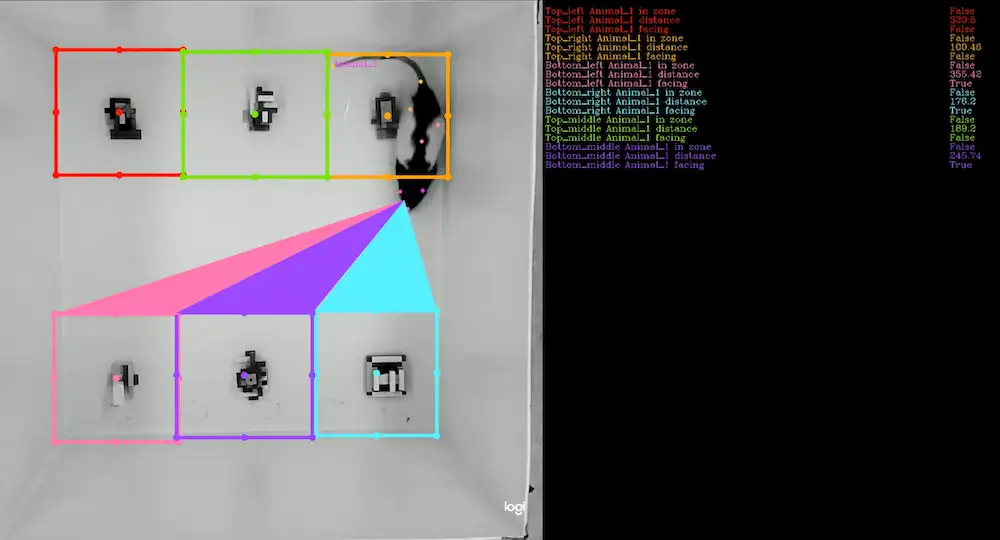

  

---

## VISUALIZE HEATMAP LOCATIONS (ROI tab)

*Available under the **[ROI]** tab → **Create heatmaps**. See [ROI Tutorial — Part 6: Heatmaps](https://github.com/sgoldenlab/simba/blob/master/docs/ROI_tutorial.md#heatmaps).*

  

Location heatmaps visualize **time spent in different regions of the arena** (colour-coded by duration). Unlike classification heatmaps, this tool does **not** depend on user-drawn ROIs or classifier predictions: it divides the arena into square bins and shows where the selected body part spent the most time. Use it to explore spatial occupancy patterns (e.g. corners, center, edges). For an example in video format, see the [SimBA YouTube playlist](https://youtu.be/O41x96kXUHE).

**Prerequisites:**
- **Pose data** — Tracking data (body-part coordinates) must be in `project_folder/csv/outlier_corrected_movement_location/`, with one CSV per video. SimBA uses this data to compute where the selected body part (e.g. Center, Nose) was in each frame and then sums time per spatial bin. Video and CSV base filenames must match.
- **Videos** — Source videos in `project_folder/videos/` are required if you choose **HEATMAP BACKGROUND** = VIDEO or VIDEO FRAME (to overlay the heatmap on video). Not required for **NONE** (heatmap only).
- **Calibration** — Video parameters (pixels per mm, resolution) must be set so that bin size in mm and spatial coordinates are meaningful; see the project’s `project_folder/logs/video_info.csv`.

| Option | Description |
|--------|-------------|
| **PALETTE** | Colormap for the heatmap (e.g. jet, viridis, magma, plasma). See [Matplotlib colormaps](https://matplotlib.org/stable/gallery/color/colormap_reference.html). |
| **SHADING** | **Gouraud** = smooth gradients between bins. **Flat** = solid colors per bin. |
| **BODY-PART** | Single body part used to represent location. SimBA generates heatmaps based on where this body part spends time. Typically use Center (center of mass) or Nose. |
| **MAX TIME SCALE (S)** | Maximum value for the color scale (seconds per bin). **AUTO** = SimBA computes the max time spent in any bin from the data. Or choose 5–100 in steps of 5. |
| **BIN SIZE (MM)** | Size of each square region in mm (e.g. 20×20). Smaller = finer detail but noisier; larger = coarser but smoother heatmaps. |
| **SHOW TIME COLOR LEGEND** | If TRUE, displays the color bar explaining the heatmap scale (seconds spent in each area). |
| **MINIMUM SECONDS** | Hide bins with very low occupancy. Bins below this value (seconds) appear empty. NONE = show all bins. |
| **LINE COLOR** | Color for contour/boundary lines between bins. NONE = no lines. |
| **HEATMAP BACKGROUND** | **NONE** = plain heatmap. **VIDEO** = overlay on full video. **VIDEO FRAME** = overlay on one chosen frame. When VIDEO/VIDEO FRAME: **HEATMAP OPACITY (%)** (5–100). When VIDEO: **SHOW KEYPOINT** (draw body-part position). When VIDEO FRAME: **FRAME NUMBER** (0 = first). |
| **PLOT SELECT TIME-PERIOD** | If checked, only plots between **START TIME** and **END TIME** (HH:MM:SS). |
| **CPU CORES** | Number of CPU cores for parallel processing when creating multiple heatmaps. |
| **CREATE FRAMES** | If checked, saves one .png per frame. Warning: for long videos this creates many files. |
| **CREATE VIDEOS** | If checked, creates .mp4 with heatmap building over time. |
| **CREATE LAST FRAME** | If checked, saves one .png with the cumulative heatmap for the entire video. Default: on. |

**SINGLE VIDEO** — Select one video from the **VIDEO** dropdown and click <kbd>Create single heatmap</kbd>. **MULTIPLE VIDEO** — Click <kbd>Create multiple heatmaps</kbd> to process all videos that have data in `project_folder/csv/outlier_corrected_movement_location/`.

**Where output is saved:** `project_folder/frames/output/heatmaps_locations/`. Per-video: `{video_name}.mp4`, `{video_name}_final_frm.png` (or similar), and (if CREATE FRAMES) subfolder `{video_name}/` with frame images.

[location_heatmap.webm](https://github.com/user-attachments/assets/d124f790-bd80-4a1e-9020-3a31ea12fc35)

  

---

## VISUALIZE DIRECTIONALITY (ROI tab)

*Available under the **[ROI]** tab. SimBA uses nose and ear coordinates to estimate head direction (line of sight). This is a proxy for gaze, not actual gaze tracking. Requires nose, left ear, and right ear (or equivalent) body parts. See [ROI Tutorial — Part 3–5](https://github.com/sgoldenlab/simba/blob/master/docs/ROI_tutorial.md) and [Directionality between animals](https://github.com/sgoldenlab/simba/blob/master/docs/directionality_between_animals.md).*

  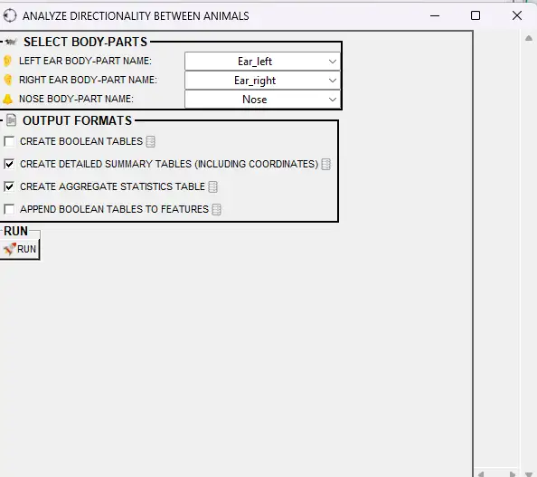

**Directionality towards ROIs** — Use [Visualize ROI Features](#visualize-roi-features-roi-tab) (SHOW DIRECTIONALITY = LINES or FUNNEL) to visualize when animals are directing towards user-defined ROIs.

The tools below visualize **directionality between animals**, not towards ROIs:

### Visualize directionality between animals

**[ROI]** tab → **OTHER ANALYSES / VISUALIZATIONS** → **VISUALIZE DIRECTIONALITY BETWEEN ANIMALS**

Creates videos showing when each animal is **directing towards other animals** (not ROIs). Draws lines or polyfills from the observer’s eye to the observed body parts.

**Prerequisites:**
- **At least two animals** — The directionality analysis and visualization are defined for one animal directing towards another; your project and pose data must include at least two tracked animals.
- **Nose and ear body parts** — The pose configuration must include **nose**, **left ear**, and **right ear** (or equivalent) for each animal so SimBA can estimate head direction (line of sight). These are used to compute when one animal is “directing” towards the other.
- **Directionality data already computed** — You must run **ANALYZE DIRECTIONALITY BETWEEN ANIMALS** (in the **[ROI]** tab) **before** using this visualization. That step writes directionality dataframes to `project_folder/logs/directionality_dataframes/`. This tool reads from that folder; if it is empty or missing, the visualization will have nothing to display.

| Option | Description |
|--------|-------------|
| **LEFT EAR / RIGHT EAR / NOSE** | Body parts used to estimate head direction. Must be unique. |
| **SHOW POSE TRACKING** | Draw pose-estimated body parts. |
| **HIGHLIGHT DIRECTION END-POINTS** | Emphasize observed body parts with salient circles. |
| **SHOW ANIMAL NAMES** | Display animal labels. |
| **DIRECTION COLOR** | Color of direction lines. **Random** = auto-assigned. |
| **POSE CIRCLE SIZE** | Size of pose dots. AUTO or 1–10. |
| **LINE THICKNESS** | Thickness of direction lines. AUTO or 1–10. |
| **LINE OPACITY** | Transparency of direction lines (0.1–1.0). |
| **CPU core count** | Cores for multiprocessing. |

**Where output is saved:** `project_folder/frames/output/Directing_animals/`

[visualize_directionality_1.webm](https://github.com/user-attachments/assets/84538728-eb2c-40b2-9360-a5f73d8da506)

[visualize_directionality_2.webm](https://github.com/user-attachments/assets/cf73b602-932b-4ab4-82e0-2fa9f963531b)

---

## VISUALIZE DATA TABLES

Creates videos or frames where a table overlays the video, showing movement metrics (total distance traveled, current velocity) for selected body parts, updating in real time as the video plays. Useful for presentations or for checking that movement calculations look correct. See [Scenario 2 — Part 5](Scenario2.md#part-5--visualize-results). The pop-up offers the following options:

**Prerequisites:**
- **Pose data** — Tracking data must be in `project_folder/csv/outlier_corrected_movement_location/` (one CSV per video). SimBA computes total distance and velocity from the selected body part’s coordinates; calibration (pixels per mm) must be set so values are in cm and cm/s. Run outlier correction and video parameters first if this folder is empty.
- **Videos** — Source videos in `project_folder/videos/` with filenames matching the pose CSVs. Required so the table overlay can be rendered on the correct video and synced to frame count.

| Option | Description |
|--------|-------------|
| **RESOLUTION** | Output image/video size (width×height in pixels). Options include 640×480, 1280×720, etc. |
| **DECIMAL ACCURACY** | Number of decimal places for movement and velocity values (0–10). |
| **BACKGROUND COLOR** | Background color of the table (e.g. White, Black). Must differ from header and text colors. |
| **HEADER COLOR** | Color of the header labels (e.g. ANIMAL, TOTAL MOVEMENT, CURRENT VELOCITY). Must differ from background. |
| **FONT THICKNESS** | Thickness of the table text (0–10). Higher = bolder. |
| **# ANIMALS** | Number of body parts (rows) to show in the table. Each row displays one body part. |
| **BODY-PART (per row)** | Which body part to track (e.g. Nose, Center, Tail_base). Must be unique per row. **COLOR** — Text color for that row. Must differ from background. |
| **CREATE FRAMES** | If checked, saves one .png per frame of the table overlay. |
| **CREATE VIDEOS** | If checked, creates .mp4 with the table updating as the video plays. At least one of CREATE FRAMES or CREATE VIDEOS must be checked. |

**Metrics displayed:** For each body part, the table shows **Total movement (cm)** (cumulative distance up to the current frame) and **Velocity (cm/s)** (current frame).

**SINGLE VIDEO** — Select one video and click <kbd>Create single video</kbd>. **MULTIPLE VIDEOS** — Click <kbd>Create multiple videos</kbd> to process all videos that have data in `project_folder/csv/outlier_corrected_movement_location/`.

**Where output is saved:** `project_folder/frames/output/live_data_table/`. Per-video: `{video_name}.mp4`, and (if CREATE FRAMES) subfolder `{video_name}/` with frame images.

  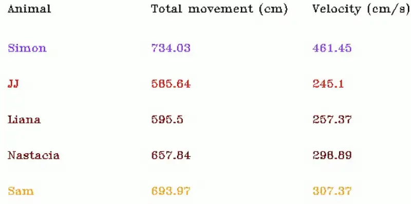

---

## MERGE (CONCATENATE) MULTIPLE VIDEOS

The **merge (concatenate) multiple videos** tool combines several videos into one output video by arranging them in a single multi-panel layout. Each input video becomes one panel; they are not played one after another in time, but shown side by side (or in a grid) in every frame. Typical uses include putting the original video, a classification-overlay video, a Gantt chart, and a probability or path plot into one view for figures, slides, or quick visual comparison.

  

**Prerequisites:**
- **Two or more video files** — You must have the videos you want to merge already on disk (e.g. from SimBA visualizations: classification video, Gantt video, path plot, probability plot, or any other exported .mp4/.avi). Each file is selected via **VIDEO 1**, **VIDEO 2**, etc. No SimBA project is required when using **Tools** → **Concatenate multiple videos**; when using the **[Visualizations]** tab, the project’s output folder is the typical source.

**How to open it:** In the **[Visualizations]** tab, click <kbd>MERGE FRAMES</kbd>. You can also use the **Tools** menu → **Concatenate multiple videos**. See [Scenario 2 — Part 5](Scenario2.md#part-5--visualize-results).

**What you set:**

- **Number of videos** — Choose how many videos to merge (2–20). The window then shows one file selector per video (**VIDEO 1**, **VIDEO 2**, …). Order of the list determines panel position (e.g. Video 1 is top-left or first, depending on join type).
- **Join type** — Layout of the panels:
  - **HORIZONTAL** — One row; videos side by side.
  - **VERTICAL** — One column; videos stacked.
  - **MOSAIC** — Two rows of panels (videos split across the two rows). With only 2 videos, this behaves like VERTICAL.
  - **MIXED MOSAIC** — One large panel (Video 1) and the rest in a two-row mosaic. Requires at least 3 videos.
- **Resolution** — **WIDTH** and **HEIGHT** (in pixels) of each panel. Options include 480, 640, 1280, 1920, 2560. For MIXED MOSAIC, this size applies to the smaller panels.
- **USE GPU** — If **TRUE**, a compatible GPU is used to speed up encoding when available.
- **OUT VIDEO QUALITY** — 10–100; higher values give better quality and larger files (default 60).

Click <kbd>RUN</kbd> to generate the merged video.

**Where output is saved:** `project_folder/frames/output/merged/` as `merged_video_YYYYMMDDHHMMSS.mp4` (date and time with no separator, e.g. `merged_video_20250212143055.mp4`). When the tool is run without a project (**Tools** → **Concatenate multiple videos**), the file is saved in the same directory as the first selected video.

https://github.com/user-attachments/assets/b84364ee-3e85-4630-8955-070491f74f00

---

## Post-classification validation (Scenario 4)

*Generates bout-level clips for reviewing predictions and spotting false positives. See [Scenario 4 — Part 7](Scenario4.md#part-7-post-classification-validation-detecting-false-positives).*

  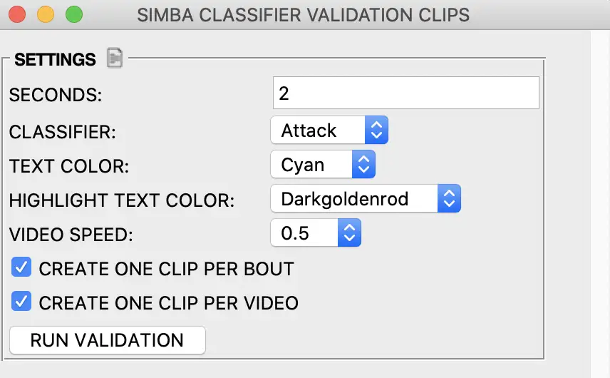

Creates a video for each CSV with concatenated clips of all bouts of the target behavior. Each bout is extracted and concatenated into one video so you can quickly review predictions and spot false positives.

**Prerequisites:**
- **Classifier predictions** — Machine results must exist in `project_folder/csv/machine_results/` (one CSV per video) with prediction columns for the target behavior. Run the classifier first so these files exist.
- **Videos** — Source videos must be in `project_folder/videos/` with filenames matching the machine_results CSVs. SimBA uses them to extract the bout clips and concatenate them into the validation video.

**Options:**
- **Seconds** — Duration added before and after each event (in seconds). Use to add context around each bout.
- **Target** — Behavior to include (e.g. Attack, Sniffing). Select the classifier you want to validate.

**Where output is saved:** `project_folder/frames/output/classifier_validation/`. Each file: `{videoname}_{target}_{bout_count}.mp4`.

  <video src="images/scenario4/classifiervalidation.mp4" width="600" controls>Post-classification validation output</video>

  <video src="images/scenario4/ClassifierValidationClips_1.mp4" width="600" controls>Classifier validation clips</video>

---

## VISUALIZE ANNOTATIONS (Label behavior tab)

*Available under the **[Label behavior]** tab → **LABELLING TOOLS** → **VISUALIZE ANNOTATIONS**. See [Label behavior — Visualization](https://github.com/sgoldenlab/simba/blob/master/docs/label_behavior.md#visualization).*

Extracts and saves **frames where behavior was annotated as present** (behavior-present frames). Use this to review your annotation quality, create training datasets, or verify that labels match the intended behavior. Each output image corresponds to one annotated behavior-present frame.

**Prerequisites:**
- **Behavior annotations** — The project must contain labeled behavior data: either from the SimBA **[Label behavior]** tab (frame or bout annotations) or from imported third-party annotations (e.g. BORIS, Solomon Coder). SimBA expects these to be stored in CSV files that include both pose/features and the behavior columns.
- **Data files in the correct folder** — Annotated CSVs must be in `project_folder/csv/targets_inserted/` (or the project’s equivalent targets folder). Each file typically corresponds to one video and includes columns that indicate for each frame (or bout) whether the behavior was present. If you have not yet labeled or appended annotations, do that first so this folder is populated with the classifier(s) you want to visualize.

| Option | Description |
|--------|-------------|
| **CHOOSE CLASSIFIERS** | Tick which classifier(s) to extract. At least one must be selected. Each classifier gets its own subfolder. |
| **DOWN-SAMPLE IMAGES** | **None** = full resolution. **2x**, **3x**, **4x**, **5x** = reduce image dimensions by that factor. |
| **IMAGE FORMAT** | Output format: png, jpg, or webp. |
| **GREYSCALE IMAGES** | If TRUE, converts frames to grayscale. |
| **VIDEO** | **ALL VIDEOS** = process all annotated videos. Or select one video. |

**RUN** — Click <kbd>RUN</kbd> to extract the frames. Progress appears in the main SimBA terminal.

**Where output is saved:** `project_folder/frames/output/annotated_frames/`. Hierarchy: `{video_name}/{classifier_name}/{frame_number}.png`. For example, `My_video/Attack/28.png` is frame 28 of `My_video` annotated as **Attack** present.

---

## VISUALIZE POSE-ESTIMATION IN FOLDER (Tools menu)

*Available under **Tools** → **Visualize pose-estimation in folder...**. See [Tools: Visualize pose estimation in folder](Tools.md#visualize-pose-estimation-in-folder).*

Renders **videos with pose keypoints overlaid** on each frame. Use this to verify tracking quality after interpolation, smoothing, or outlier correction—or to inspect any folder of pose CSV/parquet files. The tool does **not** require a SimBA project: it works on any folder containing compatible tracking files.

**Typical use:** After importing and preprocessing pose data, select the folder (e.g. `project_folder/csv/outlier_corrected_movement_location/` or `project_folder/csv/input/`) and choose a save directory; SimBA renders one video per tracking file.

  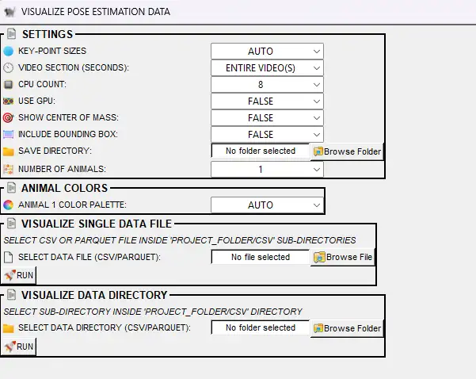

| Option | Description |
|--------|-------------|
| **KEY-POINT SIZES** | Size of pose circles (AUTO, or 1–100). AUTO derives size from video resolution. |
| **VIDEO SECTION (SECONDS)** | **ENTIRE VIDEO(S)** = full video. Or 10, 20, … 200 to render only the first N seconds per video. |
| **CPU COUNT** | Cores for multiprocessing (2 to max minus one). More cores = faster but higher RAM/GPU use. |
| **USE GPU** | If TRUE, uses GPU for concatenation when multiprocessing. |
| **INCLUDE BOUNDING BOX** | If TRUE, draws rectangular boxes around each animal's body parts. |
| **SHOW CENTER OF MASS** | **FALSE** = no center dot. Or choose a color to draw the center of mass per animal (useful for verifying movement analysis). |
| **SAVE DIRECTORY** | Folder where output videos are saved. User-selectable (e.g. desktop or a project subfolder). |
| **NUMBER OF ANIMALS** | Number of tracked individuals (1–16). Must match the pose data. |
| **ANIMAL n COLOR PALETTE** | Color scheme per animal. **AUTO** = SimBA picks; or choose a palette (e.g. Set1, viridis). |
| **SELECT DATA FILE (CSV/PARQUET)** | Run on a single file. Pick a CSV or parquet tracking file and click <kbd>RUN</kbd>. |
| **SELECT DATA DIRECTORY (CSV/PARQUET)** | Batch run on all supported files in a folder. Pick a directory (e.g. `project_folder/csv/outlier_corrected_movement_location/`) and click <kbd>RUN</kbd>. |

**Where output is saved:** The **SAVE DIRECTORY** you choose. Each input file produces one output video (e.g. `{filename}.mp4`).

[pose_plotter.webm](https://github.com/user-attachments/assets/09810e7a-a63f-45e0-8f51-781d7ed77c15)

---

## VISUALIZE BLOB TRACKING (Process Videos menu)

*Available under **Process Videos** → **Blob tracking...** → **Visualize blob tracking**. See [Blob tracking](https://github.com/sgoldenlab/simba/blob/master/docs/blob_track.md) and [Blob tracking visualization notebook](https://github.com/sgoldenlab/simba/blob/master/docs/nb/blob_tracking_vis.ipynb).*

  

Renders **videos with blob-tracking overlays**: convex hulls, anterior (nose), posterior (tail), center, and optional left/right body-part points. Blob tracking uses background subtraction (no pose-estimation model) to detect animals and infer body parts from the blob shape. Use this to verify blob detection quality or create presentation videos.

**Prerequisites:**
- **Blob tracking CSV files** — You must have already run SimBA’s **blob tracking** pipeline (background subtraction, convex hull, anterior/posterior/center inference) so that CSV files exist with blob-derived body-part or hull data. The format and columns must match what this visualization tool expects (see [Blob tracking](https://github.com/sgoldenlab/simba/blob/master/docs/blob_track.md)).
- **Source videos** — The original videos that were used to generate the blob tracking CSVs. Each CSV filename (without extension) must match a video filename (without extension) so SimBA can overlay the blob shapes on the correct video.
- **No SimBA project required** — This tool runs from the **Process Videos** menu and does not require a SimBA project. You select the **data directory** (blob CSVs), **video directory**, and **save directory** manually.

| Option | Description |
|--------|-------------|
| **VIDEO DIRECTORY** | Folder containing source videos. Filenames must match CSV filenames (without extension). |
| **DATA DIRECTORY** | Folder containing blob tracking CSV files. |
| **SAVE DIRECTORY** | Where output videos are saved. |
| **CPU CORE COUNT** | Number of CPU cores for processing (1 to max). |
| **SHAPE OPACITY** | Opacity of drawn shapes (0.1–1.0). Lower = more transparent. |
| **BACKGROUND OPACITY** | Opacity of background video frames (0.1–1.0). |
| **KEY-POINT SIZES** | Size of circles for point markers. AUTO or 1–20. |
| **HULL COLOR** | Color for convex hull. **NONE** = disable hull. |
| **ANTERIOR COLOR** | Color for anterior (nose) point. **NONE** = disable. |
| **POSTERIOR COLOR** | Color for posterior (tail) point. **NONE** = disable. |
| **CENTER COLOR** | Color for center point. **NONE** = disable. |
| **LEFT COLOR** | Color for left body-part point. **NONE** = disable. |
| **RIGHT COLOR** | Color for right body-part point. **NONE** = disable. |

**RUN** — Click <kbd>RUN</kbd> to generate annotated videos for all matching CSV/video pairs in the selected directories.

**Where output is saved:** The **SAVE DIRECTORY** you choose.

[blob_tracking_2.webm](https://github.com/user-attachments/assets/f95d2841-992a-45d6-be1e-2e0dd9ad2dc8)

[blob_tracking_3.webm](https://github.com/user-attachments/assets/4e24f131-4f0d-4af3-aeee-f241541f0b41)

[blob_tracking_4.webm](https://github.com/user-attachments/assets/5fe5b899-102a-4ce4-9db8-57d3dff0939c)

---

## VISUALIZE YOLO MODEL RESULTS (Process Videos menu)

*Available under **Process Videos** → **YOLO tracking...** → **Visualize YOLO model results**. See [YOLO Pose Estimation Visualization](https://github.com/sgoldenlab/simba/blob/master/docs/yolo_pose_plot.md).*

  

Renders **videos with YOLO pose-estimation overlays**: keypoints, skeleton lines, optional bounding boxes, and (when PLOT TRACKS = TRUE) track IDs and consistent colors per animal. Use this to verify YOLO inference results or create presentation videos.

**Prerequisites:**
- **YOLO pose CSV files** — You must have run **Predict with YOLO model** (under **Process Videos** → **YOLO tracking...**) so that pose-estimation results are saved as CSV files. Each CSV contains keypoint coordinates (and optionally track IDs) per frame. The visualization reads these files and draws keypoints (and skeleton/tracks if selected) on the video.
- **Source videos** — The videos that were used as input to the YOLO prediction step. CSV and video base filenames must match (excluding extension) so each CSV is overlaid on the correct video.
- **No SimBA project required** — This tool runs from the **Process Videos** menu. You choose the **data path/directory** (YOLO CSVs), **video path/directory**, and **save directory** yourself; a SimBA project folder is not required.

| Option | Description |
|--------|-------------|
| **SAVE DIRECTORY** | Where annotated output videos are saved. |
| **PLOT TRACKS** | **TRUE** = use `YOLOPoseTrackVisualizer` (track IDs, consistent colors per animal; for multi-animal). **FALSE** = use `YOLOPoseVisualizer` (keypoints only; faster for single-animal). |
| **CPU CORE COUNT** | Number of CPU cores (1 to max minus one). |
| **SHOW BOUNDING BOXES** | If TRUE, draws boxes around each detected animal. |
| **VERBOSE** | If TRUE, prints progress to terminal. |
| **THRESHOLD** | Confidence threshold (0.0–1.0). Only detections above this are drawn. 0.0 = show all. |
| **LINE THICKNESS** | Thickness of skeleton lines. AUTO or 1–20. |
| **CIRCLE SIZE** | Radius of keypoint circles. AUTO or 1–20. |
| **DATA PATH (CSV)** | Single-file mode: path to one YOLO pose CSV. |
| **VIDEO PATH** | Single-file mode: path to the matching video. |
| **DATA DIRECTORY** | Batch mode: folder of YOLO pose CSV files. |
| **VIDEO DIRECTORY** | Batch mode: folder of source videos. CSV and video filenames must match (excluding extension). |

<kbd>CREATE SINGLE VIDEO</kbd> — Use DATA PATH and VIDEO PATH, then click to process one video. <kbd>CREATE MULTIPLE VIDEOS</kbd> — Use DATA DIRECTORY and VIDEO DIRECTORY, then click to process all matching pairs.

**Where output is saved:** The **SAVE DIRECTORY** you choose. Output videos have the same names as the input videos with pose overlays.

[yolo_visualize_2.webm](https://github.com/user-attachments/assets/e7b552dd-b3e0-4ec1-bb95-27b09d447419)

---

## EGOCENTRICALLY ALIGN POSE AND VIDEO (Tools menu)

*Available under **Tools** → **Egocentrically align pose and video**. See [Egocentric alignment notebook](https://github.com/sgoldenlab/simba/blob/master/docs/nb/egocentric_align.ipynb).*

Rotates and translates **pose data** and **video frames** so one animal is centered and facing a fixed direction. Use for egocentric analysis (e.g. Straub tail classification) or visualization where orientation should be standardized. The **center anchor** body-part is placed at the center of each frame; the **direction anchor** defines the animal’s facing direction, which is rotated to the chosen **direction** (0–360°).

  

**Prerequisites:**
- **Pose-estimation CSV files** — A folder containing pose CSV (or parquet) files with body-part x,y coordinates (and optionally likelihood) per frame. For example, use `project_folder/csv/outlier_corrected_movement_location/` if you have already run outlier correction in a SimBA project, or any other folder with compatible tracking files.
- **Matching source videos** — The videos that correspond to each tracking file. Each CSV filename (without extension) must match exactly one video filename (without extension) so SimBA can render the pose overlay on the correct video. Resolution and frame count should match the tracking data.
- **No SimBA project required** — This tool runs from the **Tools** menu. You select the **data directory**, **video directory** (or single file), and **save directory** yourself.

| Option | Description |
|--------|-------------|
| **DATA DIRECTORY** | Folder containing pose CSV files. |
| **VIDEO DIRECTORY** | Folder containing source videos. |
| **SAVE DIRECTORY** | Where aligned pose CSVs and rotated videos are saved. Cannot be the same as data or video directories. |
| **CENTER ANCHOR** | Body-part placed at the center of each frame (e.g. center of mass, tail base). |
| **DIRECTION ANCHOR** | Body-part that defines the animal’s facing direction (e.g. nose). Placed at **DIRECTION** degrees relative to center. |
| **DIRECTION** | Target angle in degrees (0–360). E.g. 0 = direction anchor to the east (right); 180 = to the west (left). |
| **ROTATION COLOR** | Fill color for pixels revealed when the frame is rotated (e.g. Black). |
| **CPU COUNT** | Number of CPU cores for video rotation. |
| **USE GPU** | If TRUE, uses GPU for rotation (requires NVIDIA GPU). |

**RUN** — Processes all matching CSV/video pairs. Outputs: (1) aligned pose CSV files, (2) rotated videos with the subject centered and facing the specified direction.

**Where output is saved:** The **SAVE DIRECTORY** you choose. Aligned CSVs and rotated videos keep the same filenames as inputs.

[egocentric_2.webm](https://github.com/user-attachments/assets/46df9a47-7266-48b4-8d6b-271ae6f0adba)

---

## CREATE PATH PLOTS (ROI tab)

*Available under the **[ROI]** tab → **CREATE PATH PLOTS**. Also under **Tools** → **Create path plot** (no project required).

  

Creates a **simple path plot** for one body part in one video. Unlike the full path plot in the [Visualizations](#visualize-path-plots) tab, this tool has minimal options—ideal for a quick trajectory visualization without classification markers, multiple animals, ROI overlays, or time segments. For more complex path plots (multiple animals, classifiers, ROI overlays, batch processing), use **CREATE PATH PLOTS** in the **[Visualizations]** tab.

**Prerequisites:**
- **Pose data** — When run from the **[ROI]** tab, pose data must be in `project_folder/csv/outlier_corrected_movement_location/` (one CSV per video). The project must have video parameters set and outlier correction already run. When run from **Tools** → **Create path plot**, you choose the data folder yourself and no project is required.
- **Videos** — When using the ROI tab, source videos in `project_folder/videos/` must match the pose CSVs. Required for video output (path building over time); for last-frame-only image output, the path is drawn from the pose data and video is optional depending on implementation.

| Option | Description |
|--------|-------------|
| **VIDEO** | Which video to plot. Dropdown lists videos that have data in the directory `project_folder/csv/outlier_corrected_movement_location/`. |
| **BODY-PART** | Single body part to trace (e.g. Nose, Center, Tail_base). |
| **BACKGROUND COLOR** | Background color (e.g. White, Black). |
| **LINE COLOR** | Color of the path line (e.g. Red, Blue). |
| **LINE THICKNESS** | 1–10 pixels. |
| **CIRCLE SIZE** | Size of circles marking points along the path (1–10). |
| **LAST FRAME ONLY** | **TRUE** = save one .png with the full path. **FALSE** = save an .mp4 where the path builds frame by frame. |

**RUN** — Click <kbd>RUN</kbd> to generate the path plot.

**Where output is saved:** `project_folder/frames/output/path_plots/`. Output: `{video_name}_simple_path_plot.png` (if LAST FRAME ONLY) or `{video_name}_simple_path_plot.mp4`.

[EzPathPlot_2.webm](https://github.com/user-attachments/assets/f9f484dd-b5fa-4542-a9ee-8718b7c1b515)

---

## CONCATENATE TWO VIDEOS (Tools menu)

*Available under **Tools** → **Concatenate (stack) videos...** → **Concatenate two videos**. See [Tools: Concatenate two videos](Tools.md#concatenate-stack-videos).*

  

Joins **two videos** into a single output video, either **horizontally** (side by side) or **vertically** (stacked). Unlike **Concatenate multiple videos** (which arranges 2–20 videos in a multi-panel mosaic), this tool produces a simple two-panel layout. No SimBA project is required.

| Option | Description |
|--------|-------------|
| **FIRST VIDEO PATH** | Path to the first video file. |
| **SECOND VIDEO PATH** | Path to the second video file. |
| **RESOLUTION (ASPECT RATIO RETAINED)** | **VIDEO 1** = use first video’s resolution; **VIDEO 2** = use second video’s resolution; or a fixed height/width (240, 320, 480, 640, 720, 800, 960, 1120, 1080, 1980). For horizontal concat, this sets height; for vertical, it sets width. Aspect ratio is preserved. |
| **OUTPUT VIDEO QUALITY** | 10–100. Higher = better quality, larger file (default 60). |
| **USE GPU** | If TRUE, uses NVIDIA GPU for faster encoding when available. |
| **HORIZONTAL concatenation** | Places the two videos side by side in one row. |
| **VERTICAL concatenation** | Stacks the two videos in one column. |

**RUN** — Click <kbd>RUN</kbd> to create the concatenated video.

**Where output is saved:** Same directory as the **first video**. Filename: `{video1}_{video2}_concat.mp4` (e.g. `Video1_Video2_concat.mp4`).

[concatenate_two_videos_1.webm](https://github.com/user-attachments/assets/04ab462f-a194-41f0-92b7-e21d9d0fe042)

---

## ➡️ Related tutorials

- **[Scenario 1](Scenario1.md)** — Train classifier, validate on single video (interactive probability plot, validation video)
- **[Scenario 2](Scenario2.md)** — Run classifier on experimental data, full visualization set (Part 5)
- **[Scenario 4](Scenario4.md)** — Add new data to project, post-classification validation (Part 6–7)
- **[ROI Tutorial](https://github.com/sgoldenlab/simba/blob/master/docs/ROI_tutorial.md)** — ROI analysis, directionality towards ROIs (Part 3–5), location heatmaps (Part 6)
- **[Directionality between animals](https://github.com/sgoldenlab/simba/blob/master/docs/directionality_between_animals.md)** — Full tutorial for directionality between animals
- **[Label behavior](https://github.com/sgoldenlab/simba/blob/master/docs/label_behavior.md)** — Labelling tools, including visualize annotations
- **[Tools](Tools.md)** — Visualize pose-estimation in folder, concatenate two videos, and other tools
- **[Blob tracking](https://github.com/sgoldenlab/simba/blob/master/docs/blob_track.md)** — Blob detection, tracking, and visualization
- **[YOLO pose visualization](https://github.com/sgoldenlab/simba/blob/master/docs/yolo_pose_plot.md)** — Visualize YOLO model results
- **[Egocentric alignment notebook](https://github.com/sgoldenlab/simba/blob/master/docs/nb/egocentric_align.ipynb)** — Egocentrically align pose and video

---

## 📚 API Reference

| Visualization | Class or module | Read the Docs |
|---------------|-----------------|---------------|
| Classification videos | `PlotSklearnResultsSingleCore`, `PlotSklearnResultsMultiProcess` | [simba.plotting](https://simba-uw-tf-dev.readthedocs.io/en/latest/simba.plotting.html) |
| Validation video | `ValidateModelOneVideo`, `ValidateModelOneVideoMultiprocess` | [simba.plotting](https://simba-uw-tf-dev.readthedocs.io/en/latest/simba.plotting.html) |
| Gantt charts | `GanttCreatorSingleProcess`, `GanttCreatorMultiprocess` | [simba.plotting](https://simba-uw-tf-dev.readthedocs.io/en/latest/simba.plotting.html) |
| Probability plots | `TresholdPlotCreatorSingleProcess`, `TresholdPlotCreatorMultiprocess` | [simba.plotting](https://simba-uw-tf-dev.readthedocs.io/en/latest/simba.plotting.html) |
| Path plots | `PathPlotterSingleCore`, `PathPlotterMulticore` | [simba.plotting](https://simba-uw-tf-dev.readthedocs.io/en/latest/simba.plotting.html) |
| Distance plots | `DistancePlotterSingleCore`, `DistancePlotterMultiCore` | [simba.plotting](https://simba-uw-tf-dev.readthedocs.io/en/latest/simba.plotting.html) |
| Classification heatmaps | `HeatMapperClfSingleCore`, `HeatMapperClfMultiprocess` | [simba.plotting](https://simba-uw-tf-dev.readthedocs.io/en/latest/simba.plotting.html) |
| ROI tracking (ROI tab) | `ROIPlotter`, `ROIPlotMultiprocess` | [simba.plotting](https://simba-uw-tf-dev.readthedocs.io/en/latest/simba.plotting.html) |
| ROI features (ROI tab) | `ROIfeatureVisualizer`, `ROIfeatureVisualizerMultiprocess` | [simba.plotting](https://simba-uw-tf-dev.readthedocs.io/en/latest/simba.plotting.html) |
| Location heatmaps (ROI tab) | `HeatmapperLocationSingleCore`, `HeatMapperLocationMultiprocess` | [simba.plotting](https://simba-uw-tf-dev.readthedocs.io/en/latest/simba.plotting.html) |
| Directionality between animals | `DirectingOtherAnimalsVisualizer`, `DirectingOtherAnimalsVisualizerMultiprocess` | [simba.plotting](https://simba-uw-tf-dev.readthedocs.io/en/latest/simba.plotting.html) |
| Data tables | `DataPlotter` | [simba.plotting](https://simba-uw-tf-dev.readthedocs.io/en/latest/simba.plotting.html) |
| Merge videos | `FrameMergererFFmpeg`, `ConcatenatorPopUp` | [simba.plotting](https://simba-uw-tf-dev.readthedocs.io/en/latest/simba.plotting.html), [simba.ui](https://simba-uw-tf-dev.readthedocs.io/en/latest/simba.ui.html) |
| Annotated frames (Label behavior tab) | `AnnotationFrameExtractor` | [simba.labelling](https://simba-uw-tf-dev.readthedocs.io/en/latest/simba.labelling.html) |
| Pose visualization (Tools menu) | `PosePlotter`, `PosePlotterMultiProcess` | [simba.plotting](https://simba-uw-tf-dev.readthedocs.io/en/latest/simba.plotting.html) |
| Blob tracking (Process Videos menu) | `BlobVisualizer` | [simba.plotting](https://simba-uw-tf-dev.readthedocs.io/en/latest/simba.plotting.html) |
| YOLO model results (Process Videos menu) | `YOLOPoseVisualizer`, `YOLOPoseTrackVisualizer` | [simba.plotting](https://simba-uw-tf-dev.readthedocs.io/en/latest/simba.plotting.html) |
| Egocentrically align pose and video (Tools menu) | `EgocentricalAligner` | [simba.data_processors](https://simba-uw-tf-dev.readthedocs.io/en/latest/simba.data_processors.html) |
| Create path plots (ROI tab) | `EzPathPlot` | [simba.plotting](https://simba-uw-tf-dev.readthedocs.io/en/latest/simba.plotting.html) |
| Concatenate two videos (Tools menu) | `video_concatenator` | [simba.video_processors](https://simba-uw-tf-dev.readthedocs.io/en/latest/simba.video_processors.html) |

Full API index: [SimBA API Reference](https://simba-uw-tf-dev.readthedocs.io/en/latest/api.html)

---

## Where visualization outputs are saved

*In the paths below, `project_folder` means the main folder of your SimBA project (the folder that contains `csv`, `videos`, `logs`, etc.). Replace it with the actual path on your computer, e.g. `C:\Users\YourName\MySimBAProject` or `/home/username/MySimBAProject`.*

| Visualization | Output path |
|---------------|-------------|
| Classification videos | `project_folder/frames/output/sklearn_results/` |
| Gantt charts | `project_folder/frames/output/gantt_plots/` |
| Probability plots | `project_folder/frames/output/probability_plots/` |
| Path plots | `project_folder/frames/output/path_plots/` |
| Distance plots | `project_folder/frames/output/line_plot/` |
| Classification heatmaps | `project_folder/frames/output/heatmaps_classifier_locations/` |
| ROI tracking (ROI tab) | `project_folder/frames/output/ROI_analysis/` |
| ROI features (ROI tab) | `project_folder/frames/output/ROI_features/` |
| Location heatmaps (ROI tab) | `project_folder/frames/output/heatmaps_locations/` |
| Directionality between animals (ROI tab) | `project_folder/frames/output/Directing_animals/` |
| Data tables | `project_folder/frames/output/live_data_table/` |
| Merged videos | `project_folder/frames/output/merged/` |
| Validation video (Scenario 1) | `project_folder/frames/output/validation/` |
| Post-classification validation clips (Scenario 4) | `project_folder/frames/output/classifier_validation/` |
| Annotated frames (Label behavior tab) | `project_folder/frames/output/annotated_frames/` |
| Create path plots (ROI tab) | `project_folder/frames/output/path_plots/` |
| Pose visualization (Tools menu) | User-selected save directory |
| Blob tracking (Process Videos menu) | User-selected save directory |
| YOLO model results (Process Videos menu) | User-selected save directory |
| Egocentrically align pose and video (Tools menu) | User-selected save directory |
| Concatenate two videos (Tools menu) | Same directory as first selected video |

---

> **Bugs and feature requests:** Please help improve SimBA by reporting bugs or suggesting features—either [open an issue on GitHub](https://github.com/sgoldenlab/simba/issues) or reach out on [Gitter](https://gitter.im/SimBA-Resource/community).

*Author: [Simon N](https://github.com/sronilsson)*
