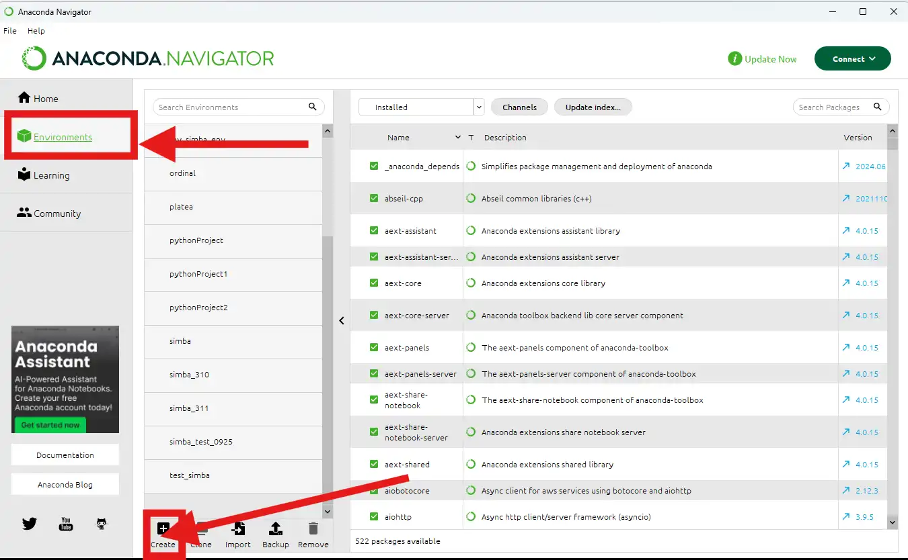
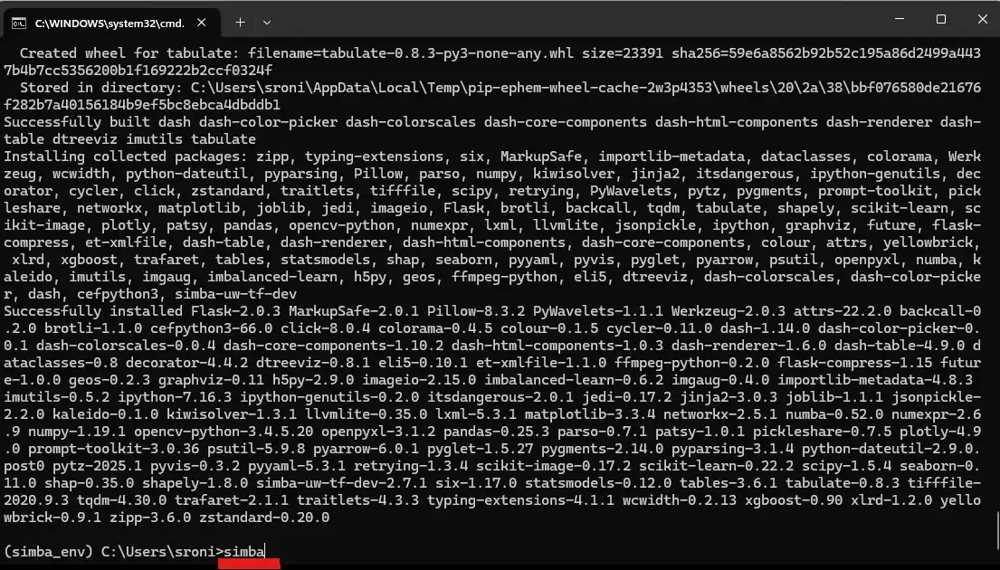

Install SimBA using Anaconda Navigator
======================================

First, install Anaconda Navigator on your system. You can download
Anaconda Navigator `HERE <https://www.anaconda.com/products/individual>`__. For Microsoft
Windows instructions, click `HERE <https://ultahost.com/knowledge-base/install-anaconda-on-windows/>`__
or `HERE <https://www.geeksforgeeks.org/how-to-install-anaconda-on-windows/>`__.
For Linux/macOS, click `HERE <https://docs.anaconda.com/navigator/install/>`__.

.. hint::
   If you need support and/or hit errors during the installation process, please each out to us by opening an
   `issue <https://github.com/sgoldenlab/simba/issues>`__ and sending us a messeage on `Gitter <https://app.gitter.im/#/room/#SimBA-Resource_community>`__.

.. hint::
   If you want to install SimBA using conda, but do not want to use the Anaconda Navigator, see `THESE <https://github.com/sgoldenlab/simba/blob/master/docs/installation_new.md>`__
   instructions.

.. hint::

   **Video Tutorial**
   
   For a visual walkthrough of this installation process, see our `Anaconda Navigator Installation Video <install_anaconda_navigator_video.html>`_.

**STEP 1**. Run Anaconda Navigator. The application looks like this:

.. image:: tutorials_rst/img/installation/anaconda_navigator_1.webp
  :width: 700
  :align: center

**STEP 2**. On the left, click on the ``Environments`` tab, followed by
the <kbdCreate button highlighted in this image:

**STEP 3**. Once clicked, its brings up teh below pop-up allowing you to
enter the name of your new python conda environment, and which python
version it should have. Here, we select python 3.6, and name the
environment ``simba_env``. Next, we click the Create button.

.. image:: tutorials_rst/img/installation/anaconda_navigator_3.webp
  :width: 700
  :align: center

**STEP 4**. Once complete, the new conda environment will be listed in
the graphical interface, together with any other environments you have
on your system:

.. image:: tutorials_rst/img/installation/anaconda_navigator_4.webp
  :width: 700
  :align: center

**STEP 5**. Each listed environment will have a little “play” button
associated with it. Once we click on the play button, we will see some
options. Go ahead and click on the ``Open Terminal`` option:

.. image:: tutorials_rst/img/installation/anaconda_navigator_5.webp
  :width: 700
  :align: center

**STEP 6**. This will bring up a terminal. In this terminal, you can see
the name of your conda environment as the pre-fix of your path,
highlighted with a red line on the left in the image below. Go ahead and
typw ``pip install simba-uw-tf-dev`` (highlighted with a red line on the
right in the image below) and hit Enter. After hitting Enter, SimBA will
install on your system and you can follow the progress in the terminal
window.

.. image:: tutorials_rst/img/installation/anaconda_navigator_6.webp
  :width: 700
  :align: center

**STEP 7**. Once installed, type ``simba`` in your ternimal window, and
hit Enter, and SimBA will launch.

.. hint::
   SimBA may take a little time to launch depending in your computer, but you should eventually see `THIS <https://github.com/sgoldenlab/simba/blob/master/simba/assets/img/splash_2024.mp4>`__
   splash screen followed by `THIS <https://github.com/sgoldenlab/simba/blob/master/images/main_gui_frm.webp>`__ main GUI window.

