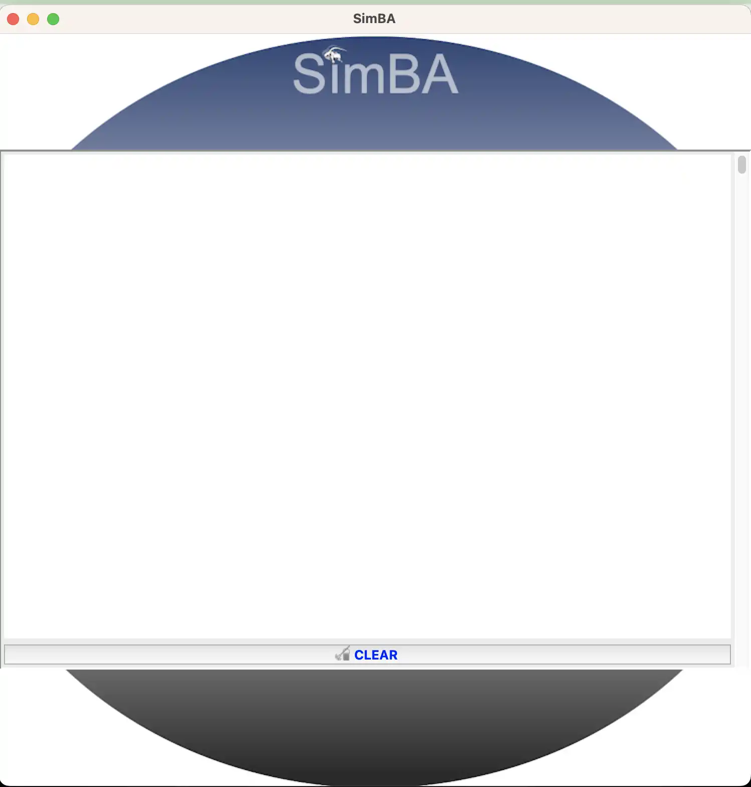

Install SimBA using Anaconda Navigator
======================================

First, install Anaconda Navigator on your system. You can download
Anaconda Navigator `HERE <https://www.anaconda.com/products/individual>`__. For Microsoft
Windows instructions, click `HERE <https://ultahost.com/knowledge-base/install-anaconda-on-windows/>`__
or `HERE <https://www.geeksforgeeks.org/how-to-install-anaconda-on-windows/>`__.
For Linux/macOS, click `HERE <https://docs.anaconda.com/navigator/install/>`__.

.. note::
   SimBA also relies on **FFmpeg** for video pre-processing, video editing, and visualization tools.
   It is strongly recommended that you install it before running SimBA — see the requirements on the
   :doc:`pip installation page <pip_installation>` for FFmpeg install instructions.

.. hint::

   - **Need help?** If you hit errors during installation, open an `issue <https://github.com/sgoldenlab/simba/issues>`__ or send us a message on `Gitter <https://app.gitter.im/#/room/#SimBA-Resource_community>`__.
   - **Prefer the command line?** To install with conda *without* the Anaconda Navigator GUI, see `THESE <https://github.com/sgoldenlab/simba/blob/master/docs/installation_new.md>`__ instructions.
   - **Video walkthrough:** For a visual guide to this process, see our `Anaconda Navigator Installation Video <install_anaconda_navigator_video.html>`_.

#. Run Anaconda Navigator. The application looks like this:

   .. image:: tutorials_rst/img/installation/anaconda_navigator_1.webp
     :alt: Anaconda Navigator home screen on first launch
     :width: 700
     :align: center

#. On the left, click on the ``Environments`` tab, followed by
   the **Create** button highlighted in this image:

   .. image:: tutorials_rst/img/installation/anaconda_navigator_2.webp
     :alt: Environments tab selected with the Create button highlighted
     :width: 700
     :align: center

#. Once clicked, it brings up the below pop-up allowing you to
   enter the name of your new python conda environment, and which python
   version it should have. Here, we select python 3.6, and name the
   environment ``simba_env``. Next, we click the Create button.

   .. image:: tutorials_rst/img/installation/anaconda_navigator_3.webp
     :alt: Create-environment dialog naming the environment simba_env with python 3.6 selected
     :width: 700
     :align: center

#. Once complete, the new conda environment will be listed in
   the graphical interface, together with any other environments you have
   on your system:

   .. image:: tutorials_rst/img/installation/anaconda_navigator_4.webp
     :alt: New simba_env environment listed among existing environments
     :width: 700
     :align: center

#. Each listed environment will have a little “play” button
   associated with it. Once we click on the play button, we will see some
   options. Go ahead and click on the ``Open Terminal`` option:

   .. image:: tutorials_rst/img/installation/anaconda_navigator_5.webp
     :alt: Environment play-button menu with the Open Terminal option selected
     :width: 700
     :align: center

#. This will bring up a terminal. In this terminal, you can see
   the name of your conda environment as the pre-fix of your path,
   highlighted with a red line on the left in the image below. Go ahead and
   type ``pip install simba-uw-tf-dev`` (highlighted with a red line on the
   right in the image below) and hit Enter. After hitting Enter, SimBA will
   install on your system and you can follow the progress in the terminal
   window.

   .. image:: tutorials_rst/img/installation/anaconda_navigator_6.webp
     :alt: Terminal showing the simba_env prefix and the pip install simba-uw-tf-dev command
     :width: 700
     :align: center

#. Once installed, type ``simba`` in your terminal window, and
   hit Enter, and SimBA will launch.

   .. image:: tutorials_rst/img/installation/anaconda_navigator_7.webp
     :alt: Terminal running the simba command to launch the application
     :width: 700
     :align: center

.. note::
   SimBA may take a little time to launch depending on your computer. Once it does, you should
   first see this splash screen:

.. video:: _static/img/splash_2024.mp4
   :width: 500px
   :align: center
   :autoplay:
   :loop:
   :muted:

Followed by the main SimBA GUI window:

