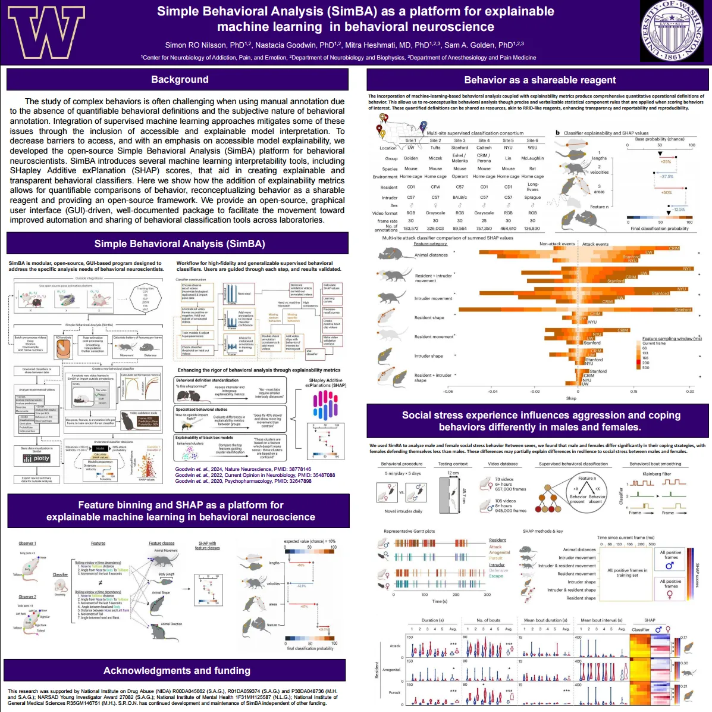
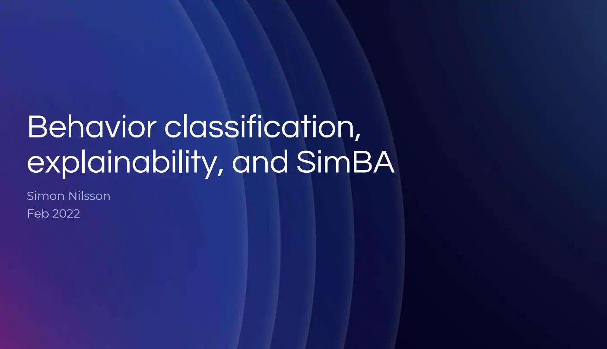
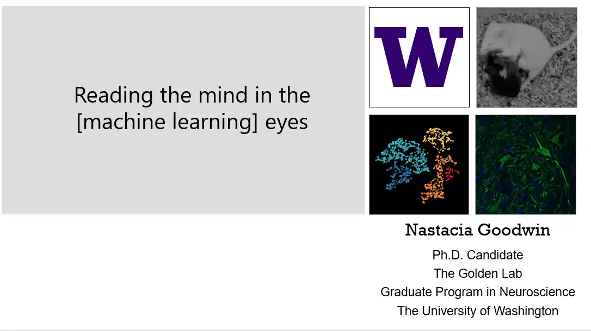
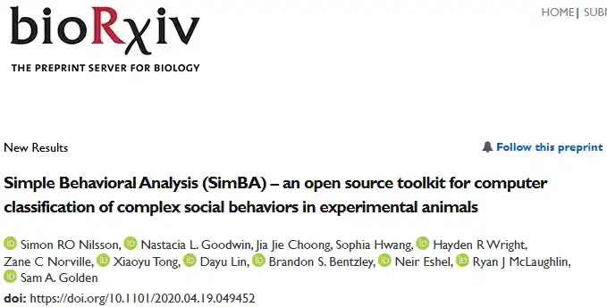
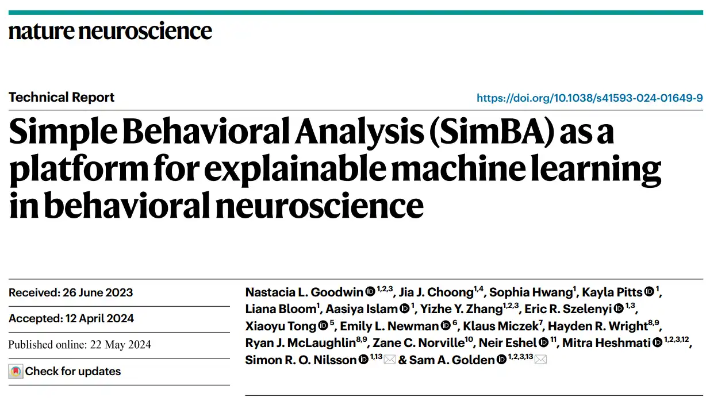
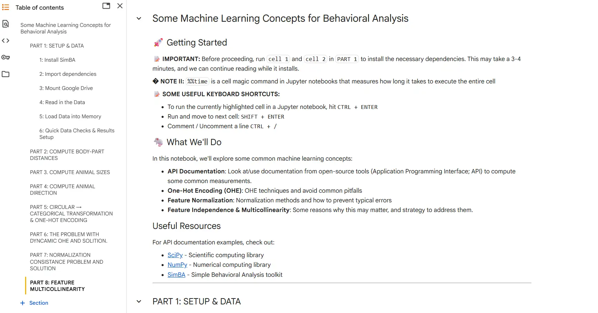
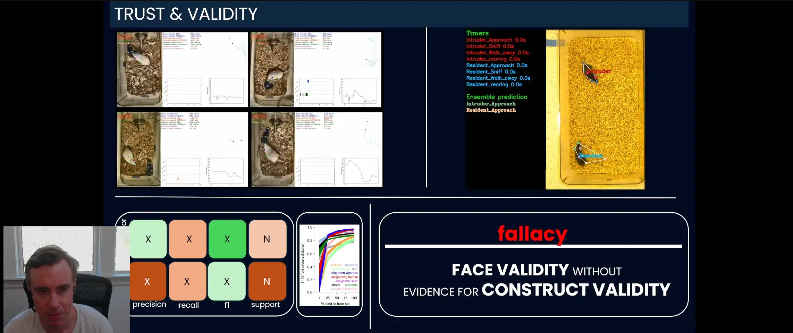
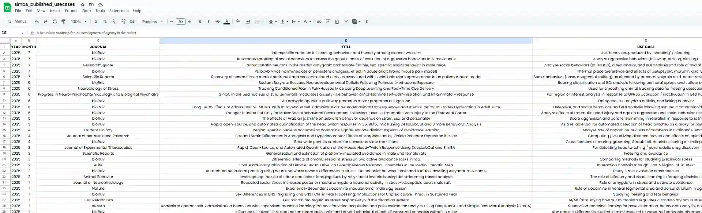

SimBA Presentations Workflow Documents
==========================================

.. contents::
   :local:
   :depth: 1

📈 Workflow Diagram
--------------------------
Visual overview of the SimBA analysis pipeline, from video input to classification output.

.. image:: ../_static/img/simba_workflow.png
   :width: 1000
   :align: center

:download:`📄 Download Workflow (PDF) <../_static/pdf/SimBA_workflow.pdf>`

🧠 SimBA Poster – GRC
--------------------------
Poster presented at the Gordon Research Conference summarizing SimBA’s capabilities and applications.

:download:`🖼️ Download Poster (PDF) <../_static/pdf/simba_poster_sam_2.pdf>`

🔍 SimBA Explainability Slides – Winter Brain
--------------------------
Slides introducing explainability features within SimBA, presented at Winter Brain Workshop.

:download:`📊 Download Explainability Presentation (PPTX) <https://osf.io/f9ws3/>`

🧬 SimBA Slides – SfN
--------------------------
Presentation from Society for Neuroscience (SfN) showcasing SimBA’s behavior classification use cases.

:download:`📊 Download SfN Presentation (PPTX) <https://osf.io/y9xj5/>`

📄 SimBA Preprint – bioRxiv
--------------------------
Original preprint detailing SimBA’s architecture, methods, and early validation examples.

:download:`📄 Download Preprint (PDF) <https://www.biorxiv.org/content/10.1101/2020.04.19.049452v2.full.pdf>`
:download:`💾 Backup PDF <../_static/pdf/Nilsson_etal_2024.pdf>`

📰 SimBA Paper – Nature Neuroscience
----------------------------------------------------
Peer-reviewed publication in *Nature Neuroscience* Describing SimBA.

:download:`🔗 Published PDF (Primary Link) <https://static1.squarespace.com/static/5b1b659871069912b3022368/t/666b3f0bae03e61fecdaab73/1718304536255/Goodwin+2024+NN.pdf>`
:download:`💾 Backup PDF <../_static/pdf/Goodwin_etal_2024.pdf>`

📓 SimBA API example notebook and ML concepts
----------------------------------------------------

:download:`🔗 Notebook <https://colab.research.google.com/drive/1x8oBKmSvndSakCsZvpITiNpQY-TDIsae#scrollTo=ETqBJrguDM6_>`

🎥 SimBA overview 2025/10
----------------------------------------------------

:download mp4:`🔗 OSF <https://osf.io/2uack>`
:youtube:`🔗 VIEW <https://www.youtube.com/watch?v=oEr2-3Cuhb0>`

🧪 SimBA Published Use Cases
----------------------------------------------------
Spreadsheet collection of real-world independent SimBA applications and validations.

.. warning::
   This list is not actively maintained and may be outdated.

🔗 `View Use Cases Spreadsheet (Google Sheets) <https://docs.google.com/spreadsheets/d/169enc3Am2KQKifxj1F9KEKKLbftpMhBlw49zjl-egsY/edit?usp=sharing>`__

