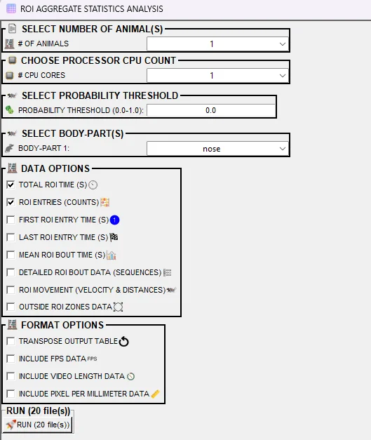
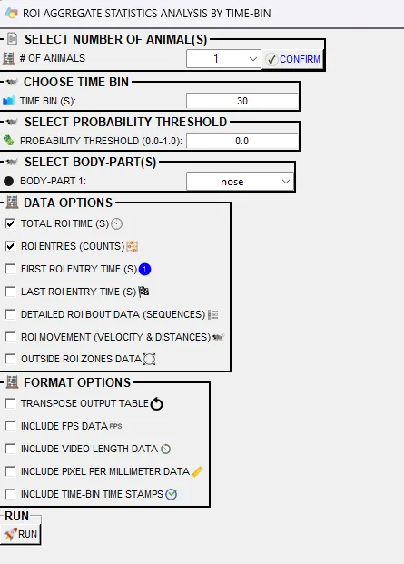
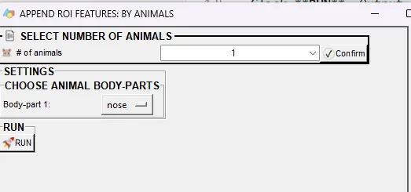
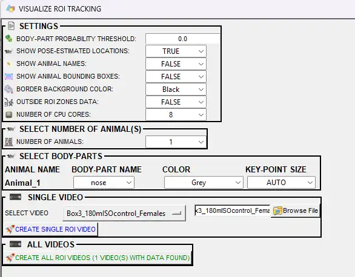
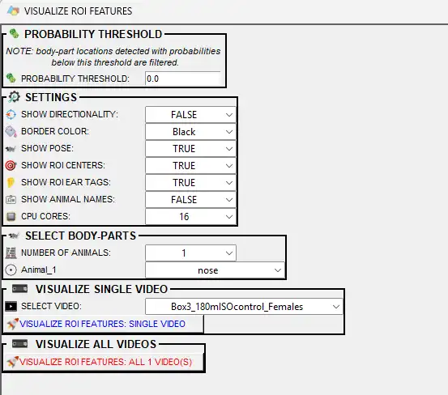
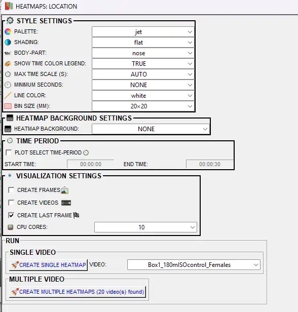

# 📍 Regions of Interest (ROIs) in SimBA

> [!IMPORTANT]
> **Scope of this tutorial:** This document is **not** about defining (drawing) ROIs. It is about **using** ROIs that you have **already defined elsewhere**—to analyze them, add ROI-based features for machine learning, create visualizations, and use misc functions in the ROI tab. How to draw ROIs (rectangles, circles, polygons, save, apply to videos) is covered in the [ROI tutorial: defining and drawing ROIs](https://github.com/sgoldenlab/simba/blob/master/docs/roi_tutorial_new_2025.md). Use that tutorial first to define your ROIs, then return here for analysis and features.

> [!IMPORTANT]
> **Prerequisite:** Before you can use any of the tools below, ROIs must already be drawn and saved in your project (in the **[ROI]** tab). If you have not defined ROIs yet, see the [ROI tutorial: defining and drawing ROIs](https://github.com/sgoldenlab/simba/blob/master/docs/roi_tutorial_new_2025.md).

> [!TIP]
> Many menu items and dialog options in SimBA have **tooltips**. Hover over a label or control to see a short description.

---

## 📖 Overview

This tutorial covers how to **use** ROIs that are already defined in your project. With those ROIs in place, you can:

- **Describe behavior** — How much time did each animal spend in each ROI? How many entries? Movement and velocity inside or outside ROIs?
- **Add features for machine learning** — Distances to ROI centers, inside/outside flags, cumulative time in ROI, and (if you track nose and ears) **directionality** towards ROIs. These can improve classifiers when **spatial location matters** for the behavior.
- **Visualize** — Overlay ROI shapes and counters on videos; plot ROI-based features (distances, directionality, inside/outside) over time.

> [!CAUTION]
> If spatial location is **irrelevant** for the behavior you are classifying, do **not** add ROI-based features to the model—they only add noise.

**Where to find these tools:** **[ROI]** tab in the main SimBA window. The tools described here (analysis and visualization) appear under **ANALYZE ROI DATA** and related sections. *Drawing* ROIs is done in the same tab but is documented in the [defining and drawing ROIs tutorial](https://github.com/sgoldenlab/simba/blob/master/docs/roi_tutorial_new_2025.md), not in this document.

---

## ✅ Before analyzing ROIs

To use ROI analysis or ROI-based features in SimBA, tracking data must be processed **up to and including outlier correction**. You need one pose file per video in:

`project_folder/csv/outlier_corrected_movement_location/`

**Steps to complete first:**

1. [Import videos to the project](Scenario1.md#step-2--import-videos-to-simba-project)
2. [Import tracking data](Scenario1.md#step-3--import-dlc-tracking-data-to-simba-project)
3. [Set video parameters](Scenario1.md#step-3--set-video-parameters) (including pixels per mm if you use distances)
4. [Run outlier correction](Scenario1.md#step-4--outlier-correction) (or explicitly skip it)

> [!NOTE]
> **ROI data as classifier features:** With ROIs already defined (in your project), SimBA can compute per-frame metrics beyond raw body-part coordinates: distance to ROI centers, inside/outside each ROI, cumulative time in each ROI, and (with nose + left/right ear) whether the animal is **directing towards** each ROI. These metrics are turned into features you can append to your feature set for training. Use them when the behavior you care about depends on **where** the animal is or where it is looking. See [Part 4: Generating features from ROI data](#part-4-generating-features-from-roi-data).

---

## 📑 Contents

- [Part 1: ROIs must be defined before using this tutorial](#part-1-rois-must-be-defined-before-using-this-tutorial)
- [Part 2: Analyzing ROI data (aggregates)](#part-2-analyzing-roi-data-aggregates)
- [Part 3: Analyzing ROI data by time-bin](#part-3-analyzing-roi-data-by-time-bin)
- [Part 4: Generating features from ROI data](#part-4-generating-features-from-roi-data)
- [Part 5: Visualizing ROI tracking](#part-5-visualizing-roi-tracking)
- [Part 6: Visualizing ROI features](#part-6-visualizing-roi-features)
- [Part 7: Miscellaneous ROI tools](#part-7-miscellaneous-roi-tools)
  - [Distances / velocity (aggregates and time-bins)](#distances--velocity-aggregates-and-time-bins)
  - [Path plots](#path-plots)
  - [Heatmaps (location)](#heatmaps-location)
  - [Directionality between animals](#directionality-between-animals)
  - [Directionality between body parts](#directionality-between-body-parts)
  - [Aggregate conditional statistics from boolean fields](#compute-aggregate-conditional-statistics-from-boolean-fields)
  - [Spontaneous alternation](#spontaneous-alternation)

---

## Part 1: ROIs must be defined before using this tutorial

**This tutorial does not explain how to define (draw) ROIs.** All of the analysis and visualization below assumes that ROIs are already drawn and saved in your project. If you have not done that yet, do it first:

- **Define ROIs elsewhere:** [roi_tutorial_new_2025.md](https://github.com/sgoldenlab/simba/blob/master/docs/roi_tutorial_new_2025.md) — step-by-step: video/frame selection, drawing rectangles/circles/polygons, shape attributes, saving, and applying ROIs from one video to another.

Once ROIs are defined and saved, use the sections below to analyze and visualize them.

---

## Part 2: Analyzing ROI data (aggregates)

**Where:** **[ROI]** tab → **ANALYZE ROI DATA: AGGREGATES**

Compute **descriptive statistics** for each animal and each ROI across entire videos (e.g. total time in ROI, number of entries, first/last entry time, mean bout length, movement and velocity in ROI).

  

**Prerequisites:** ROIs drawn and saved; pose data in `project_folder/csv/outlier_corrected_movement_location/`.

| Setting | Description |
|--------|-------------|
| **SELECT NUMBER OF ANIMAL(S)** | Frame header; below it, **# OF ANIMALS** dropdown lists 1 through the number of animals in your project. Choose how many animals to include in the analysis. |
| **CHOOSE PROCESSOR CPU COUNT** | **# CPU CORES** — Number of CPU cores to use (1 to max on your machine). Higher values speed up processing when you have many videos. |
| **PROBABILITY THRESHOLD (0.0–1.0)** | Minimum pose-estimation probability (0–1). Any frame where the selected body-part’s probability is **below** this value is excluded from ROI calculations. Use 0.0 to include all frames regardless of confidence. |
| **SELECT BODY-PART(S)** | One dropdown per animal (**BODY-PART 1**, **BODY-PART 2**, …). Choose which body-part is used to infer that animal’s location (e.g. Nose, Center of mass). |
| **DATA OPTIONS** | Checkboxes for which metrics to compute (see list below). At least one must be checked. |
| **FORMAT OPTIONS** | Checkboxes that control output layout and extra columns: **TRANSPOSE OUTPUT TABLE** (one row per video vs one row per measurement); **INCLUDE FPS DATA** (add video FPS to the table); **INCLUDE VIDEO LENGTH DATA** (add video duration in seconds); **INCLUDE PIXEL PER MILLIMETER DATA** (add calibration factor used for distances/velocity). |
| **RUN** | Button to start the analysis; label shows how many files will be processed. |

**Data options (checkboxes):**

- **TOTAL ROI TIME (S)** — Total time (seconds) each animal spends in each ROI per video.
- **ROI ENTRIES (COUNT)** — Number of times each animal enters each ROI per video.
- **FIRST ROI ENTRY TIME (S)** / **LAST ROI ENTRY TIME (S)** — Time (s) of first and last entry per ROI (or `None` if never entered).
- **MEAN ROI BOUT TIME (S)** — Mean duration (s) of each continuous stay in each ROI.
- **DETAILED ROI BOUT DATA (SEQUENCES)** — If checked, writes a CSV (e.g. `Detailed_ROI_bout_data_YYYYMMDDHHMMSS.csv`) in `project_folder/logs/` with frame numbers, timestamps, and duration of every entry/exit per ROI, animal, and video.
- **ROI MOVEMENT (VELOCITY AND DISTANCES)** — Total distance moved and average velocity per animal per ROI per video.
- **OUTSIDE ROI ZONES DATA** — Treat **all area not covered by any ROI** as one extra “ROI” and compute the same metrics for it.

> [!CAUTION]
> For reliable ROI statistics, use the best possible pose data: pre-process videos (e.g. remove segments without the animal), and use interpolation for missing pose data at import. See [Tools](Tools.md) (clip, crop, change FPS, and other video processing), [Process videos](https://github.com/sgoldenlab/simba/blob/master/docs/tutorial_process_videos.md), and [Scenario 1 — Import DLC tracking data](Scenario1.md#step-3--import-dlc-tracking-data-to-simba-project).

Click **RUN** and monitor progress in the SimBA terminal.

**Where output is saved:** `project_folder/logs/` — e.g. `ROI_descriptive statistics_YYYYMMDDHHMMSS.csv`. With **TRANSPOSE OUTPUT TABLE** unchecked, each row is a video/ROI/animal/measurement; with it checked, each row is a video and columns are measurements. If **DETAILED ROI BOUT DATA** was checked, an additional file (e.g. `Detailed_ROI_data_YYYYMMDDHHMMSS.csv`) lists every entry/exit with times and durations.

---

## Part 3: Analyzing ROI data by time-bin

**Where:** **[ROI]** tab → **ANALYZE ROI DATA: TIME-BINS**

Same metrics as Part 2, but **stratified by time-bins** (e.g. every 60 s or 15.5 s). Use this to ask: “How much time in each ROI in each minute?” or “How many entries per 15 s?”

  

**Prerequisites:** Same as Part 2 (ROIs drawn; outlier-corrected pose data).

| Setting | Description |
|--------|-------------|
| **SELECT NUMBER OF ANIMAL(S)** | **# OF ANIMALS** dropdown (1 through project animal count) plus **CONFIRM** button. After changing the number of animals, click **CONFIRM** to refresh the body-part and option frames below. |
| **CHOOSE TIME BIN** | **TIME BIN (S)** — Size of each time-bin in seconds (e.g. 60 for 1-minute bins, 15.5 for 15.5 s). Must be greater than 0. |
| **SELECT PROBABILITY THRESHOLD** | **PROBABILITY THRESHOLD (0.0–1.0)** — Same as in Part 2; frames with body-part probability below this are excluded. Use 0.0 to include all frames. |
| **SELECT BODY-PART(S)** | One dropdown per animal (**BODY-PART 1**, **BODY-PART 2**, …). Body-part(s) used to infer animal location for each time-bin. |
| **DATA OPTIONS** | Checkboxes: same metrics as Part 2 (total ROI time, entries, first/last entry time, detailed bout data, movement, outside ROI) but computed **per time-bin**. At least one must be checked. Note: **MEAN ROI BOUT TIME** is not available in time-bin analysis. |
| **FORMAT OPTIONS** | **TRANSPOSE OUTPUT TABLE** — One row per video vs per measurement. **INCLUDE FPS DATA** — Add video FPS. **INCLUDE VIDEO LENGTH DATA** — Add video duration (s). **INCLUDE PIXEL PER MILLIMETER DATA** — Add calibration factor. **INCLUDE TIME-BIN TIME STAMPS** — Add start time, start frame, end time, and end frame for each bin; if unchecked, bins are represented only by an index (0 to last). |
| **RUN** | Button to start the analysis. |

Click **RUN**. Output is saved in `project_folder/logs/` (e.g. `ROI_time_bins_140.0s_data_YYYYMMDDHHMMSS.csv`). Optional detailed bout file as in Part 2.

---

## Part 4: Generating features from ROI data

**Where:** **Extract features** tab (after [extracting base features](Scenario1.md#step-5--extract-features)).

Append **ROI-based features** to the existing feature set in `project_folder/csv/features_extracted/`. These can be used for training classifiers when behavior depends on spatial location.

**Per-frame features added:**

- **Inside/outside** — Boolean (TRUE/FALSE) for each body-part and each ROI.
- **Distance** — Millimeter distance from body-part to ROI center.
- **Cumulative time in ROI** — Time spent in each ROI up to the current frame.
- **Cumulative % session in ROI** — Percentage of total session time in each ROI up to the current frame.

If the project uses **nose, left ear, and right ear** (or equivalent), SimBA also computes **directionality towards each ROI** and can add:

- Boolean: animal **directing towards** the center of each ROI.
- Cumulative time and percentage of session spent directing towards each ROI.

**Two ways to append ROI features:**

1. **APPEND ROI DATA TO FEATURES: BY ANIMAL** — One body-part per animal. Use when you want one location proxy per animal (e.g. nose only).

  

2. **APPEND ROI DATA TO FEATURES: BY BODY-PARTS** — One or more body-parts, regardless of animal. Use when you need multiple ROI features (e.g. Animal_1 nose and Animal_2 tail-base distances to ROIs).

**By Animal:** In **SELECT NUMBER OF ANIMALS**, set **# of animals** and click **Confirm**. The **SETTINGS** frame then shows **Choose bodyparts** — one dropdown per animal (e.g. BODY-PART 1, BODY-PART 2). Pick the body-part that will represent each animal’s location for all ROI feature calculations. Click **Run**.

**By Body-Parts:** Set the **number of body-parts** (or animals) you want to use, then click **Confirm**. A **Choose bodyparts** section appears with one dropdown per selection; choose which body-parts to use (e.g. Animal_1 Nose, Animal_2 Tail_base). Each chosen body-part gets its own set of ROI-based feature columns. Click **Run**. New columns are added to each CSV in `project_folder/csv/features_extracted/`. A summary CSV (e.g. `ROI_features_summary_YYYYMMDDHHMMSS.csv`) is written to `project_folder/logs/` with mean distance to each ROI and (if directionality is computed) total time directing towards each ROI.

**Feature names and examples:** See [roi_features_examples.md](https://github.com/sgoldenlab/simba/blob/master/docs/roi_features_examples.md).

**Next steps:** [Label behavior](Scenario1.md#step-6--label-behavior) → [Train machine model](Scenario1.md#step-7--train-machine-model).

### Removing ROI features from the feature set

If you no longer need ROI columns in your feature files: click **REMOVE ROI FEATURES FROM FEATURE SET** in the **Extract features** tab. Confirm when prompted. SimBA removes ROI-based columns from each file in `project_folder/csv/features_extracted/` and places the removed columns in `project_folder/logs/ROI_data_(datetime)/` (you can delete that folder). ROI columns are identified from your project’s ROI definitions; if you renamed ROI shapes after creating features, SimBA may not find all ROI columns.

---

## Part 5: Visualizing ROI tracking

**Where:** **[ROI]** tab → **VISUALIZE ROI TRACKING**

Create videos that overlay your ROI shapes and **counters** (time spent in each ROI, number of entries) on the source video. Useful for presentations and sanity checks. This tool is also described in [Visualizations.md](Visualizations.md).

  

| Option | Description |
|--------|-------------|
| **SETTINGS** | |
| **BODY-PART PROBABILITY THRESHOLD** | Minimum pose-estimation probability (0–1). Frames where the selected body-part’s probability is below this are excluded from ROI and pose drawing. Use 0.0 to include all frames. |
| **SHOW POSE-ESTIMATED LOCATIONS** | **TRUE** — Draw pose keypoints (circles) on the video; **FALSE** — Do not draw. When TRUE, **COLOR** and **KEY-POINT SIZE** in the body-parts section become active. |
| **SHOW ANIMAL NAMES** | **TRUE** — Display animal labels (e.g. Animal_1) on the video; **FALSE** — Do not show names. |
| **SHOW ANIMAL BOUNDING BOXES** | **TRUE** — Draw bounding boxes around each animal; **FALSE** — Do not draw boxes. |
| **BORDER BACKGROUND COLOR** | Color of the border/frame around the video (e.g. Black, White). Affects the appearance of the output video frame. |
| **OUTSIDE ROI ZONES DATA** | **TRUE** — Treat all area not covered by any ROI as one combined zone and show time/entry counters for it; **FALSE** — Only show counters for user-drawn ROIs. |
| **NUMBER OF CPU CORES** | Dropdown from 1 to your machine’s core count. Higher values speed up rendering when creating multiple videos but may use more RAM. |
| **USE GPU** | **TRUE** / **FALSE** — Use NVIDIA GPU for video encoding if available; can speed up output. Disabled if no compatible GPU is detected. |
| **SELECT NUMBER OF ANIMAL(S)** | **NUMBER OF ANIMALS** dropdown — How many animals (and thus how many body-part rows) to show. Changing this refreshes the body-parts table below. |
| **SELECT BODY-PARTS** | One row per animal with: **ANIMAL NAME** (label), **BODY-PART NAME** (dropdown — which body-part represents that animal’s location), **COLOR** (dropdown — color of the pose circle for that animal; only used if SHOW POSE-ESTIMATED LOCATIONS is TRUE), **KEY-POINT SIZE** (dropdown — size of the pose circle, 1–100 or **AUTO** to scale from video resolution; only used if pose is shown). |
| **SINGLE VIDEO** | **SELECT VIDEO** — Dropdown (or file picker) of videos that have both ROI definitions and pose data. **CREATE SINGLE ROI VIDEO** — Generate the ROI tracking video for the selected video only. |
| **ALL VIDEOS** | **CREATE ALL ROI VIDEOS (N VIDEO(S) WITH DATA FOUND)** — Generate ROI tracking videos for every project video that has ROIs and pose data. |

Use **CREATE SINGLE ROI VIDEO** for one video or **CREATE ALL ROI VIDEOS** to process the full project.

**Where output is saved:** `project_folder/frames/output/ROI_analysis/`. Progress appears in the SimBA terminal.

  <video src="images/roi_tutorial/ROI_visualization_1.webm" width="500" controls style="border: 1px solid #999; border-radius: 4px; box-shadow: 0 10px 40px rgba(0,0,0,0.35); max-width: 100%;">Your browser does not support the video tag.</video>

  <video src="images/roi_tutorial/ROI_OF.webm" width="500" controls style="border: 1px solid #999; border-radius: 4px; box-shadow: 0 10px 40px rgba(0,0,0,0.35); max-width: 100%;">Your browser does not support the video tag.</video>

---

## Part 6: Visualizing ROI features

**Where:** **[ROI]** tab → **Visualize ROI features**

Visualize **continuous and boolean ROI features** (distances to ROIs, inside/outside, directing towards ROIs) over time on the video, rather than only the classic “time in ROI / entries” counters.

  

| Option | Description |
|--------|-------------|
| **PROBABILITY THRESHOLD** | Minimum pose-estimation probability (0–1). Body-part locations below this are filtered out. Use 0.0 to use all detections. Note text in the dialog explains that locations below the threshold are filtered. |
| **SETTINGS** | |
| **SHOW DIRECTIONALITY** | **FALSE** — Do not show directionality; **LINES** — Draw lines from animal to ROIs when directing; **FUNNEL** — Draw funnel-shaped directionality. Requires nose and left/right ear body-parts; option is disabled if directionality cannot be computed. |
| **BORDER COLOR** | Color of the border/shape outlines (e.g. Black, White). Affects ROI and overlay appearance. |
| **SHOW POSE** | **TRUE** — Draw pose-estimated body-parts on the video; **FALSE** — Do not draw. |
| **SHOW ROI CENTERS** | **TRUE** — Mark the center of each ROI with a circle; **FALSE** — Do not show centers. |
| **SHOW ROI EAR TAGS** | **TRUE** — Show [ear tags](https://github.com/sgoldenlab/simba/blob/master/docs/ROI_tutorial_new.md#shape-attributes) (orientation markers) for each ROI shape; **FALSE** — Do not show. |
| **SHOW ANIMAL NAMES** | **TRUE** — Display animal labels on the video; **FALSE** — Do not show. |
| **USE GPU** | **TRUE** / **FALSE** — Use NVIDIA GPU for encoding if available. Disabled if no compatible GPU is detected. |
| **CPU CORES** | Number of CPU cores (2 to max on your machine). Used when creating videos; higher values can speed up batch processing. |
| **SELECT BODY-PARTS** | **NUMBER OF ANIMALS** dropdown — How many animals to visualize. Below it, one dropdown per animal (e.g. Animal_1, Animal_2) to choose which body-part represents that animal’s location for ROI feature drawing. |
| **VISUALIZE SINGLE VIDEO** | **SELECT VIDEO** — Dropdown of all project videos that have ROI data. **VISUALIZE ROI FEATURES: SINGLE VIDEO** — Create the ROI-features visualization for the selected video only. |
| **VISUALIZE ALL VIDEOS** | **VISUALIZE ROI FEATURES: ALL N VIDEO(S)** — Create ROI-features videos for every video in the project. |

Directionality can be shown as **Funnels** or **Lines** (see example GIFs below).

**Where output is saved:** `project_folder/frames/output/ROI_features/`.

  <video src="images/roi_tutorial/Lines_directionality.webm" width="500" controls style="border: 1px solid #999; border-radius: 4px; box-shadow: 0 10px 40px rgba(0,0,0,0.35); max-width: 100%;">Your browser does not support the video tag.</video>

  <video src="images/roi_tutorial/ROI_directionality.webm" width="500" controls style="border: 1px solid #999; border-radius: 4px; box-shadow: 0 10px 40px rgba(0,0,0,0.35); max-width: 100%;">Your browser does not support the video tag.</video>

---

## Part 7: Miscellaneous ROI tools

The **[ROI]** tab has a right-hand frame **OTHER ANALYSES / VISUALIZATIONS** that contains the tools in this section. Many of them **do not use user-drawn ROIs**: they work on pose data (distances, velocity, path trajectories) or on a grid-based view of the arena. They are grouped here because they appear in the same tab; for full reference see [Visualizations.md](Visualizations.md).

---

### Distances / velocity (aggregates and time-bins)

**Where:** **[ROI]** tab → **OTHER ANALYSES / VISUALIZATIONS** → **ANALYZE MOVEMENT / VELOCITY: AGGREGATES** or **ANALYZE MOVEMENT / VELOCITY: TIME-BINS**

Compute **total distance moved** and **average velocity** (e.g. cm, cm/s) per animal per video from pose data. No ROIs required—SimBA uses the body-part(s) you choose (e.g. nose, center of mass) to compute movement. **Aggregates** gives one set of statistics per video; **Time-bins** gives the same metrics in user-defined time windows (e.g. per minute) and can optionally create line plots.

**Prerequisites:** Pose data in `project_folder/csv/outlier_corrected_movement_location/`; video parameters (including pixels per mm for real-world distances) set.

**Aggregates options:**

| Option | Description |
|--------|-------------|
| **# OF ANIMALS** | Number of animals to analyze (1 to project max). Determines how many body-part dropdowns appear. |
| **THRESHOLD** | Minimum pose-estimation confidence (0.0–1.0). Only frames where body-part detection exceeds this value are used. Use 0.0 to include all frames. |
| **SELECT BODY-PARTS** | For each animal, choose which body part to track (e.g. Nose, Center, Tail_base, **Animal N CENTER OF GRAVITY**). |
| **DISTANCE (CM)** | If checked, calculates total distance traveled (cm) per animal per video. |
| **VELOCITY (CM/S)** | If checked, calculates average velocity (cm/s) per animal per video. At least one of DISTANCE or VELOCITY must be checked. |
| **TRANSPOSE OUTPUT CSV** | If checked, each video is one row; animal–body-part–measurement combinations are columns. |

**Time-bins options:**

| Option | Description |
|--------|-------------|
| **# OF ANIMALS** | Same as aggregates. |
| **CREATE PLOTS** | If checked, generates line plots (distance or velocity vs time bin) per video per body part. |
| **TIME BIN SIZE (S)** | Duration of each bin in seconds (e.g. 60 for 1-minute bins). |
| **SELECT BODY-PARTS** | Same as aggregates. |
| **DISTANCE (CM)** / **VELOCITY (CM/S)** | Same as aggregates, but computed **per time bin**. |
| **TRANSPOSE OUTPUT CSV** | If checked, time bins become columns. |
| **INCLUDE TIME-STAMPS** | If checked, adds START TIME and END TIME (HH:MM:SS) for each bin. |

**Where output is saved:** `project_folder/logs/` (e.g. `Movement_log_YYYYMMDDHHMMSS.csv` for aggregates; `Time_bins_60s_movement_results_YYYYMMDD_HHMMSS.csv` for time-bins). If **CREATE PLOTS** is checked, line plots go to `project_folder/logs/time_bin_movement_plots_YYYYMMDD_HHMMSS/`.

Full step-by-step: [Scenario 2 — Analyze distances/velocity](Scenario2.md#2-analyze-distances--velocity-aggregates) (aggregates) and [Scenario 2 — Time-bins](Scenario2.md#4-analyze-distances--velocity-time-bins) (time-bins).

---

### Path plots

**Where:** **[ROI]** tab → **OTHER ANALYSES / VISUALIZATIONS** → **CREATE PATH PLOTS**

Create a **simple path plot** (trajectory of one body-part over time) for a single video. Does not use ROIs; uses pose data only. Ideal for a quick “where did the animal move?” visualization with minimal options. **More complex path plots** (multiple animals, classification markers, ROI overlays, time-segment controls, batch processing) can be created via **CREATE PATH PLOTS** in the **[Visualizations]** tab; see [Visualizations.md — Visualize path plots](Visualizations.md#visualize-path-plots) and [Scenario 2 — Part 5](Scenario2.md#part-5--visualize-results).

**Prerequisites:** Pose data in `project_folder/csv/outlier_corrected_movement_location/`; video parameters set.

| Option | Description |
|--------|-------------|
| **VIDEO** | Which video to plot. Dropdown lists videos that have data in `project_folder/csv/outlier_corrected_movement_location/`. |
| **BODY-PART** | Single body part to trace (e.g. Nose, Center, Tail_base). |
| **BACKGROUND COLOR** | Background color (e.g. White, Black). |
| **LINE COLOR** | Color of the path line (e.g. Red, Blue). |
| **LINE THICKNESS** | 1–10 pixels. |
| **CIRCLE SIZE** | Size of circles marking points along the path (1–10). |
| **LAST FRAME ONLY** | **TRUE** = save one .png with the full path. **FALSE** = save an .mp4 where the path builds frame by frame. |

Click <kbd>RUN</kbd> to generate the path plot.

**Where output is saved:** `project_folder/frames/output/path_plots/`. Output: `{video_name}_simple_path_plot.png` (if LAST FRAME ONLY) or `{video_name}_simple_path_plot.mp4`.

Also available under **Tools** → **Create path plot** (no project required). Full description: [Visualizations.md — Create path plots (ROI tab)](Visualizations.md#create-path-plots-roi-tab), [Tools.md — Create path plot](Tools.md#create-path-plot).

---

### Heatmaps (location)

**Where:** **[ROI]** tab → **OTHER ANALYSES / VISUALIZATIONS** → **CREATE LOCATION HEATMAPS**

Generate **location heatmaps** (video or image) showing time spent in different **regions of the arena**. This tool does **not** use user-drawn ROIs; it divides the frame into a grid of bins (e.g. 80×80 mm) and colors regions by time spent there. Useful for “where did the animal spend most of its time?” overviews. Also described in [Visualizations.md — Heatmap locations](Visualizations.md#visualize-heatmap-locations-roi-tab).

  

| Option | Description |
|--------|-------------|
| **STYLE SETTINGS** | |
| **PALETTE** | Colormap for the heatmap (e.g. jet, viridis). Determines how time spent is mapped to color. See [visualization tutorials](https://github.com/sgoldenlab/simba/blob/master/docs/tutorial.md#heatmap) for examples. |
| **SHADING** | **Gouraud** or **Flat** — Smooth (gradient) vs flat shading between bins. See [classifier heatmap docs](Scenario2.md#visualizing-classification-heatmaps) for comparison. |
| **BODY-PART** | Single body-part used to represent the animal’s location (e.g. Nose, Center of mass). Time in each bin is based on this body-part’s coordinates. |
| **MAX TIME SCALE (S)** | Dropdown: **AUTO** or values in seconds (e.g. 5–100 in steps). The value (or auto-computed max) is the time in seconds that maps to the strongest color on the legend. Use **AUTO** to let SimBA use the maximum time spent in any single bin across the video(s). |
| **BIN SIZE (MM)** | Size of each square spatial bin in mm (e.g. 20×20, 80×80). Smaller bins give finer spatial detail but noisier maps; larger bins give smoother, coarser maps. |
| **SHOW TIME COLOR LEGEND** | **TRUE** — Show the color bar that explains the time scale; **FALSE** — Omit the legend. |
| **MINIMUM SECONDS** | **NONE** or a number of seconds (e.g. 5–495 in steps). If set, only bins where the animal spent at least this many seconds are colored; others can be treated differently. **NONE** means no minimum. |
| **LINE COLOR** | Color of lines or borders between bins (e.g. White, Black, NONE). **NONE** omits bin outlines. |
| **HEATMAP BACKGROUND SETTINGS** | |
| **HEATMAP BACKGROUND** | **NONE** — Heatmap only; **VIDEO** — Overlay heatmap on the full video; **VIDEO FRAME** — Overlay on a single video frame. Affects how the heatmap is composited. |
| **TIME PERIOD** | **PLOT SELECT TIME-PERIOD** — If checked, **START TIME** and **END TIME** (HH:MM:SS) become active; only the selected time window is used to build the heatmap. If unchecked, the entire video is used. |
| **VISUALIZATION SETTINGS** | |
| **CPU CORES** | Number of CPU cores (2 to max minus one). Used for multiprocessing when creating multiple heatmaps; higher values speed up batch runs. |
| **CREATE FRAMES** | If checked, one PNG per frame per video (can create very many files for long videos). |
| **CREATE VIDEOS** | If checked, one heatmap video per input video (heatmap builds over time). |
| **CREATE LAST FRAME** | If checked, one cumulative heatmap image per video (full-session summary). At least one of CREATE FRAMES, CREATE VIDEOS, or CREATE LAST FRAME should be checked. |
| **RUN** | |
| **SINGLE VIDEO** | **VIDEO** dropdown — Choose one video from the project. **CREATE SINGLE HEATMAP** — Generate heatmap(s) for that video only. |
| **MULTIPLE VIDEO** | **CREATE MULTIPLE HEATMAPS (N video(s) found)** — Generate heatmaps for every video that has pose data in `project_folder/csv/outlier_corrected_movement_location/`. |

**Where output is saved:** `project_folder/frames/output/heatmaps_locations/`.

  <video src="images/visualizations/location_heatmap.webm" width="500" controls style="border: 1px solid #999; border-radius: 4px; box-shadow: 0 10px 40px rgba(0,0,0,0.35); max-width: 100%;">Your browser does not support the video tag.</video>

  

---

### Directionality between animals

**Where:** **[ROI]** tab → **OTHER ANALYSES / VISUALIZATIONS** → **ANALYZE DIRECTIONALITY BETWEEN ANIMALS** / **VISUALIZE DIRECTIONALITY BETWEEN ANIMALS**

Analyze and visualize **one animal directing towards another animal** (head/gaze direction inferred from nose and ears; no ROIs required). SimBA uses nose and left/right ear coordinates to estimate “line of sight”—a proxy for gaze, not actual gaze tracking. Run **ANALYZE DIRECTIONALITY** first to generate directionality data; then use **VISUALIZE DIRECTIONALITY** to overlay directing states on video.

**Prerequisites:** At least two animals; pose configuration must include **nose**, **left ear**, and **right ear** (or equivalent) for each animal; pose data in `project_folder/csv/outlier_corrected_movement_location/`.

**Analysis output options:** Boolean tables (per-frame 0/1 per observing→observed body-part), detailed summary tables (pixel coordinates of eye and observed body-part), aggregate statistics (seconds each animal directed towards each other), and option to append boolean tables to features for machine learning.

**Visualization options:**

| Option | Description |
|--------|-------------|
| **LEFT EAR / RIGHT EAR / NOSE** | Body parts used to estimate head direction. Must be unique. |
| **SHOW POSE TRACKING** | Draw pose-estimated body parts on the video. |
| **HIGHLIGHT DIRECTION END-POINTS** | Emphasize observed body parts with salient circles. |
| **SHOW ANIMAL NAMES** | Display animal labels. |
| **DIRECTION COLOR** | Color of direction lines. **Random** = auto-assigned. |
| **POSE CIRCLE SIZE** | Size of pose dots. AUTO or 1–10. |
| **LINE THICKNESS** | Thickness of direction lines. AUTO or 1–10. |
| **LINE OPACITY** | Transparency of direction lines (0.1–1.0). |
| **CPU core count** | Cores for multiprocessing. |

**Where output is saved:** Analysis → `project_folder/logs/` and `project_folder/logs/directionality_dataframes/`. Visualization → `project_folder/frames/output/Directing_animals/`.

Also described in [Visualizations.md — Directionality](Visualizations.md#visualize-directionality-roi-tab). Full tutorial: [Directionality between animals](https://github.com/sgoldenlab/simba/blob/master/docs/directionality_between_animals.md).

---

### Directionality between body parts

**Where:** **[ROI]** tab → **OTHER ANALYSES / VISUALIZATIONS** → **ANALYZE DIRECTIONALITY BETWEEN BODY PARTS** / **VISUALIZE DIRECTIONALITY BETWEEN BODY PARTS**

Analyze and visualize **one animal directing towards a specific body-part** (e.g. Animal 1 nose directing towards Animal 2 tail-base). SimBA uses nose and left/right ear to estimate head direction (same logic as directionality between animals). Does not use user-drawn ROIs. You choose **one body part per animal** that all animals will be evaluated as “directing towards.” Run **ANALYZE DIRECTIONALITY** first; then use **VISUALIZE DIRECTIONALITY** to overlay directing states on video.

**Prerequisites:** Pose configuration must include **nose**, **left ear**, and **right ear** (or equivalent) for each animal; pose data in `project_folder/csv/outlier_corrected_movement_location/`.

**Analysis options (ANALYZE DIRECTIONALITY BETWEEN BODY PARTS):**

| Option | Description |
|--------|-------------|
| **Choose {Animal} body part** | For each animal, select the **target body part** that the others will be evaluated for directing towards (e.g. Nose, Tail_base). This can be a body part of the same animal or another animal. |

Click <kbd>RUN ANALYSIS</kbd> to run. Output: per-frame boolean tables and summary statistics in `project_folder/logs/directionality_dataframes/`.

**Visualization options (VISUALIZE DIRECTIONALITY BETWEEN BODY PARTS):**

| Option | Description |
|--------|-------------|
| **Show pose-estimated body-parts** | Draw pose dots on the video. |
| **Polyfill direction lines** | **TRUE** = draw a filled polygon between all direction end-points instead of individual lines; **FALSE** = draw separate lines for each directing relationship. |
| **Direction color** | Color of direction lines (e.g. Red, Blue). **Random** = auto-assigned per relationship. |
| **Pose circle size** | Size of pose dots (1–10). |
| **Line thickness** | Thickness of direction lines (1–10). |
| **SINGLE VIDEO** | Choose one video from the dropdown; click **Create single video**. |
| **MULTIPLE VIDEO** | Click **Create multiple videos** to process all videos that have pose data. |

**Where output is saved:** Analysis → `project_folder/logs/directionality_dataframes/`. Visualization → `project_folder/frames/output/Body_part_directing_animals/`.

  <video src="images/visualizations/visualize_directionality_1.webm" width="500" controls style="border: 1px solid #999; border-radius: 4px; box-shadow: 0 10px 40px rgba(0,0,0,0.35); max-width: 100%;">Your browser does not support the video tag.</video>

---

### Compute aggregate conditional statistics from boolean fields

**Where:** **[ROI]** tab → **OTHER ANALYSES / VISUALIZATIONS** → **AGGREGATE BOOLEAN CONDITIONAL STATISTICS**

Compute **conditional aggregate statistics** over boolean fields (0/1), e.g. “For how much time and how many frames was Animal 1 inside Rectangle_1 **and** directing towards Polygon_1, **while** Animal 2 was outside Rectangle_1 and directing towards Polygon_1?”

**Prerequisites:** ROI features must already be [appended](#part-4-generating-features-from-roi-data). The project must have files in `project_folder/csv/features_extracted/` containing at least two boolean fields. Otherwise the button shows an error.

  

| Option | Description |
|--------|-------------|
| **CONDITIONAL RULES #** | **# RULES** — Dropdown from 2 to 20. Select how many simultaneous conditions (rules) you want. The **CONDITIONAL RULES** table below updates to show that many rows. |
| **CONDITIONAL RULES** | Table with one row per rule. **RULE #** — Row index (1, 2, …). **BEHAVIOR** — Dropdown of all boolean columns from your feature files in `project_folder/csv/features_extracted/` (e.g. “Simon inside Rectangle_1”, “Simon directing towards Polygon_1”). Each behavior can appear in only one row. **STATUS** — **TRUE** or **FALSE**; whether that behavior must be present (TRUE) or absent (FALSE) for the condition to hold. The tool then computes, per video, for how much time and how many frames **all** selected rules were satisfied at once. |
| **RUN** | Runs the calculation. Output CSV (e.g. `Conditional_aggregate_statistics_YYYYMMDDHHMMSS.csv`) is saved in `project_folder/logs/`: one row per video; one column per rule (value TRUE/FALSE indicating whether that rule was included); last two columns are **TIME** (seconds) and **frame count** the combined condition was satisfied. |

  

---

### Spontaneous alternation

**Where:** **[ROI]** tab → **OTHER ANALYSES / VISUALIZATIONS** → **SPONTANEOUS ALTERNATION**

Compute **spontaneous alternation** (e.g. Y-maze) from pose data and **user-defined ROIs**: one ROI for the maze center and three (or more) ROIs for the arms. SimBA draws a convex hull around the animal’s body parts, detects arm entries/exits based on that polygon, and computes alternation and error counts. Requires a **single-animal** project and outlier-corrected pose data.

**Prerequisites:** Single-animal project; pose data in `project_folder/csv/outlier_corrected_movement_location/`; at least four ROIs drawn (one center, three arms).

| Option | Description |
|--------|-------------|
| **ARM DEFINITIONS** | |
| **MAZE ARM 1 / MAZE ARM 2 / MAZE ARM 3** | Dropdowns to select which ROI names represent the three maze arms. |
| **MAZE CENTER** | Dropdown to select which ROI represents the center of the maze. |
| **ANIMAL SETTINGS** | |
| **POSE ESTIMATION THRESHOLD** | Minimum confidence (0–1) for body-part detections to be used. **0** = use all detections; higher values filter out low-confidence points. |
| **ANIMAL AREA (%)** | Percent of the convex hull polygon that must enter or exit an arm/center for it to count as an entry or exit. Smaller values → more entries/exits. |
| **ANIMAL BUFFER (MM)** | Extra margin (in mm) added around the convex hull. Useful if pose estimation misses outer body parts. |
| **SAVE DETAILED DATA** | **TRUE** = save per-video CSV files with frame-by-frame alternation sequences, arm entry sequences, and detailed error/alternation counts. **FALSE** = save only the aggregate summary. |
| **VERBOSE** | **TRUE** = print detailed progress; **FALSE** = minimal output. |
| **RUN** | |
| **RUN ANALYSIS** | Runs the alternation calculation on all videos with pose data. Output CSV (e.g. `spontaneous_alternation_YYYYMMDDHHMMSS.csv`) in `project_folder/logs/`. |
| **RUN VISUALIZATION** | **VIDEO** dropdown — Choose one video. **CREATE VIDEO** — Overlay convex hull, arm ROIs, current 3-arm sequence, and alternation/error counts on the video. Saved to `project_folder/frames/output/spontanous_alternation/`. |

**Output columns (aggregate):** alternation rate, alternation count, same-arm return error count, alternate arm return error count. With **SAVE DETAILED DATA**, additional CSVs document frame-level sequences.

Full guide: [Spontaneous alternation in SimBA](https://github.com/sgoldenlab/simba/blob/master/docs/spontaneous_alternation.md).

  <video src="images/roi_tutorial/SpontaneousAlternationsPlotter.webm" width="500" controls style="border: 1px solid #999; border-radius: 4px; box-shadow: 0 10px 40px rgba(0,0,0,0.35); max-width: 100%;">Your browser does not support the video tag.</video>

---

## 📚 Related documentation

- [Scenario 1](Scenario1.md) — Project setup, video parameters, outlier correction, feature extraction, labeling, training
- [Scenario 2](Scenario2.md) — Running classifiers and visualizations
- [Visualizations.md](Visualizations.md) — ROI tracking, ROI features, location heatmaps, directionality (full reference)
- [Tools.md](Tools.md) — Convert ROI definitions (H5 ↔ CSV), other tools
- [roi_tutorial_new_2025.md](https://github.com/sgoldenlab/simba/blob/master/docs/roi_tutorial_new_2025.md) — Defining and drawing ROIs (full guide)
- [roi_features_examples.md](https://github.com/sgoldenlab/simba/blob/master/docs/roi_features_examples.md) — ROI feature names and examples
- [directionality_between_animals.md](https://github.com/sgoldenlab/simba/blob/master/docs/directionality_between_animals.md) — Directionality between animals (full tutorial)
- [spontaneous_alternation.md](https://github.com/sgoldenlab/simba/blob/master/docs/spontaneous_alternation.md) — Spontaneous alternation (Y-maze)

---

## 📚 API Reference

Classes, methods, and modules used in this workflow and their Read the Docs links:

| Workflow step | Class or module | Read the Docs link |
|---------------|-----------------|--------------------|
| Load project, config | `ConfigReader` | [simba.config_reader](https://simba-uw-tf-dev.readthedocs.io/en/latest/simba.config_reader.html) |
| Analyze ROI data (aggregates) | `ROIAggregateStatisticsAnalyzer`, `ROIAggregateStatisticsAnalyzerMultiprocess` | [simba.roi_tools](https://simba-uw-tf-dev.readthedocs.io/en/latest/simba.roi_tools.html) |
| Analyze ROI data by time-bin | `ROITimebinAnalyzer`, `ROITimebinCalculator` | [simba.roi_tools](https://simba-uw-tf-dev.readthedocs.io/en/latest/simba.roi_tools.html) |
| Generate ROI features | `ROIFeatureCreator` | [simba.roi_tools](https://simba-uw-tf-dev.readthedocs.io/en/latest/simba.roi_tools.html) |
| Append ROI features to features | `AppendROIFeaturesByAnimalPopUp`, `AppendROIFeaturesByBodyPartPopUp` | [simba.ui](https://simba-uw-tf-dev.readthedocs.io/en/latest/simba.ui.html) |
| Visualize ROI tracking | `ROIPlotter`, `ROIPlotMultiprocess` | [simba.plotting](https://simba-uw-tf-dev.readthedocs.io/en/latest/simba.plotting.html) |
| Visualize ROI features | `ROIfeatureVisualizer`, `ROIfeatureVisualizerMultiprocess` | [simba.plotting](https://simba-uw-tf-dev.readthedocs.io/en/latest/simba.plotting.html) |
| Analyze distances/velocity (aggregates) | `MovementCalculator` | [simba.data_processors](https://simba-uw-tf-dev.readthedocs.io/en/latest/simba.data_processors.html) |
| Analyze distances/velocity (time-bins) | `TimeBinsMovementCalculator`, `TimeBinsMovementCalculatorMultiprocess` | [simba.data_processors](https://simba-uw-tf-dev.readthedocs.io/en/latest/simba.data_processors.html) |
| Create path plots (ROI tab) | `EzPathPlot` | [simba.plotting](https://simba-uw-tf-dev.readthedocs.io/en/latest/simba.plotting.html) |
| Create location heatmaps | `HeatmapperLocationSingleCore`, `HeatMapperLocationMultiprocess` | [simba.plotting](https://simba-uw-tf-dev.readthedocs.io/en/latest/simba.plotting.html) |
| Analyze directionality between animals | `DirectingOtherAnimalsAnalyzer` | [simba.data_processors](https://simba-uw-tf-dev.readthedocs.io/en/latest/simba.data_processors.html) |
| Visualize directionality between animals | `DirectingOtherAnimalsVisualizer`, `DirectingOtherAnimalsVisualizerMultiprocess` | [simba.plotting](https://simba-uw-tf-dev.readthedocs.io/en/latest/simba.plotting.html) |
| Analyze directionality between body parts | `DirectingAnimalsToBodyPartAnalyzer` | [simba.data_processors](https://simba-uw-tf-dev.readthedocs.io/en/latest/simba.data_processors.html) |
| Visualize directionality between body parts | `DirectingAnimalsToBodyPartVisualizer` | [simba.plotting](https://simba-uw-tf-dev.readthedocs.io/en/latest/simba.plotting.html) |
| Aggregate boolean conditional statistics | `BooleanConditionalCalculator` | [simba.data_processors](https://simba-uw-tf-dev.readthedocs.io/en/latest/simba.data_processors.html) |
| Spontaneous alternation | `SpontaneousAlternationCalculator`, `SpontaneousAlternationsPlotter` | [simba.data_processors](https://simba-uw-tf-dev.readthedocs.io/en/latest/simba.data_processors.html), [simba.plotting](https://simba-uw-tf-dev.readthedocs.io/en/latest/simba.plotting.html) |

Full API index: [SimBA API Reference](https://simba-uw-tf-dev.readthedocs.io/en/latest/api.html)

---

*Author: [Simon N](https://github.com/sronilsson)*
