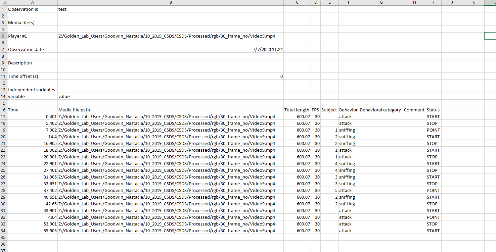
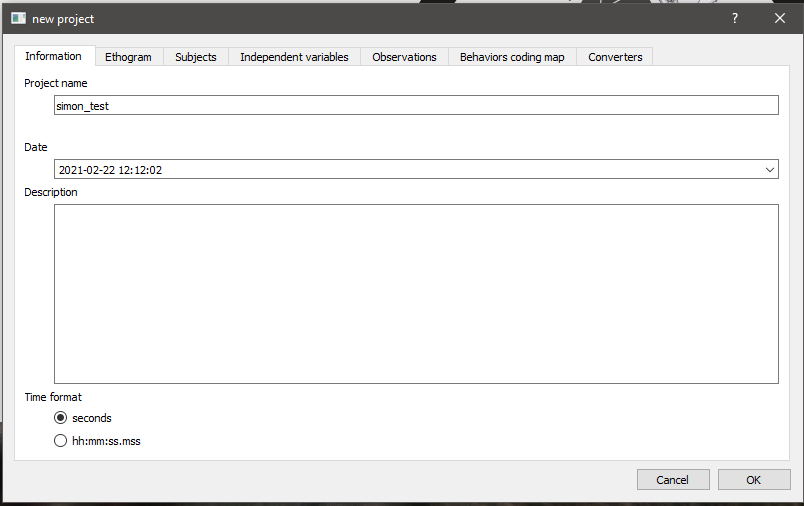

Exporting BORIS annotations for SimBA
====================================

BORIS has options for saving human annotations in various formats - and
we need to make sure that the BORIS output files are saved in a format
that is compatible with SimBA. The screenshot below shows the format of
the tabular BORIS CSV format that SimBA expects:

To generate BORIS data in this file format, begin by creating a new
project with **seconds** time format:

Next, create a new observation in BORIS:

.. image:: img/boris/boris_3.png
  :width: 1000
  :align: center

When you set up your ethogram, name your behaviors the same way as they
are named in your simba project. If that is not possible (because
historical data), rename your simba classifier names to match the names
in the BORIS annotations. We need a way of knowing what behaviors in
SimBA matches the behaviors in Boris.

.. image:: img/boris/boris_4.png
  :width: 1000
  :align: center

Once done, export your annotations as **Tabular events**:

.. image:: img/boris/boris_5.png
  :width: 1000
  :align: center

Now you have your data in the SimBA-required format - head to the
tutorial on `Appending third-party annotations in
SimBA <https://github.com/sgoldenlab/simba/edit/master/docs/third_party_annot.md>`__
to learn how to append it to your feature and pose data.

Author `Simon N <https://github.com/sronilsson>`__
