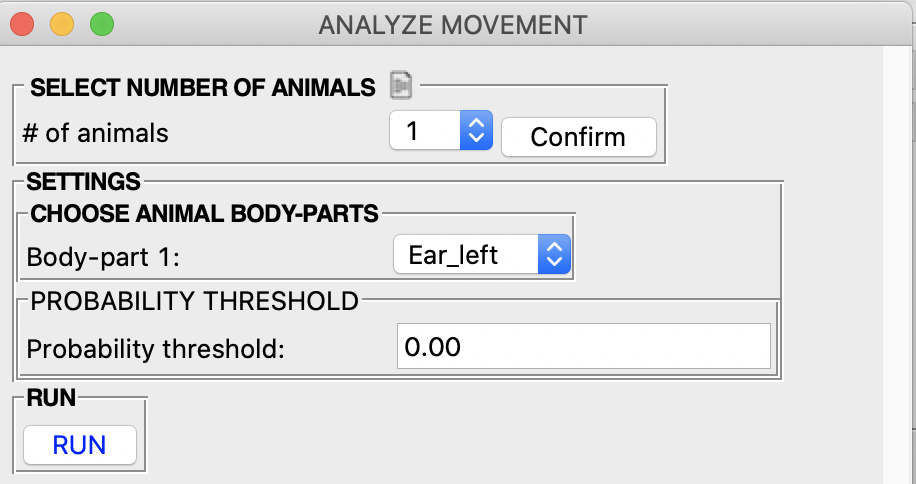
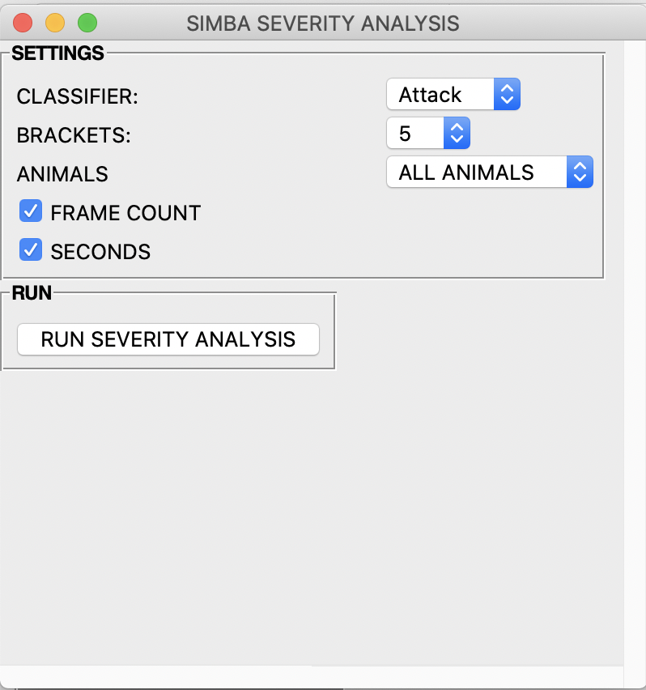
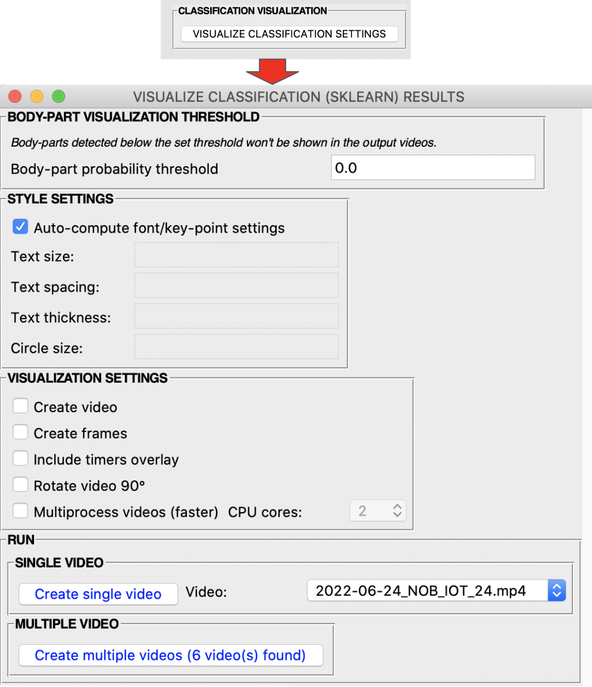
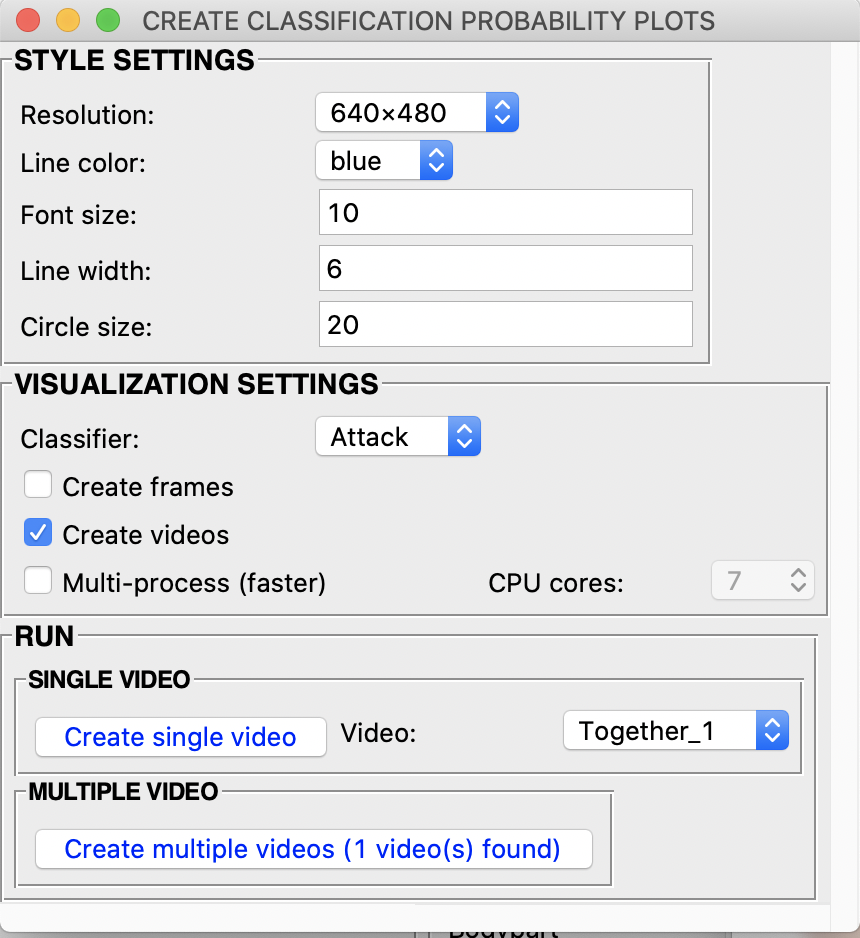
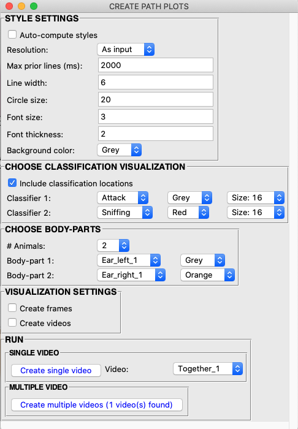
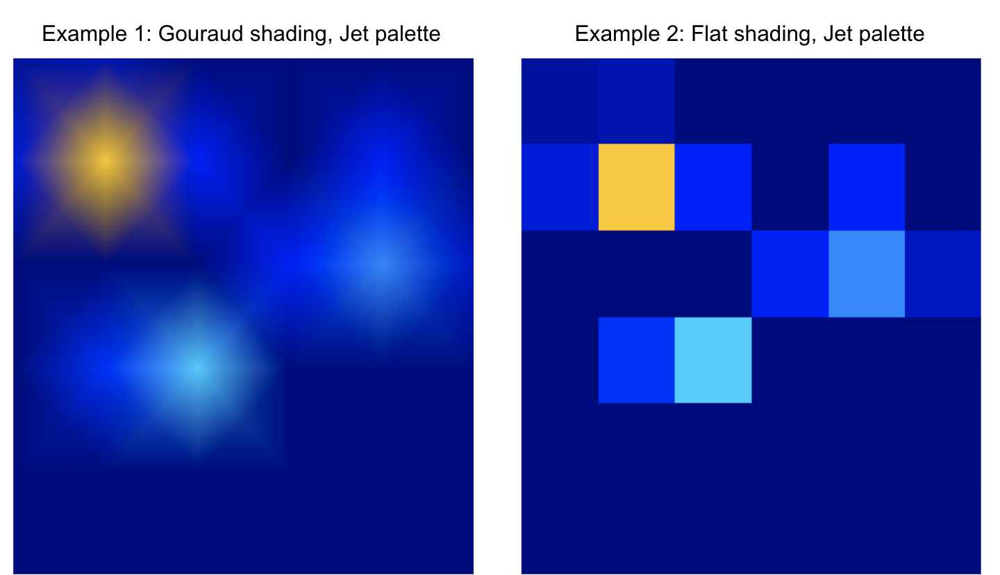

Scenario 2 walkthrough
===============

To faciliate the initial use of SimBA, we provide several use scenarios.
We have created these scenarios around a hypothetical experiment that
take a user from initial use (completely new start) all the way through
analyzing a complete experiment and then adding additional experimental
datasets to an initial project.

All scenarios assume that the videos have been
`pre-processed <https://github.com/sgoldenlab/simba/blob/master/docs/tutorial_process_videos.md>`__
and that `DLC behavioral tracking CSV
dataframes <https://github.com/sgoldenlab/simba/blob/master/docs/Tutorial_DLC.md>`__
have been created.

**Hypothetical Experiment**:
---------------------------

Three days of resident-intruder testing between aggressive CD-1 mice and
subordinante C57 intruders. Each day of testing has 10 pairs of mice,
for a total of 30 videos recorded across 3 days. Recordings are 3
minutes in duration, in color, at 30fps.

**Scenario 2**: Using a classifier on new experimental data…
---------------------------

In this scenario you have either are now ready to do one of two things.

(i)  You have generated a classifier yourself which performance you are
     happy with. For example, you have followed `Scenario
     1 <https://github.com/sgoldenlab/simba/edit/master/docs/Scenario1.md>`__,
     and generated the classifier for “Behavior that Will Get a Nature
     Paper (Behavior BtWGaNP)” and its working well.

(ii) Or, you have received a behavioral classifier generated somewhere
     else, and now you want to use the classifier to score Behavior
     BtWGaNP on your experimental videos. For example, you have
     downloaded the classifier from our `OSF
     repository <https://osf.io/d69jt/>`__.

Part 1: ‘Clean up your project’, or create a new project.
---------------------------------------------------------

We will need start with a project directory tree that does not contain
any other data than the data we want to analyze. If you are coming along
from `Scenario
1 <https://github.com/sgoldenlab/simba/edit/master/docs/Scenario1.md>`__,
you will have a project tree already. However, this project tree
contains the files used to create the BtWGaNP classifier: if you look in
the subdirectories of the ``project_folder/csv/input`` directory, you
will see the 19 CSV files we used to generate the project. If we
continue using this project, SimBA will see these CSV files and analyze
these files in addition to your Experimental data. Thus, one option is
to manually remove these files from the subdirectories of our project
(see the legacy tutorial for `Scenario
4 <https://github.com/sgoldenlab/simba/blob/master/docs/Scenario4.md#part-1-clean-up-your-project--or-alternatively-create-a-new-project>`__
where we take this approach), or you could use the
``Archive Processed files`` function in the ``Load Project`` tab
described in the new `Scenario 4
tutorial <https://github.com/sgoldenlab/simba/blob/master/docs/Scenario4_new.md#part-1-clean-up-your-project--or-alternatively-create-a-new-project>`__
and shown in the image below.

.. image:: img/scenario_2/menu_1.jpg
  :width: 1200
  :align: center

Another alternative is to `create a
new <https://github.com/sgoldenlab/simba/blob/master/docs/Scenario1.md#part-1-create-a-new-project>`__
project that only contains the data from our Experiment. In this
Scenario, we will create a `new
project <https://github.com/sgoldenlab/simba/blob/master/docs/Scenario1.md#part-1-create-a-new-project>`__.

Go ahead and create a new project with your experimental data, follow
the instructions for creating a new project in either of these
tutorials:
`1 <https://github.com/sgoldenlab/simba/blob/master/docs/Scenario1.md#part-1-create-a-new-project-1>`__,
`2 <https://github.com/sgoldenlab/simba/blob/master/docs/tutorial.md#step-1-generate-project-config>`__.
Instead of using your pilot data as indicated in the tutorial from
`Scenario
1 <https://github.com/sgoldenlab/simba/blob/master/docs/Scenario1.md#part-1-create-a-new-project-1>`__,
use the data and videos for the experiment you want to analyze.

.. note::
   In the final *Step 4* of the `tutorial for creating a new
   project <https://github.com/sgoldenlab/simba/blob/master/docs/Scenario1.md#part-1-create-a-new-project-1>`__,
   we extract the frames from the imported videos. Having the frames is
   only necessery if you wish to visualize the predictive classifications
   generated in this current Scenario 2. If you do not want to visualize
   the machine predictions you can skip this step. However, we recommend
   that you at least visualize the machine predictions using one or a few
   videos to gauge its performance. How to visualize the machine
   predictions is described in `Part
   5 <https://github.com/sgoldenlab/simba/blob/master/docs/Scenario2.md#part-5--visualizing-machine-predictions>`__
   of this tutorial.

Part 2: Load project and process your tracking data
---------------------------------------------------

In `Part
1 <https://github.com/sgoldenlab/simba/blob/master/docs/Scenario2.md#part-1-clean-up-your-project-or-create-a-new-project>`__
above, we created a project that contains your experimental data. To
continue working with this project, we **must** load it. To load the
project and process your experimental data, follow the instructions for
**Step 1 to 5** in either the `Scenario 1
tutorial <https://github.com/sgoldenlab/simba/blob/master/docs/Scenario1.md>`__
or `Part I of the generic
tutorial <https://github.com/sgoldenlab/simba/blob/master/docs/tutorial.md#step-1-generate-project-config%5D>`__.

In this current Scenario 2, you can **ignore Steps 6-7 of the
tutorials**, which deals with annotating data and creating classifiers.

However, **Step 1-5** of the `Scenario 1
tutorial <https://github.com/sgoldenlab/simba/blob/master/docs/Scenario1.md>`__,
which we need to complete, performs `outlier correction in the
tracking <https://github.com/sgoldenlab/simba/blob/master/misc/Outlier_settings.pdf>`__
and `extracts
features <https://github.com/sgoldenlab/simba/blob/master/misc/Feature_description.csv>`__,
which we will need to do before analyzing our experimental data.

Part 3: Run the classifier on new data
--------------------------------------

At this point we have Experimental data, which has been corrected for
outliers and with features extracted, and we want to predict behavior
BtWGaNP in these videos.

.. note::
   If you haven’t generated the predictive classifier yourself,
   and you have instead downloaded the predictive classifier or been
   given the predictive calssifier by someone else, we will also include
   information on how you can use that classifier to predict behaviors
   in your videos.

1. In the Load Project menu, navigate to the **Run Machine Model** tab
   and you should see the following window.

.. image:: img/scenario_2/menu_2.png
  :width: 600
  :align: center

2. Click on ``Model Selection``. The following window, containing the
   classifier names that were defined when you created the project, will
   pop up. The image below depicts a full suite of behavioral predictive
   classifiers relevant to aggression behavior, but yours should only
   show Behavior BtWGaNP.

.. image:: img/scenario_2/menu_3.png
  :width: 600
  :align: center

3. Click on ``Browse File`` and select the model (*.sav*) file
   associated with the classifier name. If you are following along from
   `Scenario
   1 <https://github.com/sgoldenlab/simba/edit/master/docs/Scenario1.md>`__,
   the *.sav* file will be saved in your earlier project, in the
   ``project_folder\models\generated_models`` directory or the
   ``project_folder\models\validation\model_files`` directory. You can
   also select an *.sav* file located in any other directory. For
   example, if you have downloaded a random forest model from `our OSF
   repository <https://osf.io/d69jt/>`__, you can specify the path to
   that file here.

Once the path has been selected, go ahead and modify the discrimination
``Threshold`` and ``Minimum Bout`` for each classifier separately. If
you want to explore the optimal threshold for your classifier, go ahead
and read `Scenario 1 - Critical validation step before running machine
model on new
data <https://github.com/sgoldenlab/simba/blob/simba_JJ_branch/docs/Scenario1.md#critical-validation-step-before-running-machine-model-on-new-data>`__
on how to use the ``Validate Model on Single Video`` menu (this
information is also repeated in brief in Step 4 below). The
``Threshold`` entry box accepts a value between 0 and 1. The
``Minimum Bout`` is a time value in milliseconds that represents the
minimum length of a classified behavioral bout. To read more about the
``Minimum Bout`` - go ahead and read `Scenario 1 - Critical validation
step before running machine model on new
data <https://github.com/sgoldenlab/simba/blob/simba_JJ_branch/docs/Scenario1.md#critical-validation-step-before-running-machine-model-on-new-data>`__\ (this
information is also repeated in brief in Step 4 below).

.. note::
   In the real world you may want want to run mutiple
   classifiers on each video, one for each of the behaviors you are
   intrested in. **In such a scenario you have defined mutiple
   predictive calssifier names when you created the project in Step 1**.
   Each one will be displayed in the ``Model Selection``, and you can
   specify a different path to a different *.sav* file for each of them.

.. note::
   Each random forest expects a specific number of
   features. The number of calculated features is determined by the
   number of body-parts tracked in pose-estimation in DeepLabCut or
   DeepPoseKit. *For example*: if the input dataset contains the
   coordinates of three body parts, then a fewer number of features can
   be calculated than if 8 body parts were tracked. This means that you
   will get an error if you run a random forest model *.sav* file that
   has been generated using 8 body parts on a new dataset that contains
   only 3 body parts.

4. Fill in the ``Discrimination threshold`` and click on ``Set`` to save
   the settings.

-  ``Discrimination threshold``: This value represents the level of
   probability required to define that the frame belongs to the target
   class and it accepts a float value between 0.0 and 1.0. In other
   words, how certain does the computer have to be that behavior BtWGaNP
   occurs in a frame, in order for the frame to be classified as
   containing behavior BtWGaNP? For example, if the discrimination
   theshold is set to 0.50, then all frames with a probability of
   containing the behavior of 0.5 or above will be classified as
   containing the behavior. For more information on classification
   theshold, click
   `here <https://www.scikit-yb.org/en/latest/api/classifier/threshold.html>`__.

.. note::
   You can titrate the discrimination threshold to best fit your
   data. Decreasing the threshold will predict that the classified
   behavior is *more* frequent, while increasing the threshold will
   predict that the behaviors as *less* frequent.

5. Fill in the ``Minimum behavior bout length`` and click on ``Set`` to
   save the settings.

-  ``Minimum behavior bout length (ms)``: This value represents the
   minimum length of a classified behavioral bout. **Example**: The
   random forest makes the following predictions for behavior BtWGaNP
   over 9 consecutive frames in a 50 fps video: 1,1,1,1,0,1,1,1,1. This
   would mean, if we don’t have a minimum bout length, that the animals
   enganged in behavior BtWGaNP for 80ms (4 frames), took a break for
   20ms (1 frame), then again enganged in behavior BtWGaNP for another
   80ms (4 frames). You may want to classify this as a single 180ms
   behavior BtWGaNP bout, rather than two separate 80ms BtWGaNP bouts.
   If the minimum behavior bout length is set to 20, any interruption in
   the behavior that is 20ms or shorter will be removed and the example
   behavioral sequence above will be re-classified as: 1,1,1,1,1,1,1,1,1
   - and instead classified as a single 180ms BtWGaNP bout. If your
   videos in your project are recorded at different frame rates then
   SimBA will account for this when correcting for the
   ``Minimum behavior bout length``.

6. Click on ``Run RF Model`` to run the machine model on the new
   experimental data. You can follow the progress in the main SimBA
   terminal window. A message will be printed once all the behaviors
   have been predicted in the experimental videos. New CSV files, that
   contain the predictions together with the features and
   pose-estimation data, are saved in the
   ``project_folder/csv/machine_results`` directory.

Part 4: Analyze Machine Results
-------------------------------

Once the classifications have been generated, we may want to analyze
descriptive statistics for the behavioral predictions. For example, we
might like to know how much time the animals in each video enganged in
behavior BtWGaNP, how long it took for each animal to start enganging in
behavior BtWGaNP, how many bouts of behavior BtWGaNP did occur in each
video, and what where the mean/median interval and bout length for
behavior BtWGaNP. We may also want some descriptive statistics on the
movements, distances and velocities of the animals. If applicable, we
can also generate an index on how ‘severe’ behavior BtWGaNP was, and/or
split the different classification and movement statistics into
time-bins. To generate such descriptive statistics summaries, click on
the ``Run machine model`` tab in the ``Load project`` menu. In the
sub-menu ``Analyze machine results``, you should see the following
buttons:

.. image:: img/scenario_2/data_analysis_1.png
  :width: 800
  :align: center

1. ``ANALYZE MACHINE PREDICTIONS: AGGREGATES``: This button generates
   descriptive statistics for each predictive classifier in the project,
   including the total time, the number of frames, total number of
   ‘bouts’, mean and median bout interval, time to first occurrence, and
   mean and median interval between each bout. Clicking the button will
   display a pop up window with tick-boxes for the different metric
   options, and the user ticks the metrics that the output file should
   contain. The pop up window should look like this:

.. image:: img/scenario_2/data_analysis_2.png
  :width: 800
  :align: center

Clicking on ``RUN`` runs the selected desciptive statistics on all the
files in ``project_folder/csv/machine_results`` directory. A date-time
stamped output csv file with the data is saved within the
``/project_folder/log`` folder. Check the main SimBA terminal window for
the exact output filename and file path.

2. ``ANALYZE MOVEMENT / VELOCITY: AGGREGATES``: This button generates
   descriptive statistics for distances and velocities. Clicking the
   button will display a pop-up window where the user selects how many
   animal, and which body-parts, the user wants to use to calculate the
   distance and velocity metrics. The pop up window should look like
   this:

Clicking the ``Run`` buttons calculates the descriptive statistics on
all the CSV files in ``project_folder/csv/machine_results`` directory. A
date-time stamped output csv file with the data is saved in the
``/project_folder/log`` folder.

.. note::
   When clicking the ``Body-part`` dropdown in the
   ``ANALYZE MOVEMENT / VELOCITY: AGGREGATES`` pop-up menu, you should
   see all the body-parts available in your project. You should also see
   options with the suffix **CENTER OF GRAVITY**, e.g., an option may be
   named ``Animal 1 CENTER OF GRAVITY``. If you use this option, SimBA
   will estimate the centroid of the choosen animal and compute the
   moved distance and the velocity based on the estimated centroid.

3. ``ANALYZE MACHINE PREDICTIONS: TIME BINS``: Use this menu to compute
   descriptive statistics of classification within **user-defined
   time-bins**. This menu looks very similar to the menu used for
   aggregate machine classification computations, but has one additional
   entry-box at the bottom. In this bottom entry-box, enter the size of
   your time-bins in **seconds**.

.. image:: img/scenario_2/data_analysis_4.png
  :width: 800
  :align: center

.. note::
   (i) If no behavior was expressed in a certain time bin, then
   the fields representing that time bin is missing. (ii) If there was 1
   behavior event within a time bin, then the
   ``Mean event interval (s)`` and ``Median event interval (s)`` fields
   are missing for that time-bin.

4. ``ANALYZE MOVEMENT / VELOCITY: TIME-BINS``: This button generates
   descriptive statistics for movements, velocities, and distances
   between animals in **user-defined time-bins**. Clicking this button
   brings up a pop-up menu very similar to the
   ``ANALYZE MOVEMENT / VELOCITY: AGGREGATES``, but has one additional
   entry-box at the bottom. In this bottom entry-box, enter the size of
   your time-bins in **seconds**. It also has a checkbox named
   ``Create plots``. If the ``Create plots`` checkbox is ticked, SimBA
   will generate line plots, with one line plot per videos, representing
   the movement of your animals in the defined time-bins.

.. image:: img/scenario_2/data_analysis_5.png
  :width: 800
  :align: center

5. ``ANALYZE MACHINE PREDICTIONS: BY ROI``: If you have drawn
   `user-defined
   ROIs <https://github.com/sgoldenlab/simba/blob/master/docs/ROI_tutorial_new.md>`__,
   then we can compute how much time, and how many classified behavioral
   bout started and ended in each user-defined ROI. Clicking on the
   ``Classifications by ROI`` brings up the following pop-up:

.. image:: img/scenario_2/data_analysis_6.png
  :width: 800
  :align: center

In this pop-up. Tick the checkboxes for which classified behaviors and
ROIs you wish to analyze. Also tick the buttons for which measurements
you want aggregate statistics for. In the ``Select body-part`` drop-down
menu, select the body-part you shich to use as a proxy for the location
of the behavior. Once filled in, click
``Analyze classifications in each ROI``. An output data file will be
saved in the ``project_folder/logs`` directory of your SimBA project.

6. ``Analyze machine predictions: by severity``: This type of analysis
   is only relevant if your behavior can be graded on a scale ranging
   from mild (the behavior occurs in the presence of very little body
   part movements) to severe (the behavior occurs in the presence of a
   lot of body part movements). For instance, attacks could be graded
   this way, with ‘mild’ or ‘moderate’ attacks happening when the
   animals aren’t moving as much as they are in other parts of the
   video, while ‘severe’ attacks occur when both animals are tussling at
   full force. This button and code calculates the ‘severity’ of each
   frame classified as containing the behavior based on a user-defined
   scale. Clicking the severity button brings up the following menu:

-  **Classifier** dropdown: Select which classifier you want to
   calculate severity scores for.
-  **Brackets** dropdown: Select the size of the severity scale. E.g.,
   select **10** if you want to score your classifications on a 10-point
   scale.
-  **Animals** dropdown: Select which animals body-parts you want to use
   to calculate the movement. E.g., select ``ALL ANIMALS`` to calculate
   the movement based on all animals and their body-parts.
-  **FRAME COUNT** checkbox: Check this box to get the results presented
   as **number of frames** in each severity bracket.
-  **SECONDS** checkbox: Check this box to get the results presented as
   **number of seconds** in each severity bracket.

Click on RUN SEVERITY ANALYSIS. You can follow progress in the main
SimBA terminal. The results are saved in the ``project_folder/logs/``
directory of your SimBA project. You can found an expected output of
this analysis
`HERE <https://github.com/sgoldenlab/simba/blob/master/misc/severity_example_20230301090603.csv>`__

Congrats! You have now used machine models to classify behaviors in new
data. To visualize the machine predictions by rendering images and
videos with the behavioral predictions overlaid, and plots describing
on-going behaviors and bouts, proceed to `Part
5 <https://github.com/sgoldenlab/simba/blob/master/docs/Scenario2.md#part-5--visualizing-machine-predictions>`__
of the current tutorial.

Part 5: VISUALIZING RESULTS
---------------------------

In this part of the tutorial we will create visualizations of machine
learning classifications and the features which you have generated. This
includes images and videos of the animals with *prediction overlays,
gantt plots, line plots, paths plots, heat maps and data plot etc.*
These visualizations can help us understand the classifier(s),
behaviors, and differences between experimental groups.

To access the visualization functions, click the ``[Visualizations]``
tab.

VISUALIZING CLASSIFICATIONS
~~~~~~~~~~~~~~~~~~~~~~~~~~~

On the left of the ``Visualization`` tab menu, there is a sub-menu with
the heading ``DATA VISUALIZATION`` with a button named
``VISUALIZE CLASSIFICATIONS``. Use this button to create videos with
classification visualization overlays, similar to what is presented
`HERE <https://youtu.be/lGzbS7OaVEg>`__. Clicking this button brings up
the below pop-up menu allowing customization of the videos and how they
are created. We will go through each of the settings in the
visualization options in turn:

-  **BODY-PART VISUALIZATION THRESHOLD** (0.0-1.0): In this entry-box,
   enter the **minimum** pose-estimation detection probability threshold
   required for the body-part to be included in the visualization. For
   example, enter ``0.0`` for **all** body-part predictions to be
   included in teh visualization. Enter ``1.0`` for only body-parts
   detected with 100% certainty to be visualized.

-  **STYLE SETTINGS**: By default, SimBA will **auto-compute** suitable
   visualization (i) font sizes, (ii) spacing between text rows, (iii)
   font thickness, and (iv) pose-estimation body-part location circles
   which depend on the resolution of your videos. If you do **not** want
   SimBA to auto-compute these attributes, go ahead and and **un-tick**
   the \`Auto-compute font/key-point sizes checkbox, and fill in these
   values manually in each entry box.

-  **VISUALIZATION SETTINGS**:

   -  **Create video**: Tick the ``Create video`` checkbox to generate
      ``.mp4`` videos with classification result overlays.
   -  **Create frames**: Tick the ``Create frames`` checkbox to generate
      ``.png`` files with classification result overlays (NOTE: this
      will create one png file for each frame in each video. If you are
      concerned about storage, leave this checkbox unchecked).
   -  **Include timers overlay**: Tick the ``Include timers overlay``
      checkbox to insert the cumulative time in seconds each classified
      behavior has occured in the top left corner of the video.
   -  **Rotate video 90°**: Tick the ``Rotate video 90°`` checkbox to
      rotate the output video 90 degrees clockwise relative to the input
      video.
   -  **Multiprocess videos (faster)**: Creating videos can be
      computationally costly, and creating many, long, videos can come
      with unacceptable run-times. We can solve this using
      multiprocessing over multiple cores on your computer. To use
      multi-processing, tick the ``Multiprocess videos (faster)``
      checkbox. Once ticked, the ``CPU cores`` dropdown becomes enabled.
      This dropdown contains values between ``2`` and the number of
      cores available on your computer with fancier computers having
      higher CPU counts. In this dropdown, select the number of cores
      you want to use to create your visualizations.

-  **RUN**:

   -  **SINGLE VIDEO**: To create classification visualizations for a
      single video, select the video in the ``Video`` drop-down menu and
      click the ``Create single video`` button. You can follow the
      progress in the main SimBA terminal. The results will be stored in
      the ``project_folder/frames/output/sklearn_results`` directory of
      your SimBA project.
   -  **MULTIPLE VIDEO**: To create classification visualizations for
      all videos in your project, click the ``Create multiple videos``
      button. You can follow the progress in the main SimBA terminal.
      The results will be stored in the
      ``project_folder/frames/output/sklearn_results`` directory of your
      SimBA project.

VISUALIZING GANTT CHARTS
~~~~~~~~~~~~~~~~~~~~~~~~

Clicking the ``VUSIALIZE GANTT`` button brings up a pop-up menu allowing
us to customize gantt charts. Gantt charts are broken horizontal bar
charts allowing us to insepct when and for how long each of our
classified behaviors occur as in the gif below.

.. image:: img/scenario_2/visualization_2.png
  :width: 800
  :align: center

.. image:: img/scenario_2/gantt_example_1.gif
  :width: 800
  :align: center

-  **STYLE SETTINGS**: Use this menu to specify the resultion of the
   Gantt plot videos and/or frames. Furthermore, use the ``Font size``
   entry box to specify the size of the y- and x-axis label text sizes.
   Use the ``Font rotation degree`` entry-box to specify the rotation of
   the y-axis classifier names (set to ``45`` by default which is what
   is visualized in the gif above).

-  **VISUALIZATION SETTINGS**:

   -  **Create video**: Tick the ``Create video`` checkbox to generate
      gantt plots ``.mp4`` videos.
   -  **Create frames**: Tick the ``Create frames`` checkbox to generate
      gantt plots ``.png`` files (NOTE: this will create one png file
      for each frame in each video. If you are concerned about storage,
      leave this checkbox unchecked).
   -  **Create last frame**: Tick the ``Create last frame`` checkbox to
      generate a gantt plots ``.png`` file representing the entire
      video.
   -  **Multiprocess videos (faster)**: Creating gantt videos and/or
      images can be computationally costly, and creating many, long,
      videos can come with unacceptable run-times. We can solve this
      using multiprocessing over multiple cores on your computer. To use
      multi-processing, tick the ``Multiprocess videos (faster)``
      checkbox. Once ticked, the ``CPU cores`` dropdown becomes enabled.
      This dropdown contains values between ``2`` and the number of
      cores available on your computer, with fancier computers having
      higher CPU counts. In this dropdown, select the number of cores
      you want to use to create your gantt charts.

-  **RUN**:

   -  **SINGLE VIDEO**: To create gantt chart visualizations for a
      single video, select the video in the ``Video`` drop-down menu and
      click the ``Create single video`` button. You can follow the
      progress in the main SimBA terminal. The results will be stored in
      the ``project_folder/frames/output/sklearn_results`` directory of
      your SimBA project.
   -  **MULTIPLE VIDEO**: To create gantt chart visualizations for all
      videos in your project, click the ``Create multiple videos``
      button. You can follow the progress in the main SimBA terminal.
      The results will be stored in the
      ``project_folder/frames/output/sklearn_results`` directory of your
      SimBA project.

.. note::
   If you’d like to create a gif from the gantt frames, you can
   do so by using the `SimBA tools
   menu <https://github.com/sgoldenlab/simba/blob/master/docs/Tutorial_tools.md>`__
   and the `Generate
   gifs <https://github.com/sgoldenlab/simba/blob/master/docs/Tutorial_tools.md#generate-gifs>`__
   tool.

VISUALIZING CLASSIFICATION PROBABILITIES
~~~~~~~~~~~~~~~~~~~~~~~~~~~~~~~~~~~~~~~~

SimBA can create line plots depicting the *classification probability*
that a specific behavior is occuring in the current frame across the
video. On the left of the ``Visualization`` menu, a button named
``VISUALIZE PROBABILITIES``. Clicking this button brings up the below
sub-menu allowing users to customize the videos and how they are
created.

.. image:: img/scenario_2/probability_example.gif
  :width: 800
  :align: center

-  **STYLE SETTINGS**: Use this menu to specify the resultion of the
   probability plot videos and/or frames.

   -  **RESOLUTION**: Use this dropdown to select the resolution (size)
      of the output video and/or output frames.
   -  **LINE COLOR**: Use this dropdown to specify the color of the line
      in the charts.
   -  **FONT SIZE**: In this entry-box, enter the font size of the y-
      and x-axis labels and tick labels. (e.g., ``10``)
   -  **LINE WIDTH**: In this entry-box, enter the thickness of the line
      in the chart (e.g., ``6``).
   -  **CIRCLE SIZE**: In this entry-box, enter the size of the circle
      representing the current frame probability value (e.g., ``20``)

-  **VISUALIZATION SETTINGS**:

   -  **CLASSIFIER**: Use this drop down menu to select the classifier
      you which to create the line plot for.
   -  **CREATE FRAMES**: Tick the ``Create frames`` checkbox to create
      probability plots ``.png`` files (NOTE: this will create one png
      file for each frame in each video. If you are concerned about
      storage, leave this checkbox unchecked).
   -  **CREATE VIDEOS**: Tick the ``Create video`` checkbox to create
      probability plots ``.mp4`` videos.
   -  **Multiprocess videos (faster)**: Creating probability videos
      and/or images can be computationally costly, and creating many,
      long, videos can come with unacceptable run-times. We can solve
      this using multiprocessing over multiple cores on your computer.
      To use multi-processing, tick the ``Multiprocess videos (faster)``
      checkbox. Once ticked, the ``CPU cores`` dropdown becomes enabled.
      This dropdown contains values between ``2`` and the number of
      cores available on your computer, with fancier computers having
      higher CPU counts. In this dropdown, select the number of cores
      you want to use to create your probability charts.

-  **RUN**:

   -  **SINGLE VIDEO**: To create probability chart visualizations for a
      single video, select the video in the ``Video`` drop-down menu and
      click the ``Create single video`` button. You can follow the
      progress in the main SimBA terminal. The results will be stored in
      the ``project_folder/frames/output/probability_plots`` directory
      of your SimBA project.
   -  **MULTIPLE VIDEO**: To create probability chart visualizations for
      all videos in your project, click the ``Create multiple videos``
      button. You can follow the progress in the main SimBA terminal.
      The results will be stored in the
      ``project_folder/frames/output/probability_plots`` directory of
      your SimBA project.

.. note::
   If you’d like to create a gif from the probability_plots
   frames, you can do so by using the `SimBA tools
   menu <https://github.com/sgoldenlab/simba/blob/master/docs/Tutorial_tools.md>`__
   and the `Generate
   gifs <https://github.com/sgoldenlab/simba/blob/master/docs/Tutorial_tools.md#generate-gifs>`__
   tool.

VISUALIZING PATH PLOTS
~~~~~~~~~~~~~~~~~~~~~~

SimBA can create path plots depicting the location of the animal(s),
their paths, as well the locations of the classified behaviors. In the
[Visualizations] tab, click the [VISUALIZE PATHS] button, which brings
up the below pop-up menu.

.. image:: img/scenario_2/path_plot_example.gif
  :width: 800
  :align: center

-  **STYLE SETTINGS**:

   -  **AUTO-COMPUTE STYLES**: By default, SimBA will **auto-compute**
      suitable visualization styles which depend on the resolution of
      your videos. If you do **not** want SimBA to auto-compute these
      attributes, go ahead and and **un-tick** the
      ``Auto-compute styles`` checkbox, and fill in these values
      manually in each entry box.
   -  **MAX PRIOR LINES** (int): Number of milliseconds for which the
      movement path is diplayed. E.g., a value of ``2000`` will display
      the movement path for the most recent 2s.
   -  **LINE WIDTH** (int): The width of the lines representing the
      movement path. E.g., ``6``.
   -  **CIRCLE SIZE** (int): The size of the circle representing the
      animals current location. E.g., ``20``.
   -  **FONT SIZE**: The size of the font text of the animals name.
      ``E.g., 3``.
   -  **FONT THICKNESS**: The thickness (boldness) of the font text of
      the animals name. ``E.g., 2``.
   -  **BACKGROUND COLOR**: The background color of the path plots.
      E.g., ``White``.

-  **CHOOSE CLASSIFICATION VISUALIZATION**: Use this menu to specify if
   and how the location of classified events are printed on the path
   plots.

   -  **INCLUDE CLASSIFICATION LOCATIONS**: Check this box to include
      the location of classified events in the path plot.

   -  You should see a row for each classifier, and three drop-down
      menues for each classifier. In the example screengrab above, I
      have two classifiers (Classifier 1: *Attack*, Classifier 2:
      Sniffing). In the second drop-down, select which **color** the
      circles depicting the location of the classified events should
      have. In the third dropdown, select the **size** the circles
      depicting the location of the classified events should have.

   ..

      Note: The classified event location will be inferred to be in the
      first animals body-part location

-  **CHOOSE BODY-PARTS**: Use this menu to specify which body-parts of
   the animals will represent their location.

   -  **# ANIMALS**: Use this drop-down to specify how many animals you
      want to visualize paths for.

   -  You should see a row for each animal, and two drop-down menues
      per. In the example screengrab above, I have two animals. In the
      first drop-down, select the body-part which you want to represent
      the path. In the second drop-down, select which **color** the
      circles and lines depicting the location of the animal should
      have.

-  **RUN**:

   -  **SINGLE VIDEO**: Use this menu to create a *single* path
      visualization video. The ``Video`` drop-down will contain all the
      videos in your ``project_folder/machine_results`` directory.
      Choose which video you want to create a path visualization for.
      Once choosen, click the ``Create single video`` button. You can
      follow the progress in the main SimBA terminal window. Once
      complete, a new video and/or frames will be saved in the
      ``project_folder/frames/output/path_plots`` directory.
   -  **MULTIPLE VIDEO**: Use this menu to create a path visualization
      video for every video in your project. After clicking the
      ``Create multiple videos`` button. You can follow the progress in
      the main SimBA terminal window. Once complete, one new video
      and/or frames folder for every input video will be saved in the
      ``project_folder/frames/output/path_plots`` directory.

VISUALIZING DISTANCE PLOTS
~~~~~~~~~~~~~~~~~~~~~~~~~~

SimBA can create distance plots depicting the distance between different
body-parts and/or animals across the videos. In the [Visualizations]
tab, click the [VISUALIZE DISTANCES] button, which brings up the below
pop-up menu.

.. image:: img/scenario_2/visualization_5.png
  :width: 800
  :align: center

.. image:: img/scenario_2/visualization_5.png
  :width: 800
  :align: center

.. image:: img/scenario_2/distance_plot_example.gif
  :width: 800
  :align: center
   

.. image:: img/scenario_2/visualization_8.png
  :width: 800
  :align: center

-  **STYLE SETTINGS**:

   -  **RESOLUTION**: Use the drop-down to set the size of the output
      video(s) and/or frames.
   -  **FONT SIZE** (int): The size of the text representing the y- and
      x-axis labels and graph title.
   -  **LINE WIDTH** (int): The width of the lines representing the
      animal body-part distances.

-  **CHOOSE DISTANCES**:

   -  **# DISTANCES**: Use the drop-down to specify how many distances
      (lines) you want to display in the distance plot. E.g., the two
      gifs above 1 and 4 distances, respectively.
   -  Once you have selected a number of lines, the table show be
      populated with as many rows as distances chosen, with **three**
      drop-down menus per row. Use the first two drop-down menus to
      select the two body-parts which distance in-between you want
      depicted in the output video and/or frames. Use the third
      right-most drop-down to select the color of that specific line.

-  **VISUALIXATION SETTINGS**:

   -  **Create video**: Tick the ``Create video`` checkbox to generate
      ``.mp4`` videos with distance plots.
   -  **Create frames**: Tick the ``Create frames`` checkbox to generate
      ``.png`` files with distance plots (NOTE: this will create one png
      file for each frame in each video. If you are concerned about
      storage, leave this checkbox unchecked).
   -  **Create last frame**: Create a single ``.png`` image representing
      the body-part distances at the end of each video (as in the bottom
      image above).

-  **RUN**:

   -  **SINGLE VIDEO**: Use this menu to create a *single* distance
      visualization video. The ``Video`` drop-down will contain all the
      videos in your ``project_folder/machine_results`` directory.
      Choose which video you want to create a distance visualization
      for. Once choosen, click the ``Create single video`` button. You
      can follow the progress in the main SimBA terminal window. Once
      complete, a new video and/or frames will be saved in the
      ``project_folder/frames/output/line_plots`` directory.
   -  **MULTIPLE VIDEO**: Use this menu to create a distance
      visualization video for every video in your project. After
      clicking the ``Create multiple videos`` button. You can follow the
      progress in the main SimBA terminal window. Once complete, one new
      video and/or frames folder for every input video will be saved in
      the ``project_folder/frames/output/line_plots`` directory.

VISUALIZING CLASSIFICATION HEATMAPS
~~~~~~~~~~~~~~~~~~~~~~~~~~~~~~~~~~~

SimBA can create heatmap videos and/or images representing the location
of classified events. For an idea of how classification heatmaps works,
see `THIS VIDEO <https://youtu.be/O41x96kXUHE>`__.

.. image:: img/scenario_2/visualization_7.png
  :width: 800
  :align: center

-  **STYLE SETTINGS**:

   -  **PALETTE**: Pick the heatmap color palette. For examples, `CLICK
      HERE <https://matplotlib.org/stable/gallery/color/colormap_reference.html>`__
   -  **SHADING**: Pick the shading/smoothing. The left image above was
      created using *Gouraud*, the right using *Flat* shading.
   -  **CLASSIFIER**: Pick the classifier to plot in the heatmap.
   -  **BODY-PART**: Pick the body-part which represents the location
      the classified events.
   -  **MAX TIME SCALE (S)**: Pick the time, in seconds, which
      represents the maximum color intensity in the heatmap. Choose
      ``Auto-compute`` to let SimBA find the max in the video.
   -  **BIN SIZE (MM)**: Pick the size of each location in the image.
      For more information on bin sizes, click
      `HERE <https://github.com/sgoldenlab/simba/blob/master/docs/ROI_tutorial.md#part-5-miscellaneous-roi-tools>`__

-  **VISUALIXATION SETTINGS**:

   -  **Create video**: Tick the ``Create video`` checkbox to generate
      ``.mp4`` videos heat maps.
   -  **Create frames**: Tick the ``Create frames`` checkbox to generate
      ``.png`` files with heat map plots (NOTE: this will create one png
      file for each frame in each video. If you are concerned about
      storage, leave this checkbox unchecked).
   -  **Create last frame**: Create a single ``.png`` image representing
      the classification heat maps at the end of each video.
   -  **Multiprocess videos (faster)**: Creating heatmaps is
      computationally costly, and creating many, long, videos can come
      with unacceptable run-times. We can solve this in part by using
      multiprocessing over the multiple cores on your computer. To use
      multi-processing, tick the ``Multiprocess videos (faster)``
      checkbox. Once ticked, the ``CPU cores`` dropdown becomes enabled.
      This dropdown contains values between ``2`` and the number of
      cores available on your computer with fancier computers having
      higher CPU counts. In this dropdown, select the number of cores
      you want to use to create your visualizations.

-  **RUN**:

   -  **SINGLE VIDEO**: Use this menu to create a *single* heatmap
      visualization. The ``Video`` drop-down will contain all the videos
      in your ``project_folder/machine_results`` directory. Choose which
      video you want to create a distance visualization for. Once
      choosen, click the ``Create single video`` button. You can follow
      the progress in the main SimBA terminal window. Once complete, a
      new video and/or frames will be saved in the
      ``project_folder/frames/output/heatmaps_classifier_locations``
      directory.
   -  **MULTIPLE VIDEO**: Use this menu to create a heatmap
      visualization for every video in your project. After clicking the
      ``Create multiple videos`` button. You can follow the progress in
      the main SimBA terminal window. Once complete, one new video
      and/or frames folder for every input video will be saved in the
      ``project_folder/frames/output/heatmaps_classifier_locations``
      directory.

VISUALIZING DATA TABLES
~~~~~~~~~~~~~~~~~~~~~~~

In the ``Visualization`` sub-menu, use the second button named
``VISUALIZE DATA PLOTS`` to create a frames that display the velocities
and movements of animals:

.. image:: img/scenario_2/data_table_example_1.gif
  :width: 800
  :align: center

.. image:: img/scenario_2/data_table_example_2.gif
  :width: 800
  :align: center

-  **STYLE SETTINGS**:

   -  **RESOLUTION**: The size of the output video and/or frames in
      pixels.
   -  **DECIMAL ACCURACY**: The number of floating points in the values
      displayed.
   -  **BACKGROUND COLOR**: The background color of the data tables.
   -  **HEADER COLOR**: The colors of the headers in the data table.
   -  **FONT THICKNESS**: The thickness of the font in teh the table.

-  **CHOOSE BODY-PARTS**:

-  **VISUALIXATION SETTINGS**:

   -  **Create video**: Tick the ``Create video`` checkbox to generate
      ``.mp4`` videos data plots.
   -  **Create frames**: Tick the ``Create frames`` checkbox to generate
      ``.png`` files with data plots (NOTE: this will create one png
      file for each frame in each video. If you are concerned about
      storage, leave this checkbox unchecked).

-  **RUN**:

   -  **SINGLE VIDEO**: Use this menu to create a *single* data table
      visualization. The ``Video`` drop-down will contain all the videos
      in your ``project_folder/machine_results`` directory. Choose which
      video you want to create a distance visualization for. Once
      choosen, click the ``Create single video`` button. You can follow
      the progress in the main SimBA terminal window. Once complete, a
      new video and/or frames will be saved in the
      ``project_folder/frames/output/live_data_table`` directory.
   -  **MULTIPLE VIDEO**: Use this menu to create a data table
      visualization for every video in your project. After clicking the
      ``Create multiple videos`` button. You can follow the progress in
      the main SimBA terminal window. Once complete, one new video
      and/or frames folder for every input video will be saved in the
      ``project_folder/frames/output/live_data_table`` directory.

MERGING (CONCATENATING VIDEOS)
~~~~~~~~~~~~~~~~~~~~~~~~~~~~~~

Next, we may want to merge (concatenate) several of the videos we have
created in the prior steps into a single video file. To do this, click
the ``MERGE FRAMES`` button in the [VISUALIZATIONS] tab, and you should
see this pop up to the left:

.. image:: img/scenario_2/merge_frames.png
  :width: 800
  :align: center

Begin by selecting how many videos you want to concatenate together in
the ``VIDEOS #`` drop-down menu and click ``SELECT``. A table, with one
row representing each of the videos, will show up titled
``VIDEO PATHS``. Here, click the ``BROWSE FILE`` button and select the
videos that you want to merge into a single video.

Next, in the ``JOIN TYPE`` sub-menu, we need to select how to join the
videos together, and we have 4 options:

-  MOSAIC: Creates two rows with half of your choosen videos in each
   row. If you have an unequal number of videos you want to concatenate,
   then the bottom row will get an additional blank space.
-  VERTICAL: Creates a single column concatenation with the selected
   videos.
-  HORIZONTAL: Creates a single row concatenation with the selected
   videos.
-  MIXED MOSAIC: First creates two rows with half of your choosen videos
   in each row. The video selected in the ``Video 1`` path is
   concatenated to the left of the two rows.

Finally, we need to choose the resolution of the videos in the
``Resolution width`` and the ``Resolution height`` drop-down videos.
**If choosing the MOSAIC, , VERTICAL, or horizontal join type, this is
the resolution of each panel video in the output video. If choosing
MIXED MOSAIC, then this is the resolution of the smaller videos in the
panel (to the right)**.

After clicking ``RUN``, you can follow the progress in the main SimBA
terminal and the OS terminal. Once complete, a new output video with a
date-time stamp in the filename is saved in the
``project_folder/frames/output/merged`` directory of your SimBA project.

Go to `Scenario
3 <https://github.com/sgoldenlab/simba/blob/master/docs/Scenario3.md>`__
to read about how to update a classifier with further annotated data.

Go to `Scenario
4 <https://github.com/sgoldenlab/simba/blob/master/docs/Scenario4.md>`__
to read about how to analyze new experimental data with a previously
started project.

Author `Simon N <https://github.com/sronilsson>`__
